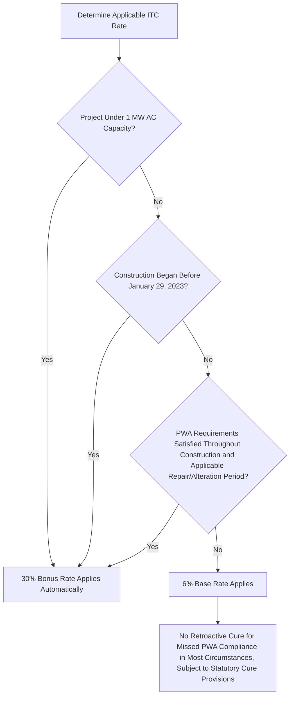
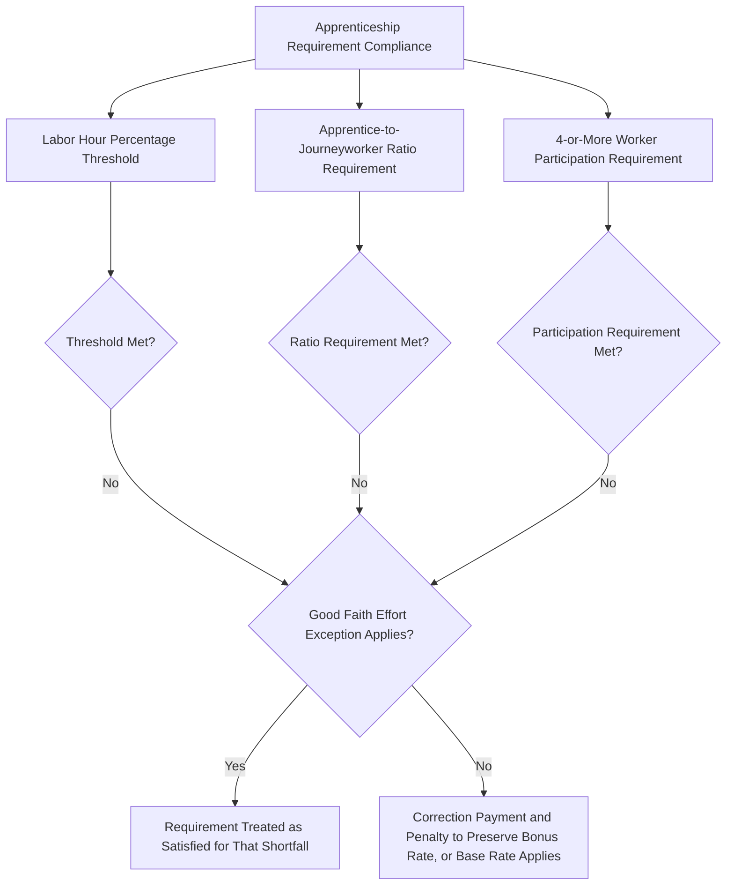

## Base Rate Versus Bonus Rate Structure

### Overview

The Inflation Reduction Act of 2022 (IRA) restructured the Investment Tax Credit into a two-tier rate architecture applicable to both the legacy Section 48 credit and the technology-neutral Section 48E credit: a low base rate that applies by default, and a substantially higher bonus rate available upon satisfaction of prevailing wage and apprenticeship (PWA) requirements or an exemption from those requirements. This base/bonus structure is the mechanism through which the IRA links labor standards to the vast majority of available credit value, making PWA compliance analysis a threshold determination in nearly every utility-scale tax equity transaction.

### The Two-Tier Rate Structure

$$\text{Applicable ITC Rate} = \begin{cases} 30\% \times \text{Eligible Basis} & \text{if PWA requirements satisfied, or project} < 1\text{ MW (AC), or construction began before } 1/29/2023 \\ 6\% \times \text{Eligible Basis} & \text{otherwise} \end{cases}$$

The statutory design under §48(a)(9) (and the parallel provision under §48E(a)(2)) sets a **base rate of 6%** of qualified/eligible basis, with a **bonus rate of 30%** — five times the base rate — available when the PWA conditions are met. This 5x multiplier structure means PWA compliance is, for most utility-scale projects, the single largest rate-determinative variable in the entire ITC calculation, dwarfing the effect of any individual bonus adder.

**Key Points**

- The 30% bonus rate is not itself an "adder" in the technical sense used for domestic content, energy community, and low-income adders — it is the elevated base tier of the two-tier structure, and the additional percentage-point adders are calculated as increments on top of whichever base/bonus tier applies.
- Historically, prior to the IRA, the base ITC rate for solar was already 30% (subject to a phase-down schedule enacted in 2015 legislation) without any PWA condition; the IRA's restructuring effectively converted what had been an unconditional 30% rate into a conditional one, defaulting to 6% absent PWA compliance or an applicable exception.

### The Prevailing Wage Requirement

#### Scope and Standard

The prevailing wage requirement obligates the taxpayer to ensure that laborers and mechanics employed by the taxpayer, and by any contractor or subcontractor, in the construction of the facility — and, for a defined period after placed-in-service for certain facilities, in specified alteration or repair work — are paid wages at rates not less than the prevailing rates for construction, alteration, or repair of a similar character in the locality, as determined by the Secretary of Labor in accordance with the Davis-Bacon Act framework (subchapter IV of chapter 31 of title 40, United States Code).

**Key Points**

- Prevailing wage rates are determined by locality and by labor classification (e.g., electrician, laborer, ironworker), sourced from the Department of Labor's published wage determinations, and can vary substantially by geography and craft.
- The prevailing wage obligation is not limited to the taxpayer's direct employees; it flows through the entire contractor and subcontractor chain, making EPC contract drafting and subcontractor compliance monitoring a critical practical component of PWA satisfaction.
- For certain facilities, the prevailing wage requirement extends to a defined period of alteration or repair after the facility is placed in service, not merely the initial construction period — a continuing obligation that is easy to overlook once a project reaches commercial operation.

#### Correction and Penalty Mechanism

The statute provides a cure mechanism for prevailing wage failures: if the taxpayer fails to pay the required prevailing wages, it may still preserve the bonus rate by paying affected workers the wage deficiency plus interest, and paying a penalty to the Treasury (generally $5,000 per affected worker, subject to statutory adjustment), with an enhanced penalty for intentional disregard of the requirement.

$$\text{Correction Payment} = \text{Wage Deficiency} + \text{Interest} + \text{Per-Worker Penalty (statutory amount)}$$

### The Apprenticeship Requirement

#### Labor Hour and Ratio Standards

The apprenticeship requirement obligates the taxpayer to ensure that a specified percentage of total labor hours for construction, alteration, or repair work are performed by qualified apprentices from registered apprenticeship programs. The applicable percentage increased over a phase-in schedule tied to the date construction began (a lower initial percentage for earlier construction start dates, rising in the years following IRA enactment to a plateau percentage for construction beginning in later years).

Additionally, the taxpayer (or contractor/subcontractor) must satisfy applicable apprentice-to-journeyworker ratio requirements under applicable state or federal apprenticeship program standards, and any contractor or subcontractor employing four or more individuals to perform construction, alteration, or repair work must employ one or more qualified apprentices.

**Key Points**

- The apprenticeship requirement has three independent components that must each be satisfied: the labor hour percentage threshold, the ratio requirement, and the participation requirement (the "4-or-more" rule) — failing any one component can jeopardize compliance even if the others are met.
- A **good faith effort exception** allows a taxpayer to be treated as satisfying the apprenticeship requirement despite a shortfall, if it can demonstrate a good faith effort to request qualified apprentices from a registered apprenticeship program (generally requiring a written request and, absent a timely and reasonable response, an ability to proceed without penalty for that specific shortfall) — an important practical relief valve given labor market apprentice availability constraints in some localities and trades.
- Like the prevailing wage requirement, a correction and penalty payment mechanism exists for apprenticeship shortfalls not covered by the good faith effort exception, generally involving a per-labor-hour-deficiency penalty payment to Treasury.

### Exceptions to the PWA Requirement — Automatic Bonus Rate Eligibility

Two categories of projects qualify for the 30% bonus rate without needing to separately demonstrate PWA compliance:

#### The 1 MW (AC) Small-Project Exception

Facilities with a maximum net output of less than 1 megawatt (measured in alternating current, AC) are exempt from the PWA requirements entirely and automatically qualify for the 30% bonus rate. This exception is measured at the **energy project** level following aggregation under the final Section 48 regulations, meaning multiple small facilities aggregated into a single energy project (through common off-take agreements, shared financing, or other aggregation factors) may collectively exceed 1 MW and lose the automatic exception even though no individual facility does so alone.

**Key Points**

- The final regulations' clarification of the aggregation/integral-part test was partly motivated by concern that an overly rigid rule could inadvertently prevent small rooftop solar installations from qualifying for the 1 MW exception, illustrating how closely the aggregation analysis and the PWA exception interact in practice.
- Community solar, distributed generation, and small commercial rooftop projects are the primary beneficiaries of this exception, since they frequently fall under the 1 MW threshold on a standalone basis.

#### The Pre-Enactment Construction Exception

Facilities that began construction before January 29, 2023 (the date that is 60 days after Treasury's initial PWA guidance, per the statutory grandfathering mechanism) are exempt from the PWA requirements and automatically qualify for the 30% bonus rate regardless of actual wage/apprenticeship practices, reflecting Congress's intent not to impose new labor requirements retroactively on projects already underway when the guidance became effective.

### Interaction with Bonus Adders

Once the applicable base/bonus tier (6% or 30%) is determined, the additional percentage-point adders (domestic content, energy community, low-income community allocation) are calculated as increments on top of that tier:

$$\text{Total Credit Rate} = \text{Base or Bonus Tier (6\% or 30\%)} + \text{Domestic Content Adder} + \text{Energy Community Adder} + \text{Low-Income Adder (if allocated)}$$

**Key Points**

- Adder percentage points are generally the same numerical amount (e.g., 10 percentage points for domestic content, 10 for energy community) regardless of whether the base tier is 6% or 30% — meaning the adders are proportionally far more valuable, and more likely to be pursued, for projects already qualifying for the 30% bonus tier.
- A project stuck at the 6% base rate due to PWA non-compliance, even if it separately qualifies for all available adders, will reach a maximum combined rate far below a PWA-compliant project's maximum combined rate — underscoring why PWA compliance strategy typically takes precedence over adder optimization in transaction planning.

### Comparative Rate Outcomes

| Scenario | Base/Bonus Tier | Domestic Content | Energy Community | Low-Income Adder | Total Rate |
| --- | --- | --- | --- | --- | --- |
| PWA compliant, no adders | 30% | — | — | — | 30% |
| PWA compliant, all adders, no allocation | 30% | +10% | +10% | — | 50% |
| PWA compliant, all adders, with 20% low-income allocation | 30% | +10% | +10% | +20% | 70% |
| PWA non-compliant, no adders | 6% | — | — | — | 6% |
| PWA non-compliant, all adders, with 20% low-income allocation | 6% | +10% | +10% | +20% | 46% |
| Under 1 MW AC (automatic bonus, no adders) | 30% | — | — | — | 30% |

**Key Points**

- The gap between the best-case PWA-compliant outcome (70%) and the best-case PWA-non-compliant outcome (46%) illustrates the outsized impact of the base/bonus tier relative to any single adder, reinforcing PWA compliance as the primary rate-optimization lever for larger projects.
- These illustrative combinations assume full stacking eligibility; in practice, satisfying domestic content, energy community, and low-income allocation requirements simultaneously involves independent, often difficult-to-coordinate compliance and application processes.

### Compliance Monitoring and Recordkeeping

Because PWA compliance is assessed based on actual conduct throughout the construction period (and, for covered facilities, the post-placed-in-service alteration/repair period), robust real-time monitoring is a practical necessity rather than a one-time certification:

- **Certified payroll records**: contemporaneous documentation of wages paid by classification and locality, generally following Davis-Bacon-style certified payroll reporting conventions, retained and available to substantiate compliance.
- **Apprenticeship program documentation**: records of registered apprenticeship program participation, labor hours performed by apprentices, ratio compliance, and any good faith effort requests made to apprenticeship programs (with response documentation).
- **EPC contract flow-down provisions**: prevailing wage and apprenticeship compliance obligations, audit rights, and indemnification provisions should be flowed down through EPC and subcontractor agreements, since the taxpayer bears ultimate responsibility for the entire contractor chain's compliance.
- **Correction payment tracking**: if shortfalls occur, contemporaneous tracking of wage deficiencies, interest calculations, and penalty payments made to preserve bonus-rate eligibility.

### Structuring and Diligence Implications

- **Term sheet allocation of PWA compliance risk**: tax equity investment documents typically include detailed representations, ongoing covenants, and indemnification provisions specifically addressing PWA compliance risk, given the substantial rate differential (6% versus 30%) at stake.
- **Independent PWA compliance review**: many transactions engage third-party labor compliance consultants or counsel to conduct a PWA compliance audit prior to closing or prior to claiming the credit, given the complexity and contractor-chain-wide scope of the requirement.
- **1 MW exception and aggregation coordination**: developers of distributed or community-scale projects should assess aggregation risk early, since inadvertent aggregation with other facilities can eliminate an otherwise-available small-project PWA exception.
- **Transferability and credit buyer diligence**: purchasers of transferred credits under §6418 have a direct financial stake in confirmed PWA compliance, since a PWA failure discovered post-transfer can reduce the credit amount below what was purchased, making PWA diligence a standard component of credit purchase agreements.

### Common Pitfalls in Practice

- **Assuming solar/wind projects retain a blanket 30% rate as under pre-IRA law** — the post-IRA default is 6%, with 30% requiring affirmative PWA compliance or an applicable exception; failing to plan for PWA compliance from the outset of construction risks defaulting to the lower rate.
- **Overlooking the post-placed-in-service alteration/repair period obligation** for certain facilities — treating PWA compliance as a construction-only obligation can create exposure for repair and alteration work performed after commercial operation begins.
- **Underestimating subcontractor-chain compliance burden** — prevailing wage and apprenticeship obligations flow through every tier of contractors and subcontractors, and a single non-compliant subcontractor can jeopardize the entire project's bonus-rate eligibility absent adequate contract flow-downs and monitoring.
- **Miscalculating the 1 MW exception due to aggregation** — assuming a facility is exempt from PWA based on its standalone capacity without checking whether aggregation factors combine it with other facilities into a single energy project exceeding the threshold.
- **Treating the good faith effort exception as a blanket safe harbor** — the apprenticeship good faith effort exception has specific procedural requirements (timely written requests, documented lack of response) and does not excuse a general failure to attempt apprenticeship program engagement.

**Related Topics**

- Domestic content, energy community, and low-income community bonus adder mechanics
- Energy project aggregation rules and their interaction with the 1 MW PWA exception
- Section 6418 credit transferability and PWA compliance risk allocation between buyer and seller
- Davis-Bacon Act prevailing wage determination methodology
- EPC contract structuring for labor compliance flow-down and indemnification
- Section 48 versus Section 48E rate structure continuity across the technology transition
- Beginning-of-construction doctrine and the January 29, 2023 PWA grandfathering date
- Recapture rules under Section 50(a) and their interaction with post-construction compliance failures