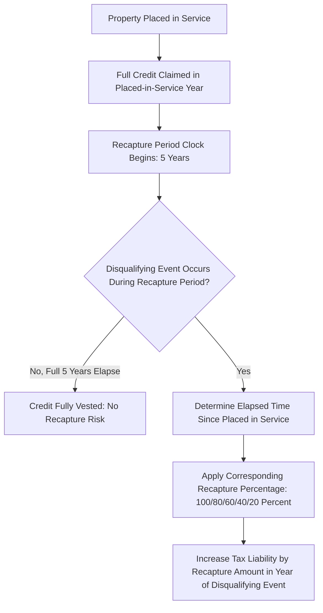
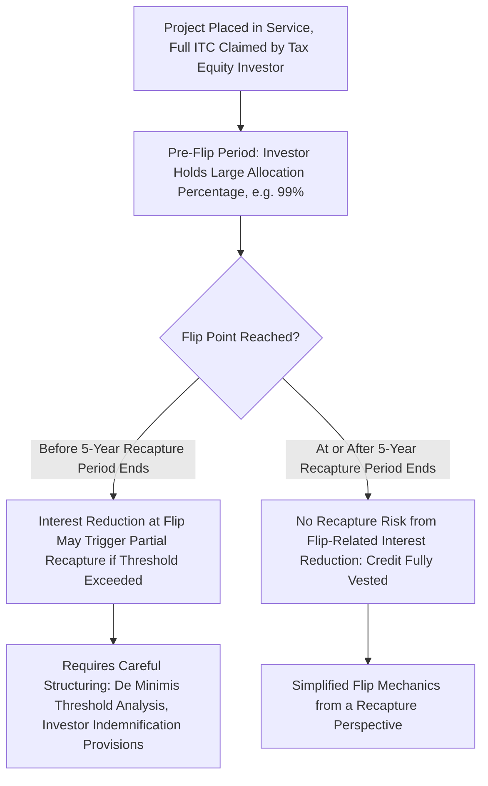

## Five-Year Vesting and Recapture Schedule

### Overview

The five-year vesting and recapture schedule under Section 50(a) is the mechanism that converts the Investment Tax Credit from a fully-claimed, day-one benefit into an economically contingent one: the full credit is claimed in the placed-in-service year, but a declining portion remains subject to repayment (recapture) if the underlying property ceases to qualify as investment credit property, or if a disqualifying event occurs, within five years of being placed in service. This recapture exposure is a central structuring driver in tax equity transactions — it shapes partnership flip timing, drives extensive representations and indemnification provisions, and is a core diligence item in credit transferability transactions under Section 6418.

### Statutory Basis and Core Mechanism

Section 50(a)(1) provides that if, during any taxable year, investment credit property is disposed of, or otherwise ceases to be investment credit property with respect to the taxpayer, before the close of the recapture period, the taxpayer's tax for that year is increased by the "recapture amount" — a declining percentage of the original credit claimed, based on how much of the five-year period has elapsed.

$$\text{Recapture Amount} = \text{Original Credit Claimed} \times \text{Applicable Recapture Percentage}$$

### The Recapture Percentage Schedule

The recapture percentage declines in 20-percentage-point increments for each full year the property remains in service as qualifying investment credit property, reaching zero once the full five-year period has elapsed:

| Time Since Placed in Service | Recapture Percentage | Vested Percentage |
| --- | --- | --- |
| Less than 1 full year | 100% | 0% |
| At least 1 year, less than 2 years | 80% | 20% |
| At least 2 years, less than 3 years | 60% | 40% |
| At least 3 years, less than 4 years | 40% | 60% |
| At least 4 years, less than 5 years | 20% | 80% |
| 5 years or more | 0% | 100% |

$$\text{Vested Percentage} = 20\% \times \text{Number of Full Years Elapsed Since Placed-in-Service (capped at 5)}$$

**Key Points**

- Vesting occurs ratably and automatically over time as each full year passes; no affirmative election or filing is required to "vest" the credit — the recapture percentage simply declines as a matter of statutory operation based on elapsed time.
- A disqualifying event that occurs even one day before a vesting anniversary triggers the higher recapture percentage applicable to the prior, not the impending, threshold — precise date tracking matters for structuring transactions timed around vesting milestones.

### Events Triggering Recapture

#### Disposition of the Property

A sale, exchange, or other transfer of the underlying investment credit property to an unrelated party during the recapture period is the most straightforward triggering event, since the taxpayer claiming the credit no longer owns the property that generated it.

#### Cessation as "Investment Credit Property"

Recapture can also be triggered without any transfer of ownership, if the property ceases to be investment credit property with respect to the taxpayer. Common fact patterns include:

- The property is converted to a use that would not have originally qualified for the credit (e.g., a change in the facility's function or classification).
- The property becomes tax-exempt use property under §168(h) due to a change in lessee, off-take counterparty, or ownership structure (see the tax-exempt use property analysis, which independently governs eligibility but also interacts with recapture if the change occurs after the credit was originally claimed).
- A change in the ownership structure of a partnership holding the property causes a partner's interest to be treated as reduced in a manner triggering a proportionate recapture event under the partnership-specific recapture rules (discussed below).

#### Partnership-Specific Recapture Triggers

Because most tax equity investments are held through partnerships, Treas. Reg. §1.47-6 (carried forward conceptually into current recapture practice) addresses recapture at the partner level: a reduction in a partner's interest in a partnership that owns investment credit property can trigger a proportionate recapture event for that partner, even though the partnership itself continues to hold and operate the property without interruption.

**Key Points**

- This partner-level recapture concept is a central reason why partnership flip structures are carefully timed and drafted: a change in the tax equity investor's percentage interest (as occurs at the flip point, when allocations shift from the investor-heavy pre-flip ratio to the developer-heavy post-flip ratio) can itself be a partial recapture-triggering event if it occurs before the five-year recapture period has fully run.
- The magnitude of a partnership interest reduction matters — regulations generally provide a de minimis threshold (a reduction of one-third or less of the partner's proportionate interest, as historically interpreted under the investment credit recapture regulations) below which recapture is not triggered, giving structuring flexibility for minor allocation shifts but requiring careful drafting when larger shifts are contemplated.

### Interaction with Partnership Flip Timing

The five-year recapture period is a primary driver of when partnership flip transactions are structured to occur:

**Key Points**

- Many partnership flip structures are explicitly designed so the flip point does not occur until after the five-year recapture period has expired, eliminating recapture risk associated with the allocation shift entirely, even though this extends the tax equity investor's involvement in the deal.
- Where commercial or return considerations require an earlier flip, the transaction documents must carefully analyze whether the specific allocation shift falls within the de minimis interest-reduction threshold, and if not, structure appropriate protections (investor consent rights, recapture indemnification, escrow mechanisms) to address the resulting exposure.

### Interaction with Credit Transferability Under Section 6418

The IRA's addition of §6418, allowing eligible taxpayers to transfer certain credits (including the ITC) to unrelated parties for cash, does not eliminate recapture risk — it relocates it. Under §6418(g)(3), if a recapture event occurs with respect to transferred credit property, the **recapture liability generally falls on the transferee** (the credit purchaser), not the transferor (the original credit generator), unless the parties have specifically allocated this risk differently through indemnification provisions in their credit purchase agreement.

**Key Points**

- This statutory default — recapture risk following the credit rather than the underlying property owner — is a fundamental driver of credit purchase agreement structuring, since transferees (often corporations purchasing credits purely as a tax-efficient investment with no operational involvement in or control over the underlying project) have no ability to prevent a disqualifying event but bear the statutory recapture liability.
- Market practice has developed robust seller (transferor) indemnification packages, insurance products (tax credit insurance covering recapture risk), and due diligence protocols specifically to address this statutorily-assigned but commercially reallocated recapture risk in transferability transactions.

### At-Risk and Recapture Interaction

Recapture under §50(a) is analytically distinct from, but can arise from related fact patterns to, at-risk recapture under §465(e) (discussed in the Passive Activity Loss and At-Risk Rules context): a cash distribution pattern that reduces a partner's at-risk amount below zero triggers §465(e) recapture of previously deducted *losses*, while an ownership interest reduction of sufficient magnitude can separately trigger §50(a) recapture of the *credit* itself. Both forms of recapture exposure should be modeled together in flip-timing and distribution-waterfall analysis, since they can arise from overlapping economic events (changes in the investor's economic interest in the deal) even though they operate under separate statutory provisions with separate mechanics.

### Recordkeeping and Ongoing Monitoring

Because recapture exposure persists for five full years after placed-in-service — often well after the initial financial closing and initial diligence period — ongoing monitoring is a practical necessity:

- **Ownership structure change tracking**: any contemplated transfer of partnership interests, changes in allocation percentages, or restructuring of the ownership vehicle during the recapture period should be checked against the recapture rules before execution.
- **Property use and classification monitoring**: changes in how the property is used (including changes in off-take counterparties that could trigger tax-exempt use property reclassification) should be evaluated for recapture impact even absent any formal disposition.
- **Casualty and involuntary conversion events**: destruction, condemnation, or other involuntary loss of the property during the recapture period can also trigger recapture, subject to certain replacement property rules that may mitigate the consequence in specific circumstances.
- **Recapture schedule disclosure in financing and transfer documents**: credit purchase agreements, tax equity term sheets, and partnership agreements should clearly reference the applicable recapture percentage schedule and the specific placed-in-service date anchoring it.

### Common Pitfalls in Practice

- **Assuming recapture only applies to outright asset sales** — partnership interest reductions, ownership structure changes, and property reclassification events can all independently trigger recapture without any sale of the underlying physical asset.
- **Structuring flip points without recapture analysis** — timing a partnership flip based purely on return/IRR targets without checking whether the resulting allocation shift exceeds the de minimis interest-reduction threshold can create unplanned recapture exposure.
- **Overlooking transferee recapture exposure in credit purchase transactions** — credit buyers who assume recapture risk remains with the original project owner, absent explicit indemnification language confirming risk allocation, may be statutorily exposed under §6418(g)(3)'s default rule.
- **Failing to track precise placed-in-service date anniversaries** — because the recapture percentage steps down at yearly anniversaries of the placed-in-service date, imprecise date tracking can lead to miscalculated recapture exposure in the event of a disqualifying event near a vesting threshold.
- **Neglecting to distinguish Section 50(a) credit recapture from Section 465(e) at-risk loss recapture** — treating these as the same analysis, when they are separate statutory regimes triggered by potentially overlapping but analytically distinct events, can result in incomplete risk assessment.

**Related Topics**

- Partnership flip structure mechanics and typical flip point negotiation
- Section 6418 credit transferability and recapture risk allocation in purchase agreements
- Tax credit insurance products covering recapture and other transaction risk
- Section 465(e) at-risk recapture rules and their interaction with cash distribution waterfalls
- Tax-exempt use property restrictions and their recapture implications upon post-closing counterparty changes
- Treasury Regulation 1.47-6 partnership-level recapture allocation rules
- Placed-in-service date determination and its role in fixing the recapture period
- Casualty loss and involuntary conversion treatment for investment credit property