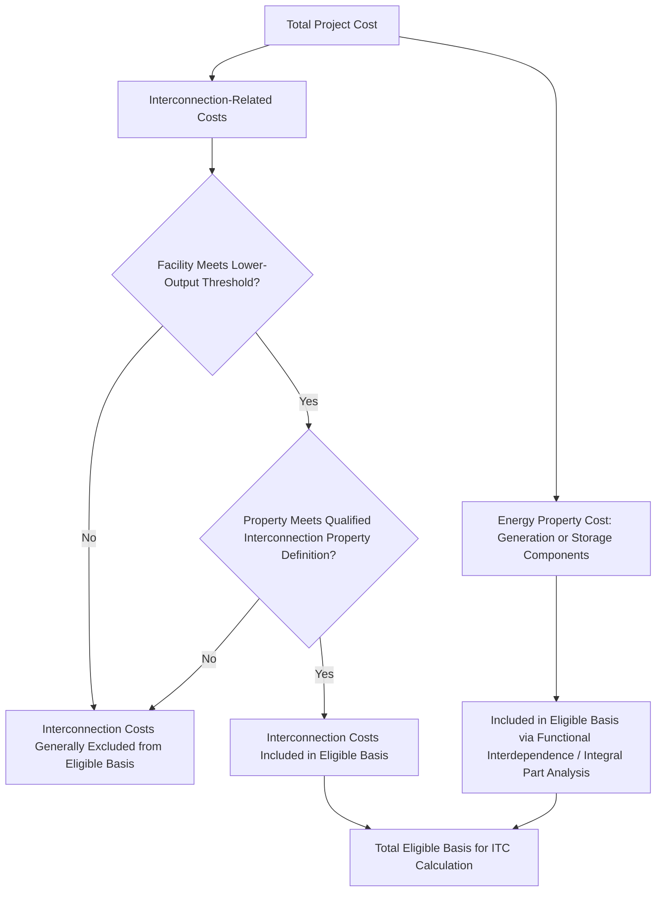

## Storage and Interconnection Property Eligibility

### Overview

Standalone energy storage and interconnection property eligibility represent two of the most significant expansions of Investment Tax Credit scope introduced by the Inflation Reduction Act of 2022 (IRA). Before the IRA, storage generally had to be charged predominantly by an eligible renewable energy property to qualify for the ITC as an integral part of that property; standalone storage without such a nexus generally did not qualify. Similarly, interconnection costs for many facilities were treated as outside the ITC basis. The IRA's amendments to Section 48 (and the parallel provisions carried into Section 48E) removed the standalone storage restriction and created a specific basis-inclusion rule for interconnection property, both refined by the final Treasury regulations issued December 4, 2024 (TD 10015).

### Standalone Energy Storage Technology

#### Statutory Expansion Under the IRA

The IRA added "energy storage technology" as an independently enumerated category of energy property under §48(a)(3)(A)(ix) (and the parallel treatment for storage under §48E), removing the pre-IRA requirement that storage be charged primarily by a co-located, ITC-eligible renewable generation facility to qualify. Under current law, energy storage technology that meets the statutory definition is eligible for the ITC as a standalone asset, regardless of whether it is charged from the grid, from a co-located renewable facility, or from any other source.

$$\text{Pre-IRA Storage Eligibility} = \text{Storage} + \text{Predominant Charging from ITC-Eligible Renewable Facility}$$

$$\text{Post-IRA Storage Eligibility} = \text{Storage Meeting Statutory Definition (Standalone, Regardless of Charging Source)}$$

**Key Points**

- This change substantially broadened the addressable market for storage tax equity: grid-charged, arbitrage-focused, and ancillary-services-focused standalone battery storage projects became independently creditable without requiring artificial co-location or charging-source structuring that was previously necessary to preserve ITC eligibility.
- The elimination of the charging-source restriction also simplified diligence for storage-plus-generation hybrid projects, since the storage component's eligibility no longer turns on demonstrating a predominant-charging-source relationship to the co-located generation asset.

#### Qualifying Energy Storage Technology — Statutory Definition

The statutory definition of qualified energy storage technology (as amended by the IRA) generally includes property that receives, stores, and delivers energy for conversion to electricity (or, for certain technologies, thermal energy storage), with a minimum capacity threshold (historically at least 5 kilowatt hours of capacity for property other than thermal energy storage, subject to specific statutory thresholds). Categories include, among others:

- Battery storage systems (the most common commercial application in current tax equity transactions)
- Thermal energy storage property
- Hydrogen energy storage property (subject to specific statutory conditions)
- Other technologies meeting the statutory storage definition as clarified by Treasury guidance

**Key Points**

- The final Section 48 regulations address rules for energy storage technology specifically, refining the functional interdependence and integral-part analysis (discussed in the Eligible Basis and Qualifying Property context) as applied to storage system components.
- Hybrid storage-plus-generation projects require a component-level analysis: the storage component and the generation component may each independently qualify as energy property, and eligible basis is determined by properly allocating costs between (and, where applicable, among) the distinct functionally interdependent units within the combined facility.

### Interconnection Property Eligibility

#### The Basis-Inclusion Problem Addressed by the IRA

Prior to the IRA, interconnection costs — the expenses associated with connecting a generating (or storage) facility to the electric grid, including transmission upgrades, substation equipment, and related network improvements — were frequently treated as costs incurred by, or reimbursed to, the interconnecting utility, and were not consistently includible in the generating facility owner's ITC-eligible basis, particularly where the utility itself constructed and owned the interconnection facilities.

The IRA added a specific rule allowing certain lower-output energy properties to include the cost of qualified interconnection property in their basis for the ITC, addressing a longstanding basis-exclusion gap that had disadvantaged smaller facilities disproportionately burdened by interconnection costs relative to their overall project size.

$$\text{Eligible Basis (Lower-Output Facility)} = \text{Cost of Energy Property} + \text{Cost of Qualified Interconnection Property (if applicable)}$$

#### Qualified Interconnection Property — Scope and Output Threshold

"Qualified interconnection property" generally refers to tangible property used to connect an energy project to the transmission or distribution grid, including equipment such as transformers, circuit breakers, and other property necessary to accomplish the interconnection, but the basis-inclusion rule applies specifically to **lower-output energy properties**, reflecting Congress's intent to address the disproportionate interconnection cost burden faced by smaller-scale facilities rather than extending unlimited interconnection basis inclusion to all facility sizes.

The final Section 48 regulations (TD 10015) clarify the treatment of costs with respect to qualified interconnection property, addressing definitional and allocation questions that arose under the proposed regulations.

**Key Points**

- The output threshold distinguishing "lower-output" facilities eligible for this rule from larger facilities is a specific statutory/regulatory capacity measure that should be confirmed against the current final regulatory text for the applicable taxable year, since precise threshold figures and any subsequent legislative adjustment are best verified directly against the governing regulation at the time of a specific transaction. [Unverified: given the technical specificity of the output threshold and the pace of regulatory refinement in this area, practitioners should confirm the exact current capacity threshold and any interconnection cost caps against the final regulations and any subsequent IRS guidance before relying on a specific number for a transaction.]
- This basis-inclusion rule is particularly significant for distributed generation, community solar, and smaller commercial-scale projects, where interconnection costs can represent a disproportionately large share of total project cost relative to utility-scale facilities that typically have more interconnection cost-sharing leverage or different utility cost-allocation treatment.

### Interaction Between Storage and Interconnection Eligibility in Hybrid Projects

Storage-plus-generation hybrid facilities (e.g., solar-plus-storage) raise combined eligibility questions requiring careful component-level analysis:

- **Separate unit determination**: the storage system and the generation system may each be analyzed as separate (or, depending on facts, integrated) functionally interdependent units, affecting how costs are allocated to each for basis purposes and how the aggregation rules for the "energy project" concept apply across the combined facility.
- **Shared interconnection infrastructure**: where a single interconnection point serves both the generation and storage components, allocation of the interconnection cost between the two components (to the extent the qualified interconnection property basis-inclusion rule applies) requires a reasonable cost allocation methodology, since each component's own output/size may separately determine its own eligibility for the lower-output interconnection basis-inclusion rule.
- **Placed-in-service coordination**: consistent with the general aggregation rule (an energy project is not placed in service until the last energy property within the project is placed in service), a hybrid facility's storage and generation components, if aggregated, share a common placed-in-service date determined by the later-completing component.

**Example**

A 4 MW community solar facility paired with a 4 MWh battery storage system shares a single interconnection point. If the combined facility meets the applicable lower-output threshold, qualified interconnection property costs (e.g., the shared substation upgrade) may be included in eligible basis, allocated reasonably between the solar and storage components based on relative cost, capacity, or another defensible allocation methodology, while the solar panels/racking/inverters and the battery modules/inverters/controls are each separately evaluated for functional interdependence and integral-part status within their respective systems.

### Storage-Specific PWA and Adder Considerations

Standalone and hybrid storage projects are subject to the same base/bonus rate structure (6% base, 30% bonus upon PWA compliance or exception) and are eligible for the same bonus adders (domestic content, energy community, low-income community allocation) as generation-only energy property, since the IRA's rate and adder architecture applies uniformly across qualifying energy property categories rather than differentiating by generation versus storage function.

**Key Points**

- Domestic content certification for storage systems requires tracking steel/iron and manufactured product cost thresholds specific to battery and related storage equipment supply chains, which may involve different sourcing considerations (e.g., battery cell and module manufacturing) than solar panel or wind turbine supply chains.
- The low-income community bonus adder categories (low-income community location, Indian land, qualified low-income residential building projects, qualified low-income economic benefit projects) apply to qualifying storage facilities under 5 MW on the same basis as generation facilities, subject to the same competitive allocation application process.

### Structuring and Diligence Implications

- **Component-level cost segregation for hybrid facilities**: EPC contracts and cost breakdowns for solar-plus-storage or wind-plus-storage projects should clearly delineate costs attributable to the generation system, the storage system, and shared interconnection infrastructure, supporting a defensible eligible basis allocation for each component.
- **Interconnection cost documentation and threshold verification**: confirm the facility's output classification against the current qualified interconnection property basis-inclusion threshold before assuming interconnection costs are includible, and maintain documentation supporting the qualified interconnection property characterization of specific cost items.
- **Charging source due diligence for legacy structuring artifacts**: projects originally structured under pre-IRA rules (with artificial charging-source arrangements designed to preserve storage ITC eligibility through co-located renewable charging) should be reviewed to determine whether such structuring remains necessary or whether it can be simplified given standalone storage's current independent eligibility.
- **Aggregation analysis for combined facilities**: assess whether a storage-plus-generation facility's components will be treated as a single aggregated energy project (affecting placed-in-service timing and PWA threshold measurement) or as separate energy properties, and structure financing/off-take agreements accordingly based on the desired outcome.

### Common Pitfalls in Practice

- **Applying outdated charging-source restrictions to standalone storage** — continuing to structure storage charging arrangements around the pre-IRA predominant-charging-source rule when current law no longer requires this nexus for standalone storage eligibility, creating unnecessary structuring complexity.
- **Assuming all interconnection costs are includible in eligible basis** — the qualified interconnection property basis-inclusion rule applies specifically to lower-output facilities meeting the applicable threshold, not universally to all energy property regardless of size.
- **Inadequate cost allocation methodology for hybrid facility interconnection costs** — failing to document a reasonable, defensible allocation of shared interconnection costs between generation and storage components in a combined facility, creating substantiation risk on audit or in transferability diligence.
- **Overlooking storage-specific domestic content supply chain complexity** — assuming domestic content compliance methodology developed for solar panel or wind turbine supply chains transfers directly to battery storage supply chains without independent verification of applicable component and cost thresholds.
- **Failing to reassess aggregation consequences for hybrid projects** — not evaluating whether combining generation and storage under common financing or off-take arrangements triggers aggregation that affects placed-in-service timing or PWA threshold measurement for the combined facility.

**Related Topics**

- Eligible basis and qualifying property: functional interdependence and integral part analysis
- Placed-in-service requirements and the energy project aggregation rule
- Base rate versus bonus rate structure and PWA compliance for storage facilities
- Domestic content adder compliance for battery and storage equipment supply chains
- Section 48 versus Section 48E technology-neutral credit eligibility for storage technology
- Low-income community bonus credit allocation program mechanics for storage under 5 MW
- Section 6418 credit transferability considerations for hybrid storage-generation facilities
- Grid services, ancillary market participation, and their interaction with ITC eligibility for grid-charged storage