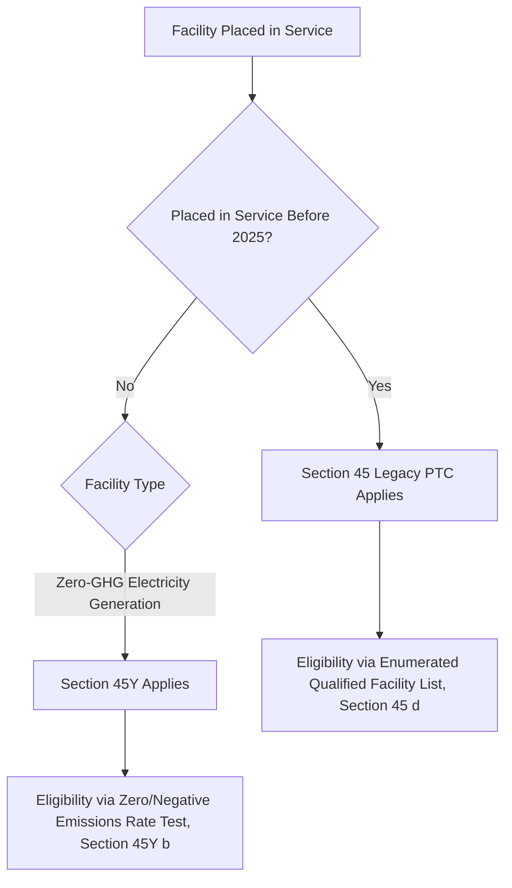
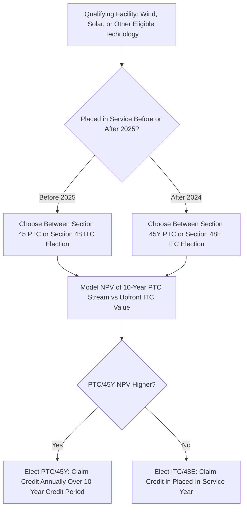

## Section 45 Legacy Credit Versus Section 45Y Technology-Neutral Credit

### Overview

Just as Section 48 is transitioning to the technology-neutral Section 48E for investment credits, the legacy Section 45 Production Tax Credit (PTC) is transitioning to the technology-neutral Section 45Y Clean Electricity Production Credit for facilities placed in service after 2024. Section 45/45Y and Section 48/48E are structurally paired mirror-image credits — a per-kilowatt-hour production-based credit versus an upfront investment-based credit — and taxpayers generally elect between the PTC regime and the ITC regime (subject to eligibility) rather than claiming both for the same facility. Understanding the Section 45-to-45Y transition is therefore essential alongside the Section 48-to-48E transition, since project developers routinely model both credit families before selecting an election path.

### Statutory Framework and Timeline

#### Section 45 — The Legacy, Technology-Specific Production Credit

Section 45 has provided a per-kilowatt-hour production tax credit since 1992, historically covering wind, closed-loop and open-loop biomass, geothermal, solar (before solar's practical shift toward the ITC in most transactions), municipal solid waste, qualified hydropower, and marine and hydrokinetic renewable energy, each enumerated as a specific qualified facility type under §45(d).

#### Section 45Y — The Technology-Neutral Successor

The IRA added Section 45Y, effective for facilities placed in service after December 31, 2024, restructuring the eligibility test around the same technology-neutral, zero-emissions principle used in Section 48E: any qualified facility used for the generation of electricity that has an anticipated greenhouse gas emissions rate of zero or less is eligible, rather than requiring the facility to match an enumerated technology category.

$$\text{Eligibility Test (Section 45)} = \text{Is the facility an enumerated qualified facility type?}$$

$$\text{Eligibility Test (Section 45Y)} = \text{Does the facility have an anticipated GHG emissions rate} \leq 0?$$

**Key Points**

- As with the Section 48/48E transition, the governing statute is determined by **placed-in-service date**, not begin-construction date — a facility beginning construction under Section 45-era assumptions but placed in service in 2025 or later is subject to Section 45Y's zero-emissions eligibility test.
- Because Section 45 already covered the dominant technology in the PTC market (wind) as an enumerated category, and wind readily satisfies a zero-emissions test, the practical eligibility impact of the 45-to-45Y transition is narrower for wind than the corresponding 48-to-48E transition is for some historically ITC-ineligible technologies now newly eligible for 48E (e.g., nuclear).

### Credit Calculation Mechanics — Structural Parallel

Both Section 45 and Section 45Y share the same fundamental per-kilowatt-hour calculation architecture with an inflation-adjusted base amount and the same two-tier PWA-linked rate structure used in the ITC:

$$\text{PTC Amount} = \text{Kilowatt-Hours of Electricity Produced and Sold} \times \text{Applicable Credit Rate per kWh}$$

$$\text{Applicable Credit Rate} = \begin{cases} \text{Full statutory rate (inflation-adjusted, historically referenced as approximately 2.75 cents/kWh in recent years)} & \text{if PWA satisfied, or under 1 MW exception, or pre-1/29/2023 construction} \\ \text{One-fifth of full rate} & \text{otherwise} \end{cases}$$

**Key Points**

- Mirroring the ITC's 6%/30% base-to-bonus ratio, the PTC's base rate is one-fifth of the bonus rate, preserving the same 5x PWA-compliance multiplier across both credit families.
- The credit is claimed annually over a defined **credit period** — generally the 10-year period beginning on the date the facility was originally placed in service — meaning, unlike the ITC's single-year claim, PTC/45Y economics depend on sustained production over a decade, introducing production risk (weather, resource availability, curtailment) into the credit's economic value that the ITC does not share.
- Exact current inflation-adjusted per-kWh rates should be confirmed against the most recently published IRS inflation adjustment guidance for the applicable placed-in-service year, since these figures are adjusted annually and specific historical figures can become quickly outdated. [Unverified: precise current per-kWh rate figures for a specific taxable year should be verified against the applicable IRS annual inflation adjustment notice rather than relied upon from memory.]

### Eligible Technology Comparison

| Technology | Section 45 (Legacy) | Section 45Y (Technology-Neutral) |
| --- | --- | --- |
| Wind (onshore/offshore) | Enumerated qualified facility | Qualifies via zero-emissions test |
| Closed-loop/open-loop biomass | Enumerated, with distinct rate structures historically | Requires emissions rate determination; not automatically qualified by fuel category alone |
| Geothermal (electricity) | Enumerated | Qualifies via zero-emissions test |
| Qualified hydropower | Enumerated | Qualifies via zero-emissions test |
| Marine and hydrokinetic | Enumerated | Qualifies via zero-emissions test |
| Municipal solid waste | Enumerated | Requires emissions rate determination |
| Solar (electricity) | Enumerated but historically underutilized relative to ITC election for solar | Qualifies via zero-emissions test |
| Nuclear (new/uprated) | Not covered by legacy Section 45 (addressed via Section 45U for existing nuclear production) | Qualifies via zero-emissions test — a notable expansion parallel to the 48E nuclear expansion |

**Key Points**

- As with Section 48E, Treasury is required to publish and periodically update tables of anticipated greenhouse gas emissions rates for various facility types under Section 45Y, along with a petition process for technologies not yet listed, mirroring the Section 48E emissions rate table framework.
- Combustion, gasification, and biomass-derived facilities face the same qualitatively more demanding emissions-rate-based qualification path under Section 45Y that parallel technologies face under Section 48E, replacing the simpler enumerated-category matching under legacy Section 45.

### The Section 48/48E Versus Section 45/45Y Election

#### General Election Mechanics

Section 48(a)(5) (and the parallel provision for Section 48E) allows a taxpayer that would otherwise be eligible to claim the PTC (or 45Y credit) for a facility to instead elect to treat the facility as energy property eligible for the ITC (or 48E credit), effectively allowing wind, solar, and other qualifying facilities to choose between the two credit families on a facility-by-facility basis, subject to the election being made in the placed-in-service year and generally being irrevocable once made.

$$\text{Election Choice} = \max(\text{NPV of PTC/45Y over 10-year production period}, \text{ITC/48E credit claimed upfront})$$

**Key Points**

- The election is economically consequential and technology/resource-dependent: high-capacity-factor wind projects in strong wind resource areas have historically often favored the PTC given the extended production period's cumulative value, while solar projects (with different capital-cost-to-output ratios and, historically, less favorable production tax credit economics relative to the ITC) have more frequently elected the ITC.
- Storage-inclusive hybrid projects add complexity to the election analysis because storage is generally an ITC-only asset (there is no production-based credit analog for storage charging/discharging), meaning a hybrid facility's generation component election choice must be considered alongside the storage component's inherent ITC-only treatment.

### Bonus Adder Structure — Parallel to the ITC Family

Section 45/45Y share the same bonus adder categories introduced by the IRA as Section 48/48E, calculated as percentage increases to the per-kWh credit rate rather than to an eligible-basis percentage:

- **Domestic content adder**: an additional 10% increase to the credit rate for facilities satisfying domestic content requirements (steel, iron, and manufactured product thresholds), paralleling the ITC's 10-percentage-point basis adder but expressed as a rate multiplier rather than a basis addition.
- **Energy community adder**: an additional 10% increase to the credit rate for facilities located in qualifying energy communities, using the same energy community definitional framework (brownfield sites, statistical areas with historical fossil fuel employment, retired coal facility areas) shared across both the ITC and PTC families.

**Key Points**

- Unlike the ITC, there is no low-income community bonus adder analog under Section 45/45Y — the low-income community bonus credit allocation program is specific to the investment-credit family (Section 48(e) and the parallel Section 48E allocation mechanism), reflecting Congress's original design choice to link the low-income adder to upfront investment credit structures rather than production-based credits.
- Because adders under the PTC family compound over the full 10-year credit period on a per-kWh basis, their cumulative value can be substantial for high-production facilities, even though the percentage increase (10%) matches the ITC adder's percentage-point convention numerically.

### FEOC Restrictions — Parallel Divergence Introduced by 2025 Legislation

As with Section 48/48E, the 2025 budget reconciliation legislation introduced foreign entity of concern (FEOC) and prohibited foreign entity material assistance restrictions applicable to both Section 45/45Y and Section 48/48E, restricting credit eligibility or adder availability where a facility has specified connections to prohibited foreign entities. [Unverified: given the complexity and ongoing development of FEOC guidance following the 2025 legislative changes, practitioners should confirm current statutory text and the most recent Treasury/IRS guidance specific to the production credit family, since FEOC compliance mechanics, safe harbors, and effective dates may differ in application details between the investment credit and production credit contexts even though the underlying restriction framework is conceptually shared.]

### Phase-Out Mechanics

Section 45Y, like Section 48E, incorporates an emissions-based phase-out trigger tied to overall electricity sector greenhouse gas emissions reaching a specified threshold relative to a baseline year, beginning for facilities starting construction after the later of 2032 or the year the emissions threshold is met, as determined by Treasury/EPA. As with Section 48E, 2025 legislative amendments have further modified phase-out and eligibility timelines for certain technologies relative to the original IRA-enacted schedule. [Unverified: exact current phase-out percentages, applicable dates, and technology-specific carve-outs following the 2025 reconciliation legislation should be verified against the current statutory text and most recent IRS/Treasury guidance given the pace of legislative change in this area.]

### Structuring and Diligence Implications

#### Election Timing and Irrevocability

Because the Section 48(a)(5)/48E ITC election out of the PTC/45Y regime is generally made and becomes irrevocable at the time the facility is placed in service (via the taxpayer's return filing position for that year), developers and tax equity investors must finalize the economic election analysis before or contemporaneously with the placed-in-service determination, integrating this decision into overall financial close and closing-mechanics timelines.

#### Tax Equity Structuring Differences Between PTC and ITC Deals

PTC-elected partnership flip structures differ materially from ITC-elected structures in cash flow and return timing: because the PTC accrues over a 10-year production period rather than as an upfront credit, tax equity investor return profiles, flip-point timing, and capital account mechanics are modeled around a longer credit-realization horizon, generally extending the period during which the tax equity investor's allocation percentage and associated recapture-type risk considerations remain economically relevant (though PTC recapture mechanics differ from ITC recapture under Section 50(a) and are generally tied to output verification and continued qualified facility status rather than a declining vesting schedule).

#### Production Risk Allocation

Because PTC/45Y value depends on actual electricity production and sale over the 10-year credit period, tax equity term sheets for PTC-elected deals typically include detailed production risk allocation provisions (minimum production guarantees, curtailment risk allocation, resource assessment representations) that are largely absent from ITC-elected deal structures, where the credit amount is fixed at the placed-in-service date regardless of subsequent production performance.

### Common Pitfalls in Practice

- **Assuming the ITC/PTC election is technology-determined rather than facility-specific** — while market convention associates wind with PTC and solar with ITC, the election is available on a facility-by-facility economic basis and should be independently modeled rather than assumed based on technology type alone.
- **Overlooking storage's ITC-only status in hybrid project election analysis** — assuming a hybrid facility's PTC/45Y election for the generation component automatically extends favorable treatment to a co-located storage component, when storage generally must independently rely on ITC/48E treatment regardless of the generation component's election.
- **Treating the 45-to-45Y transition as identical in practical impact to the 48-to-48E transition** — because Section 45 already enumerated the dominant PTC technology (wind) and wind readily satisfies the zero-emissions test, the technology-eligibility impact of the transition is generally narrower for the PTC family than for the ITC family, where more historically ineligible technologies (e.g., nuclear) gain new eligibility.
- **Failing to model production risk in PTC-elected deal structuring** — underestimating the extent to which resource variability and curtailment risk affect actual realized PTC value over the 10-year credit period relative to the more certain, upfront ITC credit amount.
- **Missing the absence of a low-income adder analog** — assuming PTC-elected projects can access a low-income community bonus adder parallel to the ITC's allocation program, when this bonus category is specific to the investment credit family.

**Related Topics**

- Section 48 versus Section 48E investment tax credit eligibility comparison
- The Section 48(a)(5) PTC-to-ITC election mechanics and economic modeling considerations
- Domestic content and energy community adder compliance across the PTC and ITC families
- Foreign entity of concern (FEOC) restrictions under 2025 legislative amendments
- Partnership flip structuring differences between PTC-elected and ITC-elected deals
- Section 45U existing nuclear production credit and its relationship to Section 45Y's new nuclear eligibility
- Production risk allocation and resource assessment representations in PTC tax equity term sheets
- Treasury's Section 45Y emissions rate table publication and technology petition process