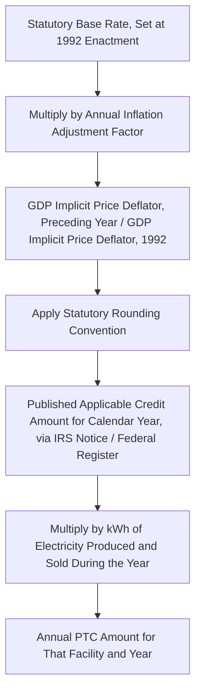
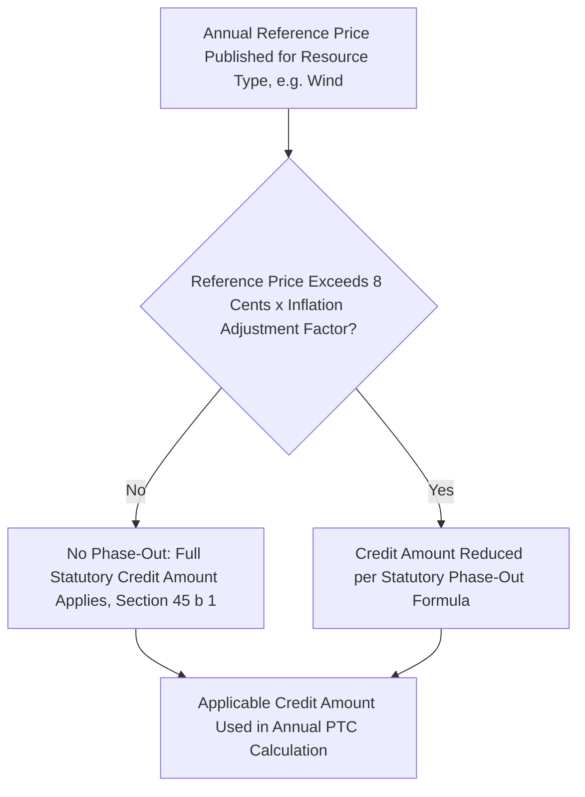

## Per-Kilowatt-Hour Calculation and Inflation Adjustment

### Overview

The Production Tax Credit's per-kilowatt-hour calculation mechanism — under both legacy Section 45 and technology-neutral Section 45Y — converts a statutory base cent amount from the early 1990s into a current-dollar credit rate through an annually published inflation adjustment factor. Because the credit is claimed over a 10-year production period rather than as a single upfront amount, understanding exactly how the per-kWh rate is calculated, rounded, and adjusted each year is essential to accurately modeling the economic value of a PTC-elected tax equity transaction, and to correctly claiming the credit on an annual basis throughout the credit period.

### The Statutory Calculation Formula

#### Core Mechanism

Both Section 45(b)(2) and Section 45Y(c) define the applicable credit amount as a statutory base amount (denominated in the early-1990s cents-per-kWh figures set at enactment) multiplied by an annually determined inflation adjustment factor, then rounded according to specified statutory rounding conventions.

$$\text{Inflation Adjustment Factor} = \frac{\text{GDP Implicit Price Deflator for Preceding Calendar Year}}{\text{GDP Implicit Price Deflator for 1992}}$$

$$\text{Applicable Credit Amount} = \text{Statutory Base Amount} \times \text{Inflation Adjustment Factor (rounded per statutory convention)}$$

The inflation adjustment factor is defined as a fraction, the numerator of which is the GDP implicit price deflator for the preceding calendar year and the denominator of which is the same deflator for 1992, using the most recent revision of the deflator published by the Department of Commerce before March 15 of the relevant year. Treasury has no latitude to raise or lower this result — the only discretion in the process concerns which revision of the deflator is used, and the statute settles that too by specifying the applicable publication cutoff date.

**Key Points**

- 1992 is the anchor year because Section 45 was originally enacted as part of the Energy Policy Act of 1992, making the 1992 GDP deflator the fixed denominator against which all subsequent years' inflation adjustment is measured.
- Because the inflation adjustment factor is a mechanical, non-discretionary calculation based on published government economic data, the annual rate publication is a routine, largely ministerial IRS notice rather than a substantive policy determination — though the underlying statutory base rates and technology categories remain subject to legislative change.

### Current Published Rates — Section 45 Legacy Credit

For calendar year 2025, the IRS published the following Section 45 amounts (Federal Register, May 2025), using an inflation adjustment factor of 1.9971 for calendar year 2025 for qualified energy resources:

| Facility Category | Placed in Service Before 1/1/2022 | Placed in Service On or After 1/1/2022 |
| --- | --- | --- |
| Wind, closed-loop biomass, geothermal | 3 cents/kWh (full rate) | 0.6 cents/kWh (base) / 3 cents/kWh (with PWA) |
| Open-loop biomass, landfill gas, trash, qualified hydropower, marine/hydrokinetic | 1.5 cents/kWh (full rate) | 0.6 cents/kWh (base) / 3 cents/kWh (with PWA) |
| Solar (placed in service 2006–2021) | Not eligible for PTC (ITC-only during this period) | Not applicable |

**Key Points**

- The IRA's restructuring of Section 45 rates for facilities placed in service after December 31, 2021 changed the credit calculation to the PWA-linked base/bonus structure (0.6 cents base, 3 cents bonus), separate from the higher unconditional full-rate amounts that continue to apply to older facilities placed in service before 2022 under a different rounding rule preserved for those legacy facilities.
- Due to differing rounding conventions between the pre-2022 and post-2021 placed-in-service regimes, the fully-vested PWA-compliant rate for facilities placed in service before January 1, 2022 (3.1 cents/kWh) is not numerically identical to the fully-vested PWA-compliant rate for facilities placed in service on or after that date (3.0 cents/kWh), despite both nominally representing the "full" bonus-rate outcome.

### Current Published Rates — Section 45Y Technology-Neutral Credit

For calendar year 2025, the applicable amount under §45Y(a)(2)(A) was published as 0.6 cents ($0.006) per kWh, and the applicable amount under §45Y(a)(2)(B) was published as 3 cents ($0.03) per kWh, using a 2025 inflation adjustment factor of 1.9971.

For calendar year 2026, the IRS published an inflation adjustment factor of 2.0570 (calculated using a GDP implicit price deflator of 128.986 for 2025 and 62.707 for 1992), producing a base amount of 0.6 cents per kWh and an alternative (bonus) amount of 3.1 cents per kWh for 2026.

$$\text{2026 Section 45Y Base Rate} = 0.3\text{ cents} \times 2.0570 = 0.6171\text{ cents, rounded down to } 0.6\text{ cents/kWh}$$

**Key Points**

- Multiplying the inflation adjustment factor by the underlying 1992-era base credit of 0.3 cents yields a raw 2026 figure of 0.6171 cents, which is then rounded down to 0.6 cents per the applicable statutory rounding rule — illustrating that the published round figures are the output of a precise, publicly documented arithmetic calculation rather than independently set policy numbers.
- Per kWh, the 2026 Section 45Y credit has a full (PWA-compliant) value of 3.1 cents and a base (non-PWA-compliant) value of 0.6 cents, maintaining the same 5x base-to-bonus ratio structure used across the ITC and PTC families.
- One clerical inconsistency has appeared in at least one published notice, where a single line referenced "calendar year 2025" while the title, summary, and detailed computation section all consistently identified calendar year 2026 — the document's overall heading and arithmetic controls, but this illustrates the importance of reading the full computation section rather than any single reference line when verifying a specific year's rate from a published notice.

### Rounding Conventions

The statute specifies particular rounding rules for the calculated credit amount, and these rules differ depending on the facility's placed-in-service date category (a distinction inherited from the IRA's restructuring of Section 45 rates for post-2021 facilities):

$$\text{Rounded Amount} = \text{Round}\left(\text{Raw Calculated Amount}, \text{nearest } 0.05\text{ cent (or applicable statutory increment)}\right)$$

**Example**

For the §45U zero-emission nuclear production credit (a related but separate production credit sharing similar inflation-adjustment mechanics), the calendar year 2025 amount under §45U(a)(1)(A) was calculated as 0.3 cents multiplied by an inflation adjustment factor of 1.0242, then rounded to the nearest multiple of 0.05 cent — illustrating the general pattern of base-amount-times-factor-then-round that appears with technology-specific variations across the family of related production credit provisions (Sections 45, 45Y, 45U, 45V, and 45Z).

**Key Points**

- Rounding conventions and the specific rounding increment can differ across the various related production credit sections (45, 45Y, 45U, 45V, 45Z), so practitioners should confirm the precise rounding rule applicable to the specific credit section at issue rather than assuming uniform treatment across all production-based energy credits.

### The Reference Price Phase-Out Mechanism (Section 45 Legacy Only)

Section 45(b)(1) contains a phase-out mechanism specific to the legacy credit, tied to a published annual "reference price" for the applicable electricity resource: if the reference price for a given resource (e.g., wind) exceeds a specified inflation-adjusted threshold (historically 8 cents, itself adjusted by the same inflation factor), the credit amount is reduced.

For calendar year 2026, the reference price for facilities producing electricity from wind was published at 3.17 cents per kilowatt hour; because this price does not exceed 8 cents multiplied by the applicable inflation adjustment factor, the phase-out under §45(b)(1) does not apply for the relevant calendar year.

$$\text{Phase-Out Triggered if: } \text{Reference Price} > 8\text{ cents} \times \text{Inflation Adjustment Factor}$$

**Key Points**

- This reference-price-based phase-out mechanism is specific to Section 45's legacy design and has not, in practice, been triggered for wind in recent years given actual market reference prices remaining well below the inflation-adjusted threshold.
- Reference prices for closed-loop biomass, open-loop biomass, geothermal energy, municipal solid waste, qualified hydropower production, and marine and hydrokinetic renewable energy have in some years not been separately determined or published, reflecting more limited market data availability for these less commonly PTC-elected technology categories relative to wind.
- [Unverified: whether Section 45Y retains an analogous reference-price phase-out mechanism, or whether this feature is unique to the legacy Section 45 structure, should be confirmed against the current statutory text of Section 45Y, since the technology-neutral redesign may have altered or omitted this specific legacy mechanism.]

### Annual Publication Process and Timing

Both the Section 45 inflation adjustment/reference price notice and the Section 45Y inflation adjustment/applicable amounts notice are published annually in the Federal Register, generally in the spring or late summer of the applicable calendar year, and are subsequently republished in the Internal Revenue Bulletin. Because these figures apply to sales, consumption, or storage of electricity occurring during the specific calendar year identified in the notice, tax equity investors and project sponsors modeling multi-year PTC cash flows must incorporate the correct year-specific published rate for each year of the facility's 10-year credit period, rather than assuming a static rate throughout.

**Key Points**

- Because the inflation adjustment factor and resulting rates are published on a rolling annual basis and depend on the prior year's GDP implicit price deflator, PTC cash flow models for future years within a facility's credit period necessarily rely on projected (not yet published) future inflation adjustment factors, introducing a modeling assumption that should be clearly flagged and periodically updated against actual published figures as they become available.
- The publication of both the Section 45 and Section 45Y notices in the same general timeframe each year (though as separate notices, since they are governed by separate statutory provisions with separate publication requirements) means practitioners tracking multiple vintage facilities (some under legacy Section 45, others under Section 45Y) should confirm they are referencing the correct notice for each facility's governing statute.

### Structuring and Diligence Implications

- **Multi-year rate modeling discipline**: financial models supporting PTC-elected tax equity transactions should clearly document which years' rates are based on actual published IRS figures versus projected/assumed future inflation adjustments, and should be periodically refreshed as new annual notices are published throughout the facility's 10-year credit period.
- **Placed-in-service date rate bucket verification**: given the differing rate structures and rounding conventions across placed-in-service date categories (pre-2022 legacy full-rate facilities versus post-2021 PWA-linked base/bonus facilities, and pre-2025 Section 45 facilities versus post-2024 Section 45Y facilities), confirm the correct applicable rate table and rounding convention for each specific facility based on its actual placed-in-service date.
- **Cross-reference verification against current Federal Register notices**: because these figures are published annually and are subject to routine updates, deal teams should verify current-year rates directly against the most recently published Federal Register notice or IRS Bulletin republication rather than relying on prior-year figures or general market commentary.
- **Reference price phase-out monitoring for legacy Section 45 wind facilities**: while the phase-out has not been triggered in recent years, tax equity documentation for legacy Section 45 wind facilities should acknowledge the theoretical phase-out mechanism and its dependence on published reference prices remaining below the inflation-adjusted threshold.

### Common Pitfalls in Practice

- **Using a stale or outdated per-kWh figure from a prior year** — because rates are republished annually based on updated inflation adjustment factors, using a figure from an earlier calendar year's notice for a current-year production calculation will misstate the credit amount.
- **Applying the wrong rounding convention** — conflating the rounding rules applicable to pre-2022 legacy Section 45 facilities, post-2021 Section 45 facilities, and Section 45Y facilities can produce calculation errors, since these categories have historically used different rounding increments and reference base amounts.
- **Assuming Section 45 and Section 45Y rates are always numerically identical** — while the two sections currently share similar base and bonus amounts by coincidence of their shared post-IRA design, they are calculated under separate statutory provisions with independently published inflation adjustment factors and should not be assumed identical without verification for a given year.
- **Overlooking the reference price phase-out mechanism entirely for legacy wind facilities** — even though the mechanism has not been triggered in recent history, a comprehensive PTC risk analysis for legacy Section 45 wind facilities should account for the theoretical possibility of reference-price-driven credit reduction.
- **Failing to project forward rates responsibly in long-term models** — building a 10-year PTC cash flow model on a flat, unescalated per-kWh rate assumption without acknowledging that actual future rates will depend on future GDP deflator movements, which are inherently uncertain multi-year projections. [Inference: the degree of future inflation adjustment factor volatility, and its resulting impact on long-term PTC modeling precision, depends on macroeconomic conditions that cannot be forecast with certainty at the time a model is built.]

**Related Topics**

- Section 45 legacy credit versus Section 45Y technology-neutral credit eligibility comparison
- Base rate versus bonus rate structure and PWA compliance for production tax credits
- The Section 48(a)(5) PTC-to-ITC election mechanics and economic modeling considerations
- Related production credit provisions: Section 45U (nuclear), 45V (clean hydrogen), 45Z (clean fuel)
- Domestic content and energy community adders applied to per-kWh credit rates
- Production risk allocation and resource assessment representations in PTC tax equity term sheets
- Ten-year credit period mechanics and annual credit claim procedures
- GDP implicit price deflator methodology and its role in federal tax inflation adjustments