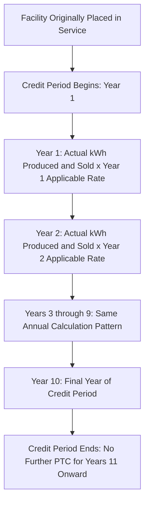
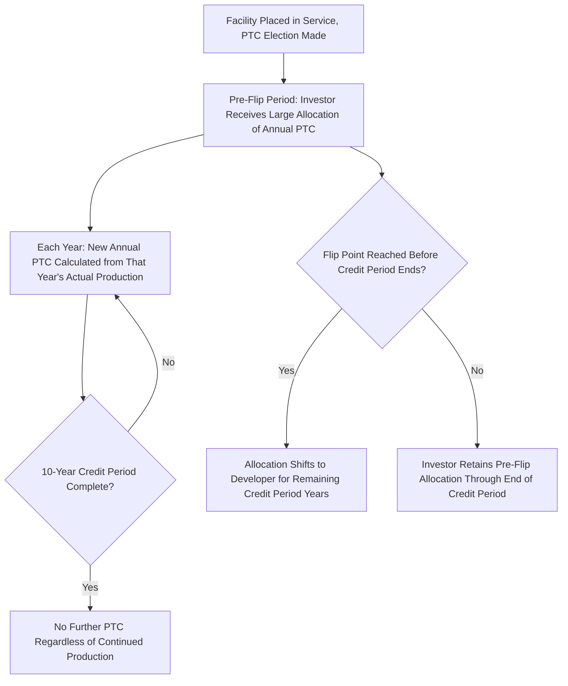

## Ten-Year Credit Period Mechanics

### Overview

The 10-year credit period is the temporal backbone of the Production Tax Credit under both legacy Section 45 and technology-neutral Section 45Y: rather than claiming a single lump-sum credit in the placed-in-service year (as with the ITC), a PTC-elected facility generates a separate annual credit calculation for each of the ten years beginning on the date the facility was originally placed in service, based on actual electricity produced and sold during each such year. This extended, production-contingent claiming period fundamentally shapes tax equity structuring, cash flow modeling, and risk allocation for PTC-elected transactions in ways that have no direct analog in ITC-elected deals.

### Statutory Basis and Core Mechanism

Section 45(a) and the parallel Section 45Y(a) define the credit period as the 10-year period beginning on the date the facility was originally placed in service. Taxpayers may receive the PTC for 10 years, starting with the date the facility is placed in service, with PTC amounts calculated separately for each year of the facility's operations.

$$\text{Annual PTC for Year } n = \text{kWh Produced and Sold in Year } n \times \text{Applicable Rate for Calendar Year } n$$

$$\text{Total Credit Period} = \sum_{n=1}^{10} \text{Annual PTC for Year } n$$

**Key Points**

- The credit period begins on the **original** placed-in-service date and does not reset upon a change in ownership of the facility during the period — a purchaser of an existing PTC-eligible facility mid-credit-period generally steps into the remainder of the original 10-year window rather than starting a fresh 10-year period, subject to specific statutory successor rules.
- Because each year's credit amount depends on that year's specific published inflation-adjusted rate (discussed in the Per-Kilowatt-Hour Calculation and Inflation Adjustment context) and that year's actual production, no two years of a facility's credit period will generally produce an identical dollar credit amount, even for a facility with stable physical output.

### Annual Calculation and Claiming Mechanics

#### Production and Sale Requirement

The credit is tied to electricity that is both produced by the taxpayer at the qualified facility and sold by the taxpayer to an unrelated person during the taxable year (subject to specific rules for certain related-party or self-consumption arrangements that may nonetheless qualify under statutory exceptions for particular ownership structures, such as certain vertically integrated utility or cooperative arrangements). Electricity generated but not sold in a given year (e.g., due to curtailment without compensation, or storage without eventual sale in a manner that satisfies the sale requirement) generally does not generate a credit for that year.

**Key Points**

- The dual production-and-sale requirement means facility output alone is insufficient; the electricity must actually be sold (or, in specific statutorily defined circumstances, otherwise treated as sold, such as through certain metering and crediting arrangements for facilities selling to a related party under specified conditions) to generate the annual credit.
- Curtailment — whether for grid reliability, negative pricing, or transmission constraints — that results in electricity not being produced or not being sold directly reduces that year's PTC amount, distinguishing PTC economics from the ITC's fixed, production-independent credit amount.

#### Annual Return Filing

Unlike the ITC, which is generally claimed once via Form 3468 in the placed-in-service year, the PTC is claimed annually via Form 8835 (Renewable Electricity Production Credit) or its Section 45Y successor reporting mechanism, for each of the 10 years within the credit period, based on that year's actual metered production and sales data.

**Key Points**

- This annual filing requirement means a PTC-elected facility generates ten separate credit-claiming events over its credit period, each requiring its own supporting production and sales documentation, in contrast to the ITC's single claiming event.
- Partnership-held PTC-elected facilities allocate the annual credit amount to partners under the partnership's operating agreement waterfall provisions for each taxable year, meaning the partnership must perform this allocation calculation annually throughout the entire 10-year credit period, not merely once at closing.

### Interaction with Partnership Flip Structures

#### Extended Investor Involvement Horizon

Because PTC value accrues over 10 years of actual production rather than as an upfront amount, PTC-elected partnership flip structures generally involve a longer-duration relationship between the tax equity investor and the sponsor than typical ITC-elected structures, since the investor's return depends on capturing a meaningful share of the credit stream across multiple years rather than a single upfront credit claim.

**Key Points**

- Flip point timing in PTC deals is frequently negotiated with reference to the 10-year credit period itself — some structures target a flip after the credit period substantially concludes, aligning the investor's primary economic interest with the years in which PTC value is actually being generated, while the post-PTC-period cash flows (still valuable but no longer credit-enhanced) shift predominantly to the developer.
- Because the credit period is fixed at exactly 10 years from the original placed-in-service date regardless of subsequent ownership changes, structuring flexibility around flip timing exists within that fixed window, but the window itself cannot be extended or restarted through subsequent restructuring.

#### Production Risk Allocation in Deal Documentation

Because each year's credit depends on that year's actual production, PTC-elected tax equity term sheets typically include:

- **Minimum production guarantees or make-whole provisions**: sponsor commitments (potentially backed by contractual manufacturer/EPC performance guarantees, or resource-related insurance products) addressing shortfalls in expected annual output relative to the resource assessment used in original underwriting.
- **Curtailment risk allocation provisions**: contractual terms addressing which party bears the economic risk of grid-operator-directed curtailment, negative pricing periods, or other production-suppressing events outside the sponsor's operational control.
- **Resource assessment representations and warranties**: detailed representations regarding the wind or solar resource assessment methodology (e.g., P50/P90 production estimates) underlying the initial economic model, since deviations from these assessments directly affect actual realized PTC value across the 10-year period.

### Comparison to ITC Recapture Timing

While the PTC credit period and the ITC's five-year recapture period both span multi-year windows, they operate on fundamentally different mechanics and serve different functions:

| Feature | ITC Five-Year Recapture Period | PTC Ten-Year Credit Period |
| --- | --- | --- |
| Direction of value flow | Full credit claimed upfront; recapture reduces/reverses it if disqualifying event occurs | Credit accrues incrementally each year; no credit exists until earned by actual production |
| Trigger for value change | Disposition or disqualifying event (contingent, may never occur) | Ongoing annual production and sale (occurs by design, not as an adverse contingency) |
| Duration | 5 years | 10 years |
| Risk character | Downside/reversal risk on an already-claimed benefit | Realization risk on a not-yet-earned future benefit stream |

**Key Points**

- These are not the same concept applied to different credit types; the ITC recapture period is a clawback mechanism protecting against early disqualification of an already-fully-claimed credit, while the PTC credit period is the fundamental earning mechanism by which the credit comes into existence at all, year by year.
- A facility that has elected the ITC in lieu of the PTC (under the Section 48(a)(5)/48E election) has no PTC credit period at all — the two mechanisms are mutually exclusive for a given facility, since the election determines which credit family (and which corresponding timing mechanic) applies.

### Ownership Transfer During the Credit Period

If a PTC-eligible facility changes ownership during its 10-year credit period, the successor owner generally continues to claim the PTC for the remainder of the original credit period (based on the facility's original placed-in-service date), rather than the credit period restarting based on the acquisition date, subject to confirming the successor's status as an eligible claimant under the applicable statutory and regulatory ownership continuity rules.

**Key Points**

- This continuity principle is significant for secondary market transactions involving operating PTC-elected facilities, since a purchaser's economic underwriting must account for the remaining portion of the original 10-year window rather than assuming a fresh 10-year credit period from the acquisition date.
- Partnership interest transfers (as opposed to asset-level ownership transfers) within a PTC-elected structure raise additional considerations regarding proper credit allocation among old and new partners for the year of transfer, generally governed by the partnership's operating agreement and applicable partnership tax allocation rules for a mid-year ownership change.

### Structuring and Diligence Implications

- **Multi-year cash flow and credit modeling**: financial models for PTC-elected transactions must project production, applicable per-kWh rates, and resulting annual credit amounts across the full 10-year window, integrating production risk, inflation adjustment uncertainty for future years, and the negotiated allocation waterfall for each year.
- **Annual compliance and reporting infrastructure**: because the PTC requires annual claiming based on actual metered production and sales data, tax equity investors and sponsors should establish robust, auditable annual data collection and reporting processes for the full duration of the credit period, not merely at financial close.
- **Secondary market acquisition due diligence**: purchasers of operating PTC-elected facilities mid-credit-period should verify the facility's original placed-in-service date, confirm the remaining credit period duration, and review historical production and PTC claiming history to assess the reliability of projected remaining credit value.
- **Flip timing alignment with credit period economics**: structuring teams should explicitly model flip point scenarios relative to the 10-year credit period boundary, since the economic value delivered to each party differs materially depending on whether the flip occurs before, at, or after the credit period concludes.

### Common Pitfalls in Practice

- **Confusing the PTC credit period with the ITC recapture period** — treating the two multi-year windows as functionally equivalent, when one is an earning mechanism for a not-yet-claimed benefit and the other is a clawback mechanism for an already-claimed benefit.
- **Assuming a fresh 10-year credit period begins upon a change of ownership** — failing to recognize that the credit period is anchored to the facility's original placed-in-service date and generally does not restart upon a subsequent sale or ownership restructuring.
- **Underestimating annual compliance burden across a decade-long claiming period** — treating PTC claiming as a one-time filing exercise rather than an ongoing, decade-long annual obligation requiring sustained production data collection and reporting infrastructure.
- **Modeling PTC value without adequately reflecting production risk** — building financial models on a static assumed production figure for all 10 years without stress-testing curtailment, resource variability, and equipment performance degradation scenarios that could reduce actual realized credit value relative to initial underwriting assumptions.
- **Overlooking mid-year ownership transfer allocation complexity** — failing to properly address partnership tax allocation mechanics for the specific year in which an ownership change occurs within the credit period, potentially creating disputes or compliance errors regarding which party is entitled to that year's credit.

**Related Topics**

- Per-kilowatt-hour calculation and inflation adjustment mechanics for annual rate determination
- Section 45 legacy credit versus Section 45Y technology-neutral credit eligibility comparison
- The Section 48(a)(5) PTC-to-ITC election mechanics and economic modeling considerations
- Partnership flip structure timing relative to the PTC credit period and ITC recapture period
- Production risk allocation, resource assessment, and P50/P90 modeling conventions
- Curtailment risk allocation and negative pricing exposure in PPA and tax equity documentation
- Secondary market acquisition diligence for operating renewable energy facilities
- Partnership tax allocation rules for mid-year ownership interest transfers