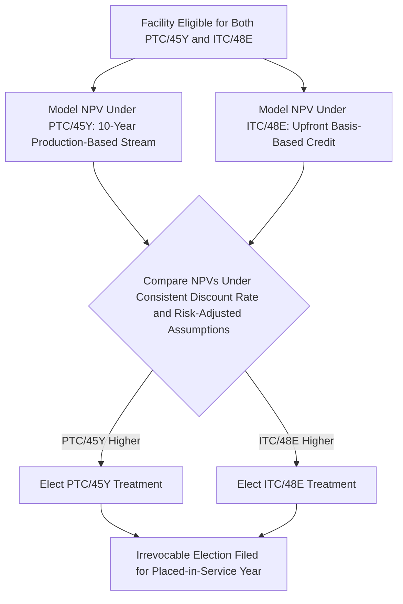
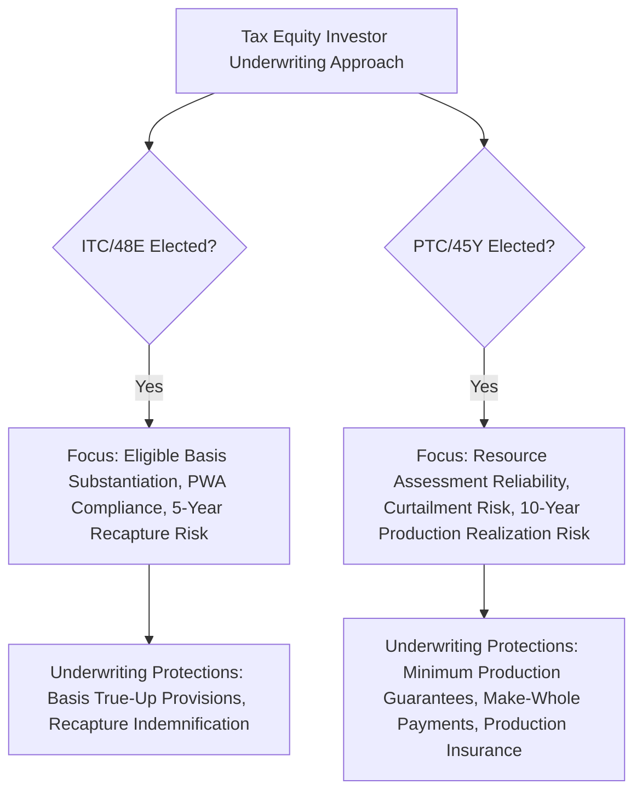

## Choosing Between the Investment and Production Credit

### Overview

For any facility eligible under both the investment credit family (Section 48/48E) and the production credit family (Section 45/45Y), the taxpayer must make an affirmative, generally irrevocable election choosing between them. This decision is one of the most economically consequential structuring choices in a tax equity transaction, since the two credit types differ fundamentally in timing, risk profile, and interaction with project economics, capital structure, and financing terms. This topic synthesizes the comparative decision framework, building on the mechanics separately detailed for eligible basis, placed-in-service timing, base/bonus rates, recapture, per-kWh calculation, and the 10-year credit period.

### The Election Mechanism

Section 48(a)(5) (and its Section 48E analog) permits a taxpayer that would otherwise qualify for the PTC/45Y credit with respect to a facility to elect instead to treat the facility as energy property eligible for the ITC/48E credit. The election is made with respect to a specific facility, is generally made in connection with the placed-in-service year filing, and is treated as irrevocable once made.

$$\text{Election Decision} = \arg\max\left(\text{NPV}_{\text{ITC/48E}}, \; \text{NPV}_{\text{PTC/45Y}}\right)$$

**Key Points**

- The election is facility-specific, not technology-specific or company-wide — a single developer with a portfolio of wind and solar projects can elect the ITC for some facilities and the PTC for others, based on each facility's individual economics.
- Because the election is generally irrevocable, the decision must be finalized with a high degree of confidence before or at the placed-in-service filing, making pre-closing economic modeling and sensitivity analysis a critical, time-boxed workstream in deal execution.

### Core Structural Differences Driving the Decision

| Dimension | Investment Credit (ITC/48E) | Production Credit (PTC/45Y) |
| --- | --- | --- |
| Timing of credit realization | Single claim in placed-in-service year | Annual claims over 10-year credit period |
| Basis of calculation | Percentage of eligible basis (cost-based) | Per-kWh rate times actual production (output-based) |
| Exposure to production risk | None — fixed once eligible basis and rate are determined | Direct — lower-than-expected production reduces credit value |
| Exposure to cost/basis risk | Direct — construction cost overruns can increase eligible basis (and thus credit) but also directly affect project economics | Indirect — construction costs affect overall project returns but do not directly determine credit amount |
| Recapture mechanism | Five-year declining recapture schedule under Section 50(a) | No comparable recapture mechanism; annual credits are earned incrementally as production occurs |
| Interaction with storage | Storage independently ITC-eligible as standalone technology | No production credit analog exists for storage |
| Applicability to bonus adders | Domestic content, energy community, low-income community allocation (basis/rate percentage adders) | Domestic content, energy community (rate percentage adders); no low-income community adder analog |

### Technology and Resource-Driven Considerations

#### Capacity Factor and Resource Quality

Facilities with high capacity factors (a high ratio of actual output to theoretical maximum output) tend to generate more cumulative kWh over the 10-year credit period relative to their capital cost, generally favoring the PTC economically. Wind projects sited in strong, well-characterized wind resource areas have historically often found the PTC's extended production-based value proposition superior to the ITC's fixed upfront amount, given wind's relatively favorable capacity factor profile in strong resource locations.

Conversely, facilities with lower capacity factors relative to their capital cost, or with less certain long-term resource characterization, may find the ITC's certainty (a fixed credit amount not contingent on 10 years of actual future performance) more valuable, since it eliminates production risk from the credit-value equation entirely.

**Key Points**

- Solar facilities have historically more frequently elected the ITC, reflecting differences in solar's capital-cost-to-output ratio and resource predictability profile relative to wind, though this is a generalized market tendency rather than an absolute technology-based rule — the election remains available and economically analyzable on a facility-specific basis regardless of technology.
- Storage-inclusive hybrid facilities effectively force at least a partial ITC election for the storage component, since no production-credit analog exists for storage; the generation component's separate election choice should be analyzed independently, potentially resulting in a hybrid facility with an ITC-elected generation component alongside inherently ITC-only storage, or a PTC-elected generation component alongside ITC-only storage within the same combined project.

#### Construction Cost Certainty and Basis Risk

Because the ITC amount is directly proportional to eligible basis, projects with well-controlled, predictable construction costs provide a correspondingly predictable ITC amount, while projects facing significant cost uncertainty (supply chain risk, EPC contract structure, interconnection cost variability) introduce basis-amount uncertainty into the ITC calculation itself — a different type of uncertainty than the PTC's production-based uncertainty, but uncertainty nonetheless.

### Financing and Capital Structure Interaction

#### Debt Sizing and Cash Flow Profile

ITC-elected projects typically deliver a substantial portion of their tax benefit value in the first year or two (subject to any applicable carryforward if the credit exceeds current-year tax liability capacity), which can influence debt sizing, cash sweep mechanics, and the timing of tax equity investor return achievement relative to PTC-elected projects, where the tax benefit stream is spread across a full decade and is directly linked to the same production stream that services project-level debt.

**Key Points**

- Lenders financing PTC-elected projects may structure debt sizing and covenant packages with explicit reference to the production-dependent nature of the credit stream, potentially correlating production shortfall risk (affecting both revenue and PTC value simultaneously) into a single combined risk factor rather than treating revenue risk and credit risk as independent.
- ITC-elected projects decouple the credit amount from ongoing production performance, meaning post-closing production shortfalls affect project revenue and returns but do not separately erode the already-fixed credit amount — a risk-isolation characteristic that ITC-elected structures possess and PTC-elected structures do not.

#### Recapture Versus Realization Risk in Investor Underwriting

Tax equity investors underwriting an ITC-elected deal focus underwriting attention on the five-year recapture period (a downside/reversal risk on an already-claimed benefit), while investors underwriting a PTC-elected deal focus underwriting attention on the full 10-year production realization risk (an uncertain future benefit not yet earned) — these are qualitatively different risk categories requiring different diligence emphases, financial protections, and (in PTC deals) production risk allocation mechanisms such as minimum production guarantees.

### Bonus Adder Stacking Comparison

Both credit families share domestic content and energy community adders (calculated as basis percentage points for the ITC, and rate percentage increases for the PTC), but only the ITC family offers the low-income community bonus credit allocation program. Projects that are strong candidates for low-income community allocation (small-scale solar or wind under 5 MW located in qualifying low-income areas, on Indian land, or serving qualified low-income residential or economic benefit purposes) have an additional, ITC-specific economic incentive weighing toward the ITC election, since this adder category is unavailable under the PTC/45Y regime regardless of the facility's other characteristics.

**Key Points**

- A small-scale project that would otherwise be a marginal case between PTC and ITC economics on production/basis grounds alone may be tipped decisively toward the ITC election if it is a strong candidate for a low-income community allocation award, given that this adder can add up to 20 percentage points of basis-based credit value unavailable under any PTC election.

### Modeling Approach for the Election Decision

A rigorous election analysis typically involves:

1. **Base case production forecast**: development of a P50 (median) and P90 (conservative, high-confidence) production estimate for the facility's expected operational life, informed by independent resource assessment studies.
2. **PTC NPV calculation**: projecting annual production under each production scenario, applying projected (with appropriate escalation assumption) per-kWh rates for each of the 10 credit period years, and discounting the resulting annual credit stream to present value.
3. **ITC/48E calculation**: determining eligible basis (net of any exclusions per the functional interdependence and integral-part analysis), applying the appropriate base/bonus rate and available adders, yielding a single upfront credit amount requiring no further discounting for timing (though the credit's actual monetization timing, if subject to tax equity investor allocation mechanics, may itself involve some structuring-driven timing considerations).
4. **Sensitivity analysis**: stress-testing the PTC NPV calculation against production shortfall scenarios (P90 versus P50, extended curtailment scenarios) to assess how election-decision robustness holds up under adverse production outcomes, since the ITC's fixed amount provides a natural floor of certainty that the PTC's calculation does not.
5. **Adder eligibility overlay**: incorporating the differential adder landscape (in particular, the ITC-only low-income community allocation) into the comparative NPV analysis for projects that are credible candidates for that program.

### Common Pitfalls in Practice

- **Treating the election as technology-determined rather than facility-specific** — relying on general market conventions (wind typically PTC, solar typically ITC) without independently modeling the specific facility's actual resource characteristics, cost structure, and adder eligibility profile.
- **Underweighting production risk in PTC NPV modeling** — using only a P50 production estimate without adequately stress-testing the PTC election decision against P90 or more conservative production scenarios, given the credit's direct dependence on actual realized output over a full decade.
- **Failing to separately analyze hybrid facility components** — applying a single election framework to a combined storage-plus-generation facility without recognizing that storage is inherently ITC-only, requiring the generation component's election to be analyzed on its own terms.
- **Overlooking the ITC-exclusive low-income community adder in marginal cases** — omitting this adder category from the comparative analysis for small-scale projects that could be strong allocation candidates, potentially reaching an incorrect election conclusion.
- **Delaying the election analysis until too close to the placed-in-service filing deadline** — given the election's general irrevocability, compressed decision timelines increase the risk of an economically suboptimal or poorly diligenced election choice.
- **Ignoring financing structure interaction** — failing to coordinate the election decision with project-level debt sizing and tax equity structuring discussions, when in fact the election has material downstream effects on both.

**Related Topics**

- Section 48 versus Section 48E investment tax credit eligibility comparison
- Section 45 legacy credit versus Section 45Y technology-neutral credit eligibility comparison
- Five-year vesting and recapture schedule mechanics under Section 50(a)
- Ten-year credit period mechanics and annual claiming requirements
- Per-kilowatt-hour calculation and inflation adjustment methodology
- Storage and interconnection property eligibility and its ITC-only status
- Low-income community bonus credit allocation program mechanics
- Partnership flip structure timing differences between ITC-elected and PTC-elected deals