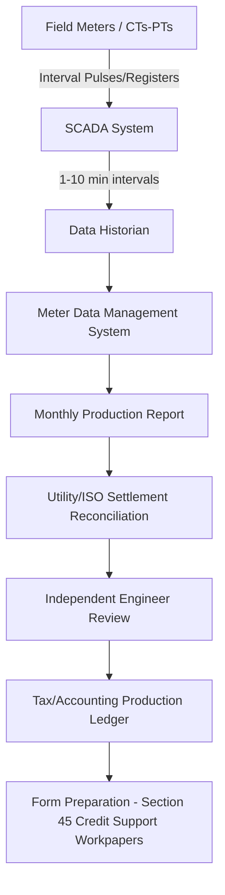

## Metering, Measurement, and Production Verification

### Overview and Statutory Basis

The Production Tax Credit (PTC) under Internal Revenue Code §45 is calculated per kilowatt-hour (kWh) of electricity produced from qualified energy resources and sold to an unrelated person during the 10-year credit period. Because the credit is denominated in cents per kWh (adjusted annually for inflation), the taxpayer's ability to substantiate actual production is not a peripheral compliance matter — it is the core mechanism that determines the dollar value of the credit claimed in any given year. Metering, measurement, and production verification therefore sit at the intersection of engineering, accounting, and tax law.

Unlike the Investment Tax Credit (ITC) under §48, which is generally calculated once based on eligible basis at placed-in-service, the PTC requires ongoing, auditable production data for every taxable year of the credit period. This creates a distinct compliance architecture involving revenue-grade metering, data acquisition systems, third-party verification, and reconciliation with power purchase agreement (PPA) or utility settlement data.

### Statutory and Regulatory Framework

**Key Points**

- §45(a) computes the credit as the applicable amount (cents/kWh, inflation-adjusted) multiplied by kWh of electricity produced by the taxpayer at a qualified facility and sold to an unrelated person during the 10-year period beginning on the date the facility was originally placed in service.
- §45(e)(1) requires that production be measured "at the point of interconnection" or otherwise consistent with Treasury guidance for certain technologies.
- Treasury Regulation §1.45-... (as supplemented by IRS notices) does not prescribe a single universal metering standard; instead, industry practice has converged on utility-grade or ISO/RTO-settlement-grade metering as the de facto evidentiary standard because it is independently verifiable.
- The "sale to an unrelated person" requirement means that production data must map cleanly to metered sales, not merely to gross generation, particularly where auxiliary/parasitic loads (e.g., substation transformers, SCADA power) consume a portion of gross output.

[Inference] The IRS has not issued a single comprehensive regulation dictating exact meter accuracy classes for §45 purposes; practitioners rely on analogy to FERC/NERC metering standards and PPA metering provisions, and on the general substantiation requirements of §6001 (adequate records).

### Points of Measurement in a Generation Facility

Production can be measured at several distinct physical points, and the choice of point materially affects the kWh figure used for credit computation:

1. **Gross Generation Meter (Turbine/Inverter Terminal)** — Measures output at the generating equipment before any step-up transformation or auxiliary load subtraction. Overstates net deliverable energy.
2. **Net Generation Meter (High-Side of Step-Up Transformer)** — Measures energy after transformer losses but before subtracting station service/auxiliary load.
3. **Revenue Meter / Point of Interconnection (POI) Meter** — Located at the utility interconnection point or ISO/RTO settlement point; this is the meter whose data typically forms the basis of the PPA settlement statement and is the most defensible reference point for §45 purposes because it reflects energy actually delivered ("sold") to an unrelated person.
4. **Individual Turbine/Inverter Sub-Meters** — Used for internal performance monitoring, warranty claims, and curtailment allocation, but generally not the primary basis for credit computation.

<svg xmlns="http://www.w3.org/2000/svg" viewBox="0 0 760 220" font-family="Arial, sans-serif">
<title>Measurement Point Waterfall (svg_diagram)</title>
<rect x="0" y="0" width="760" height="220" fill="#ffffff" />
<text x="380" y="20" text-anchor="middle" font-size="14" font-weight="bold">Energy Waterfall: Gross to Metered Sale (svg_diagram)</text>
<rect x="20" y="50" width="140" height="50" fill="#dbeafe" stroke="#1e3a8a" />
<text x="90" y="80" text-anchor="middle" font-size="11">Gross Generation</text>
<line x1="160" y1="75" x2="200" y2="75" stroke="#374151" stroke-width="2" marker-end="url(#arrow)" />
<text x="180" y="65" text-anchor="middle" font-size="9">− Transformer Loss</text>
<rect x="200" y="50" width="140" height="50" fill="#bfdbfe" stroke="#1e3a8a" />
<text x="270" y="80" text-anchor="middle" font-size="11">Net Generation</text>
<line x1="340" y1="75" x2="380" y2="75" stroke="#374151" stroke-width="2" marker-end="url(#arrow)" />
<text x="360" y="65" text-anchor="middle" font-size="9">− Aux Load</text>
<rect x="380" y="50" width="140" height="50" fill="#93c5fd" stroke="#1e3a8a" />
<text x="450" y="80" text-anchor="middle" font-size="11">Delivered Energy</text>
<line x1="520" y1="75" x2="560" y2="75" stroke="#374151" stroke-width="2" marker-end="url(#arrow)" />
<text x="540" y="65" text-anchor="middle" font-size="9">− Curtailment Adj.</text>
<rect x="560" y="50" width="180" height="50" fill="#60a5fa" stroke="#1e3a8a" />
<text x="650" y="80" text-anchor="middle" font-size="11" fill="#fff">Metered Sale (PTC Basis)</text>
<text x="380" y="140" text-anchor="middle" font-size="10" fill="`#4b5563`">Each subtraction step must be documented and auditable; only the final metered-sale figure is eligible for §45 credit computation.</text>

</svg>

### Metering Equipment and Accuracy Standards

**Key Points**

- Revenue meters used for PTC substantiation are typically ANSI C12.20 (US) Class 0.2 or 0.5 accuracy class, matching the standard used for utility billing and ISO/RTO settlement.
- Meters are generally sealed and tested/calibrated on a periodic schedule (often annually or per utility tariff requirements) with calibration certificates retained as supporting documentation.
- Current transformers (CTs) and potential transformers (PTs) associated with the revenue meter must also meet accuracy class requirements, since metering error can originate in the instrument transformers rather than the meter itself.
- Redundant/check metering (a second independent meter at the same point) is common in larger projects specifically to provide a cross-check in the event of primary meter failure or dispute, and to support tax controversy defense.

[Unverified] Specific accuracy class requirements are not uniformly mandated by the IRS for §45 purposes; they arise primarily from FERC tariff requirements, ISO/RTO metering protocols, or the metering provisions negotiated in the interconnection agreement and PPA, which practitioners then rely upon as the evidentiary standard for the tax credit.

### Data Acquisition, SCADA, and Historian Systems

Production data flows from physical meters through several intermediate systems before reaching the tax and accounting function:

1. **SCADA (Supervisory Control and Data Acquisition)** — Continuously polls meter registers, turbine/inverter controllers, and weather stations, typically at 1-minute to 10-minute intervals.
2. **Data Historian** — Time-series database (e.g., OSIsoft PI, proprietary OEM historians) that archives raw interval data for long-term retention, often required to be retained for the full credit period plus the statute of limitations window.
3. **Meter Data Management System (MDMS)** — Aggregates interval data into billing-quality totals, applies loss adjustments, and reconciles against utility-issued settlement statements.
4. **Independent Engineer (IE) / Owner's Engineer Reports** — Periodic (often quarterly or annual) production verification reports comparing actual metered output against the P50/P90 energy production estimates from the original resource assessment.

### Reconciliation with PPA and Settlement Data

**Key Points**

- The PPA settlement statement issued by the utility or offtaker is generally treated as the strongest independent evidence of metered production because it is generated by an unrelated third party and typically ties to payment.
- Discrepancies between internal SCADA totals and utility settlement data (common due to meter calibration differences, loss factor assumptions, or billing period cutoffs) must be reconciled and documented, not simply overridden by the higher figure.
- Where a facility sells into a wholesale market (e.g., ERCOT, PJM, MISO) rather than under a bilateral PPA, ISO/RTO settlement data (e.g., ERCOT's Settlement Metering data) serves the equivalent evidentiary role.
- For facilities with tax equity partnership structures (partnership flip), the production data also drives allocation of credits among partners under the partnership agreement, making reconciliation accuracy directly relevant to both IRS Form 1065/K-1 reporting and partner-level credit claims.

**Example**

A wind facility's SCADA system reports 412,600 MWh of net generation for the year. The utility settlement statement, based on the revenue meter at the POI, reflects 409,850 MWh delivered. The 2,750 MWh variance is attributable to (a) a documented 9-day meter communication outage during which SCADA used estimated (not metered) values, and (b) a small loss-compensation factor applied by the utility between the meter and the settlement point. The taxpayer's tax workpapers should reconcile to the utility-settled 409,850 MWh figure, footnote the SCADA variance, and retain both the outage log and the utility's loss-compensation methodology as supporting documentation.

### Curtailment, Outages, and Estimated Data

A recurring technical and tax issue involves periods when actual metered data is unavailable or when the facility is curtailed by the grid operator:

- **Meter Outage** — When a meter malfunctions, industry practice (and most PPA metering provisions) call for use of a "estimated energy" methodology, often based on the average of the preceding and succeeding periods' actual output adjusted for weather/wind/irradiance conditions, or based on adjacent turbine/inverter output ratios.
- **Curtailment for Grid Reliability** — Energy not produced due to a curtailment instruction from the transmission operator is not "produced" for §45 purposes; however, some PPAs include "deemed generation" or "curtailment payment" provisions for revenue purposes that are contractually distinct from the tax question of what was actually produced and metered.
- **Force Majeure Outages** — Extended outages (e.g., blade failure, inverter fire) do not toll or extend the §45 10-year credit period; the taxpayer simply forgoes the credit for the energy not produced during the outage.

[Inference] Treatment of "deemed generation" payments under curtailment provisions for §45 purposes is not addressed by a specific, generally applicable IRS ruling; practitioners generally take the position that only actually metered and sold electricity qualifies, and deemed/curtailment payments are analyzed separately as potential ordinary income rather than PTC-generating production.

### Repowering and Retrofit Considerations

For wind facilities that undergo repowering (replacement of major components such as blades, nacelles, or towers), production verification takes on additional complexity because it must support the 80/20 test for a new placed-in-service date:

- Post-repowering production data must be segregated from pre-repowering data in the historian/SCADA system, often requiring a hard "cutover" timestamp aligned with the placed-in-service date of the repowered unit.
- Metering must support demonstrating that the repowered facility's fair market value of retained (old) property is not more than 20% of the total value of the new facility (the 80/20 Rule), which is a valuation question but is informed by production capability data (e.g., pre- and post-repowering capacity factor and nameplate rating).
- A new 10-year credit period begins on the new placed-in-service date, meaning metering systems must be able to demonstrate a clean break in production accounting between the old and new credit periods to avoid double-counting or credit-period ambiguity.

### Third-Party Verification and Audit Defense

**Key Points**

- Many tax equity investment agreements contractually require an annual Independent Engineer's production certification as a condition precedent to capital account allocations or cash distributions, which doubles as tax audit support.
- Auditors (IRS or investor-side) typically request: (1) raw meter data exports, (2) calibration certificates, (3) utility settlement statements, (4) SCADA-to-settlement reconciliation workpapers, and (5) any curtailment/outage logs with estimation methodology.
- Documentation retention should generally follow the greater of the §6501 statute of limitations period or the full 10-year credit period plus several years, given that early-year production substantiates credits claimed in later audit cycles.
- Some tax equity partnerships incorporate a "Production Tax Credit true-up" mechanism, where credit allocations are trued up post-year-end once final, audited/reconciled production figures are available, since initial estimates based on preliminary SCADA data may differ from final settled figures.

### Technology-Specific Notes

**Wind**

- Production is highly sensitive to wind resource variability; verification reports typically compare actual output against the P50 (median) and P90 (90% exceedance) production estimates from the pre-construction wind resource assessment.
- Turbine controller data (SCADA) provides granular per-turbine output, useful for warranty and availability guarantee calculations, but the revenue meter remains the tax-relevant figure.

**Geothermal, Biomass, and Other §45-Eligible Resources**

- These technologies generally use similar utility-grade revenue metering but may have additional measurement considerations (e.g., steam flow and enthalpy calculations for geothermal binary/flash plants feeding into an electrical output calculation) where the electrical output — not the thermal input — is the §45-relevant quantity.

[Unverified] Specific IRS audit statistics on metering-related PTC adjustments are not publicly available in granular form; the description of common audit requests above reflects general tax equity industry practice rather than a published IRS audit manual provision specific to metering.

### Common Pitfalls

- Using gross generation (pre-auxiliary-load) figures instead of net metered sales, overstating the credit base.
- Failing to reconcile SCADA estimates to final utility settlement data before finalizing the tax return, creating restatement risk.
- Inadequate documentation of estimation methodology during meter outages, weakening audit defense.
- Commingling pre- and post-repowering production data without a clear cutover point, complicating the 80/20 test and new credit period substantiation.
- Treating curtailment compensation payments as equivalent to metered production for credit computation purposes.

**Related Topics**

- Section 45 vs. Section 48 Election Mechanics
- Placed-in-Service Date Determination and the 80/20 Rule for Repowering
- Independent Engineer Reports in Tax Equity Diligence
- Partnership Flip Structures and Credit Allocation Waterfalls
- PPA Structuring: Metering, Curtailment, and Deemed Generation Provisions
- Recordkeeping and Substantiation Requirements under IRC §6001
- Inflation Adjustment Mechanics for the §45 Applicable Amount