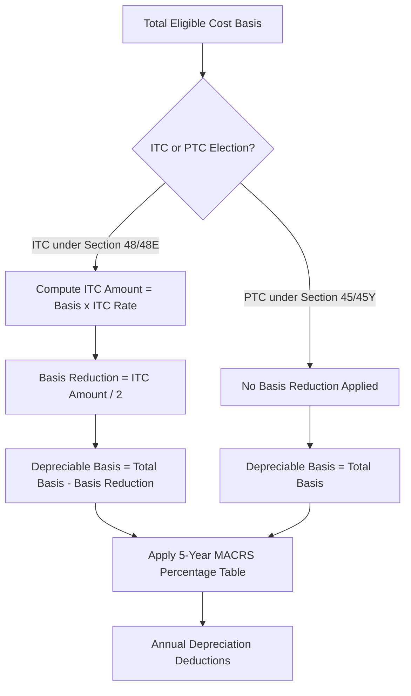

## Modified Accelerated Cost Recovery System for Energy Assets

### Overview and Statutory Basis

The Modified Accelerated Cost Recovery System (MACRS) under IRC §168 is the primary depreciation regime governing the recovery of capitalized basis in tangible property, including renewable energy generation assets. For tax equity transactions, MACRS depreciation is frequently as economically significant as the investment tax credit (ITC) or production tax credit (PTC) itself, because accelerated depreciation deductions shelter taxable income and drive a substantial portion of the after-tax internal rate of return (IRR) that motivates tax equity investment.

MACRS consists of two systems: the **General Depreciation System (GDS)**, which uses accelerated methods (200% or 150% declining balance switching to straight-line) over relatively short recovery periods, and the **Alternative Depreciation System (ADS)**, which uses straight-line depreciation over longer recovery periods. Most renewable energy property is eligible for GDS treatment with a 5-year recovery period under §168(e)(3)(B), one of the most favorable classifications in the Code.

### 5-Year MACRS Classification for Energy Property

**Key Points**

- §168(e)(3)(B)(vi) and related provisions classify most solar, wind, geothermal, fuel cell, and certain other renewable energy property as 5-year property.
- The classification traces back to Asset Class 00.4 (or specific energy property definitions cross-referenced from former §48 energy property definitions) rather than the equipment's actual useful life, which for solar or wind hardware often exceeds 20-30 years.
- The 5-year period applies to the applicable energy property itself (e.g., PV modules, inverters, wind turbines, mounting racking, and certain balance-of-system electrical equipment); it does not automatically extend to all ancillary assets on a project site.
- Land is never depreciable; certain site improvements (roads, fencing) and buildings on the project site typically fall into longer-lived MACRS classes (e.g., 15-year for land improvements, 39-year for nonresidential real property) and must be cost-segregated separately from the 5-year energy property.

[Inference] The specific list of components qualifying for 5-year treatment is not exhaustively enumerated in a single, self-contained Code section; practitioners rely on a combination of §168(e)(3)(B), the cross-referenced former energy property definitions, IRS guidance (including now-superseded Notice 2018-59-style delineations used for ITC "begun construction" purposes), and cost segregation study methodology to allocate a project's total cost among 5-year, 15-year, and other MACRS classes.

### Depreciation Methods: 200% Declining Balance with Switch to Straight-Line

For 5-year MACRS property, the default GDS method is 200% declining balance (DDB), switching to straight-line in the year that yields a larger deduction, combined with the half-year convention (or mid-quarter convention if more than 40% of the year's asset additions occur in the fourth quarter).

The declining balance rate is calculated as:

$$DB\ rate = \frac{2}{n}$$

where $n$ is the recovery period (5 years for energy property), yielding a 40% declining balance rate.

**IRS-Published 5-Year MACRS Percentage Table (Half-Year Convention, 200% DB)**

| Recovery Year | Depreciation % |
| --- | --- |
| 1 | 20.00% |
| 2 | 32.00% |
| 3 | 19.20% |
| 4 | 11.52% |
| 5 | 11.52% |
| 6 | 5.76% |

These percentages are published in IRS Publication 946 and sum to 100% of depreciable basis over the 6 tax years the half-year convention spans (a stub year 1 and a stub year 6 due to the mid-year placed-in-service assumption).

**Example**

A solar project with $80,000,000 of MACRS-depreciable basis (after basis reduction, discussed below) placed in service mid-year, using the half-year convention, generates the following Year 1 and Year 2 deductions:

$$Year\ 1\ Depreciation = \$80{,}000{,}000 \times 0.20 = \$16{,}000{,}000$$

$$Year\ 2\ Depreciation = \$80{,}000{,}000 \times 0.32 = \$25{,}600{,}000$$

### Basis Reduction for the Investment Tax Credit

**Key Points**

- Under §50(c)(3), a taxpayer claiming the ITC under §48 must reduce the depreciable basis of the energy property by one-half of the ITC claimed.
- For a project claiming a 30% ITC (the base statutory rate, potentially adjusted by domestic content, energy community, or low-income adders under current law), the depreciable basis is reduced by 15 percentage points (half of 30%), leaving 85% of the original cost basis eligible for MACRS depreciation.
- This basis reduction does not apply to the PTC under §45; PTC projects generally retain 100% of eligible cost as depreciable basis, which is one of the structural differences influencing the ITC-vs-PTC election analysis (§48 vs. §45, or the technology-neutral §48E/§45Y regime for projects placed in service after 2024).

**Example**

A wind facility with $100,000,000 of total eligible cost basis elects the ITC (via §48 or §48E, as applicable) at a 30% rate.

$$ITC\ Amount = \$100{,}000{,}000 \times 0.30 = \$30{,}000{,}000$$

$$Basis\ Reduction = \frac{\$30{,}000{,}000}{2} = \$15{,}000{,}000$$

$$Depreciable\ Basis = \$100{,}000{,}000 - \$15{,}000{,}000 = \$85{,}000{,}000$$

The $85,000,000 depreciable basis is then run through the 5-year MACRS percentage table above.

### Bonus Depreciation Interaction

**Key Points**

- §168(k) bonus depreciation allows an additional first-year deduction for qualifying MACRS property with a recovery period of 20 years or less, which includes 5-year energy property.
- Bonus depreciation rates have phased down under the Tax Cuts and Jobs Act (TCJA) schedule (100% for property placed in service through 2022, stepping down by 20 percentage points per year thereafter absent legislative change), and taxpayers must verify the applicable percentage for the specific placed-in-service year under then-current law, since subsequent legislation has periodically modified this phase-down schedule.
- When bonus depreciation is claimed, the bonus amount is deducted first from the (ITC-adjusted) depreciable basis, with the remaining basis then depreciated under the standard MACRS percentage table over the remaining recovery period.
- Bonus depreciation is not mandatory; taxpayers may elect out of bonus depreciation for a given class of property, which some tax equity structures do deliberately to smooth taxable income/loss allocations across the investor's tax appetite over multiple years rather than front-loading nearly all depreciation into Year 1.

[Unverified] The exact bonus depreciation percentage applicable in any given placed-in-service year should be verified against the specific version of §168(k) and any subsequent legislative amendments in effect at that time, as this schedule has been subject to change through multiple pieces of federal legislation.

**Example**

Using the $85,000,000 ITC-adjusted depreciable basis from above, assuming a hypothetical 60% bonus depreciation rate applicable in the relevant placed-in-service year:

$$Bonus\ Depreciation = \$85{,}000{,}000 \times 0.60 = \$51{,}000{,}000$$

$$Remaining\ Basis = \$85{,}000{,}000 - \$51{,}000{,}000 = \$34{,}000{,}000$$

$$Year\ 1\ Standard\ MACRS\ on\ Remainder = \$34{,}000{,}000 \times 0.20 = \$6{,}800{,}000$$

$$Total\ Year\ 1\ Deduction = \$51{,}000{,}000 + \$6{,}800{,}000 = \$57{,}800{,}000$$

### Conventions: Half-Year vs. Mid-Quarter

**Key Points**

- The **half-year convention** treats all property placed in service during the year as placed in service at the midpoint of the year, regardless of the actual in-service date, and is the default convention.
- The **mid-quarter convention** applies instead if more than 40% of the aggregate basis of MACRS property placed in service during the year occurs in the fourth quarter (October–December); it treats property as placed in service at the midpoint of the quarter in which it was actually placed in service.
- The mid-quarter convention can materially reduce Year 1 depreciation for late-in-year placed-in-service assets and is a common diligence item in tax equity closings scheduled near year-end, since a Q4 COD (commercial operation date) can inadvertently trigger mid-quarter treatment across the sponsor's entire portfolio of same-year placed-in-service assets.

### Alternative Depreciation System (ADS) Triggers

**Key Points**

- ADS (straight-line, generally over a longer recovery period, e.g., 12 years for energy property versus 5 years under GDS) is mandatory rather than elective in certain circumstances relevant to energy assets:
  - Property used predominantly outside the United States.
  - Tax-exempt use property, including property leased to or used by a tax-exempt entity, government, or foreign person/entity, subject to the "tax-exempt use property" rules under §168(h) — a significant consideration when a renewable energy offtaker is a municipality, school district, or other tax-exempt entity structured through certain lease or service contract arrangements.
  - Property financed with tax-exempt bonds under §168(g)(5), relevant where a public power entity or municipal utility provides financing.
- The tax-exempt use property rules under §168(h) have specific "safe harbor" thresholds for the permissible percentage of tax-exempt use (or contract term/payment structure) before ADS is triggered on the entire asset; renewable energy PPAs with tax-exempt offtakers are frequently structured to fit within these safe harbors precisely to preserve GDS 5-year treatment.

[Inference] Because §168(h) tax-exempt use property determinations are highly fact-specific (depending on contract term, percentage of use, and the "50% threshold" and related tests), a general reference cannot substitute for a facility-specific legal analysis of the offtake and lease arrangements; this is flagged as an area requiring case-specific counsel review rather than a bright-line rule stated here.

### Partnership Flip Structures and Depreciation Allocation

- In partnership flip tax equity structures, MACRS depreciation is allocated among the tax equity investor and sponsor according to the partnership agreement's allocation provisions, which must satisfy the "substantial economic effect" requirements of §704(b) or be respected under the partnership's allocation of partnership items under §704(b) and the associated Treasury Regulations.
- The tax equity investor's capital account is typically allocated the substantial majority (often 99%) of depreciation and other tax attributes during the pre-flip period, in accordance with its disproportionate allocation of taxable losses relative to its cash distribution share, structured to comply with the partnership allocation rules.
- Depreciation recapture under §1245 (for the 5-year MACRS property) becomes relevant on disposition, particularly at the point of a partnership flip or a sale of the project, and interacts with the "vintage" and character of gain recognized by each partner based on their historical depreciation allocations.

### Recapture Considerations

**Key Points**

- MACRS-depreciated energy property is generally §1245 property (personal property, not real property), meaning gain on disposition is recharacterized as ordinary income to the extent of depreciation previously claimed, rather than receiving capital gain treatment.
- ITC recapture under §50(a) is a related but distinct concept: if the energy property is disposed of, or ceases to be investment credit property, within 5 years of being placed in service, a portion of the ITC is recaptured (20% per year of the remaining recapture period), which is separate from but often analyzed alongside depreciation recapture in disposition modeling.
- Tax equity partnership agreements typically include specific indemnification and "recapture-triggering event" provisions (e.g., restrictions on early buyouts, changes in ownership, or casualty events) precisely because both ITC recapture and depreciation-related ordinary income recapture materially affect the economics for the tax equity investor.

### State Conformity Considerations

**Key Points**

- Not all states conform to federal bonus depreciation or, in some cases, to accelerated MACRS treatment generally; several states require addback of federal bonus depreciation and instead permit only straight-line depreciation for state income tax purposes.
- State depreciation conformity (or decoupling) affects the state tax shield component of a tax equity investor's overall return and must be modeled separately from federal MACRS benefits.

[Unverified] Specific state conformity positions vary and change with each state's legislative sessions; a comprehensive current state-by-state conformity matrix should be verified against current state tax authority guidance rather than assumed static.

### Common Pitfalls

- Failing to properly cost-segregate a project's total cost basis among 5-year energy property, 15-year land improvements, and non-depreciable land, resulting in incorrect application of MACRS percentages to the entire project cost.
- Miscalculating the ITC basis reduction (applying the full ITC amount rather than one-half) or failing to apply it at all.
- Overlooking the mid-quarter convention trigger for portfolios with concentrated Q4 placed-in-service dates.
- Assuming bonus depreciation percentages without verifying the specific rate applicable to the actual placed-in-service tax year under then-current law.
- Failing to analyze §168(h) tax-exempt use property implications when the offtaker or landowner is a governmental or tax-exempt entity.

**Related Topics**

- Cost Segregation Studies for Renewable Energy Assets
- Section 50(c) Basis Reduction Mechanics
- Bonus Depreciation Phase-Down Schedule Under the TCJA
- Tax-Exempt Use Property Rules (Section 168(h)) and Safe Harbors
- Partnership Flip Structures: Section 704(b) Allocations
- ITC Recapture Under Section 50(a)
- State Depreciation Conformity and Decoupling