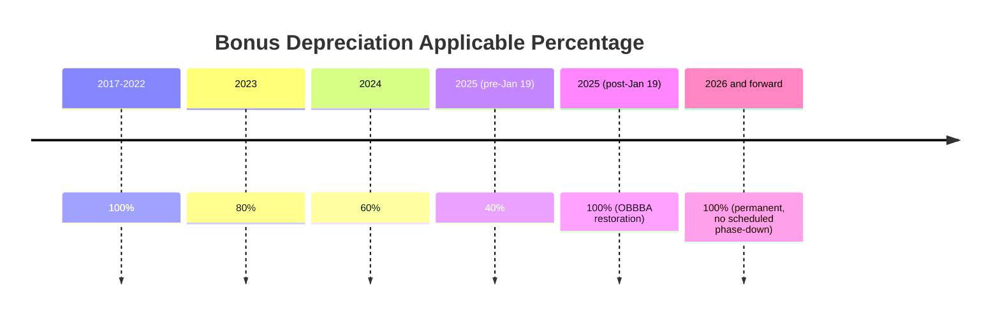
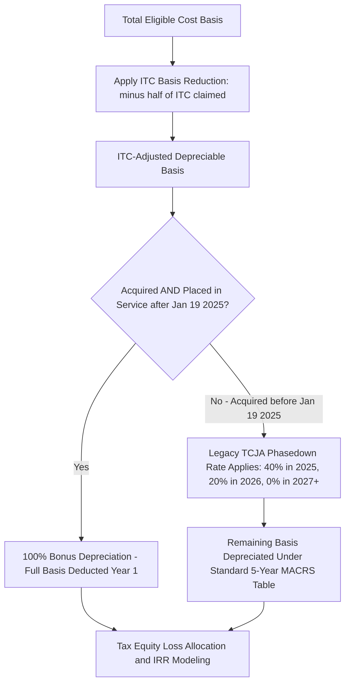

## Bonus Depreciation and the Return to One Hundred Percent

### Overview and Legislative History

Bonus depreciation under §168(k) allows taxpayers to deduct a specified percentage of the cost of qualifying property in the year it is placed in service, rather than recovering that cost over the standard MACRS schedule. For energy assets — nearly all of which qualify as 5-year MACRS property — bonus depreciation has historically been one of the most powerful levers in tax equity return modeling, because it front-loads depreciation-driven tax losses into the earliest years of a project's life.

Under the Tax Cuts and Jobs Act (TCJA) of 2017, bonus depreciation was set at 100% for qualified property acquired after September 27, 2017, with a statutory phase-down schedule reducing the applicable percentage by 20 points per year beginning in 2023: 80% (2023), 60% (2024), 40% (2025), 20% (2026), and 0% (2027 and later). This phase-down materially affected tax equity underwriting for energy projects reaching commercial operation in those years, as sponsors and investors had to model declining first-year depreciation benefits.

The One Big Beautiful Bill Act (OBBBA), enacted in 2025, made significant amendments to §168(k), permanently reinstating bonus depreciation at 100% of the cost of eligible property and reversing the scheduled phase-down entirely. [Potomac Law](https://www.potomaclaw.com/news-What-Businesses-Should-Know-About-the-New-100-Percent-Bonus-Depreciation-Rules-and-the-Manufacturing-Facility-Deduction)

*(Note: rendered here as plaintext-fenced pseudo-Mermaid per formatting rules; treat as a conceptual timeline, not a live diagram.)*

### The OBBBA Restoration: Statutory Mechanics

**Key Points**

- The legislation permanently reinstates 100% bonus depreciation for qualifying assets acquired and placed in service after January 19, 2025. [BDO](https://www.bdo.com/insights/tax/one-big-beautiful-bill-act-expands-100-depreciation-expensing-opportunities)
- This reverses the phasedown schedule enacted under the TCJA, which would have reduced bonus depreciation progressively to zero by 2027. [Grant Thornton](https://www.grantthornton.com/insights/alerts/tax/2025/insights/obbba-offers-new-ways-to-accelerate-depreciation)
- Because bonus depreciation has no taxable income limit, it can create or increase a net operating loss, distinguishing it from §179 expensing, which is subject to a taxable-income limitation. This is particularly relevant for tax equity investors whose economic model depends on generating substantial passive or allocated losses. [TS CPA PLLC](https://tscpatax.com/glossary/bonus-depreciation)
- Bonus depreciation applies automatically to qualifying property unless the taxpayer affirmatively elects out by asset class — the election-out mechanism under §168(k)(7) remains available and is typically irrevocable once made for a given class of property in a given tax year. [TS CPA PLLC](https://tscpatax.com/glossary/bonus-depreciation)

### The January 19, 2025 Dual-Date Requirement

**Key Points**

- To qualify for the permanent 100% rate, property must be both acquired after January 19, 2025, and placed in service after January 19, 2025 — both conditions must independently be satisfied. [Natptax](https://www.natptax.com/news-insights/blog/irs-releases-guidance-on-permanent-100-bonus-depreciation/)
- For qualified property acquired on or before January 19, 2025, the prior TCJA phasedown rates continue to apply based on the placed-in-service date, specifically 40% for 2025 placed-in-service, 20% for 2026, and 0% for 2027 and thereafter. [Potomac Law](https://www.potomaclaw.com/news-What-Businesses-Should-Know-About-the-New-100-Percent-Bonus-Depreciation-Rules-and-the-Manufacturing-Facility-Deduction)
- This creates a bifurcated regime within the same calendar year: a project that entered into binding acquisition commitments before January 19, 2025 but is placed in service later in 2025 may be limited to the 40% legacy rate, while a project acquired after that date and placed in service in the same year qualifies for 100%.
- The IRS instructs taxpayers to apply the existing written binding contract rules to determine whether property is acquired before or after the January 19 threshold, meaning the timing of a binding contract — not merely invoicing or delivery — controls the "acquired" determination. [Natptax](https://www.natptax.com/news-insights/blog/irs-releases-guidance-on-permanent-100-bonus-depreciation/)
- A special transition rule under §168(k)(10) allows taxpayers to elect 40% bonus depreciation for property acquired after January 19, 2025, but placed in service in a taxable year that includes January 20, 2025, addressing straddle-year fiscal taxpayers. [Grant Thornton](https://www.grantthornton.com/insights/newsletters/tax/2026/hot-topics/feb-03/interim-guidance-issued-for-revived-bonus-depreciation)

### Interim IRS Guidance: Notice 2026-11

**Key Points**

- The IRS released Notice 2026-11, providing interim guidance to implement the OBBBA changes to the §168(k) additional first-year depreciation deduction rules, with the government intending to issue proposed regulations consistent with this interim guidance. [BDO](https://www.bdo.com/insights/tax/irs-issues-interim-guidance-on-bonus-depreciation-rules)
- The notice confirms that the IRS intends to apply the written binding contract rules from the prior TCJA bonus depreciation regulations with only minor changes, providing continuity for practitioners already familiar with the existing framework. [BDO](https://www.bdo.com/insights/tax/irs-issues-interim-guidance-on-bonus-depreciation-rules)
- Because bonus depreciation is now permanent rather than subject to a phase-down, the notice does not adopt the prior regulatory framework's placed-in-service date rules that were built around the phase-down schedule — meaning practitioners should not assume every mechanical aspect of the old §1.168(k)-2 regulations carries forward unchanged. [Potomac Law](https://www.potomaclaw.com/news-What-Businesses-Should-Know-About-the-New-100-Percent-Bonus-Depreciation-Rules-and-the-Manufacturing-Facility-Deduction)
- The interim guidance largely tracks the current regulations under Treasury Regulation §1.168(k)-2 for the framework governing eligibility, timing, and elections, providing a familiar structural baseline while the formal rulemaking process proceeds. [Potomac Law](https://www.potomaclaw.com/news-What-Businesses-Should-Know-About-the-New-100-Percent-Bonus-Depreciation-Rules-and-the-Manufacturing-Facility-Deduction)
- Taxpayers can rely on existing rules regarding qualified used property, acquisition date determinations (including written binding contract rules), self-constructed property, and the component election — all directly relevant to large energy projects built under EPC contracts with staged equipment procurement. [BDO](https://www.bdo.com/insights/tax/irs-issues-interim-guidance-on-bonus-depreciation-rules)

### Application to Self-Constructed Energy Property

Utility-scale wind, solar, and storage projects are frequently "self-constructed property" for §168(k) purposes, since the taxpayer (or its EPC contractor acting as agent) fabricates or assembles the asset over an extended construction period rather than purchasing a single finished unit. This raises several mechanics specific to energy assets:

- The "acquisition date" for self-constructed property generally corresponds to when physical work of a significant nature begins, rather than a single purchase order or invoice date — a concept distinct from, but related to, the "beginning of construction" tests used for ITC/PTC qualification under §45/§48/§45Y/§48E.
- The component election allows a taxpayer to treat components of larger self-constructed property acquired or self-constructed after the applicable date as eligible for the higher bonus rate, even if the larger property itself does not meet the acquisition date test, which can be relevant for energy projects with components procured across the January 19, 2025 threshold. [BDO](https://www.bdo.com/insights/tax/irs-issues-interim-guidance-on-bonus-depreciation-rules)
- [Inference] Because Notice 2026-11 is interim guidance pending formal proposed regulations, practitioners should treat component-election mechanics and self-constructed property timing determinations for large energy assets as subject to refinement once final regulations are issued, and should monitor Treasury's regulatory project for updates.

### Interaction with ITC Basis Reduction and MACRS

Bonus depreciation for energy property operates on top of the standard basis-reduction and MACRS mechanics discussed in the depreciation chapter generally:

$$Depreciable\ Basis\ (post\text{-}ITC) = Total\ Cost\ Basis \times (1 - \frac{ITC\ Rate}{2})$$

$$Bonus\ Depreciation\ Amount = Depreciable\ Basis \times 100\%$$

**Example**

A solar project with $50,000,000 of total eligible cost, electing a 30% ITC and placed in service in 2026 (fully within the OBBBA-restored 100% window, with both acquisition and placed-in-service dates after January 19, 2025):

$$ITC = \$50{,}000{,}000 \times 0.30 = \$15{,}000{,}000$$

$$Basis\ Reduction = \$15{,}000{,}000 / 2 = \$7{,}500{,}000$$

$$Depreciable\ Basis = \$50{,}000{,}000 - \$7{,}500{,}000 = \$42{,}500{,}000$$

$$Year\ 1\ Bonus\ Depreciation = \$42{,}500{,}000 \times 1.00 = \$42{,}500{,}000$$

Under 100% bonus depreciation, essentially the entire ITC-adjusted depreciable basis is deducted in the placed-in-service year, with no residual basis flowing through the standard 5-year MACRS percentage table (subject to any partial-asset exclusions or components not qualifying for bonus treatment).

### Strategic Election-Out Considerations for Tax Equity

**Key Points**

- Taxpayers may elect out of bonus depreciation by asset class, and in tax equity structures this election is sometimes made deliberately even where 100% bonus depreciation is available. [TS CPA PLLC](https://tscpatax.com/glossary/bonus-depreciation)
- With bonus depreciation restored to 100%, nearly all depreciation deductions land in a single tax year, which can exceed the tax equity investor's usable tax capacity (tax appetite) in that year, particularly for investors with correspondingly sized but not unlimited taxable income.
- Electing out of bonus depreciation and instead using the standard 5-year MACRS percentage table spreads deductions across 6 tax years (accounting for the half-year convention stub years), which some partnership flip structures prefer to better match the investor's projected taxable income profile and avoid generating excess losses that cannot be currently utilized (subject to passive activity loss and excess business loss limitations under §469 and §461(l)).
- The permanence of the 100% rate under OBBBA removes the "use it or lose it" urgency that existed under the phase-down schedule, giving tax equity sponsors and investors more flexibility to model election-out scenarios without concern that a future year's rate will be lower.

### Interaction with Other Provisions

- The OBBBA also created new Section 168(n), providing full expensing for "qualified production property," and modestly expanded Section 179 expensing thresholds, both enacted alongside the bonus depreciation restoration as part of the same broader package of accelerated cost recovery provisions. [Grant Thornton](https://www.grantthornton.com/insights/alerts/tax/2025/insights/obbba-offers-new-ways-to-accelerate-depreciation)
- Taxpayers should consider the interaction between the return of 100% bonus depreciation and the Section 163(j) business interest expense limitation, since the timing shift affects the EBITDA-versus-EBIT computation basis for the interest limitation in a manner relevant to highly leveraged project finance structures common in energy tax equity deals. [Grant Thornton](https://www.grantthornton.com/insights/newsletters/tax/2026/hot-topics/feb-03/interim-guidance-issued-for-revived-bonus-depreciation)

### State Conformity Considerations

**Key Points**

- Certain states limit or decouple from federal bonus depreciation, meaning a project's federal 100% first-year deduction does not necessarily translate into an equivalent state tax benefit. [Martinimortgagegroup](https://martinimortgagegroup.com/section-168k-bonus-depreciation-one-big-beautiful-bill/)
- [Unverified] Specific state conformity positions to the OBBBA's restored 100% bonus depreciation vary by state and are subject to each state's own legislative action; a current state-by-state conformity matrix should be verified against up-to-date state tax authority guidance rather than assumed to mirror federal treatment uniformly.

### Common Pitfalls

- Assuming 100% bonus depreciation applies to any 2025 placed-in-service project without verifying that the property was also *acquired* after January 19, 2025 — a project acquired earlier remains subject to the legacy 40% rate for 2025.
- Overlooking the written binding contract rules when determining the acquisition date for large, multi-phase energy procurement contracts spanning the January 19, 2025 threshold.
- Failing to consider election-out planning where 100% first-year bonus depreciation would generate tax losses exceeding the tax equity investor's usable capacity in the placed-in-service year.
- Treating Notice 2026-11 as final regulatory authority rather than interim guidance pending formal proposed regulations, particularly for self-constructed property and component-election mechanics specific to utility-scale energy projects.
- Assuming state tax treatment mirrors the federal 100% restoration without confirming the specific state's conformity or decoupling position.

**Related Topics**

- Written Binding Contract Rules and Acquisition Date Determination
- Self-Constructed Property and the Component Election Under Section 168(k)
- Section 168(n) Qualified Production Property Expensing
- Passive Activity Loss and Excess Business Loss Limitations (Sections 469, 461(l))
- Section 163(j) Interest Expense Limitation Interaction
- Partnership Flip Modeling Under 100% Bonus Depreciation
- State Decoupling from Federal Bonus Depreciation