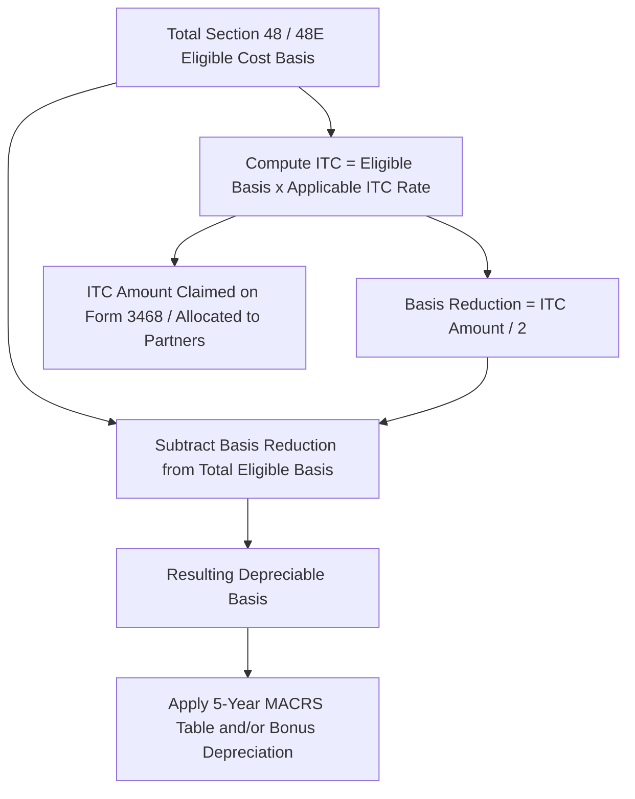

## Basis Reduction for Claimed Tax Credits

### Overview and Statutory Basis

When a taxpayer claims certain federal income tax credits with respect to depreciable property, the Internal Revenue Code generally requires a corresponding reduction in the depreciable basis of that property. This prevents the taxpayer from receiving the full benefit of both a dollar-for-dollar credit and unreduced cost-recovery deductions on the same expenditure. For energy tax equity transactions, basis reduction is a central computational step that bridges the credit-eligible cost basis (used to compute the ITC) and the depreciable basis (used to compute MACRS deductions), and it directly affects the magnitude of the tax losses available to shelter a tax equity investor's income.

The governing provision is IRC §50(c), which applies specifically to property for which an investment credit under §46 (which incorporates §48 energy property, and by extension the technology-neutral §48E clean electricity investment credit) has been determined.

### The One-Half Basis Reduction Rule

**Key Points**

- §50(c)(3) provides that where a credit is determined under §46 with respect to any property, the basis of that property is reduced by 50% of the credit so determined — commonly summarized as the "haircut" or "basis reduction."
- The reduction applies to the property's basis for all purposes of the Code, including depreciation (MACRS), not merely for credit-recapture bookkeeping purposes.
- The reduction is computed on the amount of credit "determined," meaning the credit as computed under §48/§48E before consideration of any limitations on the taxpayer's ability to currently use the credit (e.g., passive activity credit limitations under §469 do not change the basis reduction amount).
- This basis reduction rule applies to the investment tax credit under §48 and its clean-electricity successor under §48E; it does not apply to the production tax credit under §45 or §45Y, because the PTC is not an investment credit subject to §50(c) — PTC-eligible facilities generally retain full, unreduced depreciable basis.

$$Basis\ Reduction = \frac{ITC\ Amount\ Determined}{2}$$

$$Depreciable\ Basis = Total\ Eligible\ Cost\ Basis - Basis\ Reduction$$

**Example**

A battery storage facility with $40,000,000 of §48-eligible cost basis claims a 30% base ITC.

$$ITC\ Determined = \$40{,}000{,}000 \times 0.30 = \$12{,}000{,}000$$

$$Basis\ Reduction = \$12{,}000{,}000 / 2 = \$6{,}000{,}000$$

$$Depreciable\ Basis = \$40{,}000{,}000 - \$6{,}000{,}000 = \$34{,}000{,}000$$

The $34,000,000 remaining basis is what flows into the 5-year MACRS calculation (and, where applicable, bonus depreciation) discussed elsewhere in this chapter.

### Interaction with ITC Rate Adders

**Key Points**

- Where the credit-eligible ITC rate is increased by statutory adders — such as the domestic content bonus, energy community bonus, or low-income community bonus under §48(e)/§48E(h) — the basis reduction is computed on the full, adder-inclusive credit amount, not merely the 30% base rate.
- This means that projects claiming a higher blended ITC rate (for example, a base 30% rate plus a 10-percentage-point domestic content adder, yielding a 40% credit) experience a correspondingly larger basis reduction (20 percentage points off basis rather than 15).

**Example**

A wind facility qualifies for a 30% base ITC plus a 10-point energy community adder, for a total 40% ITC rate, on $60,000,000 of eligible basis.

$$ITC\ Determined = \$60{,}000{,}000 \times 0.40 = \$24{,}000{,}000$$

$$Basis\ Reduction = \$24{,}000{,}000 / 2 = \$12{,}000{,}000$$

$$Depreciable\ Basis = \$60{,}000{,}000 - \$12{,}000{,}000 = \$48{,}000{,}000$$

Compare this to the same project at the 30% base rate only, which would yield a $9,000,000 basis reduction and a $51,000,000 depreciable basis — illustrating that higher-value ITC elections come at the cost of a proportionally larger depreciation reduction.

### PTC vs. ITC: No Basis Reduction Under Section 45/45Y

**Key Points**

- A facility that elects the production tax credit under §45 (or the technology-neutral §45Y) rather than the investment credit is not subject to §50(c) basis reduction, because the PTC is computed based on metered production and sales over time, not as an investment credit tied to eligible basis.
- This creates one of the principal structural trade-offs in the §45/§45Y vs. §48/§48E election analysis: PTC-electing facilities retain 100% of cost basis for MACRS purposes, generally producing a larger depreciation tax shield in the early years, while ITC-electing facilities receive an immediate dollar-for-dollar credit against a larger dollar amount but sacrifice half of that credit's value in foregone depreciable basis.
- [Inference] The optimal ITC-vs-PTC election for a given project depends on facility-specific factors (capacity factor, project cost per watt, financing structure, and the tax equity investor's relative preference for upfront credits versus multi-year depreciation losses) and cannot be generalized as uniformly favoring one election; this is a modeling exercise rather than a fixed rule.

### Section 48(a)(10) / Grant-in-Lieu and Other Historical Analogues

- Historically, taxpayers who elected the now-expired Section 1603 cash grant in lieu of the ITC (available for a limited window following the 2009 stimulus legislation) were subject to an equivalent basis reduction mechanic under the grant program's terms, mirroring the §50(c) approach even though the grant itself was not technically a "credit."
- [Unverified] The Section 1603 grant program has long since expired and is referenced here only as a historical structural analogue illustrating that the "half-basis-reduction" concept has been a consistent feature of federal renewable energy incentive design across different incentive vehicles, not as a currently available election.

### Basis Reduction and Partnership Allocations

**Key Points**

- In partnership flip and other multi-investor tax equity structures, the depreciable basis (post-§50(c) reduction) is what is allocated among partners' capital accounts for purposes of computing each partner's share of MACRS deductions under the partnership agreement's allocation provisions, consistent with §704(b).
- Because the basis reduction lowers the total depreciation pool available for allocation, tax equity investors and their tax counsel typically model both the credit allocation and the depreciation allocation together, since the two are economically linked outputs of the same underlying eligible cost basis.
- The reduced basis also affects each partner's outside basis and capital account computations for purposes of subsequent distributions, dispositions, and recapture calculations under §1245 and §50(a).

### Timing of the Basis Reduction

**Key Points**

- The basis reduction under §50(c) generally occurs in the year the property is placed in service and the credit is determined, coinciding with the year MACRS depreciation begins, so the reduced (not the gross) basis is used from the very first depreciation computation — there is no year in which the taxpayer depreciates the unreduced basis before a later "catch-up" reduction.
- If the ITC amount is later adjusted (for example, due to a correction in eligible cost basis following a cost segregation study or IRS examination), the basis reduction must be correspondingly adjusted, which can require amended depreciation schedules for open tax years.

### Recapture Interaction

**Key Points**

- If the property is disposed of or ceases to be investment credit property within the 5-year recapture period under §50(a), a portion of the ITC is recaptured; however, the basis reduction under §50(c) is not similarly "undone" pro rata upon a partial recapture in the same mechanical way — instead, §50(c)(2) provides a basis increase mechanism: when ITC recapture occurs, the taxpayer's basis in the property is increased immediately before the event resulting in recapture by an amount equal to the recapture percentage of the amount by which basis was originally reduced.
- This basis restoration on recapture is relevant to computing gain or loss on a disposition that simultaneously triggers ITC recapture, since the taxpayer's adjusted basis for gain/loss purposes reflects the restored (partially un-reduced) basis at the moment immediately preceding the recapture-triggering event.

$$Basis\ Increase\ on\ Recapture = Original\ Basis\ Reduction \times Recapture\ Percentage$$

**Example**

Using the earlier battery storage example ($6,000,000 original basis reduction), if the property is disposed of in year 3 of the 5-year recapture period (60% recapture percentage remaining, i.e., 3 of 5 years remaining triggers 60% recapture):

$$Basis\ Increase = \$6{,}000{,}000 \times 0.60 = \$3{,}600{,}000$$

This $3,600,000 is added back to the property's basis immediately before the disposition, increasing the basis used to compute gain or loss on the sale.

### Common Pitfalls

- Applying the basis reduction to only the base 30% ITC rate while overlooking that domestic content, energy community, or low-income adders increase the credit amount and therefore proportionally increase the basis reduction.
- Incorrectly applying §50(c) basis reduction to PTC-electing facilities, which are not subject to this rule.
- Failing to true up the basis reduction (and downstream depreciation schedules) when a later cost basis adjustment (e.g., post-closing true-up, cost segregation revision, or IRS audit adjustment) changes the ITC amount determined.
- Overlooking the §50(c)(2) basis restoration mechanism when computing gain or loss on a disposition that triggers partial ITC recapture, which can materially affect the character and amount of recognized gain.
- Neglecting to coordinate basis reduction computations with partnership capital account and allocation provisions in tax equity flip structures, leading to mismatches between credit allocations and depreciation allocations.

**Related Topics**

- Section 48 vs. Section 45 Election Mechanics and Basis Trade-offs
- ITC Rate Adders: Domestic Content, Energy Community, and Low-Income Bonuses
- Section 50(a) ITC Recapture Rules and the Five-Year Recapture Schedule
- Cost Segregation Studies and Eligible Basis Determination
- Partnership Flip Structures: Section 704(b) Capital Account Allocations
- Five-Year MACRS Classification for Energy Property
- Historical Section 1603 Cash Grant Program Basis Mechanics