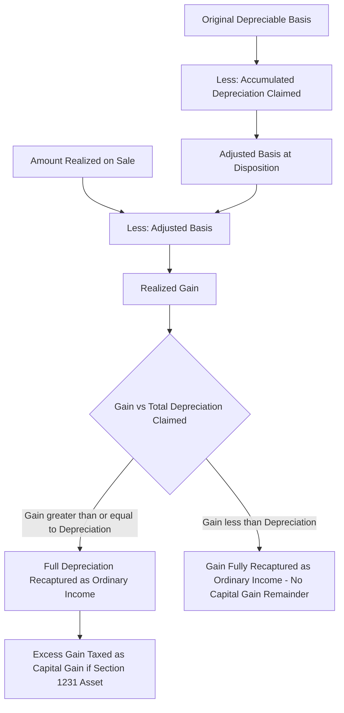

## Depreciation Recapture on Disposition

### Overview and Statutory Basis

Depreciation recapture is the mechanism by which the Internal Revenue Code recharacterizes gain on the disposition of depreciable property from capital gain to ordinary income, to the extent that gain reflects previously claimed depreciation deductions. The underlying policy rationale is that depreciation deductions reduced ordinary taxable income during the holding period, so a portion of any gain on sale — attributable to those deductions rather than genuine economic appreciation — should be taxed at ordinary rates rather than preferential capital gains rates. For renewable energy assets, which are typically §1245 property depreciated rapidly under 5-year MACRS (often further accelerated by bonus depreciation), recapture exposure on disposition can be substantial and is a central diligence item in project sales, partnership flips, and M&A transactions involving operating tax equity partnerships.

Depreciation recapture under §1245 is analytically distinct from, but frequently analyzed alongside, investment tax credit recapture under §50(a); a single disposition event can trigger both simultaneously.

### Section 1245 Property Classification

**Key Points**

- Renewable energy generation equipment — PV modules, inverters, wind turbines, racking, and most balance-of-system electrical equipment — is generally §1245 property, meaning it is depreciable personal property (or other property specifically defined as §1245 property) rather than §1250 real property.
- The §1245 classification matters because the recapture rule for §1245 property recaptures the *lesser of* recognized gain or the total depreciation (including bonus depreciation) previously allowed or allowable, as ordinary income — in practice, for most energy asset dispositions with gain, this typically means the entire depreciation taken is recaptured as ordinary income if gain equals or exceeds accumulated depreciation.
- Ancillary site improvements (fencing, certain roads) and any buildings on a project site may be classified separately as §1250 property or land improvements, which have their own (generally more limited) recapture rules under §1250 — relevant primarily to non-residential real property depreciated using accelerated methods before MACRS's current straight-line-for-real-property regime, a scenario that is uncommon for post-1986 property.
- [Inference] Because most modern nonresidential real property is depreciated using the straight-line method under MACRS, §1250 recapture (which specifically targets *excess* accelerated depreciation over straight-line) rarely produces meaningful recapture for buildings placed in service in recent years; the analysis below therefore focuses on §1245 property, which is the dominant asset class for energy generation equipment.

### The Section 1245 Recapture Formula

$$Recapture\ (Ordinary\ Income) = \min(Recognized\ Gain,\ Total\ Depreciation\ Claimed)$$

$$Adjusted\ Basis = Original\ Cost\ Basis - Accumulated\ Depreciation$$

$$Realized\ Gain = Amount\ Realized - Adjusted\ Basis$$

Any gain in excess of total depreciation claimed (i.e., gain attributable to appreciation beyond the original cost basis) retains its character as capital gain (assuming the asset is a capital asset or §1231 asset in the taxpayer's hands and other holding period requirements are met); depreciation recapture itself is always ordinary income, without regard to holding period.

**Example**

A solar project with an original depreciable basis of $34,000,000 (post-ITC basis reduction) has claimed $34,000,000 of accumulated depreciation (fully depreciated via bonus depreciation and/or the completed MACRS schedule) by the time of sale in year 6.

$$Adjusted\ Basis = \$34{,}000{,}000 - \$34{,}000{,}000 = \$0$$

The project is sold for $45,000,000 (allocated to the depreciable equipment, excluding land and any separately valued intangibles such as the PPA).

$$Realized\ Gain = \$45{,}000{,}000 - \$0 = \$45{,}000{,}000$$

$$Section\ 1245\ Recapture = \min(\$45{,}000{,}000,\ \$34{,}000{,}000) = \$34{,}000{,}000\ (ordinary\ income)$$

$$Remaining\ Capital\ Gain = \$45{,}000{,}000 - \$34{,}000{,}000 = \$11{,}000{,}000$$

In this example, the entire $34,000,000 of depreciation previously claimed is recaptured as ordinary income, with only the excess $11,000,000 of appreciation-driven gain eligible for capital gain treatment.

### Interaction with Bonus Depreciation

**Key Points**

- Because bonus depreciation (particularly the restored 100% rate discussed elsewhere in this chapter) accelerates the entirety of depreciable basis into the first year of an asset's life, energy assets frequently reach a zero (or near-zero) adjusted basis very early in the project's operating life.
- This means that virtually any sale of the project's depreciable equipment for more than a nominal amount — which is the typical case, since operating renewable energy projects with long-term contracted revenue generally appreciate or at least hold significant value — will trigger substantial §1245 ordinary income recapture, often approaching the full amount of gain recognized on the equipment component of the sale.
- Sellers structuring an exit (whether a partnership interest sale, an asset sale, or a partnership flip buyout) should model recapture exposure explicitly, since the ordinary income character (as opposed to capital gain) affects the seller's after-tax proceeds and may influence deal structuring (e.g., preference for a sale of partnership interests under §741/§751 rather than a direct asset sale, subject to the "hot asset" look-through rules discussed below).

### Recapture in the Sale of a Partnership Interest: Section 751

**Key Points**

- Many renewable energy tax equity exits occur through the sale of a partnership interest (e.g., a tax equity investor's interest in the project partnership, or a sponsor's sale of its interest post-flip) rather than a direct sale of the underlying project assets.
- Under §751, a portion of the gain on the sale of a partnership interest that is attributable to the partnership's "unrealized receivables" — a term that specifically includes potential §1245 (and §1250) depreciation recapture — is recharacterized as ordinary income to the selling partner, even though the transaction is nominally a sale of a capital-asset partnership interest.
- This requires a "hypothetical sale" computation: the partnership is treated as if it sold all of its §1245 property at fair market value immediately before the partner's interest sale, and the selling partner's share of the resulting hypothetical ordinary income (recapture) is carved out of what would otherwise be entirely capital gain on the interest sale.
- [Inference] The precise §751 hypothetical-sale computation for a project with multiple assets, historical basis step-ups from a prior partnership flip, and possible §754 election history can be highly fact-specific; a detailed §751 computation for a specific transaction should be performed with full access to the partnership's asset-by-asset basis and depreciation records rather than estimated from summary financial statements.

### Interaction with Section 1231 Netting

**Key Points**

- Depreciable property used in a trade or business and held for more than one year is generally §1231 property; net gains from §1231 property dispositions are treated as long-term capital gain (aside from the recaptured ordinary income portion under §1245), while net §1231 losses are treated as ordinary losses — a favorable "best of both worlds" treatment for the non-recaptured portion of gain.
- The §1245 recapture computation is performed *before* the §1231 netting process: the ordinary income recapture amount is carved out first, and only the residual gain enters the §1231 hotchpot for netting against other §1231 gains and losses for the year.
- The §1231 "lookback rule" (recapturing prior-year net §1231 losses as ordinary income against current-year net §1231 gains) is a separate five-year lookback mechanism that can further convert a portion of otherwise-capital residual §1231 gain into ordinary income, and should be modeled independently of §1245 recapture.

### Coordination with Section 50(a) ITC Recapture

**Key Points**

- A disposition within the 5-year ITC recapture period under §50(a) simultaneously triggers (1) potential ITC recapture (a percentage of the credit previously claimed, based on the recapture schedule) and (2) §1245 depreciation recapture on any gain recognized, and (3) the §50(c)(2) basis restoration mechanism (discussed in the basis reduction topic) that increases the property's basis immediately before the recapture event by the applicable percentage of the original basis reduction.
- Because the §50(c)(2) basis increase occurs *before* computing gain or loss on the disposition, it directly affects (and generally reduces) the amount of gain subject to §1245 recapture — the two provisions are computationally sequenced, not independent.
- Practitioners modeling an early disposition within the ITC recapture period should compute, in order: (1) the ITC recapture percentage and amount, (2) the resulting basis increase under §50(c)(2), (3) the adjusted basis for gain/loss purposes reflecting that increase, (4) realized gain, and (5) the §1245 ordinary income recapture on that gain.

### Depreciation Recapture in Repowering Transactions

- A repowering transaction that involves the retirement (rather than sale) of old components (e.g., removed wind turbine blades, nacelles, or towers) can trigger a partial disposition under the MACRS partial disposition rules, requiring the taxpayer to remove the retired component's remaining basis from the asset's overall MACRS basis and potentially recognize a loss (or, in less common cases, gain) on the retirement — a computation that is separate from, but related to, the recapture analysis on a full facility sale.
- [Unverified] The specific treatment of partial dispositions in a repowering context can depend on whether the taxpayer has made or is eligible to make a partial disposition election, and on facility-specific asset-by-asset basis tracking; this is a technical area warranting dedicated cost segregation and fixed-asset records analysis rather than a generalized rule.

### Recordkeeping and Substantiation for Recapture Computations

**Key Points**

- Accurate recapture computation requires asset-level (or at minimum, asset-class-level) tracking of original cost basis, ITC-related basis reductions, bonus depreciation claimed, and standard MACRS deductions claimed each year — a fixed asset ledger that many tax equity partnerships maintain specifically to support both annual tax return preparation and eventual exit-transaction modeling.
- Where a project has undergone a partnership flip with a prior §754 election and corresponding basis step-up, recapture computations must account for the separate "layers" of basis (original basis versus §743(b) step-up basis), since these layers can have different depreciation histories and different recapture consequences to different partners.

### Common Pitfalls

- Assuming an asset sale automatically produces capital gain because the project itself is a long-held, appreciating §1231 asset, without separately computing the §1245 ordinary income recapture carve-out.
- Overlooking §751 "hot asset" recharacterization when structuring an exit as a sale of a partnership interest rather than a direct asset sale, resulting in incorrect character classification of gain.
- Failing to sequence the §50(c)(2) basis restoration before computing gain when a disposition occurs within the ITC recapture period, leading to an overstated recapture amount.
- Neglecting to account for multiple basis "layers" (original vs. §743(b) step-up basis) in projects that have undergone a prior partnership flip with a §754 election.
- Treating repowering component retirements as a simple continuation of the existing depreciation schedule rather than analyzing potential partial disposition gain/loss recognition.

**Related Topics**

- Section 1231 Netting and the Five-Year Lookback Rule
- Section 751 Hot Asset Rules in Partnership Interest Sales
- Section 50(a) ITC Recapture Schedule and Section 50(c)(2) Basis Restoration
- Partial Disposition Elections in Repowering Transactions
- Section 754 Elections and Section 743(b) Basis Step-Ups in Partnership Flips
- Fixed Asset Recordkeeping for Tax Equity Exit Modeling
- Five-Year MACRS Classification for Energy Property