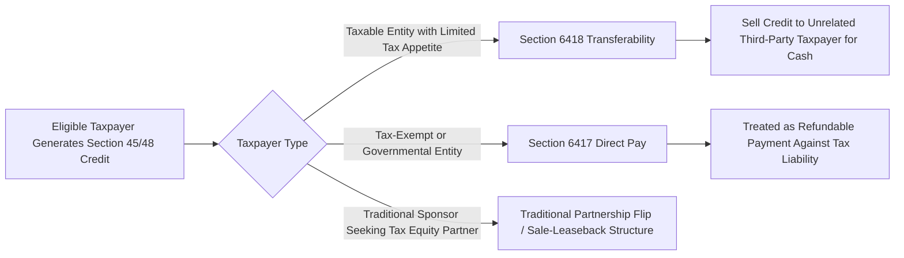

## Expansion of Eligible Technologies and Credit Values in 2022

### Overview and Legislative Context

The Inflation Reduction Act of 2022 (IRA), signed into law on August 16, 2022, represented the most significant expansion of federal renewable energy tax incentives since the enactment of the modern ITC and PTC regimes. It broadened the range of technologies eligible for the investment tax credit (ITC) under §48 and the production tax credit (PTC) under §45, restructured the base credit rate and bonus adder architecture, and laid the groundwork for the technology-neutral successor credits under §48E and §45Y. This item covers the 2022 expansion as originally enacted; a subsequent chapter item addresses the significant modifications made by the One Big Beautiful Bill Act (OBBBA) in 2025, which materially altered the trajectory the IRA set in motion. Where relevant, this item flags where 2022-era provisions have since been changed, so the historical framework is not mistaken for current law.

### Restructured Base Rate and Bonus Rate Architecture

**Key Points**

- The IRA restructured both §48 and §45 around a two-tier rate structure: a low "base rate" and a five-times-higher "bonus rate" available only if the taxpayer satisfies prevailing wage and apprenticeship (PWA) requirements (or qualifies for a statutory exception, such as facilities under 1 megawatt or projects that began construction before a specified date).
- For the ITC under §48, the base rate was set at 6% of qualified investment, with the bonus rate reaching 30% for PWA-compliant projects.
- For the PTC under §45, a base rate of 0.3 cents per kilowatt-hour was established, with a bonus rate of 1.5 cents per kilowatt-hour for facilities meeting the PWA requirements or exceptions, both figures indexed for inflation.
- This 6%/30% and 0.3¢/1.5¢ base-to-bonus structure was carried forward into the technology-neutral §48E and §45Y credits that took effect for facilities placed in service after 2024, preserving the same five-times multiplier architecture.

```mermaid
flowchart TD
    A[IRA 2022 Base Credit Rate] --> B{Prevailing Wage and Apprenticeship Requirements Met?}
    B -->|Yes, or Exception Applies| C[Bonus Rate: 30% ITC / 1.5 cents-kWh PTC]
    B -->|No| D[Base Rate Only: 6% ITC / 0.3 cents-kWh PTC]
    C --> E[Stackable Bonus Adders]
    E --> F[Domestic Content Adder: up to 10 points]
    E --> G[Energy Community Adder: up to 10 points]
    E --> H[Low-Income Community Adder - ITC only, Section 48(e)]
```

### Stackable Bonus Credit Adders

**Key Points**

- **Domestic content adder**: Facilities satisfying domestic content requirements — under the IRA, generally 100% U.S.-manufactured iron or steel for structural components and a specified percentage (40% for most facilities, 20% for offshore wind) of the cost of manufactured products being of U.S. origin — could add up to 10 percentage points to the ITC rate (or a proportional increase for the PTC).
- **Energy community adder**: Facilities located in statutorily defined "energy communities" (areas with historical fossil fuel employment, brownfield sites, or coal community census tracts) could add up to an additional 10 percentage points.
- **Low-income community adder**: Under §48(e) (an ITC-specific provision with no direct PTC analogue in the same form), qualifying solar and wind facilities under 5 megawatts located in low-income communities, on Indian land, as part of qualified low-income residential buildings, or as part of qualified low-income economic benefit projects could receive an additional 10 or 20 percentage point adder, subject to an annual capacity allocation administered by the Department of Energy and IRS.
- These adders were stackable, meaning a project satisfying PWA requirements plus domestic content plus energy community location could reach an ITC rate as high as 50% (30% base-bonus + 10% domestic content + 10% energy community) under the original 2022 framework, before consideration of the separate, capacity-limited low-income adder.

**Example**

A solar project meeting PWA requirements, satisfying domestic content thresholds, and located in a designated energy community under the original 2022 IRA framework:

$$ITC\ Rate = 30\% + 10\%\ (domestic\ content) + 10\%\ (energy\ community) = 50\%$$

### Technology Expansion Under Section 48 and Section 45

**Key Points**

- The IRA expanded the list of technologies eligible for the ITC under §48 to explicitly include standalone energy storage technology (batteries and other storage systems) for the first time, removing the prior requirement that storage be co-located with and charged predominantly by an eligible generation facility to qualify.
- Qualified biogas property, microgrid controllers, dynamic glass, and interconnection property for smaller facilities were also added or clarified as ITC-eligible property categories under the 2022 legislation.
- The PTC under §45 was extended and its technology scope preserved for wind, closed-loop and open-loop biomass, geothermal, landfill gas, trash, qualified hydropower, and marine and hydrokinetic renewable energy facilities, with the IRA extending the placed-in-service deadline for beginning-of-construction purposes that had been set to lapse.
- The IRA introduced the ability for a taxpayer to elect the ITC in lieu of the PTC (and vice versa, subject to technology eligibility) for a broader range of technologies than had previously been possible, giving developers greater flexibility to select the credit mechanism best suited to a project's economics.

### Creation of Transferability Under Section 6418

**Key Points**

- The IRA created, for the first time, a mechanism under new §6418 allowing an eligible taxpayer to transfer certain credits (including the §45 PTC and §48 ITC, among others) to an unrelated third party in exchange for cash consideration, without the transferee needing to be a partner or investor in the underlying project entity.
- This transferability mechanism was a significant structural innovation because it created an alternative to traditional tax equity partnership structures (partnership flips and sale-leasebacks) for monetizing credits, allowing project sponsors with limited internal tax appetite to sell credits directly to any taxpayer with sufficient tax liability, without the complexity of admitting a tax equity partner into the ownership structure.
- Cash received by the transferor in a §6418 transfer is excluded from the transferor's gross income, and the transferee cannot further transfer the credit (a one-time transfer limitation), and the transferee's basis reduction and other consequences generally mirror what the original credit claimant would have experienced.

### Creation of Direct Pay Under Section 6417

**Key Points**

- The IRA also created §6417, allowing certain tax-exempt and governmental entities (states, municipalities, tribal governments, rural electric cooperatives, and certain other tax-exempt organizations) to elect "direct pay," treating the credit as a refundable payment against tax liability even though these entities typically have no taxable income against which to use a credit.
- This was a significant expansion because it was the first time renewable energy tax credits were made effectively "refundable" for a defined category of tax-exempt and governmental project owners, addressing a longstanding structural barrier that had previously required public power entities and cooperatives to rely on complex flip-lease or other pass-through arrangements to access any credit value at all.
- Direct pay eligibility was more limited than transferability, being generally restricted to the specified categories of tax-exempt and governmental entities rather than available to all taxpayers.



### Creation of the Section 45X Advanced Manufacturing Production Credit

**Key Points**

- The IRA created new §45X, a production tax credit for domestic manufacturing of clean energy components — including solar modules, wind turbine components, battery cells and modules, and critical minerals — providing a per-unit or per-value credit intended to incentivize a domestic clean energy manufacturing supply chain rather than incentivizing generation or investment directly.
- §45X was structured as a manufacturer-side credit, distinct from and complementary to the generation-side §45/§48 credits, and was intended to work in tandem with the domestic content adder to strengthen incentives for U.S.-based component sourcing.

### Creation and Expansion of Section 48C Advanced Energy Project Credit

**Key Points**

- The IRA substantially expanded the Section 48C advanced energy project credit (originally created under the American Recovery and Reinvestment Act of 2009), funding it with a $10 billion allocation, including $4 billion specifically set aside for projects in energy communities.
- Section 48C is a competitively allocated credit administered jointly by the IRS and Department of Energy, requiring an application and allocation letter before a taxpayer can claim the credit, distinguishing it structurally from the largely self-executing §45/§48/§45Y/§48E credits.
- To claim the full 30% Section 48C rate, projects must meet prevailing wage and apprenticeship requirements; otherwise, the credit is limited to 6%, mirroring the base/bonus architecture used elsewhere in the IRA.

### Creation of the Technology-Neutral Section 48E and Section 45Y Framework

**Key Points**

- The IRA created new Sections 48E (Clean Electricity Investment Credit) and 45Y (Clean Electricity Production Credit) as technology-neutral successors to §48 and §45, applicable to facilities placed in service after December 31, 2024.
- Rather than enumerating specific eligible technologies, §48E and §45Y define eligibility based on a facility's greenhouse gas emissions rate, with zero (or sufficiently low) emissions facilities qualifying regardless of the generation technology used — a structural shift intended to make the credit regime durable against changes in energy technology over time.
- As originally enacted in 2022, these technology-neutral credits were scheduled to begin phasing out on the later of 2032 or the year in which U.S. electricity sector greenhouse gas emissions fell to 25% or less of 2022 levels, with the base/bonus rate structure and stackable adders carried forward from §48/§45.

[Unverified] The phase-out timeline, beginning-of-construction deadlines, and technology eligibility for §48E and §45Y as originally enacted in 2022 have since been substantially altered by the 2025 One Big Beautiful Bill Act, which accelerated phase-out schedules (particularly for wind and solar), introduced new foreign entity of concern restrictions, and imposed a July 4, 2026 beginning-of-construction deadline for most wind and solar facilities to preserve credit eligibility under a placed-in-service backstop of December 31, 2027. Practitioners should treat the 2022 IRA framework described in this item as the historical baseline and consult the OBBBA-specific chapter item for the current operative rules.

### Common Pitfalls

- Applying the original 2022 IRA phase-out timeline (tied to 2032 or emissions thresholds) to current wind and solar projects without accounting for the OBBBA's accelerated deadlines.
- Assuming all stackable bonus adders (domestic content, energy community, low-income) remain available in their original 2022 form without checking current domestic content percentage thresholds and FEOC (foreign entity of concern) restrictions layered on by subsequent legislation.
- Confusing the manufacturer-side §45X credit with the generation-side §45/§48/§45Y/§48E credits, or overlooking the restriction (added later) on claiming both §45X and §48C for the same property placed in service after August 16, 2022.
- Assuming transferability under §6418 or direct pay under §6417 remain unconditionally available for all credit types and all transferees without checking subsequently enacted restrictions (e.g., prohibitions on transfers to specified foreign entities).
- Treating the technology-neutral §45E/§45Y framework as identical in eligibility scope to its original 2022 design, rather than confirming current beginning-of-construction and placed-in-service deadlines.

**Related Topics**

- Prevailing Wage and Apprenticeship Requirements Under Section 45(b)(7)/48(a)(9)
- Domestic Content Bonus Credit Mechanics and Certification
- Energy Community Bonus Credit Geographic and Statistical Area Tests
- Low-Income Community Bonus Credit Under Section 48(e) and Capacity Allocation
- Section 6418 Transferability Mechanics and Transferee Considerations
- Section 6417 Direct Pay Elections for Tax-Exempt and Governmental Entities
- Section 45X Advanced Manufacturing Production Credit
- OBBBA Modifications to the Section 48E/45Y Framework (2025)
- Foreign Entity of Concern (FEOC) Restrictions on Credit Eligibility