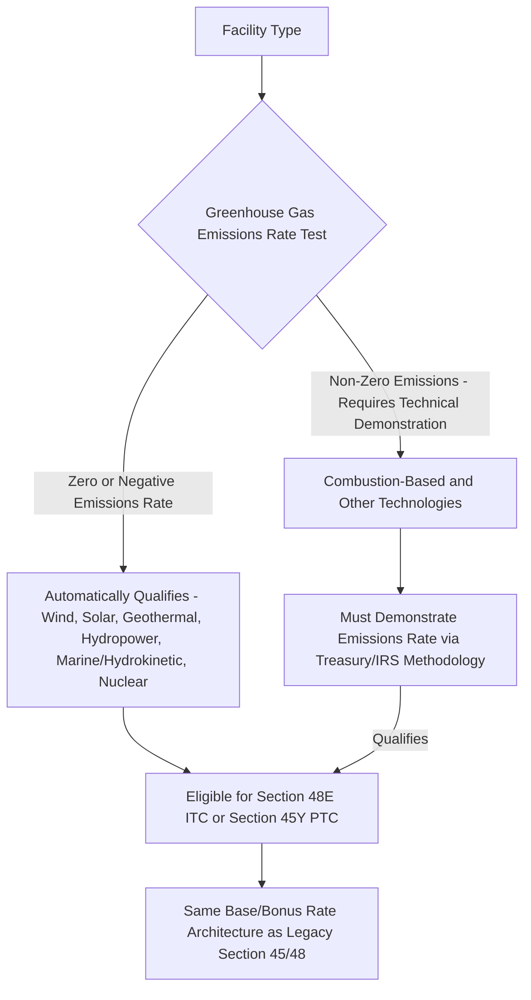
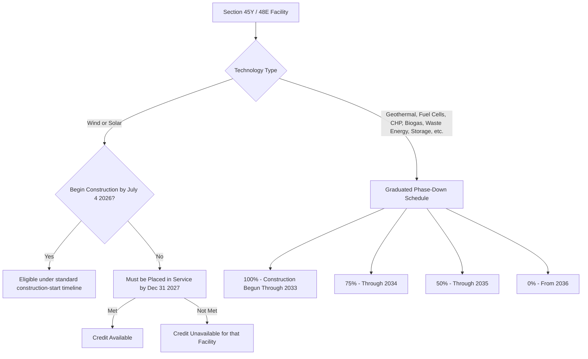

## Introduction of the Technology-Neutral Credit Regime

### Overview and Legislative Origin

The Inflation Reduction Act of 2022 (IRA) introduced a fundamental architectural shift in how federal law incentivizes clean electricity generation: rather than enumerating specific eligible technologies (as the legacy §45 PTC and §48 ITC do), Congress created new Sections 45Y (Clean Electricity Production Credit) and 48E (Clean Electricity Investment Credit), which define eligibility based on a facility's greenhouse gas emissions rate rather than its generation technology. This item addresses the design, rationale, and mechanics of this technology-neutral regime as introduced in 2022, together with the significant modifications made by the One Big Beautiful Bill Act (OBBBA) in 2025, since the two must be understood together to describe current law accurately.

### Rationale for Technological Neutrality

**Key Points**

- Policymakers advanced three principal arguments for moving to a technology-neutral framework: first, by setting a fixed goal (zero greenhouse gas emissions) rather than specifying particular technologies, the regime avoids lawmakers effectively picking winners and losers in the energy market based on potentially arbitrary or outdated technology lists.
- Second, zero-emissions technologies developed in the future are automatically eligible for the credits without requiring new legislation, creating a built-in incentive for continued technological innovation rather than requiring Congress to periodically amend an enumerated list.
- Third, the technology-neutral design was intended to provide long-term certainty and durability, replacing the historical pattern of short expiration dates and reliance on temporary tax extender legislation that had long characterized the fragmented pre-IRA energy credit system.

### Statutory Mechanics: The Emissions Rate Test

**Key Points**

- Section 48E provides an investment tax credit for expenditures on zero-emission electricity generation or standalone energy storage facilities, while Section 45Y provides a production tax credit for electricity generated by zero-emitting facilities for ten years after they are placed in service, mirroring the basic structural mechanics of the legacy §48 and §45 credits, respectively.
- Eligibility turns on whether the facility's greenhouse gas emissions rate is not greater than zero, as determined under emissions rate methodologies and provided technology-specific tables published by the Treasury Department and IRS, rather than on a statutory list of named technologies.
- As a practical matter, wind, solar, geothermal, hydropower, marine and hydrokinetic, and nuclear generation facilities are treated as automatically satisfying the zero (or negative) emissions rate threshold under published guidance, while combustion-based or other technologies must generally demonstrate their emissions rate through a more involved technical showing.
- The IRA amendments also allowed fuel cell properties to qualify for the Section 48E credit regardless of the properties' greenhouse gas emissions, reflecting subsequent legislative refinement to the zero-emissions test for that specific technology.

### Preserving the Base/Bonus Rate and Adder Architecture

**Key Points**

- Sections 48E and 45Y carried forward the same rate architecture introduced elsewhere by the IRA for the legacy credits: a low base rate (6% for the ITC, 0.3 cents/kWh for the PTC) and a bonus rate five times higher (30% ITC, 1.5 cents/kWh PTC) for facilities satisfying prevailing wage and apprenticeship requirements.
- The stackable domestic content and energy community bonus adders (each up to 10 percentage points) available under legacy §48/§45 were similarly incorporated into §48E/§45Y, preserving continuity in bonus credit mechanics across the transition from the technology-specific to the technology-neutral regime.
- The technology-neutral credits took effect for facilities placed in service after December 31, 2024, creating a transition period in which legacy §45/§48 governed facilities beginning construction (and generally placed in service) before that date, while §45Y/§48E govern the newer facility population.

### Original 2022 Phase-Out Design: The Emissions-Linked Sunset

**Key Points**

- As originally enacted in 2022, Sections 48E and 45Y were designed to phase out based on the later of two triggers: the calendar year 2032 (or 2033/2034 depending on the specific phase-down mechanics), or the year in which U.S. electricity sector greenhouse gas emissions fell to 25% or less of 2022 levels — whichever came later.
- This "later of" design meant that if emissions reduction targets were not achieved by the calendar-year backstop, the credits could continue in full force well beyond the nominal sunset year, giving the technology-neutral regime a potentially much longer effective lifespan than a simple fixed-year expiration would have provided.
- [Inference] This emissions-contingent design was a deliberate legislative choice to tie the credit's duration to environmental outcomes rather than an arbitrary calendar date, reinforcing the "technology-neutral, outcome-focused" philosophy underlying the broader IRA redesign — though as discussed below, this contingent design was subsequently replaced by the OBBBA with fixed calendar deadlines.

### The 2025 OBBBA Amendments: Retained Structure, Accelerated Timelines

**Key Points**

- The One Big Beautiful Bill Act (OBBBA), enacted July 4, 2025, retained the core technology-neutral structure of Sections 48E and 45Y — the emissions rate eligibility test, the base/bonus rate architecture, and the stackable adders remain intact — but substantially accelerated the phase-out schedule, particularly and specifically for wind and solar.
- For most non-wind, non-solar technologies (geothermal, fuel cells, combined heat and power, biogas, waste energy recovery, thermal energy, and battery storage), the OBBBA replaced the emissions-contingent "later of" sunset with a fixed graduated phase-down: 100% credit value for projects beginning construction through December 31, 2033, stepping down to 75% through 2034, 50% through 2035, and zero from 2036 onward — a materially shorter and more certain runway than the original emissions-linked design, but still a multi-year window.
- For wind and solar facilities specifically, the OBBBA imposed a much more compressed, two-part test: the facility must begin construction by July 4, 2026 to preserve credit eligibility under the standard multi-year construction timeline; a wind or solar project that begins construction after that date must instead be placed in service by December 31, 2027 to claim the Section 45Y or 48E credit at all.
- This bifurcated treatment — a materially longer runway for non-wind/non-solar technologies compared to the sharply compressed wind/solar deadlines — is one of the most consequential features of the OBBBA amendments and reflects a policy choice to differentiate treatment among technologies despite the framework's nominal "technology neutrality."

### Beginning-of-Construction Rules Under OBBBA Guidance

**Key Points**

- Following the OBBBA, the IRS issued Notice 2025-42 addressing when wind and solar projects are considered to have begun construction for §45Y/§48E purposes, significantly narrowing the pathways previously available under longstanding prior guidance.
- The familiar "5% safe harbor" (allowing a taxpayer to establish beginning of construction by incurring 5% or more of total project costs), which traced back to Notice 2013-29 and had been refined through subsequent notices, was eliminated for most wind and solar projects under this new guidance.
- In place of the 5% safe harbor, most wind and solar developers must now satisfy the "physical work test," requiring that physical work of a significant nature begin before the applicable deadline — a materially more stringent and fact-intensive standard than the cost-percentage safe harbor it replaces.
- The 5% safe harbor was specifically preserved for small-scale solar projects of 1.5 megawatts or less, reflecting a policy accommodation for the distinct compliance challenges facing distributed generation developers relative to utility-scale projects.

### Foreign Entity of Concern (FEOC) Restrictions

**Key Points**

- The OBBBA introduced new "prohibited foreign entity" (PFE) restrictions applicable to Sections 45Y, 48E, and 45X, generally denying credits to taxpayers that are, or that receive certain "material assistance" from, specified foreign entities, including entities connected to China, Russia, North Korea, or Iran.
- These restrictions apply based on categories including "specified foreign entities" (SFEs) and "foreign-influenced entities" (FIEs), with different tests for organizational control/ownership versus supply-chain "material assistance," and apply generally to facilities beginning construction after 2026 for the material assistance component, and to tax years beginning after the OBBBA's enactment date for certain entity-status restrictions.
- [Inference] The FEOC/PFE rules are highly technical and fact-dependent, requiring detailed supply chain and ownership analysis; a general summary cannot substitute for a facility- and entity-specific FEOC compliance review, particularly given that implementing guidance in this area continues to develop.

### Storage and Standalone Energy Storage Treatment

**Key Points**

- Standalone energy storage technology remains eligible for the Section 48E ITC, and the OBBBA clarified that energy storage co-located at a wind or solar facility is eligible for the credit under the longer, non-wind/solar-style phase-down timeline rather than being tied to the compressed wind/solar deadlines — a favorable clarification for storage-paired renewable projects.

### Interaction with Legacy Section 45/48

**Key Points**

- Projects that began construction before January 1, 2025 generally remain governed by legacy Section 48 (ITC) and Section 45 (PTC) rather than the technology-neutral regime, and such projects are generally unaffected by the OBBBA's accelerated phase-outs, FEOC restrictions, or other technology-neutral-regime-specific limitations.
- This creates a bifurcated compliance landscape in which practitioners must first determine which regime (legacy §45/§48 versus technology-neutral §45Y/§48E) governs a given facility based on its beginning-of-construction and placed-in-service dates, since the applicable substantive rules differ meaningfully between the two frameworks.

### Transferability and Direct Pay Preserved

**Key Points**

- Transferability under Section 6418 was maintained for the technology-neutral credits despite concerns during the OBBBA legislative process that it might be phased out; the House version of the bill considered phasing out transferability, but this was removed in the Senate, and transferability survived as a permanent tax-planning mechanism, though transfers to specified foreign entities are now prohibited.
- The Section 45Y credit also remains eligible for direct pay under Section 6417 for qualifying tax-exempt and governmental entities, preserving that monetization pathway introduced alongside the original 2022 technology-neutral framework.

### Common Pitfalls

- Assuming the original 2022 emissions-contingent phase-out timeline (tied to 2032/2033 or 25%-of-2022-emissions) still governs, rather than the OBBBA's fixed calendar deadlines.
- Applying the graduated 2033-2036 phase-down schedule (applicable to most non-wind/non-solar technologies) to a wind or solar project, which is instead subject to the much more compressed July 4, 2026 / December 31, 2027 two-part test.
- Relying on the 5% cost safe harbor for beginning-of-construction determinations on wind or solar projects above 1.5 MW, where that safe harbor has been eliminated in favor of the physical work test.
- Overlooking FEOC/prohibited foreign entity restrictions when structuring supply chains or ownership for facilities beginning construction after 2026.
- Failing to correctly determine whether a given facility is governed by legacy §45/§48 or the technology-neutral §45Y/§48E regime based on its beginning-of-construction and placed-in-service dates.

**Related Topics**

- Beginning of Construction Rules: Physical Work Test vs. Five Percent Safe Harbor
- Prohibited Foreign Entity and Material Assistance Restrictions Under OBBBA
- Emissions Rate Methodology and Treasury/IRS Technology Tables
- Transition Rules Between Legacy Section 45/48 and Technology-Neutral Section 45Y/48E
- Standalone Energy Storage Eligibility Under Section 48E
- Prevailing Wage and Apprenticeship Requirements Across Legacy and Technology-Neutral Credits
- Transferability (Section 6418) and Direct Pay (Section 6417) Under the Technology-Neutral Regime