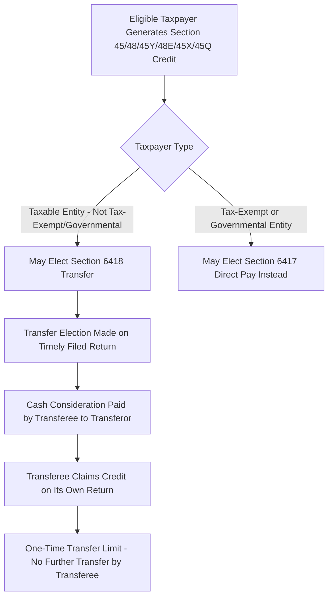
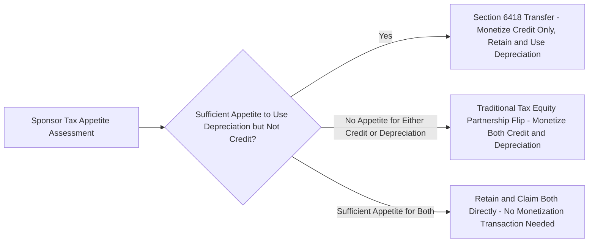

## Creation of Transferability Under Section 6418

### Overview and Legislative Origin

The Inflation Reduction Act of 2022 created new IRC §6418, establishing for the first time a statutory mechanism allowing an eligible taxpayer to transfer certain federal income tax credits to an unrelated third party in exchange for cash, without requiring the transferee to hold any equity or partnership interest in the underlying project. This represented a significant structural innovation in how renewable energy tax incentives could be monetized, creating an alternative to the traditional tax equity partnership flip and sale-leaseback structures that had previously been the dominant (and often only practical) mechanisms for developers with insufficient internal tax appetite to access the value of the credits they generated.

### Eligible Credits and Eligible Taxpayers

**Key Points**

- Section 6418 permits transfer of a specified list of credits, including the §45 production tax credit, §48 investment tax credit, §45Y clean electricity production credit, §48E clean electricity investment credit, §45X advanced manufacturing production credit, §45Q carbon oxide sequestration credit, and several other IRA-created or IRA-modified credits.
- An "eligible taxpayer" for purposes of making a transfer election is generally any taxpayer other than certain tax-exempt and governmental entities that are instead eligible to elect direct pay under the separate §6417 mechanism — meaning §6418 transferability and §6417 direct pay are structured as largely mutually exclusive (though complementary) monetization pathways depending on the transferor's tax status.
- The transferee in a §6418 transaction can be any taxpayer with sufficient tax liability to use the credit, without any requirement that the transferee have an ownership, financing, or other economic relationship to the underlying project beyond the transfer transaction itself — a marked departure from the "at risk" and partnership-based economic substance requirements traditionally associated with tax equity investment.

### Mechanics of the Transfer Election

**Key Points**

- The transfer election is made by the eligible taxpayer (transferor) on a timely filed tax return (including extensions) for the taxable year in which the credit is determined, and must be made with respect to all (or a specified portion) of the eligible credit for a given eligible credit property.
- Once made, a transfer election is irrevocable for the taxable year with respect to the specified credit and property, meaning the transferor cannot later attempt to claim the credit itself or transfer it to a different transferee after the election is finalized.
- The transferee steps into the transferor's position for purposes of claiming the credit on the transferee's own tax return, including being subject to any recapture provisions that would have applied had the transferor retained and claimed the credit itself (for example, ITC recapture under §50(a) if the underlying property is disposed of within the five-year recapture period).
- A critical structural limitation is the one-time transfer rule: a transferee that receives a transferred credit cannot itself transfer that credit to a further, subsequent transferee — the transfer chain terminates after a single transfer from the original eligible taxpayer.

### Tax Treatment of the Cash Consideration

**Key Points**

- Cash paid by the transferee to the transferor in exchange for the transferred credit is excluded from the transferor's gross income under §6418(b), meaning the transferor does not recognize taxable income on the receipt of the transfer purchase price — a favorable characterization relative to alternative monetization structures that might otherwise generate taxable income.
- Correspondingly, the transferee is not permitted to deduct the cash paid to acquire the credit; the purchase price is treated as a nondeductible cost of acquiring the credit rather than an ordinary business expense.
- The purchase price paid by the transferee is generally required to be paid in cash (as statutorily defined, which can include certain cash-equivalent payment mechanisms specified in Treasury guidance), rather than in property or other non-cash consideration, distinguishing §6418 transfers from other forms of credit monetization that might involve equity or in-kind consideration.

### Pricing and Market Mechanics

**Key Points**

- Because transferred credits are sold at a discount to their face value (reflecting the transferee's required rate of return, the perceived risk of recapture or credit disallowance, and the transferee's desire to lock in tax savings below its own effective liability), a transferable credit market emerged following the IRA's enactment, with market pricing generally quoted in a "cents on the dollar" convention for a given credit face amount.
- Pricing in the transferable credit market reflects the transferee's due diligence assessment of recapture risk, tax equity structuring precedent, and the underlying project's compliance with prevailing wage and apprenticeship requirements and any bonus adders being monetized, since a transferee that acquires a credit subject to later disallowance or recapture bears that economic risk (subject to whatever contractual indemnification the transfer agreement provides).
- [Inference] Because transferable credit pricing is a function of prevailing market supply and demand, prevailing interest rates, and perceived regulatory and recapture risk at any given time, specific pricing levels are not a fixed statutory or regulatory matter and should be sourced from current market data and transaction advisors rather than treated as a static benchmark.

### Due Diligence in Transfer Transactions

**Key Points**

- Because the transferee bears the economic risk of credit recapture or disallowance (absent contractual protection), transfer transactions typically involve substantial due diligence by the transferee into the underlying project's qualification for the credit, including confirmation of beginning-of-construction status, prevailing wage and apprenticeship compliance (or applicable exceptions), any bonus adder qualification being monetized (domestic content, energy community), and the absence of prohibited foreign entity involvement.
- Transfer agreements commonly include representations, warranties, and indemnification provisions addressing the risk of recapture, credit reduction, or disallowance, functioning similarly (though more narrowly) to the indemnification provisions found in traditional tax equity partnership agreements.
- Unlike a tax equity partnership investor, a credit transferee generally has no ongoing operational or governance relationship to the project after the transfer transaction closes, meaning the diligence process is typically more compressed and transaction-specific rather than an ongoing partnership relationship requiring continuous monitoring.

### Comparison to Traditional Tax Equity Structures

**Key Points**

- Transferability under §6418 offers a materially simpler transaction structure than a partnership flip or sale-leaseback: there is no need to form or admit a partner into a project-owning entity, no need to negotiate complex capital account, allocation, and flip-point mechanics, and no requirement that the transferee have "skin in the game" through equity ownership or debt financing of the project.
- However, transferability generally does not allow the transferee to also access depreciation benefits associated with the underlying property — depreciation remains with the original property owner (the transferor) — meaning a transfer transaction monetizes only the credit itself, not the accompanying MACRS depreciation tax shield that a tax equity partnership structure would typically also allocate to the investor.
- This distinction is a central factor in the "transfer versus tax equity" structuring decision: a sponsor with its own tax appetite sufficient to use depreciation (but insufficient appetite for the full credit) might prefer transferability to monetize only the credit while retaining and using the depreciation benefit itself, whereas a sponsor with no tax appetite at all might still prefer a traditional tax equity structure to monetize both the credit and the depreciation.

### Restrictions Introduced by the 2025 OBBBA

**Key Points**

- Despite concerns during the 2025 legislative process that transferability might be eliminated or phased out entirely, the mechanism survived: the House version of the reconciliation bill considered phasing out transferability, but the Senate removed that provision, and transferability was preserved as what practitioners have described as a now-permanent tax-planning strategy.
- The OBBBA did impose new restrictions specific to prohibited foreign entities: transfers of credits to specified foreign entities are now prohibited, meaning transferees must be vetted for FEOC status as part of the transfer transaction's due diligence process.
- Because transferability is functionally tied to the underlying credit's own eligibility and duration, the accelerated phase-out schedules imposed by the OBBBA on wind and solar facilities under §45Y/§48E (discussed in the technology-neutral regime chapter item) indirectly compress the pool of credits available for transfer with respect to those technologies, even though the transfer mechanism itself was not directly curtailed.

### Practical Applications in Renewable Energy Finance

**Key Points**

- Transferability has been particularly impactful for smaller developers, community solar projects, and sponsors without an existing institutional tax equity relationship, since it lowers the transaction cost and complexity barrier to monetizing credits relative to negotiating a full tax equity partnership.
- Larger, more sophisticated sponsors have also incorporated transferability into hybrid capital stacks, sometimes combining a partnership flip structure for a portion of a project's capital needs with a separate transfer transaction for credits generated by a discrete, severable portion of eligible basis or production.
- The emergence of transferability has contributed to a broader diversification of the capital sources available to fund renewable energy projects, supplementing (rather than fully displacing) the traditional tax equity market, since the two mechanisms serve differently situated sponsors and monetize different combinations of tax attributes.

### Common Pitfalls

- Assuming a transferee can also access depreciation benefits associated with the transferred-credit property; depreciation remains with the property owner unless a separate ownership or leasing arrangement is structured.
- Failing to conduct adequate due diligence on beginning-of-construction status, PWA compliance, and bonus adder qualification before pricing a transfer transaction, exposing the transferee to uncompensated recapture or disallowance risk.
- Attempting a second-level transfer from an initial transferee to a further downstream party, which is prohibited under the one-time transfer limitation.
- Overlooking new FEOC-related restrictions on transfers to specified foreign entities introduced by the OBBBA.
- Treating a transfer election as revocable or amendable after being made on a timely filed return, when the election is generally irrevocable once properly made.

**Related Topics**

- Section 6417 Direct Pay Elections for Tax-Exempt and Governmental Entities
- Recapture Risk Allocation in Credit Transfer Agreements
- Prevailing Wage and Apprenticeship Compliance Diligence for Transferred Credits
- Prohibited Foreign Entity Restrictions on Credit Transfers
- Comparing Transferability to Partnership Flip Structures
- Transferable Credit Market Pricing and Risk Premiums
- Section 50(a) Recapture Consequences for Credit Transferees