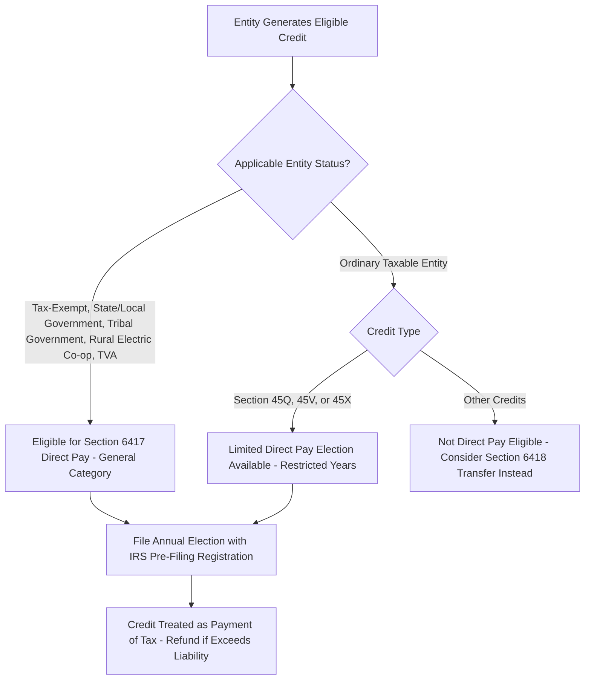

## Creation of Elective Pay Under Section 6417

### Overview and Legislative Origin

The Inflation Reduction Act of 2022 created new IRC §6417, establishing an "elective pay" (commonly called "direct pay") mechanism allowing certain tax-exempt and governmental entities to treat specified federal income tax credits as a refundable payment against tax liability, effectively making the credit refundable to entities that would otherwise have no taxable income against which to apply it. This addressed a longstanding structural gap in federal renewable energy tax policy: because tax credits are, by design, only valuable to entities with tax liability to offset, tax-exempt organizations, state and local governments, tribal governments, and rural electric cooperatives had historically been unable to directly benefit from the ITC or PTC, forcing them into complex third-party ownership, lease, or power purchase structures simply to access indirect economic value from credits they could never claim themselves.

### Eligible Entities

**Key Points**

- Section 6417 elective pay is available to a defined category of "applicable entities," including: tax-exempt organizations described in §501(a) (such as §501(c)(3) charitable organizations), states and political subdivisions thereof, the District of Columbia, U.S. territories and their political subdivisions, Indian tribal governments, Alaska Native Corporations, the Tennessee Valley Authority, and rural electric cooperatives.
- Certain other taxpayers are permitted to make a limited direct pay election for a narrower subset of credits (most notably §45Q carbon oxide sequestration, §45V clean hydrogen, and §45X advanced manufacturing production credits) for a limited number of years, reflecting a more targeted extension of direct pay treatment to specific technology-development priorities rather than the general applicable-entity category.
- This eligibility structure is intentionally narrower than the universal availability of transferability under the companion §6418 mechanism, meaning the two provisions are generally structured as complementary rather than overlapping monetization pathways: applicable entities use direct pay, while ordinary taxable entities generally use transferability if internal tax appetite is insufficient.

### Eligible Credits

**Key Points**

- Direct pay is available for a specified list of credits including the §45 production tax credit, §48 investment tax credit, §45Y clean electricity production credit, §48E clean electricity investment credit, §45Q carbon oxide sequestration credit, §45V clean hydrogen production credit, §45X advanced manufacturing production credit, §30C alternative fuel vehicle refueling property credit, §45W qualified commercial clean vehicles credit, and several others enumerated in the statute.
- Because most applicable entities (governments, tribes, tax-exempt organizations, rural electric cooperatives) are the natural owners of public infrastructure such as municipal solar installations, tribal wind projects, or cooperative-owned generation and transmission assets, the §45/§48/§45Y/§48E generation credits are of particular practical significance for direct pay elections in the renewable energy context.

### Mechanics of the Elective Pay Election

**Key Points**

- An applicable entity must complete a mandatory IRS pre-filing registration process for each applicable credit property before making a direct pay election, obtaining a registration number that must be included on the return on which the election is made.
- The election is made on an annual basis on the entity's federal income tax return (or, for entities not otherwise required to file, on the return the entity would file if it were subject to tax), meaning direct pay is not a one-time election but must be affirmatively renewed each taxable year for each applicable credit property, generally for the duration of the credit period (e.g., each of the 10 years of the §45Y PTC period).
- Once properly elected, the credit is treated as a payment of federal income tax made by the applicable entity in the amount of the credit, functioning similarly to a withholding or estimated tax payment — if the deemed payment exceeds the entity's actual tax liability (which for most applicable entities, having no taxable income, means the full credit amount), the excess is refunded to the entity.
- The direct pay mechanism is therefore economically equivalent to a cash grant equal to the credit amount for entities with no offsetting tax liability, though it is structured technically as a tax payment and refund rather than as a grant program.

### Basis Reduction and Recapture for Direct Pay Elections

**Key Points**

- Applicable entities electing direct pay for the ITC under §48/§48E remain subject to the same §50(c) basis reduction rules that apply to any ITC claimant, reducing the property's basis by one-half of the credit amount determined, notwithstanding that the entity is tax-exempt and would not otherwise use depreciation deductions for its own tax purposes (though basis matters for other purposes, including any future disposition).
- Direct pay elections remain subject to the same five-year ITC recapture rules under §50(a) that apply to any ITC claim: if the underlying property is disposed of, or ceases to be investment credit property, within the recapture period, a portion of the direct-pay refund received must be repaid to the government.
- Direct pay claims are also subject to an excessive payment penalty regime: if the IRS determines that an applicable entity received a direct pay amount in excess of the amount it was entitled to claim, the entity is generally liable for repayment of the excessive portion plus a 20% penalty, absent reasonable cause.

### Interaction with Prevailing Wage and Apprenticeship Requirements

**Key Points**

- Applicable entities electing direct pay remain subject to the same prevailing wage and apprenticeship (PWA) requirements that govern the bonus rate for taxable direct claimants — satisfying PWA (or qualifying for an applicable exception such as the under-1-megawatt exception) is required to access the five-times bonus rate (30% ITC / 1.5 cents-kWh PTC) rather than the base rate, regardless of the entity's tax-exempt or governmental status.
- This means municipal utilities, tribal governments, and other applicable entities pursuing direct pay for a renewable energy project must engage in the same PWA compliance documentation and recordkeeping processes as any taxable project sponsor seeking the bonus rate.

### Practical Applications for Public Power and Cooperative Utilities

**Key Points**

- Direct pay has been particularly significant for public power utilities, municipal governments, and rural electric cooperatives building or acquiring renewable generation and storage assets, since these entities previously had no direct mechanism to access ITC or PTC value and instead relied on complex third-party ownership structures (such as a taxable developer owning and operating a facility under a long-term power purchase agreement with the public entity) purely to enable a taxable party to monetize the credit.
- With direct pay, a municipal utility or cooperative can now directly own a solar or wind facility, elect direct pay, and receive a cash refund equal to the credit amount, substantially simplifying project structuring and potentially improving overall project economics by eliminating the layer of tax equity or ownership complexity previously required.
- [Inference] The precise magnitude of cost savings or structural simplification from direct pay relative to a legacy third-party-ownership PPA structure is project- and entity-specific, depending on financing costs, the entity's creditworthiness, and the terms that would otherwise have been available in a comparable third-party arrangement; this is a case-by-case financial modeling question rather than a generalizable rule.

### Interaction with Tax-Exempt Bond Financing

**Key Points**

- Special coordination rules apply where an applicable entity finances a direct-pay-eligible facility in part with proceeds of tax-exempt bonds: the statute reduces the amount of credit (and correspondingly the direct pay amount) to account for the proportion of the facility financed with tax-exempt bond proceeds, reflecting a policy concern about "double-dipping" between two federal subsidies (tax-exempt financing and a refundable credit) on the same capital expenditure.
- [Inference] The specific reduction formula and its interaction with different categories of tax-exempt financing (private activity bonds versus governmental bonds, for example) involves technical computational rules that require careful modeling for any applicable entity combining direct pay with tax-exempt bond proceeds; a detailed numerical illustration would require assuming specific facts not generalizable across transactions.

### Comparison to Section 6418 Transferability

**Key Points**

- Direct pay and transferability are structured as distinct, largely non-overlapping pathways: direct pay is available to a defined category of applicable entities (with a narrow additional carve-out for certain taxable entities claiming specific credits like §45Q, §45V, and §45X), while transferability under §6418 is broadly available to essentially any other eligible taxpayer.
- Direct pay results in an actual cash refund from the IRS, whereas transferability results in cash received from a private-market transferee at a negotiated (generally discounted) price — meaning direct pay claimants generally realize the full face value of the credit (subject to basis reduction and recapture exposure) without the pricing discount inherent in a private transfer transaction.
- Because most applicable entities have no taxable income and therefore no beneficial use for a non-refundable credit, direct pay is functionally the only viable monetization pathway for these entities, whereas taxable entities generally choose between retaining and using the credit directly, transferring it under §6418, or pursuing a traditional tax equity structure depending on their own tax appetite and cost-of-capital considerations.

### Common Pitfalls

- Failing to complete the mandatory IRS pre-filing registration process before attempting to make a direct pay election, which is a precondition to a valid election.
- Treating direct pay as a one-time election rather than an annual election that must be renewed for each taxable year within the credit period.
- Overlooking that direct pay claimants remain subject to §50(c) basis reduction and §50(a) recapture rules despite their tax-exempt or governmental status.
- Failing to satisfy prevailing wage and apprenticeship requirements (or qualify for an applicable exception) before assuming the bonus rate applies to a direct pay claim.
- Neglecting to account for the tax-exempt bond financing coordination rule when a facility is partly financed with tax-exempt bond proceeds, resulting in an overstated direct pay claim and potential exposure to the excessive payment penalty.

**Related Topics**

- Section 6418 Transferability Mechanics and Comparison to Direct Pay
- Mandatory Pre-Filing Registration Requirements for Elective Payment Elections
- Section 50(a) Recapture Rules Applied to Direct Pay Claimants
- Prevailing Wage and Apprenticeship Compliance for Applicable Entities
- Tax-Exempt Bond Financing Coordination Rules Under Section 6417
- Excessive Payment Penalties Under Section 6417
- Public Power and Rural Electric Cooperative Project Structuring