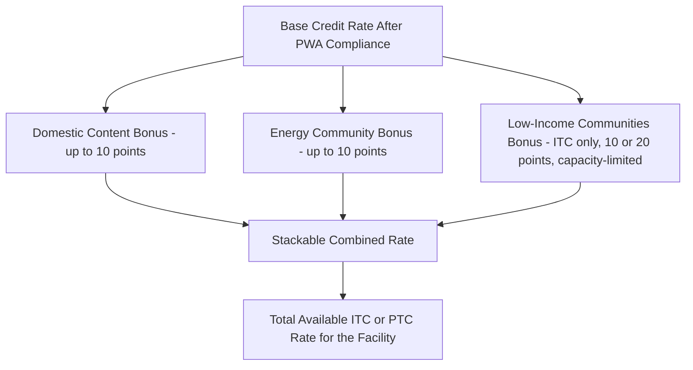
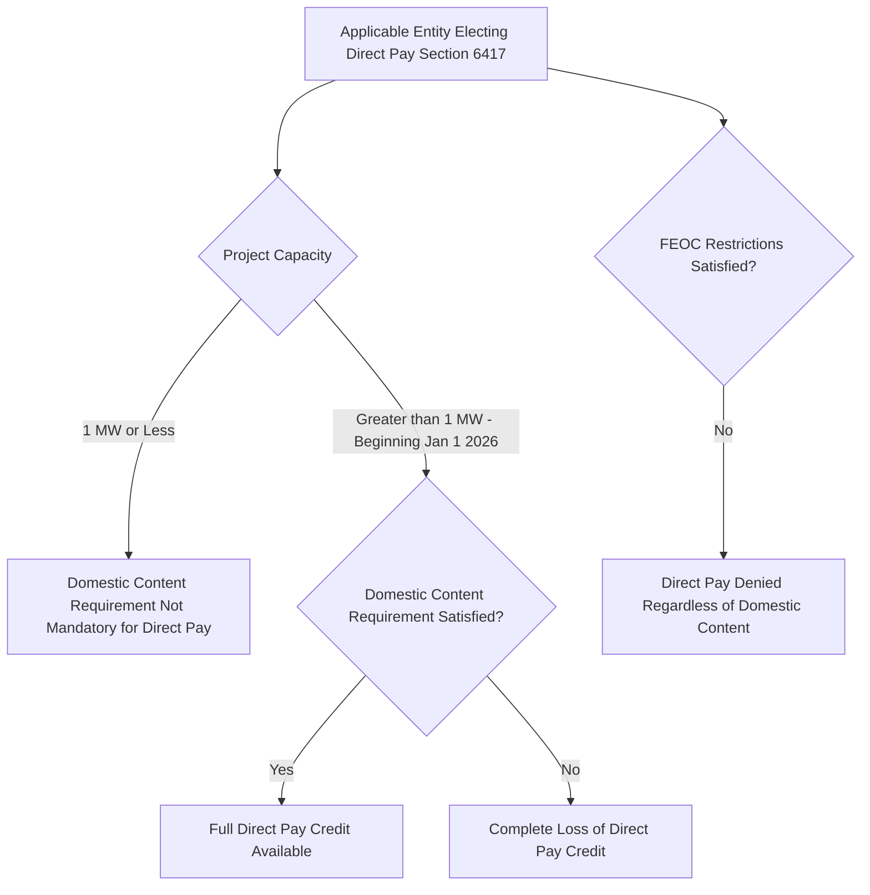

## Original Design of the Bonus Adders

### Overview

The Inflation Reduction Act of 2022 introduced three stackable bonus credit adders designed to layer additional policy objectives — domestic manufacturing, support for fossil-fuel-dependent communities, and equitable access to clean energy investment — on top of the base ITC and PTC framework. These bonus adders were structured to apply consistently across both the legacy §45/§48 credits and the newly created technology-neutral §45Y/§48E credits, and their basic percentage structure has been preserved even as subsequent guidance and the 2025 OBBBA amendments have modified surrounding eligibility and administrative rules. This item addresses the original 2022 statutory design of each adder; where current guidance has refined or altered the mechanics, that is noted for context.

### The Three-Adder Framework

**Key Points**

- The IRA created three distinct bonus adders: the domestic content bonus, the energy community bonus, and the low-income communities bonus, each independently available and, subject to specific stacking rules, combinable with one another and with the base prevailing wage and apprenticeship (PWA) bonus rate.
- Each adder was designed to advance a specific, distinct policy objective: domestic content promotes U.S. manufacturing supply chains; the energy community bonus supports economic transition in areas historically dependent on fossil fuel extraction or generation; and the low-income communities bonus promotes equitable access to the economic benefits of clean energy investment in underserved areas.
- All three adders apply to both the investment tax credit (under §48 and its technology-neutral successor §48E) and the production tax credit (under §45 and its technology-neutral successor §45Y), reflecting the IRA's general design goal of applying consistent bonus mechanics across the two primary credit vehicles.

### Domestic Content Bonus Credit: Original Design

**Key Points**

- The domestic content bonus is a two-tiered requirement: first, 100% of the steel or iron used in the facility's structural components must be produced in the United States; second, a specified percentage of the total cost of the facility's manufactured products must reflect components mined, produced, or manufactured domestically — originally set at 40% for most facilities (20% for offshore wind facilities), with the percentage threshold scheduled to increase in later years under the statute's original design.
- As originally designed, satisfying the domestic content requirement increases the ITC rate by an additional 10 percentage points (for example, from a 30% base-bonus rate to 40%) or increases the calculated PTC amount by 10%.
- IRS Notice 2023-38 established the original two-step methodology for the domestic content bonus: taxpayers must first determine which components are "steel or iron" (subject to the 100% domestic requirement) versus "manufactured products" (subject to the percentage-cost test), and then compute the direct cost (materials and labor) of domestic versus non-domestic manufactured product components to determine whether the applicable percentage threshold is satisfied.
- In practice, the domestic content bonus has proven to be one of the more difficult adders to qualify for and substantiate, since the manufactured product cost test requires developers to obtain actual, verified material and labor cost data from manufacturers and suppliers — information that is not always readily available or willingly disclosed by supply chain participants, creating practical financing and certification challenges.

**Example**

A wind facility satisfying both the PWA bonus rate and domestic content requirements, but not located in an energy community or eligible for the low-income adder:

$$ITC\ Rate = 30\%\ (PWA\ bonus\ base) + 10\%\ (domestic\ content) = 40\%$$

### Elective Safe Harbor Simplification

**Key Points**

- Recognizing the practical difficulty of the direct cost verification approach, Treasury and the IRS subsequently issued an elective safe harbor (introduced in Notice 2024-41 and later updated) providing pre-calculated, standardized cost percentage assumptions for common categories of solar (fixed-tilt, tracking, rooftop) and energy storage (grid-scale, distributed) projects, allowing taxpayers to rely on published percentage tables rather than independently sourcing granular manufacturer cost data for every component.
- This elective safe harbor represents an important administrative refinement to the original 2022 statutory design, substantially easing the compliance burden for common, standardized project configurations, though taxpayers retain the option to use the original direct-cost methodology if it produces a more favorable result for their specific supply chain.

### Energy Community Bonus Credit: Original Design

**Key Points**

- The energy community bonus, as originally designed, provides an additional 10 percentage points to the ITC rate (or a corresponding 10% increase to the PTC amount) for facilities located in one of three statutorily defined categories of "energy community": (1) a brownfield site; (2) a metropolitan or non-metropolitan statistical area that has (or, at any time after 2009, had) 0.17% or greater direct employment or 25% or greater local tax revenues related to the extraction, processing, transport, or storage of coal, oil, or natural gas, and that has an unemployment rate at or above the national average for the preceding year; or (3) a census tract (or directly adjoining census tract) in which a coal mine closed after 1999 or a coal-fired electric generating unit was retired after 2009.
- The energy community bonus was designed to be geographically determined and updated periodically, since statistical area unemployment rates and qualifying census tract lists change from year to year, requiring the IRS to issue annual (or periodic) updated lists of qualifying areas rather than fixing eligibility permanently at enactment.
- Subsequent IRS guidance, including Notice 2024-30 and Notice 2024-48, expanded and clarified the categories of qualifying projects and refined the methodology for determining statistical area and census tract eligibility under the original statutory framework.

### Low-Income Communities Bonus Credit: Original Design

**Key Points**

- The low-income communities bonus, codified at §48(e) (an ITC-specific provision without a direct, identically structured PTC analogue), was designed as a capacity-limited, competitively allocated adder rather than a self-executing bonus available to any qualifying facility.
- As originally designed, the adder applies only to solar and wind facilities with a maximum net output of less than 5 megawatts (alternating current), and provides a 10 percentage point bonus for facilities located in low-income communities or on Indian land, or a larger 20 percentage point bonus for facilities that are part of a qualified low-income residential building project or a qualified low-income economic benefit project.
- The statute directed the Treasury Department to establish an annual capacity allocation program (administered jointly with the Department of Energy), under which qualifying facilities must apply for and receive an allocation of limited program capacity before claiming the bonus — a materially different administrative mechanism from the domestic content and energy community bonuses, which are self-certified and self-executing at the point of tax filing without a competitive application process.
- [Inference] Because the low-income communities bonus program capacity is limited and allocated competitively on an annual basis, the practical availability of this specific adder for any given qualifying project depends on the outcome of that year's allocation round rather than being guaranteed simply by satisfying the underlying geographic or project-type eligibility criteria; this distinguishes it meaningfully from the other two, non-competitive adders.

### Interaction with Direct Pay Phaseout Rules

**Key Points**

- The original IRA design included statutory phaseout provisions reducing the direct pay (elective payment) amount available to an applicable entity under §6417 if domestic content requirements were not satisfied, subject to certain statutory exceptions (including a small-project exception and a materials-cost-increase exception) and a transition period during which the phaseout was not immediately enforced.
- Subsequent OBBBA-era guidance has tightened this interaction further: beginning January 1, 2026, public sector projects over 1 megawatt capacity seeking direct pay generally must meet domestic content requirements or face a complete loss of the direct pay credit, a materially more stringent consequence than the original graduated phaseout percentage design, in addition to newly applicable FEOC requirements.

### Stacking Mechanics and Maximum Combined Rate

**Key Points**

- As originally designed, a project satisfying the PWA bonus base rate, domestic content, and the energy community bonus could reach an ITC rate as high as 50% (30% + 10% + 10%), before consideration of the separate, capacity-limited low-income communities adder, which could push the total rate even higher for a qualifying small-scale project receiving a capacity allocation.
- The domestic content and energy community bonuses continue to be available at their original 10-percentage-point levels under current law, notwithstanding the broader OBBBA restructuring of phase-out timelines and the introduction of new FEOC restrictions — meaning the fundamental percentage-point value of these two adders has remained a point of continuity across the 2022-to-present legislative and regulatory evolution, even as surrounding eligibility windows and administrative requirements have changed.

### Common Pitfalls

- Assuming the domestic content bonus can be satisfied through self-certification alone without underlying documentation of manufacturer-level material and labor costs (absent reliance on the elective safe harbor).
- Treating the energy community bonus geographic determination as static, when qualifying statistical areas and census tracts are subject to periodic updates based on changing unemployment data and newly closed coal facilities.
- Assuming the low-income communities bonus is self-executing like the other two adders, rather than recognizing it as a competitively allocated, capacity-limited program requiring a successful annual application.
- Overlooking the tightened domestic content-to-direct-pay interaction for public sector projects over 1 megawatt beginning in 2026, which can result in complete loss (rather than graduated reduction) of the direct pay credit.
- Failing to distinguish the original direct-cost domestic content compliance methodology from the newer elective safe harbor, potentially leading to a more burdensome compliance approach than necessary for standardized project types.

**Related Topics**

- Prevailing Wage and Apprenticeship Requirements and the Five-Times Bonus Multiplier
- Domestic Content Elective Safe Harbor Cost Percentage Tables
- Energy Community Statistical Area and Census Tract Determination Methodology
- Low-Income Communities Bonus Capacity Allocation Program Administration
- Section 6417 Direct Pay Phaseout Rules and Domestic Content Interaction
- Foreign Entity of Concern Restrictions Affecting Bonus Adder Eligibility
- Technology-Neutral Credit Regime Under Sections 45Y and 48E