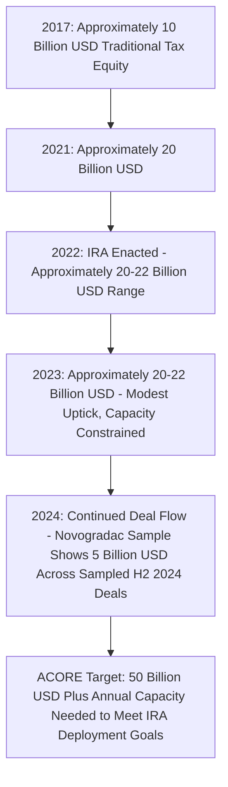
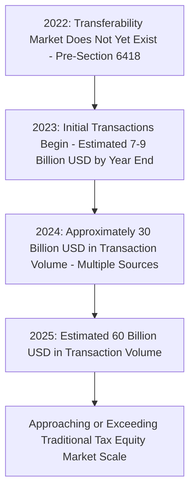

## Deal Volume and Market Growth from 2022 to 2025

### Overview

The period from the enactment of the Inflation Reduction Act (IRA) in August 2022 through 2025 saw substantial growth in the overall market for monetizing renewable energy tax credits, driven both by expansion of the traditional tax equity market and by the emergence of an entirely new transferable tax credit market enabled by §6418. Market size estimates in this space vary considerably depending on methodology, data source, and whether the estimate reflects announced transactions, closed transactions, or full-market extrapolations from a sample; the figures below should be understood as directional and source-dependent rather than as a single authoritative figure.

[Unverified] Market sizing estimates in this space are produced by different research firms, banks, and trade associations using varying data collection methodologies (sampled transaction data extrapolated to the full market, aggregated deal announcements, or survey-based estimates), and figures from different sources for the same year can diverge meaningfully; the ranges cited below reflect this genuine variance in publicly available estimates rather than a single settled figure.

### Traditional Tax Equity Market: Baseline and Growth Trajectory

**Key Points**

- Prior to the IRA, the traditional tax equity market had grown from approximately $10 billion annually in 2017 to approximately $20 billion annually by 2021, reflecting the market's organic growth trajectory even before the IRA's enactment.
- Following the IRA's 2022 enactment, market participants reported the traditional tax equity market held roughly steady in the $20-22 billion annual range through 2023, with bank-side estimates from institutions such as Bank of America and JPMorgan placing 2023 traditional tax equity volume at approximately $20-22 billion — only a modest uptick from 2022 levels, reflecting that the pool of traditional tax equity investors (predominantly large banks and insurance companies) was viewed as largely capacity-constrained even as overall renewable energy financing demand grew.
- Novogradac's analysis of a sample of more than 50 clean energy transactions closing in the second half of 2024 alone represented nearly $5 billion in tax equity investment, financing over $12.1 billion in total capital expenditures and more than 5.1 gigawatts of clean energy capacity — illustrating continued substantial deal flow within the traditional tax equity channel even as the newer transferability market began to scale alongside it.
- Industry association estimates (ACORE) suggested that meeting the IRA's overall clean energy deployment goals would require the traditional tax equity market to grow from approximately $20 billion annually to over $50 billion annually, framing the traditional market's capacity constraints as a key rationale for the IRA's parallel introduction of transferability and direct pay as supplemental monetization channels.

### Emergence and Rapid Growth of the Transferable Credit Market

**Key Points**

- The transferable tax credit market did not exist in its current form prior to the IRA's 2022 enactment, since §6418 was a novel statutory creation; the first market transactions began to close in 2023 following the availability of the transfer election.
- Early market estimates projected the transferability market would reach approximately $4 billion in 2023 and $10 billion in 2024, though actual market development substantially exceeded these early projections.
- Subsequent reporting indicated the transferability market reached an estimated $7-9 billion within just the final months of 2023 alone, with some market participants projecting the market could triple by the end of 2024 — a pace of growth materially faster than initial projections anticipated.
- Multiple independent sources placed the transferable tax credit market at approximately $30 billion in transaction volume for full-year 2024, with data platform Crux specifically estimating $30 billion of tax credit transfers occurred that year — reflecting extraordinarily rapid scaling for a market segment that had only existed since mid-2023.
- One market participant characterized this growth trajectory by noting that while it took decades for the traditional tax equity market to reach roughly $20 billion in annual scale, the transferability market reached a comparable scale in approximately 15 months, illustrating the substantially lower transaction friction and broader pool of eligible transferee-participants relative to traditional tax equity partnership structures.
- Later market research estimated the renewable energy tax credit transferability market reached $60 billion in transaction volume in 2025, with projections for continued growth to approximately $72 billion in 2026 and a compound annual growth rate near 20% over the subsequent multi-year period — though such forward-looking, multi-year projections should be treated as directional estimates subject to the same source-dependent variance noted above, particularly given the significant 2025 OBBBA legislative changes affecting the underlying credits available for transfer.

### Total Addressable Market Estimates

**Key Points**

- Separate from actual closed transaction volume, several analysts produced total addressable market (TAM) estimates for the pool of potentially transferable energy tax credits — Evercore ISI, drawing on U.S. Treasury projections, estimated the total addressable market of potentially transferable energy tax credits at approximately $47 billion for 2024, while noting explicitly that not all addressable credits would ultimately be transferred in practice.
- Broader long-run cost estimates for the IRA's energy and climate provisions, including the Penn Wharton Budget Model's approximately $1.0 trillion estimate for the 2023-2032 window (with roughly $561 billion of that total attributable specifically to transferable tax credits), illustrate the scale of the underlying credit pool from which actual market transaction volume is drawn, though realized transaction volume in any given year represents only a fraction of the full multi-year addressable pool.
- [Unverified] These aggregate, multi-year cost and addressable-market estimates rely on assumptions about future project development pace, credit utilization rates, and policy stability that are inherently uncertain, and were also produced before the 2025 OBBBA materially altered the phase-out timelines and eligibility rules for several of the underlying credits; such projections should be treated as illustrative of scale rather than as reliable point forecasts, especially for years following the OBBBA's enactment.

### Notable Transactions and Market Composition

**Key Points**

- Bank of America's August 2023 purchase of $580 million in wind-energy tax credits from a $1.5 billion portfolio of Invenergy renewable projects was among the early, larger transactions helping establish market pricing and structural norms for the nascent transferability market.
- Multiple $100 million-plus transfer transactions closed in subsequent periods involving utility-scale developers including Avangrid and Recurrent Energy, reflecting the market's rapid maturation toward larger, more institutionally structured deals.
- The Section 45X advanced manufacturing production credit emerged as a significant component of transfer market volume, with manufacturers such as First Solar announcing transactions to sell up to $700 million worth of production tax credits — illustrating that transferability volume growth was driven not only by generation-side credits (§45/§48/§45Y/§48E) but substantially by the newly created manufacturing credit as well.
- Market composition showed a trend toward diversification over the 2023-2024 period: while wind and solar dominated the earliest transferability transactions, later data showed an increasingly diverse mix of technologies and credit types (including advanced manufacturing) contributing to overall transfer volume.

### Complementary Rather Than Substitutive Relationship

**Key Points**

- Multiple industry sources emphasize that transferability has developed as largely complementary to, rather than a wholesale replacement for, traditional tax equity — because a transfer transaction does not allow the transferee to also monetize the substantial accelerated depreciation benefits associated with renewable energy property (which industry estimates suggest typically adds value equal to 10-20% of total project value), sponsors seeking to monetize both credits and depreciation often continue to rely on traditional tax equity partnership structures, or increasingly, on hybrid structures that combine a tax equity partnership for depreciation monetization with a separate transfer transaction for a portion of the credit.
- Traditional tax equity investors typically also provide capital certainty across the full multi-year credit period (particularly significant for the 10-year PTC), whereas the transfer market has historically focused predominantly on monetizing current-year tax credits, representing a further structural distinction that has supported continued coexistence of both monetization channels rather than one fully displacing the other.
- Research cited by industry trade associations suggests each dollar of federal energy tax credit has been associated with approximately five dollars of private sector investment, illustrating the broader capital formation multiplier effect attributed to the combined tax equity and transferability market growth over the 2022-2025 period.

### Impact of the 2025 OBBBA on Market Trajectory

**Key Points**

- The significant changes to credit eligibility, phase-out timelines, and foreign entity restrictions introduced by the OBBBA in mid-2025 (detailed elsewhere in this chapter) represent a material inflection point for market growth projections made prior to that legislation's enactment, particularly for wind and solar-specific transaction volume given the compressed beginning-of-construction and placed-in-service deadlines imposed on those technologies.
- [Inference] Because most 2022-2024 market growth and 2025-and-beyond projections were published before or shortly after the OBBBA's enactment and reflect varying degrees of incorporation of its effects, current-year and forward-looking deal volume figures should be treated with particular caution and cross-checked against the most recent available market data, since the compressed wind/solar timelines and new FEOC restrictions could plausibly redirect (rather than simply reduce) volume toward other technologies with longer statutory runways, such as geothermal, storage, and other non-wind/solar generation.

### Common Pitfalls

- Treating any single market size estimate as authoritative without recognizing the substantial methodological variance across sources (extrapolated samples, aggregated announcements, survey-based bank estimates).
- Conflating traditional tax equity market volume with transferable credit market volume, which are distinct (though increasingly interconnected via hybrid structures) financing channels with different growth trajectories.
- Assuming pre-OBBBA market growth projections for 2025 and beyond remain accurate without accounting for the significant 2025 legislative changes to wind and solar credit eligibility timelines.
- Overlooking that transferability transactions do not monetize depreciation, which remains a significant driver of continued traditional tax equity demand even as transfer volume has grown rapidly.
- Citing total addressable market or long-run cost projections as if they represented actual realized annual transaction volume, when these are distinct analytical concepts.

**Related Topics**

- Hybrid Structures Combining Tax Equity Partnerships and Credit Transfers
- Section 45X Advanced Manufacturing Production Credit Transfer Market Dynamics
- Pricing Mechanics and Risk Premiums in the Transferable Credit Market
- Traditional Tax Equity Investor Capacity Constraints and Bank Balance Sheet Limits
- Impact of OBBBA Phase-Out Timelines on Wind and Solar Deal Volume
- Depreciation Monetization Gap in Transfer-Only Structures
- Market Data Providers and Transaction Intelligence Platforms in Tax Credit Finance