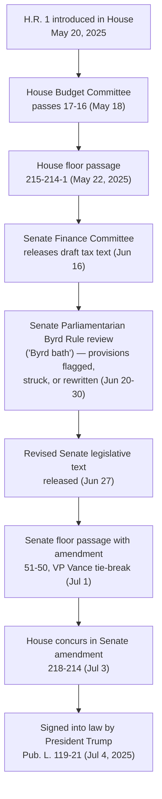

## Legislative History and the July 2025 Enactment

### Statutory Identity and Citation

The One Big Beautiful Bill Act (OBBBA) — also referred to informally as OBBB or the "Big Beautiful Bill" — is the popular short title for a federal budget reconciliation statute. Its long title is "An Act to provide for reconciliation pursuant to title II of H. Con. Res. 14," and it was enacted by the 119th United States Congress. [Wikipedia](https://en.wikipedia.org/wiki/One_Big_Beautiful_Bill_Act)

- **Public Law**: Pub. L. 119-21
- **Statutes at Large**: 139 Stat. 72 [Wikipedia](https://en.wikipedia.org/wiki/One_Big_Beautiful_Bill_Act)
- **Codification**: Amends the Tax Cuts and Jobs Act (TCJA) of 2017 [Wikipedia](https://en.wikipedia.org/wiki/One_Big_Beautiful_Bill_Act)
- **Official short title**: None. Although popularly known as the One Big Beautiful Bill Act, this short title was formally struck during the Senate amendment process, so the law carries no official short title in the U.S. Code. [Wikipedia](https://en.wikipedia.org/wiki/One_Big_Beautiful_Bill_Act)

For practitioners in Tax Equity & Incentives, this naming quirk matters practically: citations in IRS guidance, Treasury regulations, and professional literature may reference "P.L. 119-21" rather than "OBBBA" in formal contexts, even though OBBBA remains the near-universal working name.

### Reconciliation as the Legislative Vehicle

OBBBA was not an ordinary bill — it was structured as a **budget reconciliation package**, a procedural vehicle authorized under the Congressional Budget Act of 1974 that allows certain budget-related legislation to pass the Senate with a simple majority, bypassing the 60-vote cloture threshold otherwise required to overcome a filibuster.

**Key structural facts:**

- The bill consolidated policy priorities from 10 Senate committees into a single, sweeping legislative framework. [Holland & Knight](https://www.hklaw.com/en/insights/publications/2025/07/the-one-big-beautiful-bill-act-a-comprehensive-analysis)
- Because reconciliation bypasses the filibuster, it allowed a Senate Republican majority to pass the bill without needing Democratic support or votes. [kbkg](https://www.kbkg.com/feature/whats-happening-with-the-one-big-beautiful-bill)
- In exchange for that procedural advantage, the Byrd Rule requires that every provision directly affect the federal budget — either by changing spending or revenue. Provisions that fail this test require 60 votes to remain in the bill or must be stripped out. [kbkg](https://www.kbkg.com/feature/whats-happening-with-the-one-big-beautiful-bill)
- Under the Byrd Rule, provisions that produce no change in outlays or revenues, or where the change is merely "incidental," are barred from reconciliation bills; provisions that increase the deficit outside the 10-year budget window are also prohibited. [thomsonreuters](https://tax.thomsonreuters.com/news/what-to-watch-as-the-senate-takes-up-trumps-tax-and-spending-bill/)

This procedural constraint is the single most important fact for understanding *why* the final tax-equity provisions in OBBBA look the way they do: many original House-passed energy and incentive provisions were rewritten, narrowed, or removed entirely — not because of policy disagreement alone, but because the Senate Parliamentarian ruled them extraneous to the budget under Byrd Rule analysis.

### The Byrd Bath: Parliamentarian Review of Energy and Tax-Equity Provisions

The Byrd Rule analysis proceeds section-by-section: if a specific provision cannot survive the 60-vote hurdle, only that offending provision is stripped, not the whole bill. This process — colloquially called the "Byrd bath" — is highly consequential for tax equity and clean energy credit provisions, since several were flagged. [thomsonreuters](https://tax.thomsonreuters.com/news/what-to-watch-as-the-senate-takes-up-trumps-tax-and-spending-bill/)

**[Verified] Provisions specifically challenged or struck during Senate review (June 2025):**

- A provision deeming offshore oil and gas projects "automatically compliant" with the National Environmental Policy Act was ruled non-compliant with the Byrd Rule and would have required 60 votes to remain. [esgdive](https://www.esgdive.com/news/senate-budget-negotiations-ira-solar-tax-credits-bbb-trump/751763/)
- A provision removing the Secretary of the Interior's discretion to reduce fees for solar and wind projects on Bureau of Land Management land was also flagged as a Byrd Rule violation. [esgdive](https://www.esgdive.com/news/senate-budget-negotiations-ira-solar-tax-credits-bbb-trump/751763/)
- A provision enabling companies to pay to opt out of the standard environmental permit review process was ruled to require 60 votes rather than a simple majority. [ajot](https://www.ajot.com/news/us-senate-parliamentarian-says-oil-gas-projects-cant-skirt-environmental-review)
- A proposed rollback of EPA emissions limits for medium- and heavy-duty vehicles was similarly ruled ineligible for simple-majority passage. [ajot](https://www.ajot.com/news/us-senate-parliamentarian-says-oil-gas-projects-cant-skirt-environmental-review)
- Other flagged provisions unrelated to energy directly (e.g., private school vouchers, a religious college carve-out from the endowment tax) were ruled in violation and made subject to the 60-vote point of order. [ey](https://taxnews.ey.com/news/2025-1367-what-to-expect-in-washington-june-27)
- Provisions still under review as of late June 2025 included the permanence of the Opportunity Zones program and foreign-entity-of-concern restrictions tied to the clean electricity production credit — both directly relevant to tax-equity structuring. [ey](https://taxnews.ey.com/news/2025-1367-what-to-expect-in-washington-june-27)

**[Inference]** Because the Parliamentarian's rulings are not always fully documented in a single consolidated public source, practitioners should treat the exact disposition of any single flagged provision (kept, modified, or stripped) as requiring verification against the enrolled bill text and the final conference/floor amendments, rather than against mid-process news coverage.

### Full Procedural Timeline

- **May 20, 2025**: Introduced in the House as H.R. 1 by Rep. Jodey Arrington (R-TX) [Wikipedia](https://en.wikipedia.org/wiki/One_Big_Beautiful_Bill_Act)
- **May 18, 2025**: Passed House Budget Committee, 17-16 [Wikipedia](https://en.wikipedia.org/wiki/One_Big_Beautiful_Bill_Act)
- **May 22, 2025**: Passed the House, 215-214-1 [Wikipedia](https://en.wikipedia.org/wiki/One_Big_Beautiful_Bill_Act)
- **June 16, 2025**: Senate Finance Committee Chairman Mike Crapo (R-ID) released the Committee's draft reconciliation tax text [deloitte](https://dhub.deloitte.com/Newsletters/Tax/2025/TNV/250628_1.html)
- **June 27, 2025**: Senate released a revised version of the full legislative text incorporating Byrd Rule feedback [Tax Foundation](https://taxfoundation.org/research/all/federal/big-beautiful-bill-senate-gop-tax-plan/)
- **July 1, 2025**: Passed the Senate, 51-50, with Vice President J.D. Vance casting the tie-breaking vote, with amendment [Wikipedia](https://en.wikipedia.org/wiki/One_Big_Beautiful_Bill_Act)
- **July 3, 2025**: House agreed to the Senate amendment, 218-214 [Wikipedia](https://en.wikipedia.org/wiki/One_Big_Beautiful_Bill_Act)
- **July 4, 2025**: Signed into law by President Donald Trump [Wikipedia](https://en.wikipedia.org/wiki/One_Big_Beautiful_Bill_Act)

**Timeline visualization (svg_diagram):**

<svg xmlns="http://www.w3.org/2000/svg" viewBox="0 0 900 340">
<text x="450" y="28" text-anchor="middle" font-family="sans-serif" font-size="18" font-weight="bold" fill="#1a1a1a">OBBBA Legislative Timeline — 2025 (svg_diagram)</text>
<line x1="60" y1="170" x2="840" y2="170" stroke="#888" stroke-width="2" />

<circle cx="90" cy="170" r="8" fill="#2563eb" />
<text x="90" y="150" text-anchor="middle" font-family="sans-serif" font-size="12" font-weight="bold">May 20</text>
<text x="90" y="200" text-anchor="middle" font-family="sans-serif" font-size="11">H.R. 1</text>
<text x="90" y="214" text-anchor="middle" font-family="sans-serif" font-size="11">introduced</text>

<circle cx="220" cy="170" r="8" fill="#2563eb" />
<text x="220" y="150" text-anchor="middle" font-family="sans-serif" font-size="12" font-weight="bold">May 22</text>
<text x="220" y="200" text-anchor="middle" font-family="sans-serif" font-size="11">House passes</text>
<text x="220" y="214" text-anchor="middle" font-family="sans-serif" font-size="11">215-214-1</text>

<circle cx="380" cy="170" r="8" fill="#d97706" />
<text x="380" y="150" text-anchor="middle" font-family="sans-serif" font-size="12" font-weight="bold">Jun 16-27</text>
<text x="380" y="200" text-anchor="middle" font-family="sans-serif" font-size="11">Senate Finance draft +</text>
<text x="380" y="214" text-anchor="middle" font-family="sans-serif" font-size="11">"Byrd bath" review</text>

<circle cx="540" cy="170" r="8" fill="#2563eb" />
<text x="540" y="150" text-anchor="middle" font-family="sans-serif" font-size="12" font-weight="bold">Jul 1</text>
<text x="540" y="200" text-anchor="middle" font-family="sans-serif" font-size="11">Senate passes</text>
<text x="540" y="214" text-anchor="middle" font-family="sans-serif" font-size="11">51-50 (Vance breaks tie)</text>

<circle cx="680" cy="170" r="8" fill="#2563eb" />
<text x="680" y="150" text-anchor="middle" font-family="sans-serif" font-size="12" font-weight="bold">Jul 3</text>
<text x="680" y="200" text-anchor="middle" font-family="sans-serif" font-size="11">House concurs</text>
<text x="680" y="214" text-anchor="middle" font-family="sans-serif" font-size="11">218-214</text>

<circle cx="810" cy="170" r="10" fill="#16a34a" />
<text x="810" y="150" text-anchor="middle" font-family="sans-serif" font-size="12" font-weight="bold">Jul 4</text>
<text x="810" y="200" text-anchor="middle" font-family="sans-serif" font-size="11" font-weight="bold">Signed into law</text>
<text x="810" y="214" text-anchor="middle" font-family="sans-serif" font-size="11">Pub. L. 119-21</text>
<rect x="60" y="250" width="780" height="60" rx="6" fill="#f3f4f6" stroke="#ccc" />
<text x="450" y="272" text-anchor="middle" font-family="sans-serif" font-size="11" font-style="italic">Reconciliation vehicle: simple-majority Senate passage traded for Byrd Rule constraint —</text>
<text x="450" y="290" text-anchor="middle" font-family="sans-serif" font-size="11" font-style="italic">every provision must have a direct, non-incidental budgetary effect within the 10-year window.</text>
</svg>

### Process Flow: Bill to Statute

### Why This Process Matters for Tax Equity Practitioners

The reconciliation/Byrd Rule mechanics are not incidental legal trivia — they directly shape how tax-equity and clean-energy incentive provisions ended up drafted in the final statute:

1. **Provisions with no direct budgetary effect could not survive intact.** Structural or regulatory changes (e.g., NEPA compliance shortcuts, permitting fee discretion) were vulnerable to being stripped regardless of their policy significance to project developers, because the Byrd Rule tests budgetary effect, not policy merit.
2. **Revenue-scored provisions (credit repeals, credit modifications, phase-outs) were the safest category to retain**, since they have a clear, direct, and non-incidental effect on federal revenue — which is precisely why clean energy tax credit repeals and modifications from the Inflation Reduction Act (IRA) survived reconciliation review while adjacent regulatory carve-outs did not.
3. **The bill's core energy-credit changes** — repealing Inflation Reduction Act tax credits for electric vehicles and renewable energy — reflect this dynamic: credit repeal is a revenue provision and thus reconciliation-eligible, whereas many of the regulatory "streamlining" provisions bundled alongside them in earlier drafts were not. [Ballotpedia](https://ballotpedia.org/One_Big_Beautiful_Bill_Act)
4. **Opportunity Zones were a notable tax-equity survivor.** The final enacted version made the Opportunity Zones incentive permanent, establishing a new cycle of 10-year tract designations beginning July 1, 2026, while tightening eligibility by removing the ability to designate contiguous tracts and limiting eligible census tracts to those with a poverty rate of at least 20 percent or median family income no greater than 70 percent of the area median. The final law also introduced a 30 percent basis boost for qualifying projects located in rural Opportunity Zones. [CARH](https://www.carh.org/the-one-big-beautiful-bill-act-signed-into-law-on-july-4-2025/)[CARH](https://www.carh.org/the-one-big-beautiful-bill-act-signed-into-law-on-july-4-2025/)

### Scale and Fiscal Context

Tax Foundation analysis estimates the major tax provisions in OBBBA will reduce federal tax revenue by nearly $5.2 trillion between 2025 and 2034 on a conventional basis, with the dynamic score (accounting for an estimated 0.7 percent increase in long-run GDP) falling to roughly $4.3 trillion. Combined with nearly $1.1 trillion in net spending reductions estimated by the Congressional Budget Office, the analysis projects OBBBA will increase federal budget deficits by $3.3 trillion from 2025 through 2034 on a dynamic basis, or roughly $4.1 trillion including higher interest costs from increased borrowing. [Tax Foundation](https://taxfoundation.org/research/all/federal/big-beautiful-bill-senate-gop-tax-plan/)[Tax Foundation](https://taxfoundation.org/research/all/federal/big-beautiful-bill-senate-gop-tax-plan/)

This scale matters directly for tax-equity practice: the size of the revenue offset required from clean-energy credit repeal and modification is a direct function of how much fiscal room the broader TCJA extension and new individual tax cuts consumed within the reconciliation instructions' budget window.

### Post-Enactment Legislative Trajectory

Following passage, House Speaker Mike Johnson signaled plans for at least two additional reconciliation packages — one in fall 2025 and another the following spring — which would again allow Republicans to bypass the 60-vote filibuster threshold. One stated purpose of a follow-up package is to potentially revive provisions that were stripped from OBBBA during the Byrd Rule process in order to clear the Senate Parliamentarian's review. [deloitte](https://www.deloitte.com/content/dam/assets-zone3/us/en/docs/services/tax/us-tax-taxnewsandviews-250711.pdf)[deloitte](https://www.deloitte.com/content/dam/assets-zone3/us/en/docs/services/tax/us-tax-taxnewsandviews-250711.pdf)

**[Inference]** For tax-equity practitioners, this signals that OBBBA should not be treated as the final word on clean-energy incentive policy for the 119th Congress; several provisions eliminated purely for procedural (Byrd Rule) reasons — rather than substantive policy rejection — remain live candidates for reintroduction in subsequent reconciliation vehicles. Monitoring subsequent reconciliation bills is therefore a standing due-diligence item for any long-horizon tax-equity investment analysis anchored to OBBBA-era credit terms.

### Research and Reference Resources

A comprehensive six-volume legislative history of Public Law No. 119-21, tracing the law's development from introduction to enactment, has been compiled and is included in HeinOnline's U.S. Federal Legislative History Library, with each title indexed at the document level and fully searchable — covering bill versions, congressional debates, committee reports, and hearings. This is the appropriate primary-source research tool when a specific provision's drafting history (e.g., why a particular energy credit modification took its final form) needs to be traced back to committee markup or floor debate. [HeinOnline Blog](https://heinonline.com/blog/2026/05/a-closer-look-at-the-one-big-beautiful-bill-new-legislative-history-in-heinonline/)

**Related Topics:**

- The Byrd Rule and reconciliation instructions in detail (mechanics of "extraneous" provision tests)
- Repeal and phase-out schedule for IRA-era clean energy credits (§45, §48, §45X, §30D, §25D) under OBBBA
- Opportunity Zones under OBBBA: permanent authorization, rural basis boost, and revised tract eligibility criteria
- Foreign Entity of Concern (FEOC) restrictions on clean electricity production and investment credits
- Comparison of House-passed (May 22) vs. Senate-passed (July 1) vs. enacted (July 4) tax-equity provisions
- Anticipated fall 2025 / spring 2026 follow-on reconciliation packages and their implications for stripped provisions
- Effective dates and transition rules for OBBBA tax-equity provisions