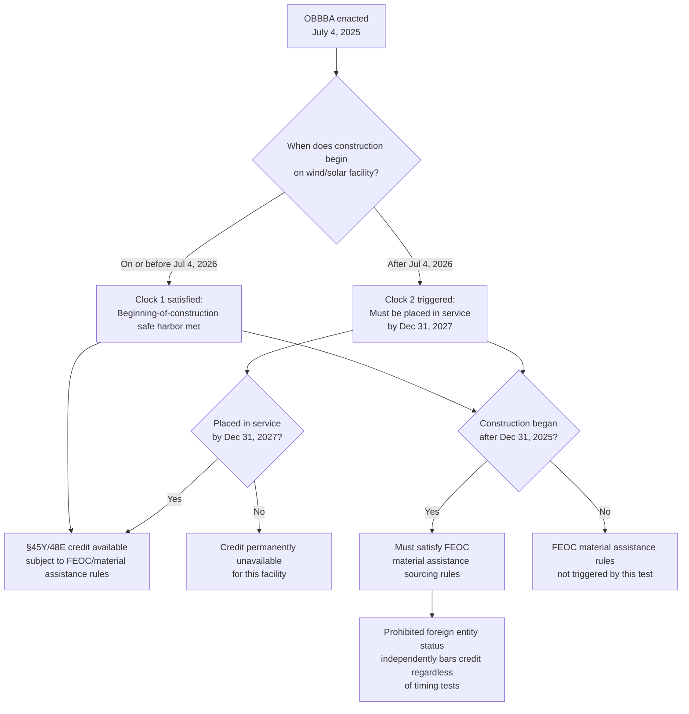

## Accelerated Phase-Out of Wind and Solar Credits

### Statutory Basis

OBBBA Section 70512 (§45Y clean electricity production credit) and Section 70513 (§48E clean electricity investment credit) impose new, accelerated termination rules specific to wind and solar generation facilities, replacing the Inflation Reduction Act's original technology-neutral phase-out schedule for these two technologies. The OBBBA retains the core structure of §§45Y and 48E but layers wind- and solar-specific termination dates on top, while other technologies (geothermal, hydrogen, nuclear, energy storage, fuel cells) remain on a separate, less aggressive schedule.

### The Two-Clock Termination Test

For "applicable wind facilities" and "applicable solar facilities," the statute establishes a two-part, either/or eligibility test — commonly described as a two-clock structure:

**Clock 1 — Beginning-of-construction safe harbor:**

If construction begins on or before **July 4, 2026** (12 months after the July 4, 2025 enactment date — some IRS guidance and court filings cite July 5, 2026 due to statutory day-counting conventions), the facility is not subject to the placed-in-service deadline and can qualify for the credit under the pre-existing general framework (subject to other OBBBA changes such as FEOC rules).

**Clock 2 — Placed-in-service deadline:**

If construction begins **after** July 4, 2026, the facility must be placed in service before **January 1, 2028** (i.e., by December 31, 2027) to qualify for the §45Y or §48E credit. Missing this placed-in-service deadline means the credit is unavailable for that facility entirely — there is no partial or phased value.

**[Verified] Formal statutory framing:** the credit termination date (facilities placed in service after December 31, 2027) applies specifically to applicable wind and solar facilities the construction of which begins after the July 5, 2026 beginning-of-construction deadline.

This is a sharp structural departure from pre-OBBBA law, where the IRA's technology-neutral §45Y/48E credits allowed beginning-of-construction dates through 2033, with phase-out tied to the later of a fixed year or when U.S. electricity-sector greenhouse gas emissions fell to 25 percent of 2022 levels. Wind and solar are now removed from that general schedule and placed on the accelerated, date-certain two-clock test.

### Contrast: General Technology-Neutral Schedule vs. Wind/Solar

| Category | Beginning-of-construction cutoff | Placed-in-service requirement | Value after cutoff |
| --- | --- | --- | --- |
| Wind & solar (applicable facilities) | July 4, 2026 (safe harbor) | December 31, 2027 if BOC after July 4, 2026 | Full credit if either test met; **zero** if placed in service after 12/31/2027 |
| Other §45Y/48E technologies (geothermal, hydrogen, nuclear, storage, fuel cells) | Begin construction before end of 2033 for full value | N/A (phase-out by BOC year, not placed-in-service year) | Phases down for BOC in 2034; partial value through 2035 |
| Qualified fuel cell property (BOC after 2025) | N/A | N/A | Fixed 30% §48E ITC, not adjustable by other §48E provisions |

### Beginning-of-Construction Guidance: Notice 2025-42

Executive Order 14315, signed July 7, 2025 (three days after OBBBA enactment), directed Treasury to issue updated beginning-of-construction guidance specifically to prevent "artificial acceleration or manipulation of eligibility." Treasury and the IRS responded with **Notice 2025-42**, issued August 15, 2025.

**Key mechanics of Notice 2025-42:**

- It applies **solely** to the wind and solar beginning-of-construction deadline created by OBBBA §§70512(l)(4) and 70513(g)(5) — it does not govern the separate beginning-of-construction rules for the FEOC/prohibited-foreign-entity restrictions, which Treasury is addressing in additional forthcoming guidance.
- It **eliminates the 5% safe harbor** (the historical rule allowing a project to establish beginning of construction by incurring costs equal to at least 5% of total project cost) for most wind and solar facilities.
- An exception preserves the 5% safe harbor for **low-output solar facilities** — defined as those with an output of 1.5 MWac or less, determined on an integrated operations basis.
- The Notice is **not retroactive** and provides a limited grace period for facilities that had not yet begun construction before September 2, 2025.
- The **Physical Work Test** remains available as an alternative method of establishing beginning of construction — requiring physical work of a significant nature, either on-site (e.g., excavation, foundation work) or off-site (e.g., manufacturing of custom components under a binding contract).

**[Inference]** Because Notice 2025-42's removal of the 5% safe harbor is a significant tightening relative to pre-OBBBA IRS practice, and because subsequent litigation activity around the safe harbor has been reported, practitioners should verify the safe harbor's current live status against the most recent IRS guidance before relying on it for a specific project's beginning-of-construction determination — this is an area of active regulatory and judicial development rather than settled law.

### Foreign Entity of Concern (FEOC) Overlay

Independent of the beginning-of-construction/placed-in-service two-clock test, OBBBA Section 70512 also layers in **prohibited foreign entity (FEOC)** restrictions that apply on a separate timeline and to a broader set of technologies than just wind and solar:

- Projects (not limited to wind and solar) that begin construction **after December 31, 2025** must satisfy "material assistance" sourcing rules tied to prohibited foreign entities in order to qualify for §45Y/48E credits.
- Prohibited foreign entities are categorically barred from claiming the credits regardless of the beginning-of-construction or placed-in-service dates otherwise satisfied.
- These rules are colloquially referred to as the FEOC rules and require separate, project-level supply-chain and ownership diligence in addition to the timing analysis above.

**[Unverified as to full technical detail]** The precise "material assistance" cost-ratio thresholds and prohibited-entity ownership/control tests are complex and subject to forthcoming Treasury guidance; project-level compliance determinations should be verified against the final regulations and any subsequent IRS notices rather than summarized guidance alone.

### Adjacent Residential and Vehicle Credit Terminations

Several related residential and vehicle credits — relevant to tax-equity-adjacent planning even though they are not §45Y/48E generation credits — were also accelerated under OBBBA. The IRS has published a consolidated FAQ chart of termination dates:

| Code Section | Credit | Termination Date |
| --- | --- | --- |
| §25C | Energy Efficient Home Improvement Credit | Not allowed for property placed in service after December 31, 2025 |
| §25D | Residential Clean Energy Credit (includes residential solar) | Not allowed for expenditures made after December 31, 2025 |
| §25E | Previously-Owned Clean Vehicles Credit | Not allowed for vehicles acquired after September 30, 2025 |
| §30C | Alternative Fuel Vehicle Refueling Property Credit | Not allowed for property placed in service after June 30, 2026 |
| §30D | New Clean Vehicle Credit | Not allowed for vehicles acquired after September 30, 2025 |
| §45L | New Energy Efficient Home Credit | Not allowed for homes acquired after June 30, 2026 |
| §45W | Qualified Commercial Clean Vehicle Credit | Not allowed for vehicles acquired after September 30, 2025 |
| §179D | Energy Efficient Commercial Buildings Deduction | Not allowed for property construction beginning after June 30, 2026 |

For §25D specifically, the IRS has clarified a strict completion-of-installation rule: under §25D(e)(8)(A), an expenditure is treated as made when original installation is *completed*, not when paid for — meaning a taxpayer who pays in full before December 31, 2025 but completes installation afterward cannot claim the credit. This same logic pattern (acquisition vs. completion vs. placed-in-service timing traps) recurs across the vehicle credits, where "acquired" is defined by binding contract plus payment (including a nominal down payment or trade-in), decoupled from the later placed-in-service date.

OBBBA also separately eliminates credits for qualified solar water heating property and qualified small wind energy property leased to individuals for residential use — a narrower elimination distinct from the §25D/45Y/48E changes above.

### Practical Compliance Timeline

### Strategic and Structuring Implications for Tax Equity

1. **Safe-harbor documentation urgency.** With the 5% cost safe harbor eliminated for most wind and solar facilities under Notice 2025-42, developers relying on the Physical Work Test must maintain contemporaneous, defensible documentation of on-site or off-site physical work of a significant nature — the margin for administrative error in establishing beginning-of-construction has narrowed considerably.
2. **Bifurcated diligence burden.** Tax-equity investors must now run two largely independent compliance analyses in parallel for any wind or solar deal: (a) the beginning-of-construction/placed-in-service timing test under §§70512(l)(4)/70513(g)(5), and (b) the FEOC material assistance and prohibited-entity ownership test — a missed determination on either axis independently disqualifies the credit.
3. **Placed-in-service risk pricing.** For projects that miss the July 4, 2026 beginning-of-construction safe harbor, the December 31, 2027 placed-in-service deadline introduces a hard construction-schedule risk that tax-equity partnerships and financing structures should price and allocate explicitly (e.g., through completion guarantees, construction-delay indemnities, or credit-shortfall true-up mechanisms) rather than treating as a standard project-finance timing risk.
4. **Low-output solar carve-out as a structuring lever.** The retained 5% safe harbor for solar facilities at or below 1.5 MWac (on an integrated operations basis) creates a narrower but still-viable safe-harbor path for distributed and community solar portfolios, in contrast to utility-scale wind and solar, which lost that safe harbor.
5. **Residential §25D acceleration compresses adjacent markets.** Because §25D (covering residential solar) terminates for expenditures on installations completed after December 31, 2025, tax-equity and lending relationships tied to residential solar leasing or PPA structures should account for a materially compressed origination window relative to pre-OBBBA IRA timelines.

**Next Steps:**

- FEOC / prohibited foreign entity material assistance rules: sourcing thresholds and ownership tests in detail
- Treasury's forthcoming FEOC beginning-of-construction guidance (separate from Notice 2025-42)
- Litigation status and current validity of the 5% safe harbor post-Notice 2025-42
- §45X Advanced Manufacturing Production Credit: wind component termination for components produced/sold after December 31, 2027
- Comparison of §45Y/48E treatment for storage, geothermal, hydrogen, and nuclear vs. wind/solar
- Structuring tax-equity partnership agreements around placed-in-service completion risk
- Executive Order 14315 and its enforcement mechanics against "artificial acceleration"