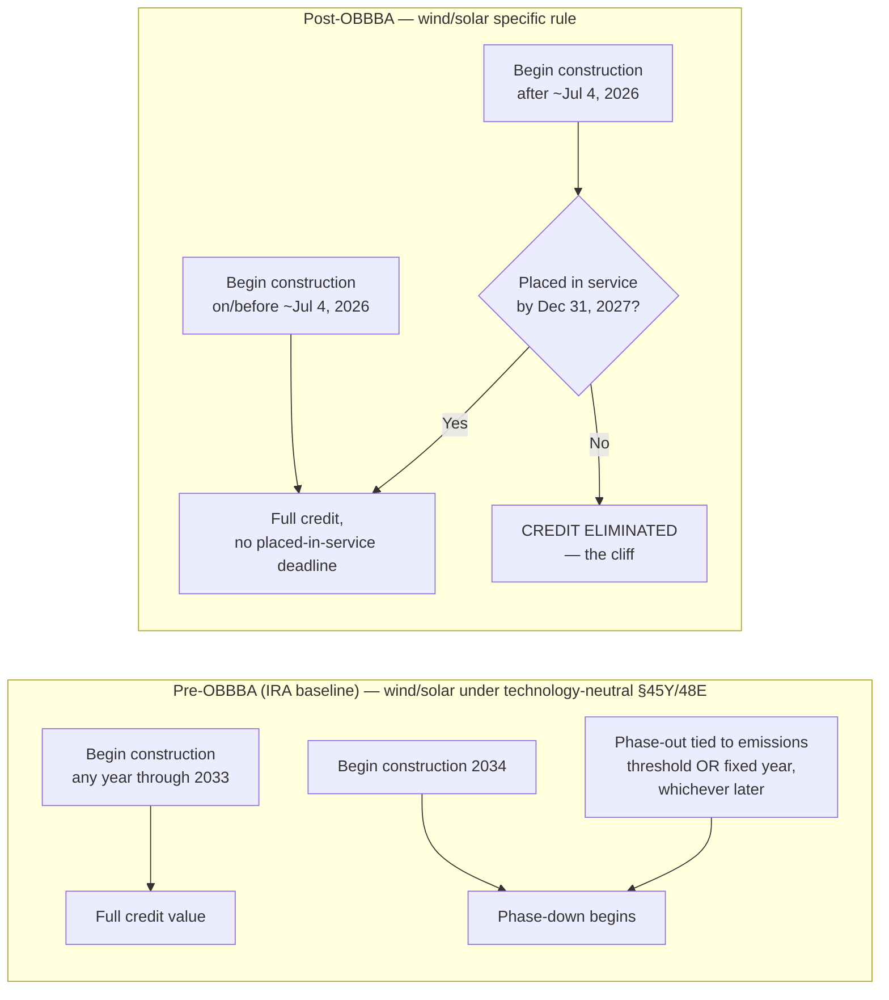

## The Placed-in-Service Cliff and Construction Deadlines

### Conceptual Overview

The "placed-in-service cliff" describes the binary, all-or-nothing eligibility consequence created by OBBBA's restructuring of §45Y (clean electricity production credit) and §48E (clean electricity investment credit) for wind and solar facilities. Unlike the Inflation Reduction Act's emissions-linked, gradually phasing-out schedule, OBBBA replaces gradual phase-down with a hard date past which the credit is entirely unavailable — a "cliff" rather than a "phase-out" in the traditional sense for the affected technologies. This item examines the mechanics, timing traps, and structuring consequences of that cliff in detail, building on the two-clock framework introduced previously.

### Why "Cliff" Is the Correct Technical Description

A phase-out schedule (as retained for geothermal, hydrogen, nuclear, and storage under §§45Y/48E) reduces credit value incrementally across a transition window. The wind/solar termination structure under OBBBA does not do this. Instead:

- A facility that satisfies either the beginning-of-construction safe harbor **or** the placed-in-service deadline receives the **full** credit value it would otherwise be entitled to under the general §45Y/48E computation rules (subject to FEOC and other independent restrictions).
- A facility that satisfies **neither** test receives **zero** credit under §45Y/48E — there is no pro-rated, reduced, or partial-value outcome for missing the deadline by any margin, whether one day or several years.

This binary structure is what distinguishes a "cliff" from a "phase-out" and is the central planning fact practitioners must communicate clearly to developers and investors: missing the deadline by even a short construction delay does not reduce the credit — it eliminates it entirely for that facility.

### The Governing Dates in Detail

**[Verified]** Statutory framework (OBBBA §§70512(l)(4) and 70513(g)(5)):

- **Enactment date**: July 4, 2025
- **Beginning-of-construction safe-harbor deadline**: 12 months after enactment. Most secondary sources cite this as **July 4, 2026**; the IRS's own citation in Notice 2025-42 and some legal commentary reference **July 5, 2026** due to statutory day-counting conventions (i.e., whether the count begins the day of or the day after enactment). Practitioners should treat July 4–5, 2026 as the operative boundary and confirm the precise controlling date against the final regulatory text or Chief Counsel guidance for any transaction where the distinction is material.
- **Placed-in-service cliff date**: December 31, 2027 (equivalently, the credit terminates for facilities placed in service **after** December 31, 2027, i.e., on or after January 1, 2028).

**The rule, precisely stated:**

> An applicable wind or solar facility is eligible for the §45Y or §48E credit if EITHER (a) construction begins on or before the beginning-of-construction deadline (~July 4, 2026), regardless of placed-in-service date, OR (b) construction begins after that deadline AND the facility is placed in service on or before December 31, 2027. A facility satisfying neither condition receives no credit under these sections.

### Decision Logic (svg_diagram)

<svg xmlns="http://www.w3.org/2000/svg" viewBox="0 0 880 460">
<text x="440" y="30" text-anchor="middle" font-family="sans-serif" font-size="18" font-weight="bold" fill="#1a1a1a">Wind/Solar §45Y / §48E Eligibility Decision Tree (svg_diagram)</text>

<rect x="330" y="55" width="220" height="45" rx="6" fill="#e0e7ff" stroke="#4338ca" />
<text x="440" y="83" text-anchor="middle" font-family="sans-serif" font-size="13" font-weight="bold">When does construction begin?</text>
<line x1="440" y1="100" x2="440" y2="130" stroke="#666" stroke-width="2" />

<polygon points="440,130 560,175 440,220 320,175" fill="#fef3c7" stroke="#b45309" />
<text x="440" y="172" text-anchor="middle" font-family="sans-serif" font-size="11">On or before</text>
<text x="440" y="186" text-anchor="middle" font-family="sans-serif" font-size="11">~Jul 4, 2026?</text>

<line x1="380" y1="200" x2="220" y2="255" stroke="#16a34a" stroke-width="2" />
<text x="290" y="222" font-family="sans-serif" font-size="11" fill="#16a34a" font-weight="bold">YES</text>
<rect x="100" y="255" width="250" height="60" rx="6" fill="#dcfce7" stroke="#16a34a" />
<text x="225" y="278" text-anchor="middle" font-family="sans-serif" font-size="12" font-weight="bold">Beginning-of-construction</text>
<text x="225" y="294" text-anchor="middle" font-family="sans-serif" font-size="12" font-weight="bold">safe harbor satisfied</text>
<text x="225" y="308" text-anchor="middle" font-family="sans-serif" font-size="10">No placed-in-service deadline applies</text>
<line x1="225" y1="315" x2="225" y2="345" stroke="#666" stroke-width="2" />
<rect x="100" y="345" width="250" height="50" rx="6" fill="#bbf7d0" stroke="#15803d" />
<text x="225" y="368" text-anchor="middle" font-family="sans-serif" font-size="12" font-weight="bold">CREDIT AVAILABLE</text>
<text x="225" y="384" text-anchor="middle" font-family="sans-serif" font-size="10">(subject to FEOC rules)</text>

<line x1="500" y1="200" x2="660" y2="255" stroke="#dc2626" stroke-width="2" />
<text x="590" y="222" font-family="sans-serif" font-size="11" fill="#dc2626" font-weight="bold">NO (after)</text>
<rect x="540" y="255" width="270" height="60" rx="6" fill="#fee2e2" stroke="#dc2626" />
<text x="675" y="278" text-anchor="middle" font-family="sans-serif" font-size="12" font-weight="bold">Placed-in-service deadline applies:</text>
<text x="675" y="294" text-anchor="middle" font-family="sans-serif" font-size="12" font-weight="bold">must be in service by Dec 31, 2027</text>
<line x1="675" y1="315" x2="675" y2="335" stroke="#666" stroke-width="2" />
<polygon points="675,335 780,370 675,405 570,370" fill="#fef3c7" stroke="#b45309" />
<text x="675" y="366" text-anchor="middle" font-family="sans-serif" font-size="10">In service</text>
<text x="675" y="380" text-anchor="middle" font-family="sans-serif" font-size="10">by 12/31/27?</text>
<line x1="605" y1="385" x2="380" y2="420" stroke="#16a34a" stroke-width="2" />
<text x="480" y="410" font-family="sans-serif" font-size="10" fill="#16a34a" font-weight="bold">YES</text>
<rect x="230" y="420" width="150" height="30" rx="6" fill="#bbf7d0" stroke="#15803d" />
<text x="305" y="440" text-anchor="middle" font-family="sans-serif" font-size="11" font-weight="bold">CREDIT AVAILABLE</text>
<line x1="745" y1="405" x2="745" y2="420" stroke="#dc2626" stroke-width="2" />
<text x="770" y="415" font-family="sans-serif" font-size="10" fill="#dc2626" font-weight="bold">NO</text>
<rect x="600" y="420" width="200" height="30" rx="6" fill="#fecaca" stroke="#b91c1c" />
<text x="700" y="440" text-anchor="middle" font-family="sans-serif" font-size="11" font-weight="bold">CREDIT LOST — the "cliff"</text>
</svg>

### Establishing Beginning of Construction: Available Methods Post-Notice 2025-42

Two IRS-recognized methods exist for establishing beginning of construction. Notice 2025-42 (issued August 15, 2025, under the directive of Executive Order 14315) modified which methods remain available specifically for the wind/solar beginning-of-construction deadline (as opposed to other credit contexts):

**1. Physical Work Test** — remains fully available. Requires physical work of a significant nature, which may be:

- **On-site work**: excavation for footings, foundation pours, installation of racking or mounting structures, road construction integral to the facility.
- **Off-site work**: manufacturing of components under a binding written contract, provided the work is significant relative to the total scope (e.g., custom-fabricated transformers, turbine components manufactured specifically for the project).

**2. 5% Safe Harbor (cost-based test)** — **eliminated** for most wind and solar facilities under Notice 2025-42's implementation of Executive Order 14315's anti-circumvention directive. A narrow carve-out preserves the safe harbor for **low-output solar facilities**, defined as facilities with an output of 1.5 MWac or less, determined on an integrated operations basis (i.e., commonly owned or contracted facilities on the same or adjacent sites may be aggregated for this determination — practitioners should confirm the precise aggregation rule against the Notice's text for any borderline project).

**[Inference]** The elimination of the cost-based safe harbor for utility-scale projects meaningfully raises the evidentiary bar for establishing a 2026 beginning-of-construction date, since incurring 5% of project costs (e.g., through equipment deposits or procurement contracts) is administratively simpler to document than demonstrating physical work of a significant nature. Developers relying on the Physical Work Test should expect greater IRS scrutiny and should maintain robust contemporaneous documentation (photographs, contractor invoices tied to specific physical milestones, executed binding contracts for custom manufacture).

### Non-Retroactivity and Transition Grace Period

Notice 2025-42 explicitly states it is **not retroactive** and provides a limited grace period for wind and solar facilities that had **not yet begun construction before September 2, 2025**. This transition mechanic matters for two distinct populations of projects:

- Projects that established beginning of construction under **prior IRS guidance** (i.e., before Notice 2025-42's issuance and before the September 2, 2025 cutoff) using the now-eliminated 5% safe harbor may retain the benefit of that earlier determination.
- Projects that had not begun construction by that date are subject to the Notice's narrowed rules going forward, including the safe-harbor elimination.

**[Unverified as to full scope]** The precise contours of what counts as "not yet begun construction before September 2, 2025" for grandfathering purposes, and how it interacts with partial construction commenced under the old 5% safe harbor rules, should be verified against the full text of Notice 2025-42 and any subsequent IRS FAQs, as summarized secondary sources vary in the level of procedural detail provided.

### Interaction with FEOC Material Assistance Timing

The placed-in-service cliff operates independently of, but in parallel with, the FEOC (prohibited foreign entity) material assistance rules, which apply their own beginning-of-construction test:

- Projects that begin construction **after December 31, 2025** (a distinct and earlier date than the July 2026 wind/solar safe-harbor deadline) must separately satisfy material assistance sourcing thresholds tied to non-prohibited-foreign-entity content, regardless of which side of the placed-in-service cliff the project falls on.
- A project can simultaneously satisfy the placed-in-service cliff test (credit-eligible on timing) and fail the FEOC material assistance test (credit-disqualified on sourcing) — the two are independent gates, and both must be cleared.

This means the "cliff" analysis alone is necessary but not sufficient for a full eligibility determination; a complete diligence file requires the timing analysis in this item plus the separate FEOC sourcing and ownership analysis.

### Construction Schedule Risk Allocation in Tax-Equity Transactions

Because the placed-in-service cliff produces a binary, high-stakes outcome tied directly to construction schedule performance, deal documents for post-July 2026 beginning-of-construction projects should address this risk explicitly:

- **Completion guarantees**: EPC (engineering, procurement, construction) contracts should include completion deadlines with contractual buffer ahead of December 31, 2027, and liquidated damages provisions calibrated to reflect the full loss of tax credit value (not merely delay costs) if the placed-in-service date slips past the cliff.
- **Credit-shortfall indemnities**: Tax-equity investment agreements can allocate the risk of missing the cliff through indemnification, credit-adjuster mechanisms, or true-up provisions distinct from ordinary construction-delay remedies, given the all-or-nothing nature of the loss.
- **Interconnection and permitting risk**: Because placed-in-service determinations often depend on utility interconnection and permission-to-operate timing (factors outside the developer's direct control), deal parties should assess interconnection queue positions and utility-side risk as first-order cliff risk factors, not secondary considerations.
- **Safe-harbor banking as risk mitigation**: Developers with flexibility in project sequencing may prioritize establishing beginning of construction before the ~July 4, 2026 deadline specifically to avoid cliff exposure altogether, effectively "banking" eligibility years in advance of commercial operation — a strategy directly incentivized by the two-clock structure.

### Comparative Timeline: IRA Baseline vs. OBBBA Cliff

### Practical Compliance Checklist for Developers and Tax-Equity Counsel

- **[Key Points]**
  - Confirm the controlling beginning-of-construction deadline date (July 4 vs. July 5, 2026) against current regulatory text for the specific transaction.
  - Determine which beginning-of-construction method (Physical Work Test or, if applicable, the narrow low-output solar 5% safe harbor) applies to the facility and confirm documentation sufficiency.
  - If beginning of construction was established before September 2, 2025 under prior guidance, evaluate whether transition/grandfathering treatment under Notice 2025-42 applies.
  - Run the FEOC material assistance analysis separately and in parallel — passing the placed-in-service cliff test does not establish FEOC compliance.
  - For any project with beginning of construction after ~July 4, 2026, treat December 31, 2027 as a hard commercial-operation deadline in project scheduling, EPC contracting, and tax-equity documentation, with contractual risk allocation calibrated to the all-or-nothing nature of the credit loss.
  - Monitor forthcoming Treasury/IRS guidance, as the beginning-of-construction rules for FEOC purposes are still being drafted separately from Notice 2025-42.

**Related Topics:**

- Physical Work Test evidentiary standards and IRS audit posture under Notice 2025-42
- Low-output solar facility aggregation rules for the retained 5% safe harbor
- FEOC material assistance cost-ratio thresholds and prohibited-entity ownership tests
- EPC contract drafting for tax-credit-linked completion deadlines
- Comparative phase-out schedules for storage, geothermal, hydrogen, and nuclear under §§45Y/48E
- Grandfathering and transition rules for pre-September 2, 2025 construction starts
- Interconnection queue risk as a placed-in-service cliff risk factor