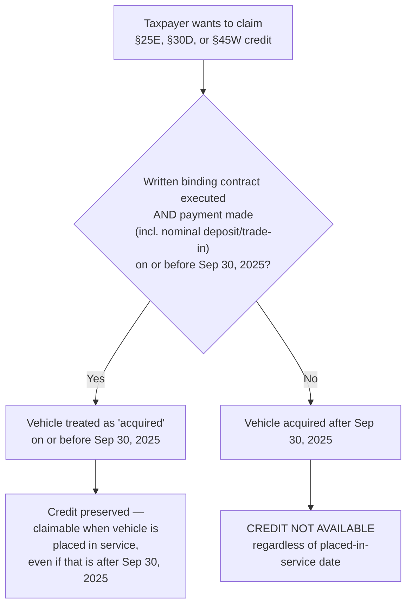

## Termination of Clean Vehicle Credits

### Overview of Affected Provisions

OBBBA accelerates the termination of the Inflation Reduction Act's suite of clean vehicle tax credits substantially earlier than their original IRA sunset dates. Four distinct Code sections are affected, each governing a different transaction category: new clean vehicles, previously-owned (used) clean vehicles, qualified commercial clean vehicles, and alternative fuel vehicle refueling property. All four termination dates fall in the second half of 2025 or mid-2026 — a dramatic compression relative to the IRA's original framework, which extended these credits through 2032.

### Termination Dates by Code Section

**[Verified]** Per IRS guidance implementing OBBBA:

| Code Section | Credit | Termination Date | Trigger Event |
| --- | --- | --- | --- |
| §30D | New Clean Vehicle Credit | Not allowed for vehicles acquired after September 30, 2025 | Acquisition |
| §25E | Previously-Owned Clean Vehicles Credit | Not allowed for vehicles acquired after September 30, 2025 | Acquisition |
| §45W | Qualified Commercial Clean Vehicle Credit | Not allowed for vehicles acquired after September 30, 2025 | Acquisition |
| §30C | Alternative Fuel Vehicle Refueling Property Credit | Not allowed for property placed in service after June 30, 2026 | Placed in service |

Note the structural distinction: §30D, §25E, and §45W are all keyed to the **acquisition** date (a defined term discussed below), while §30C runs on the more conventional **placed-in-service** date, consistent with typical energy property credit mechanics.

### The "Acquired" Definition — Critical Timing Mechanic

For §25E, §30D, and §45W, the IRS has clarified a precise, taxpayer-favorable definition of "acquired" that decouples the credit-preservation trigger from the vehicle delivery date:

**A vehicle is treated as "acquired" on the date a written, binding contract is entered into AND a payment has been made** (including a nominal down payment or a vehicle trade-in used as consideration).

The consequence of this definition is significant: if a taxpayer acquires a vehicle (under this binding-contract-plus-payment test) on or before September 30, 2025, the taxpayer remains entitled to claim the applicable credit **when the vehicle is placed in service** (i.e., when the taxpayer takes possession), **even if that possession occurs after September 30, 2025**.

This creates a practical planning mechanism: a binding purchase order or sales contract executed with even a nominal deposit before the cutoff locks in credit eligibility, decoupling it from manufacturing, delivery, or dealer-lot timing that the taxpayer or dealer may not fully control.

**[Inference]** This acquisition-based test is likely to generate a documentation and audit-substantiation practice area of its own — dealers and buyers close to the cutoff date have an incentive to establish contract execution and payment dates as early as possible and to retain clear documentary evidence (dated, signed contracts; payment receipts; trade-in agreements) given the credit's binary, all-or-nothing dependence on this single date determination.

### §25D Interaction Note (Residential, Not Vehicle, but Frequently Confused)

Distinct from the vehicle credits above, §25D (Residential Clean Energy Credit) uses a **different** timing test: an expenditure is treated as made when the **original installation is completed**, not when paid for. The IRS has explicitly confirmed that if installation is completed after December 31, 2025, the expenditure is treated as made after that date — even if the taxpayer paid in full beforehand. This is the inverse timing logic from the vehicle "acquired" test (contract-plus-payment controls) and practitioners should take care not to conflate the two rules when advising clients across both vehicle and residential clean-energy transactions.

### Decision Flow for Vehicle Credit Eligibility

### §30C: Alternative Fuel Vehicle Refueling Property

Unlike the three vehicle-purchase credits, §30C (covering EV charging stations and other alternative fuel refueling infrastructure) retains the conventional **placed-in-service** trigger rather than an acquisition-based test, and runs on a materially longer timeline:

- Termination applies to property placed in service **after June 30, 2026**.
- This gives infrastructure developers (commercial charging station installers, fleet depot operators, property owners installing charging equipment) roughly nine additional months of runway relative to the September 30, 2025 vehicle-purchase cutoffs.
- Because this credit is tied to installed, in-service infrastructure rather than a consumer purchase transaction, the compliance and documentation profile more closely resembles standard energy-property placed-in-service analysis (permitting, inspection, commissioning records) than the contract-and-payment analysis governing the vehicle credits.

### Related Adjacent Terminations (§45L, §179D)

Two additional accelerated terminations share the same June 30, 2026 placed-in-service-family cutoff and are frequently analyzed alongside the vehicle credit terminations because they were announced in the same IRS guidance package:

| Code Section | Provision | Termination Date |
| --- | --- | --- |
| §45L | New Energy Efficient Home Credit | Not allowed for qualified new energy efficient homes **acquired** after June 30, 2026 |
| §179D | Energy Efficient Commercial Buildings Deduction | Not allowed for property the construction of which **begins** after June 30, 2026 |

**[Inference]** Note that §45L uses an "acquired" trigger (relevant to homebuilders and buyers) while §179D uses a "construction begins" trigger (relevant to commercial building owners and designers) — three different trigger-event types (acquisition, placed-in-service, beginning-of-construction) now govern different credits terminating around the same mid-2026 window, which increases the risk of practitioner error if trigger types are not carefully distinguished on a credit-by-credit basis.

### Summary Timeline Across All Terminated/Accelerated Provisions

<svg xmlns="http://www.w3.org/2000/svg" viewBox="0 0 900 320">
<text x="450" y="28" text-anchor="middle" font-family="sans-serif" font-size="17" font-weight="bold" fill="#1a1a1a">OBBBA Vehicle &amp; Related Credit Termination Timeline (svg_diagram)</text>
<line x1="60" y1="160" x2="840" y2="160" stroke="#888" stroke-width="2" />

<circle cx="240" cy="160" r="9" fill="#dc2626" />
<text x="240" y="138" text-anchor="middle" font-family="sans-serif" font-size="12" font-weight="bold">Sep 30, 2025</text>
<text x="240" y="190" text-anchor="middle" font-family="sans-serif" font-size="10">§30D New Clean Vehicle</text>
<text x="240" y="204" text-anchor="middle" font-family="sans-serif" font-size="10">§25E Previously-Owned</text>
<text x="240" y="218" text-anchor="middle" font-family="sans-serif" font-size="10">§45W Commercial Clean Vehicle</text>
<text x="240" y="232" text-anchor="middle" font-family="sans-serif" font-size="10" font-style="italic">(acquisition-based trigger)</text>

<circle cx="450" cy="160" r="9" fill="#d97706" />
<text x="450" y="138" text-anchor="middle" font-family="sans-serif" font-size="12" font-weight="bold">Dec 31, 2025</text>
<text x="450" y="190" text-anchor="middle" font-family="sans-serif" font-size="10">§25C Home Improvement</text>
<text x="450" y="204" text-anchor="middle" font-family="sans-serif" font-size="10">§25D Residential Clean Energy</text>
<text x="450" y="218" text-anchor="middle" font-family="sans-serif" font-size="10" font-style="italic">(installation-completion trigger)</text>

<circle cx="680" cy="160" r="9" fill="#2563eb" />
<text x="680" y="138" text-anchor="middle" font-family="sans-serif" font-size="12" font-weight="bold">Jun 30, 2026</text>
<text x="680" y="190" text-anchor="middle" font-family="sans-serif" font-size="10">§30C Refueling Property</text>
<text x="680" y="204" text-anchor="middle" font-family="sans-serif" font-size="10">§45L Energy Efficient Home</text>
<text x="680" y="218" text-anchor="middle" font-family="sans-serif" font-size="10">§179D Commercial Buildings</text>
<text x="680" y="232" text-anchor="middle" font-family="sans-serif" font-size="10" font-style="italic">(mixed triggers)</text>
<rect x="60" y="255" width="780" height="50" rx="6" fill="#f3f4f6" stroke="#ccc" />
<text x="450" y="277" text-anchor="middle" font-family="sans-serif" font-size="11" font-style="italic">Three distinct trigger-event types govern these deadlines: acquisition (contract + payment),</text>
<text x="450" y="293" text-anchor="middle" font-family="sans-serif" font-size="11" font-style="italic">installation/placed-in-service completion, and beginning of construction — do not conflate them.</text>
</svg>

### Practical Compliance Guidance

- **[Key Points]**
  - For §30D, §25E, and §45W: the operative question is whether a **binding contract plus payment** (any amount, including nominal deposits or trade-ins) existed on or before September 30, 2025 — not the delivery or possession date.
  - For §25D: the operative question is whether **installation was completed** on or before December 31, 2025 — payment timing is irrelevant if installation completion occurs later.
  - For §30C, §45L, and §179D: confirm which specific trigger (placed-in-service, acquisition, or beginning-of-construction) applies to the specific credit before advising on the June 30, 2026 deadline, since the three provisions use three different trigger mechanics despite sharing a common date.
  - Dealers, fleet buyers, and homebuilders transacting near these cutoffs should prioritize contemporaneous documentation (dated contracts, payment records, trade-in agreements, installation completion certificates) given the binary, non-prorated nature of credit loss.
  - These vehicle and residential credit terminations are separate from, and should not be confused with, the wind/solar generation credit cliff under §§45Y/48E, which uses beginning-of-construction and placed-in-service tests on a materially different (2026/2027) timeline.

**Related Topics:**

- Dealer point-of-sale credit transfer mechanics under §30D and their interaction with the September 30, 2025 cutoff
- Documentation standards for establishing binding-contract-plus-payment acquisition dates
- §25D residential solar installation-completion timing traps in owner-financed vs. third-party-owned systems
- §45W commercial fleet electrification planning around the accelerated cutoff
- Comparative analysis: vehicle credit "acquired" test vs. generation credit "beginning of construction" test
- State-level EV incentive programs as a substitute planning avenue post-OBBBA
- §179D commercial building deduction beginning-of-construction documentation practices