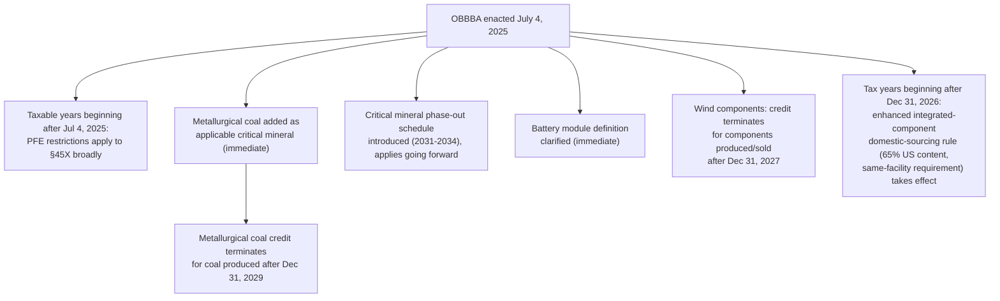

## Changes to the Advanced Manufacturing Production Credit

### Statutory Context

Section 45X, the Advanced Manufacturing Production Credit created by the Inflation Reduction Act, subsidizes domestic production of five categories of goods: solar energy components, wind energy components, battery components, inverters, and critical minerals. Unlike §45Y/48E (which govern electricity generation), §45X is a manufacturing-side, per-unit production credit — claimed by the manufacturer of the component, not the project developer who installs it. OBBBA makes six identifiable changes to §45X rather than repealing it wholesale, all effective for taxable years beginning after July 4, 2025 unless a more specific date is noted below.

### Change 1: Wind Energy Component Termination

The single most consequential §45X change is the accelerated termination of the credit for wind energy components:

- **Credit is disallowed for wind energy components produced and sold after December 31, 2027.**
- Under prior IRA law, wind components were subject to the **same phase-out schedule** as other eligible components (phase-down beginning 2030, complete termination for components sold after 2032). OBBBA removes wind from that general schedule and imposes a materially earlier, date-certain cutoff.
- This is consistent with the broader wind-specific treatment seen elsewhere in OBBBA (the §45Y/48E placed-in-service cliff) and with an accompanying presidential memorandum targeting wind energy and a related order halting work on the Empire Wind 1 project — indicating a coordinated administration-wide policy posture toward wind specifically, distinct from solar and other technologies.

### Change 2: General Phase-Out Schedule for Non-Wind, Non-Critical-Mineral Components

For eligible components **other than** wind energy components and applicable critical minerals (i.e., solar components, battery components, inverters), the pre-existing IRA phase-down schedule is retained:

| Year of Sale | Credit Value |
| --- | --- |
| Through 2029 | 100% (full credit) |
| 2030 | 75% |
| 2031 | 50% |
| 2032 | 25% |
| 2033 and later | 0% (no credit) |

**[Verified]** This confirms that solar, battery, and inverter manufacturers retain the existing phase-down timeline largely unchanged by OBBBA — the legislation's manufacturing-credit impact is concentrated on wind and critical minerals rather than a broad-based rollback.

### Change 3: Critical Minerals — New Phase-Out Introduced

Under prior law, critical minerals had **no phase-out or termination date** at all — they were the one component category exempted from any sunset. OBBBA changes this by introducing a staged phase-out for applicable critical minerals (excluding metallurgical coal, addressed separately below):

| Year of Production | Credit Value |
| --- | --- |
| Through 2030 | 100% (full credit, at the standard 10% of production cost rate) |
| 2031 | 75% |
| 2032 | 50% |
| 2033 | 25% |
| 2034 and later | 0% (no credit) |

**[Inference]** Because this is a wholly new limitation not present in the original IRA credit design, critical minerals manufacturers with long-term offtake or investment planning horizons should treat 2031–2034 as a new hard planning boundary that did not previously exist, materially changing the economics of any critical minerals processing facility whose payback period extends past 2030.

### Change 4: Metallurgical Coal Added as a Critical Mineral (New Category)

OBBBA expands the definition of "applicable critical mineral" to include **metallurgical coal** — a type of coal used specifically in steelmaking — for the first time. This is a legislatively significant change because, absent this amendment, the list of eligible critical minerals could only be changed by an act of Congress (the original 2022 USGS critical minerals list is fixed in the statute and does not auto-update with subsequent USGS revisions).

**Distinct treatment of metallurgical coal relative to other critical minerals:**

- **Credit rate**: 2.5% of production costs — substantially lower than the standard 10% rate applicable to other critical minerals and electrode active materials.
- **Termination date**: The credit for metallurgical coal is terminated for coal produced after **December 31, 2029** — an earlier and harder cutoff (full termination, not a phase-down) than the 2031–2034 phase-down schedule applying to other critical minerals.
- **Geographic sourcing exception**: Unusually, the credit for metallurgical coal is available for production costs **regardless of whether production occurs outside the United States** — a departure from the general §45X requirement that production occur in the United States or its territories. This credit is only practically usable, however, by a claimant with a U.S. taxable presence.

### Change 5: Enhanced Integrated Component / Domestic Sourcing Rule

For taxable years beginning after **December 31, 2026**, OBBBA imposes a tightened domestic-content requirement specifically for **secondary (integrated) components**:

- The credit for a secondary component is only available if that component is produced **in the same facility** as its primary components.
- At least **65% of the total direct material costs** of the secondary component must be attributable to primary components that were mined, produced, or manufactured **in the United States**.

**[Inference]** This rule is designed to discourage fragmented or offshore production strategies in which a secondary component's primary inputs are sourced internationally and merely assembled domestically — the stated policy intent is reinforcing genuinely domestic supply chains rather than nominal final-assembly-only U.S. content. Manufacturers with multi-facility or multi-jurisdictional supply chains for integrated components should reassess sourcing and facility-location strategy well ahead of the 2027 effective date given the lead time typically required for supply-chain restructuring.

### Change 6: Battery Module Definition Clarified (Tightened)

OBBBA adds clarifying statutory language defining "battery module" for §45X purposes. A qualifying battery module must be:

> "comprised of all other essential equipment needed for battery functionality, such as current collector assemblies and voltage sense harnesses, or any other essential energy collection equipment."

**[Inference]** This clarification appears intended to prevent claimants from qualifying partial or incomplete battery assemblies (e.g., cells without the surrounding functional equipment) as a full "battery module" for credit purposes — narrowing what previously may have been ambiguous product-classification territory. Manufacturers should reassess existing product classifications against this more explicit functional-completeness standard.

### Prohibited Foreign Entity (PFE) Restrictions Applied to §45X

Separately from the component-specific changes above, OBBBA extends its prohibited foreign entity (PFE) framework to §45X, effective for taxable years beginning after July 4, 2025:

- The §45X credit is **disallowed** if the taxpayer is itself a "specified foreign entity" or a "foreign-influenced entity."
- The credit is also disallowed if the taxpayer **received material assistance from a prohibited foreign entity**, mirroring the material-assistance sourcing framework applied elsewhere in OBBBA (e.g., §§45Y/48E).

**[Unverified as to full technical detail]** The precise definitional boundaries of "foreign-influenced entity" and the material assistance cost-ratio thresholds specific to §45X manufacturing supply chains should be confirmed against forthcoming Treasury regulations, as these definitions are complex, cross-reference other Code provisions, and are still subject to implementing guidance.

### Consolidated Change Summary (svg_diagram)

<svg xmlns="http://www.w3.org/2000/svg" viewBox="0 0 900 420">
<text x="450" y="28" text-anchor="middle" font-family="sans-serif" font-size="17" font-weight="bold" fill="#1a1a1a">§45X Advanced Manufacturing Credit — OBBBA Changes (svg_diagram)</text>

<rect x="40" y="50" width="200" height="36" fill="#1e3a8a" rx="4" />
<text x="140" y="73" text-anchor="middle" fill="white" font-family="sans-serif" font-size="12" font-weight="bold">Component Category</text>
<rect x="245" y="50" width="330" height="36" fill="#1e3a8a" rx="4" />
<text x="410" y="73" text-anchor="middle" fill="white" font-family="sans-serif" font-size="12" font-weight="bold">Termination / Phase-out</text>
<rect x="580" y="50" width="280" height="36" fill="#1e3a8a" rx="4" />
<text x="720" y="73" text-anchor="middle" fill="white" font-family="sans-serif" font-size="12" font-weight="bold">Rate / Note</text>

<rect x="40" y="90" width="200" height="44" fill="#fee2e2" stroke="#dc2626" />
<text x="140" y="116" text-anchor="middle" font-family="sans-serif" font-size="12" font-weight="bold">Wind components</text>
<rect x="245" y="90" width="330" height="44" fill="#fef2f2" stroke="#dc2626" />
<text x="410" y="110" text-anchor="middle" font-family="sans-serif" font-size="11">Hard termination: none after</text>
<text x="410" y="126" text-anchor="middle" font-family="sans-serif" font-size="11" font-weight="bold">Dec 31, 2027 (produced &amp; sold)</text>
<rect x="580" y="90" width="280" height="44" fill="#fef2f2" stroke="#dc2626" />
<text x="720" y="116" text-anchor="middle" font-family="sans-serif" font-size="11">Removed from general schedule</text>

<rect x="40" y="134" width="200" height="44" fill="#dcfce7" stroke="#16a34a" />
<text x="140" y="160" text-anchor="middle" font-family="sans-serif" font-size="12" font-weight="bold">Solar, battery, inverter</text>
<rect x="245" y="134" width="330" height="44" fill="#f0fdf4" stroke="#16a34a" />
<text x="410" y="150" text-anchor="middle" font-family="sans-serif" font-size="11">Unchanged phase-down:</text>
<text x="410" y="166" text-anchor="middle" font-family="sans-serif" font-size="11">75%('30) → 50%('31) → 25%('32) → 0%('33)</text>
<rect x="580" y="134" width="280" height="44" fill="#f0fdf4" stroke="#16a34a" />
<text x="720" y="160" text-anchor="middle" font-family="sans-serif" font-size="11">Pre-existing IRA schedule retained</text>

<rect x="40" y="178" width="200" height="44" fill="#fef3c7" stroke="#b45309" />
<text x="140" y="204" text-anchor="middle" font-family="sans-serif" font-size="12" font-weight="bold">Critical minerals (general)</text>
<rect x="245" y="178" width="330" height="44" fill="#fffbeb" stroke="#b45309" />
<text x="410" y="194" text-anchor="middle" font-family="sans-serif" font-size="11">NEW phase-down (none before):</text>
<text x="410" y="210" text-anchor="middle" font-family="sans-serif" font-size="11">75%('31) → 50%('32) → 25%('33) → 0%('34)</text>
<rect x="580" y="178" width="280" height="44" fill="#fffbeb" stroke="#b45309" />
<text x="720" y="204" text-anchor="middle" font-family="sans-serif" font-size="11">10% of production cost rate</text>

<rect x="40" y="222" width="200" height="44" fill="#e0e7ff" stroke="#4338ca" />
<text x="140" y="248" text-anchor="middle" font-family="sans-serif" font-size="12" font-weight="bold">Metallurgical coal (new)</text>
<rect x="245" y="222" width="330" height="44" fill="#eef2ff" stroke="#4338ca" />
<text x="410" y="248" text-anchor="middle" font-family="sans-serif" font-size="11" font-weight="bold">Hard termination after Dec 31, 2029</text>
<rect x="580" y="222" width="280" height="44" fill="#eef2ff" stroke="#4338ca" />
<text x="720" y="240" text-anchor="middle" font-family="sans-serif" font-size="11">2.5% rate; offshore production OK</text>
<text x="720" y="256" text-anchor="middle" font-family="sans-serif" font-size="10">(needs US taxable presence)</text>

<rect x="40" y="266" width="200" height="44" fill="#f3e8ff" stroke="#7e22ce" />
<text x="140" y="292" text-anchor="middle" font-family="sans-serif" font-size="12" font-weight="bold">Secondary/integrated components</text>
<rect x="245" y="266" width="330" height="44" fill="#faf5ff" stroke="#7e22ce" />
<text x="410" y="282" text-anchor="middle" font-family="sans-serif" font-size="11">Effective for tax years after Dec 31, 2026:</text>
<text x="410" y="298" text-anchor="middle" font-family="sans-serif" font-size="11">same-facility + 65% US-origin material cost</text>
<rect x="580" y="266" width="280" height="44" fill="#faf5ff" stroke="#7e22ce" />
<text x="720" y="292" text-anchor="middle" font-family="sans-serif" font-size="11">New domestic-content guardrail</text>

<rect x="40" y="310" width="200" height="44" fill="#fecaca" stroke="#991b1b" />
<text x="140" y="336" text-anchor="middle" font-family="sans-serif" font-size="12" font-weight="bold">All components (PFE overlay)</text>
<rect x="245" y="310" width="330" height="44" fill="#fef2f2" stroke="#991b1b" />
<text x="410" y="326" text-anchor="middle" font-family="sans-serif" font-size="11">Effective for tax years beginning</text>
<text x="410" y="342" text-anchor="middle" font-family="sans-serif" font-size="11">after Jul 4, 2025: PFE disqualification</text>
<rect x="580" y="310" width="280" height="44" fill="#fef2f2" stroke="#991b1b" />
<text x="720" y="336" text-anchor="middle" font-family="sans-serif" font-size="11">Independent of component category</text>

<text x="450" y="395" text-anchor="middle" font-family="sans-serif" font-size="11" font-style="italic" fill="#444">Six distinct changes — not a wholesale repeal of §45X.</text>

</svg>

### Effective Date Consolidation

### Structuring and Planning Implications

- **[Key Points]**
  - Wind component manufacturers face the most acute timeline compression — full credit termination by end of 2027, with no phase-down cushion, in contrast to solar/battery/inverter manufacturers retaining the original phase-down through 2032.
  - Critical minerals manufacturers gain a new planning horizon constraint (2031–2034 phase-down) that did not exist under original IRA law and should be incorporated into any facility investment underwriting with a payback period extending into the 2030s.
  - Metallurgical coal represents a narrow, sector-specific addition benefiting the steelmaking supply chain, but at a substantially reduced 2.5% rate and a hard 2029 cutoff — not comparable in value to the standard 10% critical minerals rate.
  - The 2027 integrated-component domestic-sourcing rule (65% US-origin material cost, same-facility production) requires lead-time planning now for manufacturers with multi-facility or international supply chains for secondary components.
  - PFE restrictions apply across all §45X component categories starting with taxable years beginning after July 4, 2025 — sourcing and ownership diligence should not be deferred pending component-specific analysis.
  - §45X credits remain transferable, meaning changes to eligibility timelines and domestic-content rules directly affect the market for and pricing of transferred credits, not solely the originating manufacturer's own tax position.

**Related Topics:**

- §45X credit transferability mechanics and market pricing effects of the new sourcing rules
- Prohibited foreign entity (PFE) and material assistance definitions as applied specifically to manufacturing supply chains
- Comparative treatment of wind under §45X vs. §45Y/48E (cross-referencing the placed-in-service cliff)
- Facility-level compliance planning for the 2027 integrated-component domestic-content threshold
- Battery module functional-completeness classification standards post-OBBBA
- Metallurgical coal supply chain economics under the 2.5% rate and offshore-production exception
- Critical minerals processing facility investment underwriting under the new 2031-2034 phase-down