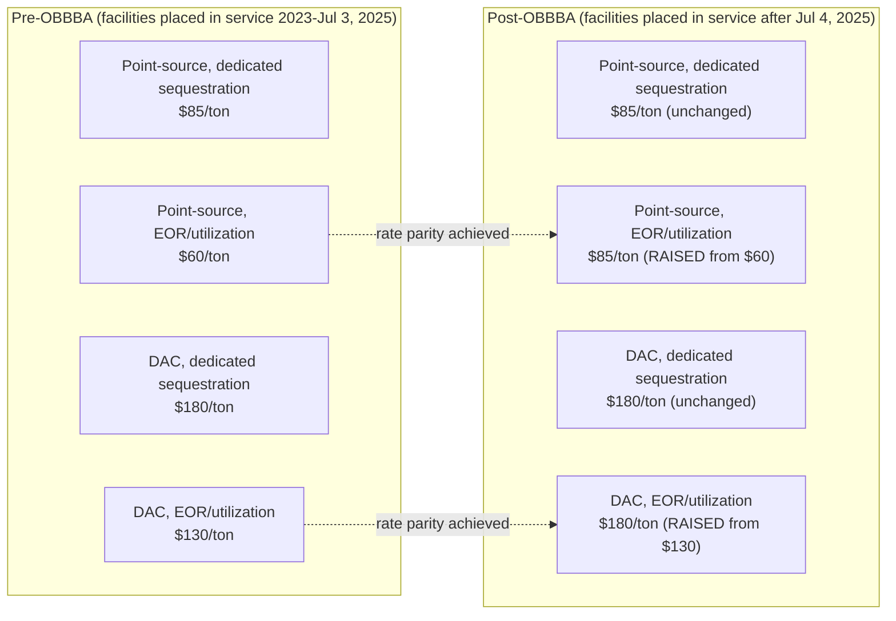

## Carbon Capture Credit Rate Increase

### Overview: §45Q Is Enhanced, Not Cut

Section 45Q (the carbon oxide sequestration tax credit) is a notable outlier in OBBBA's overall treatment of clean energy incentives. While OBBBA aggressively accelerates termination and phase-out schedules for wind, solar, and several manufacturing categories, §45Q was preserved in full and enhanced — specifically through a rate-parity change that raises credit values for enhanced oil recovery (EOR) and other utilization pathways to match the higher rate previously reserved only for dedicated geologic sequestration. This makes §45Q one of the few clean-energy-adjacent provisions in OBBBA's overall framework that expanded rather than contracted.

### Pre-OBBBA Baseline (IRA-Era Rates)

Under the Inflation Reduction Act, §45Q credit values were bifurcated by end use, creating a lower rate for CO2 that was used commercially (primarily EOR) versus CO2 that was permanently sequestered without utilization:

| Capture Method | Permanent Geologic Sequestration (dedicated storage) | EOR / Other Utilization (associated storage) |
| --- | --- | --- |
| Point-source (industrial/power) | $85 per metric ton | $60 per metric ton |
| Direct Air Capture (DAC) | $180 per metric ton | $130 per metric ton |

**[Verified]** These figures apply to facilities placed in service after December 31, 2022, under IRA-era law, with inflation adjustments contemplated for later years. Earlier IRA-baseline figures for facilities placed in service in 2022 were lower still ($17/ton sequestration, $12/ton EOR; $36/ton DAC sequestration, $26/ton DAC EOR) before further legislative and inflation adjustments took effect — sources vary slightly on which baseline year to cite, so the immediately pre-OBBBA operative rates ($85/$60 point-source; $180/$130 DAC) are the relevant comparison point for this item.

### The OBBBA Change: Rate Parity

**[Verified]** OBBBA raises the EOR/utilization credit rate to match the dedicated-sequestration rate, eliminating the historical gap entirely:

| Capture Method | Dedicated Sequestration (unchanged) | EOR / Other Utilization (NEW, post-OBBBA) |
| --- | --- | --- |
| Point-source (industrial/power) | $85 per metric ton | **$85 per metric ton** (up from $60) |
| Direct Air Capture (DAC) | $180 per metric ton | **$180 per metric ton** (up from $130) |

This is described across practitioner commentary as achieving **credit parity** between dedicated CCS-only (carbon capture and storage) projects and combined EOR/CCS projects — for the first time since §45Q's original 2008 enactment, the end use of the captured carbon (permanent storage vs. enhanced oil recovery vs. other utilization) no longer determines the credit rate; only the capture method (point-source vs. direct air capture) does.

### Effective Date and Applicability Window

- The enhanced EOR/utilization rate applies to **facilities placed in service after the OBBBA's enactment date (July 4, 2025)**.
- This is distinct from, and narrower than, the dedicated-sequestration rate's applicability, which had already applied to facilities placed in service after December 31, 2022.
- **Legislative drafting evolution**: the House-passed version of the bill left the §45Q credit amount unchanged; the Senate Finance Committee's initial proposal raised the EOR rate to $17 per ton (an outdated baseline reference) starting in 2026; the Senate-passed bill accelerated this to begin in 2025 but limited the enhancement to facilities placed in service after enactment; this Senate approach was carried into the final enacted law.

**[Inference]** The "placed in service after enactment" limitation (rather than a retroactive or broader applicability window) means existing EOR/utilization projects already placed in service before July 4, 2025 do **not** receive the enhanced rate — they remain on the pre-OBBBA $60/$130 rates for their existing 12-year credit claiming period. This creates a meaningful economic distinction between legacy projects and newly commissioned projects, which should be factored into any portfolio-level or M&A valuation analysis involving existing carbon capture assets.

### Why This Change Matters Economically

Prior to OBBBA, the lower EOR/utilization rate created an economic bias toward pursuing permanent geologic sequestration project structures (where feasible) over EOR-based utilization, since sequestration captured the higher credit value. Post-OBBBA rate parity removes this bias and is expected to have several downstream effects:

- **Increased EOR project viability**: Because EOR is the most common and, according to industry commentary, the only commercially viable utilization pathway at scale historically, projects can now access the full $85/$180 rate without needing to pursue permanent geologic sequestration, which typically requires lengthy Class VI well permitting.
- **New revenue-stream flexibility**: Developers are no longer economically constrained to dedicated storage structures and can develop revenue streams from selling captured CO2 to EOR operators or other downstream users (e.g., e-fuels production) without sacrificing credit value.
- **Direct benefit to oil and gas operators**: Because EOR utilization now qualifies for the same compensation as dedicated storage, oil and gas companies conducting EOR operations that incorporate qualifying CO2 capture see an improved return on investment relative to pre-OBBBA economics.
- **Reduced permitting-timeline risk**: Projects with short development timelines may now favor EOR pathways specifically to avoid the multi-year Class VI injection well permitting process associated with dedicated geologic sequestration, without an accompanying credit-value penalty.

### Fiscal Scoring

According to Joint Committee on Taxation (JCT) analysis, expanding §45Q under OBBBA — combined with the effect of the new FEOC provision discussed below — is projected to cost taxpayers an additional $14.2 billion over the FY2025–2034 budget window. This scoring reflects the net revenue effect of the rate increase after accounting for the offsetting revenue impact of the new foreign entity restrictions.

### FEOC (Foreign Entity of Concern) Restrictions Layered onto §45Q

OBBBA pairs the rate enhancement with new foreign entity of concern restrictions specific to §45Q — the credit is not enhanced without new eligibility guardrails:

- **Specified Foreign Entities (SFEs)**: defined to include China, Iran, North Korea, and Russia. §45Q credits cannot be claimed by or transferred to SFEs for **any taxable year beginning after July 4, 2025**.
- **Foreign-Influenced Entities (FIEs)**: entities subject to specific partial-ownership thresholds involving specified foreign entities. §45Q credits cannot be claimed by or transferred to FIEs for **any taxable year beginning after July 4, 2027** — a materially later effective date than the SFE restriction, giving FIE-adjacent claimants a longer transition runway.
- These same FEOC restrictions apply in parallel to §45Z (the clean fuel production credit), indicating a consistent cross-provision FEOC framework rather than a §45Q-specific carve-out.

### Credit Monetization Features Preserved

Despite being "on the policy chopping block" during negotiations according to some commentary, §45Q's monetization mechanisms were preserved intact under OBBBA:

- **Transferability**: §45Q credits remain transferable to unrelated third parties for cash, preserving the credit's function as a financeable asset in project capital stacks.
- **Direct pay**: Tax-exempt entities, state and local governments, tribes, and certain other "applicable entities" can elect to be treated as having paid tax in the credit amount, generating a refundable payment from the Treasury.
- **12-year claiming period**: The credit continues to be claimed over a 12-year period from the facility's placed-in-service date, consistent with pre-OBBBA structure.

**[Inference]** Because transferability was preserved, secondary-market buyers of §45Q credits should factor the new rate-parity structure into credit pricing models going forward — an EOR-based project placed in service after July 4, 2025 is now a materially more valuable transferable-credit asset than an equivalent pre-OBBBA EOR project, all else equal, given the $60→$85 (or $130→$180 for DAC) rate increase.

### Rate Comparison Visualization

### Interaction with the Broader OBBBA Framework

**[Key Points]**

- §45Q's enhancement stands in direct contrast to the accelerated termination treatment applied to wind, solar, and several §45X manufacturing categories elsewhere in OBBBA — it reflects a distinct policy posture favoring carbon management and industrial decarbonization technologies specifically.
- The rate increase applies **prospectively only** — projects placed in service before July 4, 2025 do not receive the enhanced EOR/utilization rate for their existing credit period.
- FEOC restrictions apply on two different timelines within §45Q itself (SFEs restricted starting taxable years after July 4, 2025; FIEs restricted starting taxable years after July 4, 2027), requiring separate compliance tracking from the wind/solar and §45X FEOC provisions discussed elsewhere in this chapter, which use different effective-date triggers.
- Treasury and IRS guidance implementing the OBBBA-era §45Q changes, along with earlier 2022 IRA enhancements, remains pending as of relevant industry commentary — project developers structuring EOR-based transactions should monitor for forthcoming regulatory clarity on definitional and procedural questions.
- The credit's preserved transferability and direct-pay mechanisms mean the rate increase has an immediate secondary-market pricing effect, not merely a first-party tax benefit, making it directly relevant to tax-equity and credit-purchase transaction structuring.

**Related Topics:**

- §45Q Class VI well permitting timelines and their interaction with sequestration vs. EOR project selection
- FEOC "foreign-influenced entity" ownership-threshold definitions and their application across §45Q, §45X, and §45Z
- §45Z clean fuel production credit and its shared FEOC framework with §45Q
- Secondary-market pricing dynamics for transferable §45Q credits post-rate-parity
- Direct-pay election mechanics for tax-exempt and governmental §45Q claimants
- Offshore CO2 storage regulatory developments (outer continental shelf) and their effect on future §45Q project siting
- Comparative treatment of carbon capture vs. wind/solar under OBBBA's overall energy policy framework