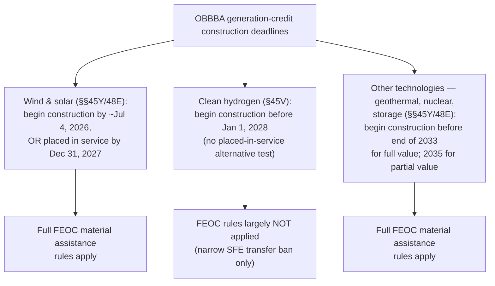

## Clean Hydrogen Credit Termination Timeline

### Statutory Basis

Section 45V (the Clean Hydrogen Production Credit) was created under the Inflation Reduction Act to provide a per-kilogram production tax credit for qualified clean hydrogen produced at a qualifying facility. OBBBA amends §45V's beginning-of-construction deadline directly. Per the U.S. Code annotation, Public Law 119-21 **"substituted 'January 1, 2028' for 'January 1, 2033'"** in the statutory text governing facility eligibility — a clean, single-variable legislative change rather than a restructuring of the credit's underlying mechanics.

### The Core Change: A Five-Year Acceleration

| Parameter | Pre-OBBBA (IRA baseline) | Post-OBBBA |
| --- | --- | --- |
| Beginning-of-construction deadline | Before January 1, 2033 | Before January 1, 2028 |
| Deadline type | Beginning-of-construction | Beginning-of-construction (same mechanic, earlier date) |
| Credit value | Up to $3.00/kg (lifecycle-emissions-dependent) | Unchanged — up to $3.00/kg |
| Credit period | 10 years from placed-in-service date | Unchanged — 10 years |
| Direct pay / transferability | Available | Retained (with new foreign-entity transfer restriction, discussed below) |

This is a straightforward **five-year compression** of the construction window, with no other structural change to how the credit is calculated or claimed. Facilities that begin construction on or before December 31, 2027 remain eligible under essentially the same rules as before; facilities that begin construction on or after January 1, 2028 lose eligibility entirely.

### Legislative Drafting History: House vs. Senate Positions

The final January 1, 2028 date represents a legislative compromise reached during the reconciliation process, and understanding the negotiating positions clarifies why this particular date was chosen:

- **House-passed version (May 22, 2025)**: Proposed terminating the credit for facilities beginning construction **after December 31, 2025** — an even more aggressive, near-immediate termination.
- **Senate-passed version (July 1, 2025) / Enacted law**: Extended the deadline by two additional years relative to the House proposal, moving the construction-commencement cutoff to before January 1, 2028.

**[Verified]** The enacted Senate approach is described by practitioner commentary as giving "the hydrogen industry two additional years to start construction and still claim the credit, compared to the House proposal" — meaning the final termination date, while still a five-year acceleration from the original 2033 IRA deadline, was itself the product of a more favorable-to-industry compromise reached during the Byrd bath/floor negotiation process rather than the more severe House-passed cutoff.

### Distinguishing Feature: No FEOC Restrictions Applied to §45V (With One Exception)

Unlike nearly every other major clean energy credit modified by OBBBA (§§45Y, 48E, 45X, 45Q), **§45V is explicitly NOT subject to the broader FEOC (Foreign Entity of Concern) material assistance and ownership restrictions** that apply elsewhere in the statute.

**[Verified]** Multiple independent sources confirm this: "The OBBBA does not apply the FEOC rules to section 45V," and separately, "the final bill does not apply foreign entity rules or make any other changes to the section 45V credit" beyond the construction-deadline acceleration.

**One narrow exception** exists: transfer of §45V credits to **specified foreign entities** (the SFE category — China, Iran, North Korea, Russia) is prohibited upon enactment, even though the broader FEOC/material-assistance framework does not otherwise apply to this credit. This is a narrower restriction than the full FEOC apparatus (which also covers foreign-influenced entities and material assistance sourcing thresholds) applied to §§45Y, 48E, 45X, and 45Q.

**[Inference]** This is a materially important distinguishing fact for practitioners: unlike wind, solar, and manufacturing credit diligence — where FEOC material assistance sourcing analysis is now a mandatory, independent compliance gate — clean hydrogen project diligence under §45V can be substantially simpler on the foreign-entity dimension, limited essentially to confirming the credit is not being transferred to a specified foreign entity, rather than running a full supply-chain material-assistance analysis.

### Decision Timeline (svg_diagram)

<svg xmlns="http://www.w3.org/2000/svg" viewBox="0 0 900 340">
<text x="450" y="28" text-anchor="middle" font-family="sans-serif" font-size="17" font-weight="bold" fill="#1a1a1a">§45V Clean Hydrogen Credit — Construction Deadline Timeline (svg_diagram)</text>
<line x1="60" y1="170" x2="840" y2="170" stroke="#888" stroke-width="2" />

<circle cx="120" cy="170" r="8" fill="#9ca3af" />
<text x="120" y="150" text-anchor="middle" font-family="sans-serif" font-size="11" font-weight="bold">IRA baseline</text>
<text x="120" y="196" text-anchor="middle" font-family="sans-serif" font-size="10">Construction deadline:</text>
<text x="120" y="210" text-anchor="middle" font-family="sans-serif" font-size="10" font-weight="bold">Jan 1, 2033</text>

<circle cx="320" cy="170" r="8" fill="#dc2626" />
<text x="320" y="150" text-anchor="middle" font-family="sans-serif" font-size="11" font-weight="bold">House-passed (May 22, 2025)</text>
<text x="320" y="196" text-anchor="middle" font-family="sans-serif" font-size="10">Proposed cutoff:</text>
<text x="320" y="210" text-anchor="middle" font-family="sans-serif" font-size="10" font-weight="bold">Dec 31, 2025</text>
<text x="320" y="224" text-anchor="middle" font-family="sans-serif" font-size="9" font-style="italic">(most severe option)</text>

<circle cx="560" cy="170" r="10" fill="#16a34a" />
<text x="560" y="150" text-anchor="middle" font-family="sans-serif" font-size="11" font-weight="bold">Senate-passed / ENACTED</text>
<text x="560" y="196" text-anchor="middle" font-family="sans-serif" font-size="10">Final cutoff:</text>
<text x="560" y="210" text-anchor="middle" font-family="sans-serif" font-size="11" font-weight="bold">Before Jan 1, 2028</text>
<text x="560" y="224" text-anchor="middle" font-family="sans-serif" font-size="9" font-style="italic">(2-year extension vs. House)</text>

<circle cx="780" cy="170" r="9" fill="#b91c1c" />
<text x="780" y="150" text-anchor="middle" font-family="sans-serif" font-size="11" font-weight="bold">Hard cutoff</text>
<text x="780" y="196" text-anchor="middle" font-family="sans-serif" font-size="10">Construction begun</text>
<text x="780" y="210" text-anchor="middle" font-family="sans-serif" font-size="10">on/after Jan 1, 2028 →</text>
<text x="780" y="224" text-anchor="middle" font-family="sans-serif" font-size="10" font-weight="bold">credit unavailable</text>
<rect x="60" y="255" width="780" height="60" rx="6" fill="#f3f4f6" stroke="#ccc" />
<text x="450" y="278" text-anchor="middle" font-family="sans-serif" font-size="11" font-style="italic">Net effect: 5-year acceleration from IRA baseline (2033 → 2028), but a 2-year</text>
<text x="450" y="296" text-anchor="middle" font-family="sans-serif" font-size="11" font-style="italic">softening relative to the House's initial 2025 cutoff proposal during reconciliation negotiation.</text>
</svg>

### Comparison to Other Generation Credit Timelines

Placing §45V alongside the other generation-technology deadlines discussed elsewhere in this chapter clarifies where hydrogen sits in OBBBA's overall termination hierarchy:

**[Inference]** This comparison reveals that clean hydrogen occupies a distinct middle position: its construction deadline (2028) is earlier and more restrictive than the general technology-neutral schedule (2033/2035) but later than the wind/solar beginning-of-construction safe-harbor deadline (~2026). Unlike wind and solar, however, §45V has **no alternative placed-in-service escape valve** — missing the January 1, 2028 beginning-of-construction date is a hard, singular disqualification with no fallback path analogous to the wind/solar placed-in-service cliff structure.

### Practical Implications for Developers and Investors

- **Single-test structure simplifies (but also hardens) the compliance question.** Because §45V uses only a beginning-of-construction test — with no placed-in-service alternative — the entire eligibility determination collapses to one question: did construction begin before January 1, 2028? This is simpler to analyze than the wind/solar two-clock test but also means there is no fallback if the beginning-of-construction determination fails.
- **Existing beginning-of-construction methodologies likely continue to apply.** Because OBBBA's §45V amendment is a narrow date substitution rather than a mechanism redesign, and because the relevant Tax Law Center commentary indicates the final bill "does not apply foreign entity rules or make any other changes to the section 45V credit," developers should generally expect the pre-existing IRS beginning-of-construction guidance for §45V (distinct from the wind/solar-specific Notice 2025-42) to remain the applicable framework, subject to confirmation against any forthcoming §45V-specific guidance.
- **Simplified foreign-entity diligence relative to other credits.** Given the absence of broad FEOC material assistance rules, hydrogen project diligence teams can generally deprioritize the extensive supply-chain sourcing analysis required for wind, solar, and §45X manufacturing credits, while still confirming no credit transfer occurs to a specified foreign entity.
- **2027 becomes the effective commercial deadline for construction commencement, not commercial operation.** Because the test is beginning-of-construction rather than placed-in-service, developers have flexibility on the back end (commercial operation date) so long as construction genuinely began before the January 1, 2028 cutoff — though practitioners should anticipate that IRS scrutiny of what constitutes "beginning construction" for hydrogen facilities specifically may tighten over time, consistent with the anti-circumvention posture seen in the wind/solar context via Executive Order 14315 and Notice 2025-42.
- **Credit value and duration unaffected.** Because the $3.00/kg maximum credit value (tied to lifecycle emissions) and the 10-year credit-claiming period are both unchanged, project economics for facilities that do clear the 2028 construction deadline remain governed by the same value proposition that existed under the original IRA framework — this is purely a window-of-eligibility change, not a benefit-value change.

### Key Dates Summary

- **[Key Points]**
  - Original IRA deadline: begin construction before January 1, 2033
  - House-passed proposal (not enacted): begin construction before January 1, 2026
  - Final enacted law (OBBBA, signed July 4, 2025): begin construction before **January 1, 2028**
  - Credit value: unchanged, up to $3.00/kg based on lifecycle greenhouse gas emissions
  - Credit period: unchanged, 10 years from placed-in-service date
  - FEOC treatment: general FEOC rules do NOT apply to §45V; narrow exception bars credit transfer to specified foreign entities (China, Iran, North Korea, Russia) effective upon enactment
  - No placed-in-service alternative test exists — beginning-of-construction is the sole eligibility gate

**Related Topics:**

- Pre-existing IRS beginning-of-construction guidance for §45V facilities (Physical Work Test / safe harbor rules specific to hydrogen)
- Lifecycle greenhouse gas emissions measurement methodology and its effect on the $3.00/kg maximum credit tier structure
- §48E-j fuel-cell property 30% ITC as a related but distinct credit pathway
- Comparative FEOC scope across §§45Y, 48E, 45X, 45Q, and 45V
- Clean hydrogen project finance structuring given the single-test (no placed-in-service fallback) eligibility design
- Specified foreign entity transfer restrictions and their compliance verification process
- Domestic content escalation rules (40% to 55%) affecting related hydrogen infrastructure investment tax credits