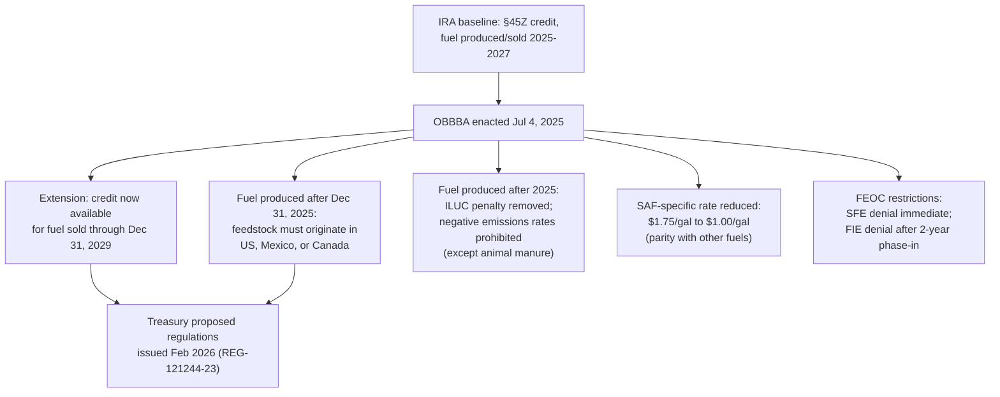

## Clean Fuel Production Credit Extension and Sourcing Rules

### Statutory Basis and Overview

Section 45Z, the Clean Fuel Production Credit, was created under the Inflation Reduction Act to consolidate a fragmented set of prior biofuel and alternative fuel incentives (income tax credits, excise tax credits, and excise tax payment provisions covering biodiesel, renewable diesel, compressed natural gas, second-generation biofuel, and sustainable aviation fuel (SAF)) into a single, technology-neutral production tax credit. Unlike most credits addressed elsewhere in this chapter, §45Z is not tied to a specific fuel type or production technology — eligibility is based solely on a fuel's lifecycle greenhouse gas emissions reduction relative to conventional petroleum-based fuels. OBBBA §70521 amends §45Z with a notable extension paired with substantially tightened sourcing and eligibility rules — making this credit, alongside §45Q, one of the few OBBBA-modified provisions that expands rather than contracts availability, while simultaneously imposing new domestic/North American sourcing guardrails.

### The Extension

**[Verified]** OBBBA extends §45Z from its original expiration (fuel produced and sold through December 31, 2027, under the IRA) to **fuel produced domestically after December 31, 2024, and sold by December 31, 2029** — a two-year extension of the credit's operative window. The Federal Register's own regulatory background confirms this: the credit "provides an income tax credit... for clean transportation fuel produced domestically after December 31, 2024, and sold by December 31, 2029."

| Parameter | Pre-OBBBA (IRA) | Post-OBBBA |
| --- | --- | --- |
| Credit window | Fuel produced/sold 2025 through 2027 | Fuel produced/sold through December 31, 2029 |
| Net effect | Baseline | Two-year extension |

### Base Credit Rate Structure (Unchanged Mechanically)

The underlying rate structure retains its IRA-era design: a base credit of **$0.20 per gallon**, rising to **$1.00 per gallon** for producers satisfying prevailing wage and apprenticeship (PWA) requirements, with the credit amount scaled based on the fuel's lifecycle GHG emissions rate — lower-emission fuels receive proportionally higher credit values within this framework.

### Sustainable Aviation Fuel (SAF) Rate Reduction — A Notable Cut Within an Extension

While the credit as a whole was extended, SAF specifically was reduced, and SAF was brought into rate parity with other transportation fuels under §45Z rather than retaining its previously enhanced treatment:

**[Verified]** The maximum per-gallon credit value available to SAF producers was reduced from **$1.75/gallon to $1.00/gallon** — eliminating the enhanced incentive SAF previously held relative to other qualifying fuels under §45Z, and establishing parity between SAF and other transportation fuels within the credit.

**[Inference]** This SAF-specific reduction, occurring within an overall credit extension, illustrates that "extension" and "enhancement" are not synonymous in this provision — practitioners advising SAF-focused clients should not assume the general narrative of §45Z as an industry-favorable outcome applies uniformly across all fuel categories within the credit; SAF producers specifically face a materially reduced per-gallon ceiling even as the credit's overall duration was extended.

### Feedstock Sourcing Restriction: The North American Rule

The most structurally significant change to §45Z is a new geographic sourcing restriction on eligible feedstocks:

**[Verified]** For fuel produced after December 31, 2025, only feedstocks **grown or produced in the United States, Mexico, or Canada** are eligible for the credit. Feedstocks sourced from outside North America are disqualified from generating §45Z credit value, regardless of the resulting fuel's emissions profile.

**Policy rationale and target effect:**

- The amendment was specifically designed to curb large-scale imports of **used cooking oil (UCO)**, which historically carried favorable (low) carbon intensity scores as a waste-derived feedstock, making imported UCO an attractive input for maximizing credit value under emissions-based scoring.
- There was reportedly increasing regulatory concern over potential fraud in imported feedstock supply chains — specifically, the possibility that virgin (non-waste) oils could be blended with or mislabeled as waste-derived UCO to improperly qualify for the more favorable carbon-intensity-based credit tier.
- The restriction supports a broad range of **domestic agricultural feedstocks** — including corn, soybeans, and other biomass-based materials — expanding market opportunities for North American farmers and agricultural producers as displaced import volume creates incremental domestic demand.

**[Inference]** This sourcing rule effectively re-directs the credit's economic benefit toward the North American agricultural sector, which stands in some tension with the credit's original emissions-based, technology-neutral design philosophy — a feedstock is now potentially excluded purely on geographic origin even if its lifecycle emissions profile would otherwise qualify it for a high credit tier. Supply chain diligence for any §45Z claimant must now track feedstock origin as an independent, binary eligibility gate, separate from the emissions-rate calculation itself.

### Additional Eligibility and Calculation Modifications

Beyond the headline extension and sourcing rule, OBBBA makes several other specific adjustments to §45Z:

- **Indirect Land Use Change (ILUC) penalty removed.** The credit's emissions calculation previously incorporated an ILUC penalty (an estimated emissions cost attributed to land-use changes indirectly caused by feedstock cultivation, such as converting forest or grassland to cropland). OBBBA removes this penalty from the emissions assessment, which broadens eligibility and generally increases calculated credit value for feedstocks that would otherwise have been penalized under the ILUC methodology.
- **Negative emissions rates prohibited (with an exception).** Negative emissions rates — which had allowed certain fuels to be scored as net-emissions-reducing beyond a simple zero baseline, thereby qualifying for enhanced credit value — are prohibited for fuels produced after 2025, **except for transportation fuel derived from animal manure**, which may retain a negative emissions rate as determined by the IRS.
- **Lowered lifecycle GHG assessment standards more broadly.** Commentary indicates the bill "lowers the lifecycle GHG assessment standards," which is described as significantly broadening credit eligibility and effectively allowing first-generation, food-based biofuels (e.g., corn ethanol, conventional biodiesel) to qualify more readily than they may have under the original, more stringent IRA-era GREET-model assessment approach.
- **No double credits.** Credits cannot be claimed for fuels produced from other fuels that already generated a §45Z credit, preventing credit-stacking across sequential processing stages of the same underlying feedstock or intermediate fuel product.
- **Coordination with the small agri-biodiesel producer credit.** OBBBA provides coordinating rules allowing both the small agri-biodiesel producer credit (§40A) and the §45Z credit to be claimed for the same qualifying gallons — a deliberate industry accommodation rather than an anti-abuse restriction, potentially incentivizing previously closed small biodiesel facilities to resume production.
- **Related excise tax credit extensions.** The bill separately extends the small producer biodiesel credit and provides coordinated extensions for related provisions (§§40A, 40B, and 6426(k)), reinforcing the overall favorable treatment of the broader biodiesel/renewable fuel ecosystem alongside the core §45Z changes.

### Foreign Entity of Concern (FEOC) Restrictions Applied to §45Z

Unlike §45V (clean hydrogen), which is largely exempt from FEOC rules, §45Z is subject to a full FEOC framework, mirroring the structure applied to §45Q:

- **Specified Foreign Entities (SFEs)**: Credits are denied entirely to specified foreign entities (China, Iran, North Korea, Russia).
- **Foreign-Influenced Entities (FIEs)**: Credits are denied to foreign-influenced entities as well, but only **after a two-year phase-in period** — giving FIE-adjacent claimants a longer compliance transition window than SFEs face.
- **Transferability preserved, with the same carve-out**: Transfer of §45Z credits to unrelated parties remains permitted, but transfer to specified foreign entities specifically is prohibited.

This FEOC structure for §45Z closely parallels the SFE-immediate/FIE-delayed pattern seen in §45Q, reinforcing that OBBBA applies a broadly consistent two-tier FEOC timing framework across the credits where FEOC restrictions do apply (as distinct from §45V's largely exempted treatment).

### Consolidated Timeline

### Regulatory Implementation Status

**[Verified]** Treasury and the IRS issued proposed regulations (REG-121244-23) implementing the §45Z changes on approximately February 3, 2026, addressing credit eligibility rules, emissions rate determination methodology, and certification/registration requirements. Key procedural notes:

- The proposed regulations confirm Treasury's intent to implement a **GREET-model-centered** clean fuels credit framework through 2029.
- A public comment period ran through approximately April 6, 2026 (60 days after Federal Register publication).
- A public hearing on the proposed rule was scheduled for May 28, 2026, in Washington, D.C.
- The proposed regulations address a specific mechanical question relevant to blended/commingled fuel: if a taxpayer sells transportation fuel held in common storage alongside other fuel with different emissions rates, the taxpayer is treated as selling a pro rata portion of each fuel type produced after December 31, 2024, and held in that common storage — a practical rule for facilities handling blended or commingled fuel streams from multiple feedstock sources with differing emissions profiles.

**[Inference]** Because these regulations were still in proposed (not final) form as of the public hearing date, practitioners should treat specific emissions-methodology and feedstock-verification mechanics as provisional pending finalization, and should monitor for the final rule before relying on granular calculation methodologies for client transactions with material dollar exposure.

### Practical and Structuring Implications

- **[Key Points]**
  - The credit extension through 2029 is a genuine industry-favorable outcome, but must be read alongside simultaneous restrictions — this is not an unqualified expansion.
  - Feedstock supply chain diligence is now a mandatory, geography-based eligibility gate: confirm North American (US/Mexico/Canada) origin for any feedstock used in fuel produced after December 31, 2025, independent of the fuel's calculated emissions rate.
  - SAF producers specifically should not assume favorable treatment from the general "45Z was extended" narrative — the SAF-specific per-gallon ceiling was cut by nearly half ($1.75 to $1.00), which may affect SAF project economics and offtake agreement pricing assumptions.
  - The removal of the ILUC penalty and prohibition on negative emissions rates (except animal manure) both affect the underlying emissions-rate calculation — producers should re-run credit-value projections using the revised methodology rather than relying on pre-OBBBA emissions assessments.
  - FEOC diligence for §45Z follows the SFE-immediate/FIE-two-year-phase-in pattern — track both entity categories on their respective timelines rather than treating FEOC compliance as a single uniform deadline.
  - Facilities handling blended or commingled fuel streams should monitor the finalized common-storage pro-rata allocation rule closely, as it directly affects credit calculation for any operation not maintaining fully segregated feedstock-to-fuel tracking.
  - Coordination opportunities exist for small biodiesel producers to claim both §40A and §45Z for the same gallons — previously closed facilities may find restart economics improved under this stacking allowance.

**Related Topics:**

- GREET model mechanics and lifecycle GHG emissions rate calculation methodology under the proposed §45Z regulations
- Feedstock verification and anti-fraud compliance for North American sourcing claims (particularly used cooking oil supply chains)
- SAF offtake agreement repricing in light of the $1.75-to-$1.00 per-gallon rate reduction
- Small agri-biodiesel producer credit (§40A) coordination and facility-restart economics
- FEOC specified foreign entity vs. foreign-influenced entity compliance timelines across §45Q and §45Z
- Common-storage pro-rata fuel allocation rules for blended-stream producers
- Comparative treatment of technology-neutral fuel credits (§45Z) vs. technology-specific generation credits (§§45Y/48E) under OBBBA