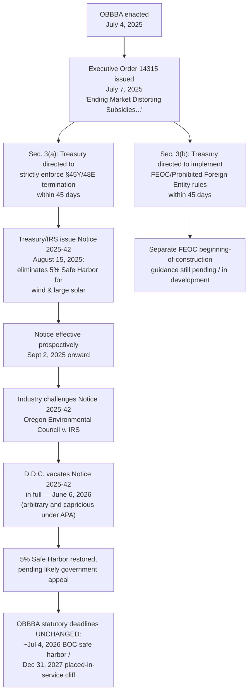

## The July 2025 Executive Order on Enforcement

### Correction Notice on Prior Item Content

**[Stated correction]** In an earlier item in this chapter ("Accelerated Phase-Out of Wind and Solar Credits" and "The Placed-in-Service Cliff and Construction Deadlines"), this content characterized the elimination of the 5% beginning-of-construction safe harbor under Notice 2025-42 as current, binding guidance. That characterization requires an explicit update: **on June 6, 2026, the U.S. District Court for the District of Columbia vacated Notice 2025-42 in full** in *Oregon Environmental Council v. IRS*, No. 25-4400 (D.D.C. June 6, 2026), finding the IRS acted arbitrarily and capriciously under the Administrative Procedure Act in eliminating the 5% Safe Harbor without adequately justifying the policy shift or addressing industry reliance interests. This item addresses the Executive Order itself in full, including this subsequent litigation development, since the two are directly connected.

### The Executive Order: Identification and Core Directive

**[Verified]** On **July 7, 2025** — three days after signing OBBBA into law — President Trump issued **Executive Order 14315**, titled **"Ending Market Distorting Subsidies for Unreliable, Foreign-Controlled Energy Sources."** The order directs federal agencies, principally the Department of the Treasury, to strictly enforce OBBBA's termination and restriction provisions for wind, solar, and foreign-linked energy sources.

**Core directive (Section 3(a) of the order):**

> Within 45 days following enactment of OBBBA, the Secretary of the Treasury shall take all action deemed necessary and appropriate to **strictly enforce the termination of the clean electricity production and investment tax credits under §§45Y and 48E** for wind and solar facilities.

**Second directive (Section 3(b) of the order):**

> Within the same 45-day window, the Secretary of the Treasury shall take prompt action to implement the enhanced **Foreign Entity of Concern (FEOC)** restrictions added by OBBBA §70512 — the "Prohibited Foreign Entities" provisions applicable to §§45Y and 48E, among other credits — including establishing separate beginning-of-construction rules specific to those FEOC provisions.

### Stated Policy Rationale

The Executive Order's title and framing make explicit the administration's stated rationale: characterizing wind and solar subsidies as "market distorting" and linking the order's second directive to concerns about "unreliable, foreign-controlled energy sources" — tying together two conceptually distinct concerns (intermittency/reliability of wind and solar generation, and foreign supply-chain/ownership influence) into a single enforcement mandate.

A specific anti-circumvention purpose is also explicit in the order's directive to Treasury: guidance was to be issued to prevent **"artificial acceleration or manipulation"** of credit eligibility — language directly targeting the concern that developers might use existing, comparatively low-friction beginning-of-construction safe harbors (particularly the cost-based 5% test) to lock in credit eligibility for projects that would not otherwise be completed within OBBBA's compressed timeline.

### Structural Relationship to OBBBA

The Executive Order does not itself amend the Internal Revenue Code or create new substantive tax rules — that authority rests with the enacted statute. Instead, EO 14315 functions as a directive shaping **how** Treasury exercises its existing regulatory and guidance authority in implementing OBBBA's already-enacted termination provisions. This is an important structural distinction:

- **OBBBA (statute)**: establishes the substantive termination dates and rules (e.g., the July 4, 2026 beginning-of-construction safe-harbor deadline and December 31, 2027 placed-in-service cliff for wind/solar under §§45Y/48E).
- **EO 14315 (executive directive)**: instructs Treasury on the *manner and rigor* of implementing and enforcing those statutory rules, particularly around the beginning-of-construction determination methodology.
- **Notice 2025-42 (agency guidance)**: Treasury and IRS's regulatory response implementing the EO's directive — and the specific guidance later challenged and vacated in court.

### Treasury's Implementing Response: Notice 2025-42

**[Verified]** On **August 15, 2025** — within the EO's 45-day window — Treasury and the IRS issued **Notice 2025-42**, which:

- Eliminated the traditional **5% cost-based safe harbor** as a method of establishing beginning of construction for **wind projects of any size** and **solar projects exceeding 1.5 MW (AC)**.
- Left the **Physical Work Test** as the sole available method for those affected projects.
- Preserved the 5% safe harbor only for small solar facilities at or below 1.5 MWac.
- Applied **prospectively only**, effective for projects beginning construction on or after **September 2, 2025** — not retroactively to projects that had already established beginning of construction under the pre-existing rules.
- Explicitly noted it did **not** address the separate beginning-of-construction rules required for the FEOC/Prohibited Foreign Entity provisions under EO Section 3(b), which Treasury indicated it was preparing separately.

This is the same Notice 2025-42 discussed in this chapter's earlier item on the placed-in-service cliff — presented there as the then-current operative guidance, which was accurate as of its issuance and for approximately ten months of subsequent applicability.

### The June 2026 Vacatur: Oregon Environmental Council v. IRS

**[Verified]** On **June 6, 2026**, Judge Colleen Kollar-Kotelly of the U.S. District Court for the District of Columbia issued a memorandum opinion in ***Oregon Environmental Council v. Internal Revenue Service***, No. 25-4400 (D.D.C. June 6, 2026), **vacating Notice 2025-42 in full** and remanding the matter to the IRS for further administrative proceedings.

**Key holdings and reasoning:**

- The court found the IRS's elimination of the 5% Safe Harbor for wind and solar (while retaining it for other technologies and small solar) was **"arbitrary and capricious"** under the Administrative Procedure Act (APA).
- The IRS was found to have offered only a **cursory justification** for the policy shift and did not meaningfully explain its stated concerns about circumvention or manipulation of eligibility.
- The court emphasized that **industry participants had relied on the 5% Safe Harbor for more than a decade**, and that the agency failed to adequately address this reliance interest or respond to alternative approaches raised during the process — a standard line of APA reasoned-decisionmaking analysis.
- The vacatur applies to **all affected taxpayers**, not merely the named plaintiffs.

**Immediate practical effect:**

- The pre-Notice framework is, on its face, restored: both the **Physical Work Test** and the **5% Safe Harbor** are once again available methods for establishing beginning of construction for wind and solar projects (including large-scale solar exceeding 1.5 MWac) under §§45Y and 48E.
- This restoration does **not** alter the underlying OBBBA statutory deadlines — the July 4/5, 2026 beginning-of-construction safe-harbor date and the December 31, 2027 placed-in-service cliff (discussed in this chapter's dedicated item) remain in effect regardless of the court's ruling on the safe-harbor methodology.

### Significant Uncertainty Remains — Practitioners Should Not Treat This as Settled

**[Verified]** Multiple contemporaneous legal analyses caution against treating the restored safe harbor as a secure, final planning basis:

- The government was expected to **seek a stay of the vacatur pending appeal** and to appeal on both jurisdictional and merits grounds.
- The court itself acknowledged that the **appellate timeline almost certainly extends past the July 4, 2026 beginning-of-construction deadline** — meaning developers relying on the restored safe harbor to meet that deadline could later find their reliance undermined by a subsequent appellate reversal.
- Because a reversal on appeal could have **retroactive effect**, market participants were cautioned not to treat the June 2026 decision as a permanently secure basis for beginning-of-construction determinations.
- On remand, the **IRS itself retains authority to issue new guidance** re-eliminating or otherwise modifying the 5% Safe Harbor, provided it engages in adequately reasoned APA-compliant decisionmaking this time — meaning the agency could, in principle, reach a similar substantive outcome to Notice 2025-42 through a more thoroughly justified rulemaking process.
- Practical timing constraints also apply: the 5% Safe Harbor generally requires **both paying for and receiving equipment** before the relevant deadline (with a limited exception for equipment reasonably expected to be delivered within three and a half months of payment) — meaning developers attempting to newly rely on the restored safe harbor this close to the July 2026 deadline may face practical logistics constraints independent of the legal question.

### Timeline of the Executive Order and Its Aftermath

### Enforcement Posture Overview (svg_diagram)

<svg xmlns="http://www.w3.org/2000/svg" viewBox="0 0 880 320">
<text x="440" y="28" text-anchor="middle" font-family="sans-serif" font-size="17" font-weight="bold" fill="#1a1a1a">EO 14315 Enforcement Chain — Status as of Sep 2026 (svg_diagram)</text>
<rect x="40" y="55" width="220" height="60" rx="6" fill="#1e3a8a" />
<text x="150" y="80" text-anchor="middle" fill="white" font-family="sans-serif" font-size="12" font-weight="bold">OBBBA statute</text>
<text x="150" y="98" text-anchor="middle" fill="white" font-family="sans-serif" font-size="10">§§45Y/48E termination rules</text>
<text x="150" y="110" text-anchor="middle" fill="white" font-family="sans-serif" font-size="10">(unaffected by court ruling)</text>
<line x1="260" y1="85" x2="330" y2="85" stroke="#666" stroke-width="2" marker-end="url(#arrow)" />
<rect x="330" y="55" width="220" height="60" rx="6" fill="#7c2d12" />
<text x="440" y="80" text-anchor="middle" fill="white" font-family="sans-serif" font-size="12" font-weight="bold">EO 14315 (Jul 7, 2025)</text>
<text x="440" y="98" text-anchor="middle" fill="white" font-family="sans-serif" font-size="10">Directs strict enforcement</text>
<text x="440" y="110" text-anchor="middle" fill="white" font-family="sans-serif" font-size="10">via Treasury guidance</text>
<line x1="550" y1="85" x2="620" y2="85" stroke="#666" stroke-width="2" />
<rect x="620" y="55" width="220" height="60" rx="6" fill="#b45309" />
<text x="730" y="80" text-anchor="middle" fill="white" font-family="sans-serif" font-size="12" font-weight="bold">Notice 2025-42 (Aug 2025)</text>
<text x="730" y="98" text-anchor="middle" fill="white" font-family="sans-serif" font-size="10">Eliminates 5% safe harbor</text>
<text x="730" y="110" text-anchor="middle" fill="white" font-family="sans-serif" font-size="10">for wind/large solar</text>
<line x1="730" y1="115" x2="730" y2="150" stroke="#dc2626" stroke-width="2" />
<rect x="620" y="150" width="220" height="60" rx="6" fill="#991b1b" />
<text x="730" y="175" text-anchor="middle" fill="white" font-family="sans-serif" font-size="12" font-weight="bold">Vacated (Jun 6, 2026)</text>
<text x="730" y="193" text-anchor="middle" fill="white" font-family="sans-serif" font-size="10">D.D.C. — Oregon Env. Council v. IRS</text>
<text x="730" y="205" text-anchor="middle" fill="white" font-family="sans-serif" font-size="10">arbitrary &amp; capricious (APA)</text>
<line x1="620" y1="180" x2="260" y2="180" stroke="#666" stroke-width="2" />
<line x1="260" y1="180" x2="260" y2="115" stroke="#666" stroke-width="2" />
<rect x="40" y="150" width="220" height="60" rx="6" fill="#166534" />
<text x="150" y="175" text-anchor="middle" fill="white" font-family="sans-serif" font-size="12" font-weight="bold">Current status</text>
<text x="150" y="193" text-anchor="middle" fill="white" font-family="sans-serif" font-size="10">5% safe harbor restored,</text>
<text x="150" y="205" text-anchor="middle" fill="white" font-family="sans-serif" font-size="10">pending likely appeal</text>
<rect x="40" y="235" width="800" height="55" rx="6" fill="#f3f4f6" stroke="#ccc" />
<text x="440" y="257" text-anchor="middle" font-family="sans-serif" font-size="11" font-style="italic">Statutory deadlines (Jul 2026 BOC / Dec 2027 placed-in-service) remain fixed throughout —</text>
<text x="440" y="273" text-anchor="middle" font-family="sans-serif" font-size="11" font-style="italic">only the METHOD of proving beginning-of-construction has been in flux via the EO/Notice/litigation chain.</text>
</svg>

### Practical and Strategic Implications for Tax Equity Practice

- **[Key Points]**
  - Executive Order 14315 is a directive to Treasury, not self-executing tax law — its practical effect on eligibility flows through the agency guidance it produces (Notice 2025-42), which is itself now vacated and in litigation flux.
  - As of the current knowledge state, both the Physical Work Test and the 5% Safe Harbor are technically available methods for establishing beginning of construction for wind and solar projects — but this status is explicitly unsettled pending likely government appeal.
  - Developers and tax equity investors should treat any beginning-of-construction determination made in reliance on the restored 5% Safe Harbor as carrying **retroactive reversal risk** if the government succeeds on appeal — deal documentation drafted during this window should consider indemnification or risk-allocation provisions addressing this specific contingency.
  - The FEOC-specific beginning-of-construction guidance directed by EO Section 3(b) remains a **separate, still-developing** regulatory track, independent of the wind/solar Notice 2025-42 litigation — do not conflate the two when advising on compliance timelines.
  - The underlying OBBBA statutory deadlines (the ~July 4, 2026 beginning-of-construction safe-harbor date and the December 31, 2027 placed-in-service cliff) are unaffected by this litigation and remain the fixed planning boundary regardless of how the safe-harbor-methodology question is ultimately resolved.
  - This episode is a useful illustrative case study in a broader pattern relevant across this chapter: OBBBA's statutory termination dates are comparatively stable, but the *implementing guidance* governing how taxpayers prove compliance with those dates has been, and may continue to be, subject to significant administrative and judicial volatility. Practitioners should treat implementing guidance as a distinctly higher-volatility layer than the underlying statute when advising on active transactions.

**Related Topics:**

- Oregon Environmental Council v. IRS: appellate proceedings and potential Supreme Court review
- APA "arbitrary and capricious" standard as applied to Treasury/IRS energy tax guidance
- Practical mechanics and equipment-delivery timing constraints of the 5% Safe Harbor test
- Forthcoming FEOC-specific beginning-of-construction guidance under EO 14315 Section 3(b)
- Risk allocation drafting for tax-equity deals executed during periods of guidance uncertainty
- Comparative agency enforcement posture across §§45Y, 48E, 45X, 45Q, and 45V post-OBBBA
- Precedential effects of this litigation on other OBBBA-implementing Treasury guidance