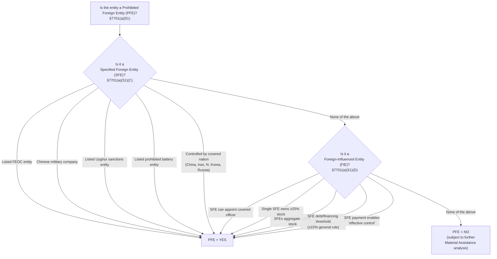

## Defining Prohibited Foreign Entities

### Statutory Home: New Code Section 7701(a)(51)–(52)

OBBBA §70521 (and related sections) adds new statutory definitions to the Internal Revenue Code's general definitions section, §7701(a), establishing the "Prohibited Foreign Entity" (PFE) framework that applies across multiple clean energy credits. The foundational definition is deliberately structured as an umbrella term:

**[Verified]** New Code §7701(a)(51) provides: **"the term 'prohibited foreign entity' means a specified foreign entity or a foreign influenced entity."**

This single sentence establishes the core architecture: **PFE = SFE ∪ FIE** — a Prohibited Foreign Entity is defined as the union of two distinct, independently-defined entity categories, each with its own criteria. Understanding PFE compliance requires separately analyzing whether an entity is an SFE, then separately analyzing whether it is an FIE — an entity failing either independent test is a PFE.

### Category 1: Specified Foreign Entity (SFE)

**[Verified]** Under §7701(a)(51)(C), a Specified Foreign Entity is an entity that meets **any one** of five distinct statutory criteria (this is a disjunctive, "any of the following" test — meeting a single criterion is sufficient):

1. **Listed FEOC entity**: An entity listed as a "foreign entity of concern" under existing national defense and security statutes.
2. **Chinese military company**: An entity determined to be a Chinese military company operating in the United States, per an existing statutory definition.
3. **Listed Uyghur sanctions entity**: An entity appearing on an existing statutory Uyghur forced-labor/sanctions list.
4. **Listed prohibited battery entity**: An entity appearing on an existing statutory list of prohibited battery-sector entities.
5. **Foreign-government-controlled entity from a covered nation**: An entity controlled by a government, citizen, or entity organized in a **"covered nation"** — defined elsewhere in the framework as **China, Iran, North Korea, and Russia**.

**[Verified]** A related but distinct concept — "foreign-controlled entity" — is separately relevant: under §7701(a)(51)(C), this generally refers to an entity for which a covered nation has certain indicia of control, and includes: (a) a person who is a citizen or national of a covered nation (excluding U.S. citizens, nationals, or lawful permanent residents); (b) an entity or qualified business unit incorporated or organized under the laws of, or with its principal place of business in, a covered nation; or (c) an entity or subsidiary controlled (as determined under the statute's control rules) by an entity meeting either of the preceding descriptions.

**[Inference]** Because SFE status is drawn substantially from pre-existing statutory lists and definitions (Chinese military company lists, Uyghur sanctions lists, prohibited battery entity lists) rather than newly created OBBBA-specific criteria, compliance teams already conducting sanctions and export-control screening for other regulatory purposes may find meaningful overlap with existing due-diligence infrastructure — though the covered-nation control test (criterion 5) is the OBBBA-specific addition requiring dedicated new analysis.

### Category 2: Foreign-Influenced Entity (FIE)

**[Verified]** Under §7701(a)(51)(D)(i), a Foreign-Influenced Entity is an entity with respect to which, **during the taxable year**, **any one** of several relationship criteria exists between the entity and an SFE:

1. **Officer appointment authority**: An SFE has direct (or indirect, per some summaries) authority to appoint a **covered officer** of the entity. A "covered officer" is defined broadly to include a member of the board of directors or an executive-level officer such as the president, CEO, COO, CFO, general counsel, or senior vice president.
2. **Single-SFE ownership threshold**: A single SFE owns **at least 25%** of the entity's stock (by vote or value, subject to the statute's specific measurement rules).
3. **Aggregate-SFE ownership threshold**: SFEs, in the aggregate, own **at least 40%** of the entity's stock.
4. **Debt/financing-based control threshold**: A general rule under §7701(a)(51)(D)(i)(I)(dd) sets a threshold described as **"at least 15 percent"** — relevant in the debt-issuance context, where SFE lenders collectively holding at least this threshold of an issuer's debt can trigger FIE status. A specialized rule under §7701(a)(51)(E)(iii)(II) applies a modified threshold for entities with publicly traded debt.
5. **Effective-control payment test**: A payment made to an SFE that allows the SFE to exercise **"effective control"** over a qualified facility (under §§48E/45Y), energy storage technology, or an eligible component (under §45X). "Effective control" is defined in the statute as arising from a contract or licensing agreement that allows a foreign party to exert influence over the production of components, or over generation or storage.

**[Unverified as to full clarity]** Industry commentary has specifically flagged that the rules defining what constitutes "effective control" under the payment-based test are **unclear**, and the statute directs Treasury to issue implementing guidance defining this term more precisely. Practitioners should treat the effective-control prong as the least settled of the FIE criteria pending that forthcoming guidance, and should not assume a given contractual or licensing arrangement clearly falls outside this test without careful, fact-specific analysis.

### Consolidated Decision Structure

### The Related, Distinct Concept: Material Assistance from a PFE

Being classified as a PFE (i.e., the entity itself is an SFE or FIE) is analytically distinct from, though closely related to, the separate concept of a project or component receiving **"material assistance from a prohibited foreign entity"** — a distinct disqualification test defined under new §7701(a)(52). This distinction is critical for accurate compliance analysis:

- **PFE status (§7701(a)(51))**: A question about the **claimant/taxpayer's own identity or ownership structure** — is the taxpayer itself an SFE or FIE?
- **Material assistance (§7701(a)(52))**: A question about the **supply chain of a specific project or component** — did a qualified facility, energy storage technology, or eligible component receive a disqualifying level of assistance (inputs, services, financing) from a PFE, regardless of who ultimately claims the credit?

**[Verified]** A taxpayer can be fully compliant on the PFE-status question (i.e., not itself an SFE or FIE) and still be disqualified from a credit if its project or component received excessive material assistance from a PFE elsewhere in the supply chain — meaning full compliance requires clearing **both** independent tests, not merely one.

### Material Assistance Cost Ratio (MACR) Mechanics — Brief Overview

**[Verified]** Section 7701(a)(52) establishes that "material assistance from a PFE" is measured via a **Material Assistance Cost Ratio (MACR)** — the disqualification test applies when the MACR falls **below** a specified threshold percentage (i.e., insufficient non-PFE-sourced cost content triggers disqualification). Key structural features:

- The threshold percentages vary by **calendar year** in which construction of the qualified facility or energy storage technology begins, and by **component type** for eligible components under §45X (solar, wind, inverter, battery, critical mineral each have separately specified thresholds).
- **[Unverified as to precise figures]** The specific numerical threshold percentages by year and component type are detailed in the statute and in subsequent IRS guidance (Notice 2026-15, discussed below); given the granularity and year-by-year variation of these figures, practitioners should consult the current authoritative table directly rather than relying on a generalized summary for any transaction-specific compliance determination.
- One commentary letter to Treasury specifically argued that the MACR calculation under §7701(a)(52)(D)(ii) should take into account only the **taxpayer's own costs**, not costs incurred by the taxpayer's suppliers — indicating this is an area where the precise scope of cost inclusion was, at least initially, subject to interpretive dispute pending clearer guidance.

### First Implementing Guidance: Notice 2026-15

**[Verified]** Treasury and the IRS released **Notice 2026-15**, providing the first substantial guidance on the PFE rules as enacted by OBBBA. Key confirmed points from this guidance:

- It clarifies and organizes existing general guidance under §7701(a)(52)(D) regarding how to determine whether a project has received a disqualifying amount of material assistance from a PFE.
- It confirms that qualified facilities and energy storage technology eligible for §§45Y/48E credits **exclude** any facility whose construction begins after **December 31, 2025** and which includes any material assistance from a PFE.
- It confirms that eligible components under §45X **exclude** any property sold in taxable years beginning after **July 4, 2025** if the property includes any material assistance from a PFE.
- Notably, the guidance is described as affirming a **"draconian view of licensing arrangements"** for purposes of determining "effective control" — suggesting Treasury has taken a stringent interpretive posture on the FIE effective-control prong discussed above, though the precise contours of this stringency should be confirmed against the Notice's full text for any specific licensing structure under review.

### Related Structural Provisions

OBBBA's PFE framework is accompanied by several supporting statutory mechanics that reinforce the definitional structure:

- **New Code §6695B**: creates a distinct penalty provision associated with PFE compliance.
- **Amendments across multiple credit sections**: §§45Q, 45U, 45X, 45Y, 45Z, 48E, 50, 139L, 6417, and 6418 were all amended to incorporate cross-references to the new PFE definitions, confirming the framework's broad applicability across the clean energy credit landscape (not merely §§45Y/48E/45X as sometimes summarized).
- **Extended statute of limitations and penalties**: OBBBA extends the statute of limitations and establishes significant penalties specifically for errors and understatements associated with the MACR calculation — reflecting a deliberate compliance-enforcement design choice, not merely a definitional add-on. (§6501 was amended for statute-of-limitations purposes; §6662 for penalty purposes.)
- **Continuity with existing beginning-of-construction guidance**: §7701(a)(51)(J) references the IRS's existing beginning-of-construction notices (Notice 2013-29 and Notice 2018-59), and §7701(a)(52)(F) incorporates "rules similar" to that provision by reference — though commentary has flagged some internal drafting ambiguity, since §7701(a)(51) itself does not otherwise use the phrase "beginning of construction." The prevailing interpretive view is that "beginning of construction" is intended to be applied consistently throughout the PFE framework despite this textual wrinkle.

### Practical Compliance Framework

**[Key Points]**

- Compliance analysis requires two independent, sequential determinations: (1) is the **claimant entity itself** a PFE (SFE or FIE)? and (2) did the **specific project or component** receive disqualifying material assistance from a PFE (MACR analysis)? Passing one test does not establish compliance on the other.
- SFE status draws heavily on pre-existing sanctions and national-security entity lists — compliance teams should integrate PFE screening with existing export-control and sanctions-screening infrastructure where practical, while adding dedicated analysis for the covered-nation control criterion.
- FIE status requires ongoing, **taxable-year-by-taxable-year** monitoring of ownership percentages (25% single-SFE / 40% aggregate-SFE thresholds), officer-appointment rights, debt-holding concentrations (15% general threshold, modified for publicly traded debt), and any licensing or contractual arrangements that could constitute "effective control" — this is not a one-time diligence exercise but a recurring compliance obligation.
- The "effective control" prong of the FIE test remains the least definitionally settled area pending full Treasury guidance, and Notice 2026-15's reportedly stringent interpretive posture toward licensing arrangements should be reviewed carefully for any transaction involving foreign licensing or technology-transfer agreements.
- Debt financing structures require specific attention: lenders and note purchasers should be screened for SFE status, and aggregate SFE debt-holding percentages should be tracked against the 15% (or modified publicly-traded-debt) threshold, as reflected in representations-and-warranties practice already emerging in project finance loan documentation.
- Different effective dates apply to different credit categories under the material assistance framework (December 31, 2025 construction-commencement threshold for §§45Y/48E facilities; July 4, 2025 taxable-year threshold for §45X components) — do not assume a uniform single effective date applies across all PFE-affected credits.

**Related Topics:**

- Material Assistance Cost Ratio (MACR) threshold tables by year and component type
- Notice 2026-15's "effective control" licensing-arrangement guidance in detail
- Debt issuance and lending representations addressing SFE/FIE status in project finance documentation
- §45X-specific PFE compliance timeline versus §§45Y/48E timeline differences
- Statute of limitations extension and penalty exposure under §§6501/6662 for MACR errors
- Interaction between PFE rules and the beginning-of-construction safe-harbor litigation (Notice 2025-42 vacatur)
- Covered nation designation criteria and potential for future expansion beyond China, Iran, North Korea, and Russia