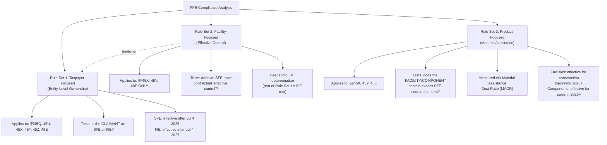

## Taxpayer-Focused, Facility-Focused, and Product-Focused Rules

### Overview: Three Independent Rule Sets

OBBBA's Prohibited Foreign Entity (PFE) framework is not a single unified test — it is composed of **three analytically distinct rule sets**, each operating at a different level of the compliance analysis and each carrying its own effective date. Tax Law Center commentary frames this explicitly: the PFE framework consists of three new sets of rules, and understanding them as separate, independently-applied tests (rather than one combined test) is essential to accurate compliance work. This item organizes the framework using a taxpayer/facility/product framing that maps directly onto the industry's own three-part structural description of the rules.

**The three rule sets, at a glance:**

| Rule Set | What It Tests | Level of Analysis | Applies To |
| --- | --- | --- | --- |
| Taxpayer-focused (entity-level / ownership) | Is the **claimant itself** a PFE? | Entity identity/ownership | §§45Q, 45U, 45X, 45Y, 45Z, 48E |
| Facility-focused (effective control) | Does an SFE exercise **effective control** over the facility via contract/licensing? | Contractual/operational control | §§45X, 45Y, 48E only |
| Product-focused (material assistance) | Did the **facility, EST, or component** receive too much PFE-sourced content? | Supply chain / cost composition | §§45X, 45Y, 48E |

### Rule Set 1: Taxpayer-Focused (Entity-Level Ownership) Rules

**[Verified]** This is the most straightforward of the three rule sets: it disallows the applicable credit outright if the **claiming taxpayer itself** is a Prohibited Foreign Entity — either a Specified Foreign Entity (SFE) or a Foreign-Influenced Entity (FIE), as defined under §7701(a)(51).

**Scope**: This entity-level rule applies broadly across §§45Q, 45U, 45X, 45Y, 45Z, and 48E — the widest applicability of the three rule sets.

**Effective dates** (these differ between the two PFE sub-categories):

- **SFE prohibition**: applies to taxable years beginning after **July 4, 2025** — meaning, for a calendar-year taxpayer, effectively starting **January 1, 2026**.
- **FIE prohibition**: applies to taxable years beginning after **July 4, 2027** — meaning, for a calendar-year taxpayer, effectively starting **January 1, 2028**. This is a materially later effective date than the SFE prohibition, giving FIE-adjacent taxpayers roughly two additional years of compliance runway.

**[Inference]** This staggered SFE/FIE effective-date structure recurs across multiple credits in this chapter (§45Q and §45Z were noted elsewhere as following the same pattern) and appears to be a deliberate, consistent design choice — a shorter transition period for the more clearly problematic SFE category, and a longer transition period for the more attenuated, influence-based FIE category, presumably reflecting the greater compliance complexity of unwinding indirect ownership and control relationships relative to identifying entities on established sanctions-type lists.

### Rule Set 2: Facility-Focused (Effective Control) Rules

**[Verified]** This is a narrower, more specific rule set nested within the broader FIE definition: an entity is treated as an FIE — and therefore fails the taxpayer-focused test above — if it made payments to an SFE pursuant to a **contract, agreement, or other arrangement** that provides the SFE (or a related entity) with **"effective control"** over a project, the production of components, or extraction/processing activity.

**Scope**: This rule applies **only** to §§45X, 45Y, and 48E — notably narrower than the taxpayer-focused rule's broader six-credit applicability, and it does not extend to §§45Q, 45U, or 45Z.

**Mechanism**: Rather than looking at ownership percentages or officer-appointment rights (the standard FIE ownership/control criteria), this test looks specifically at **contractual and licensing structures** — e.g., a licensing agreement that gives a foreign counterparty operational influence over how components are manufactured, or how a facility generates or stores energy, even absent any formal equity ownership stake.

**[Unverified as to full clarity]** Multiple independent sources describe this "effective control" standard as one of the least settled areas of the entire PFE framework — the rules are characterized as "complex and, in key respects, unclear," with Treasury and IRS guidance to date described as limited on this specific point. Notice 2026-15 reportedly affirms a stringent ("draconian," per one law firm's characterization) interpretive posture toward licensing arrangements specifically, but the precise contours of what contractual terms trigger effective control — as opposed to ordinary, non-disqualifying commercial licensing — require careful, fact-specific legal analysis against the current guidance rather than a generalized rule of thumb.

### Rule Set 3: Product-Focused (Material Assistance) Rules

**[Verified]** This is the rule set most commonly discussed under the "material assistance" heading (introduced in this chapter's prior item) — it operates independently of the taxpayer's own entity status and instead evaluates whether the **facility, energy storage technology (EST), or component itself** was built or manufactured using too much PFE-sourced content, regardless of who ultimately claims the credit.

**Scope**: Applies to §§45X, 45Y, and 48E — the same three-credit scope as the effective-control rule, and narrower than the six-credit taxpayer-focused rule.

**Mechanism — the Material Assistance Cost Ratio (MACR)**:

- Material assistance is measured via a cost-based calculation comparing **total direct costs** to the portion of costs attributable to PFE-produced or PFE-sourced items.
- Two distinct MACR calculations exist: the **Clean Electricity MACR** (applicable to qualified facilities and energy storage technology under §§45Y/48E) and the **Eligible Component MACR** (applicable to §45X components).
- The credit is denied if the MACR falls below the specified threshold percentage for the relevant year and category — essentially, "too much of the facility or EST was produced by PFEs."

**Effective dates**:

- For qualified facilities and energy storage technology (§§45Y/48E): applies to construction **beginning in 2026 or later** (i.e., construction beginning after December 31, 2025).
- For eligible components (§45X): applies to components **sold in 2026 or later**.
- **[Verified]** Projects that begin construction before January 1, 2026 are **not** subject to the project-level material assistance requirements at all — though they remain subject to the separate entity-level (taxpayer-focused) restrictions beginning in the taxpayer's first taxable year after OBBBA's enactment.

### Structural Relationship Between the Three Rule Sets

### Why the Distinction Matters: Independent Failure Points

**[Key Points]**

- A taxpayer can be entirely clean on Rule Set 1 (not itself an SFE or FIE by ownership) and still fail Rule Set 2 if a licensing arrangement inadvertently grants an SFE effective control — this is a distinct failure mode requiring separate contractual review, not merely a cap-table review.
- A taxpayer can pass both Rule Set 1 and Rule Set 2 and still fail Rule Set 3 if the physical facility or component was built with excessive PFE-sourced material inputs — meaning supply-chain sourcing diligence is required even for an entity with a completely clean ownership and contractual structure.
- Because Rule Sets 2 and 3 apply only to §§45X, 45Y, and 48E, while Rule Set 1 applies more broadly to six credits, a project claiming, for example, §45Q or §45Z credits faces **only** the entity-level ownership test — not the effective-control or material-assistance tests — simplifying (relative to wind/solar/manufacturing projects) but not eliminating the compliance burden for those credit categories.
- The pre-2026 construction grandfathering for Rule Set 3 (material assistance) does **not** extend to Rule Set 1 (entity-level ownership) — a project that began construction in 2024 avoids the material-assistance/MACR analysis entirely, but its owning taxpayer must still separately confirm it is not itself an SFE (as of taxable years beginning after July 4, 2025) or FIE (as of taxable years beginning after July 4, 2027).

### Additional Structural Notes: Public Companies and One-Directional Influence

**[Verified]** Two additional structural nuances affect how these three rule sets are applied in practice:

- **Asymmetric influence rule**: Specified Foreign Entities can provide the "influence" that creates Foreign-Influenced Entities, but Foreign-Influenced Entities generally **cannot** similarly convert other entities into PFEs — meaning the FIE-creating influence chain runs from SFEs downward, and does not compound through multiple tiers of FIE-to-FIE relationships in the same manner.
- **Public company treatment differs**: Certain public companies receive different treatment under the PFE entity requirements — some are exempted from parts of the standard foreign-influenced-entity definition, but are correspondingly subject to **additional**, distinct foreign-controlled and foreign-influenced entity requirements not applicable to other entities. This creates a materially different compliance pathway for publicly traded claimants that should not be analyzed using the same criteria applied to privately held entities.

### Anti-Circumvention Posture and Forthcoming Guidance

**[Verified]** Executive Order 14315's Section 3(b) directive (discussed in this chapter's earlier item on the July 2025 Executive Order) specifically targeted this framework, and subsequent commentary notes an anti-circumvention rule exists that may signal the IRS will take an increasingly prohibitive interpretive approach over time, particularly regarding the effective-control standard. Separately, the statute itself requires the IRS to release guidance specifically on identifying PFEs no later than **December 31, 2026** (per §7701(a)(51)(D)(iii)) — meaning further authoritative clarification on multiple open questions across all three rule sets remains forthcoming even beyond the interim Notice 2026-15 guidance already issued.

### Practical Compliance Checklist

- **[Key Points]**
  - Run all three rule sets as independent, sequential compliance gates — passing one does not establish passing the others.
  - For credits with narrower scope (§§45Q, 45U, 45Z), confirm only Rule Set 1 (entity-level ownership) applies; do not over-apply the effective-control or material-assistance analysis to these credits.
  - Track the SFE (2026) vs. FIE (2028) effective-date distinction separately for entity-level compliance planning — do not treat these as a single combined deadline.
  - Review all foreign licensing, technology-transfer, and operational-service agreements specifically for "effective control" exposure under Rule Set 2, independent of standard ownership-percentage cap table review.
  - For §§45X/45Y/48E projects beginning construction before January 1, 2026, confirm the material-assistance/MACR analysis (Rule Set 3) is not yet applicable — but do not assume this also exempts the project from the entity-level ownership test (Rule Set 1), which runs on a separate timeline.
  - Flag publicly traded claimant entities for a distinct compliance pathway under the modified public-company PFE rules rather than applying standard private-entity criteria.
  - Monitor for the IRS's statutorily mandated PFE-identification guidance due no later than December 31, 2026, as this may materially clarify or alter current interim compliance approaches across all three rule sets.

**Related Topics:**

- Material Assistance Cost Ratio (MACR) calculation mechanics and the three interim safe harbors under Notice 2026-15
- "Effective control" licensing-arrangement analysis and Notice 2026-15's interpretive posture
- Public company-specific PFE compliance pathway and exemption structure
- Battery storage industry-specific PFE compliance challenges (Section 45X and 48E overlap)
- Forthcoming December 31, 2026 IRS PFE-identification guidance
- Cross-credit comparison of PFE rule-set applicability (six-credit vs. three-credit scope)
- Anti-circumvention enforcement posture under Executive Order 14315 as applied to effective-control determinations