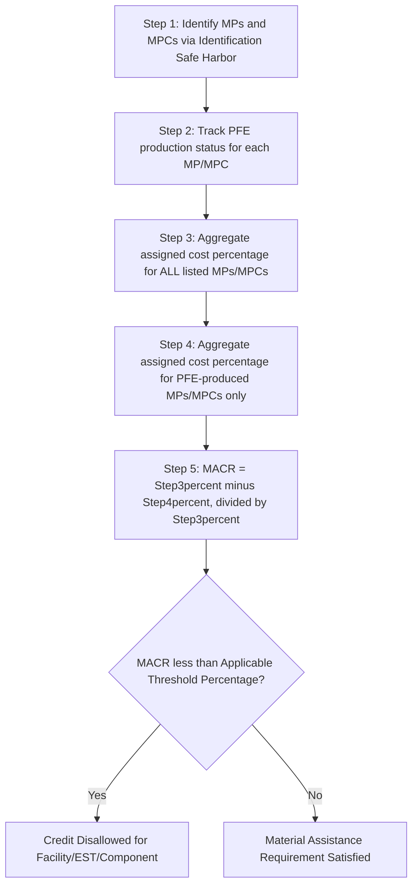

## The Material Assistance Cost Ratio Calculation

### Overview

The Material Assistance Cost Ratio ("MACR") is the core computational mechanism introduced by the One Big Beautiful Bill Act ("OBBBA") and elaborated in **IRS Notice 2026-15** (issued February 12, 2026) to determine whether a clean energy project, energy storage technology, or manufactured component has received disqualifying "material assistance" from a Prohibited Foreign Entity ("PFE"), sometimes colloquially referred to as a Foreign Entity of Concern ("FEOC"). MACR is a cost-based ratio: it compares the total direct costs of manufactured products and components incorporated into a qualified facility, energy storage technology (EST), or eligible component against the portion of those costs attributable to items produced, mined, extracted, or sourced by a PFE. For qualified facilities and energy storage technologies, the Clean Electricity MACR equals total direct costs of manufactured products and components incorporated into the facility or EST at completion, reduced by the direct costs of items that were sourced from a PFE. If the resulting ratio falls below the statutorily mandated Applicable Threshold Percentage, the credit is disallowed in full for that facility, EST, or component. [McGuireWoods](https://www.mcguirewoods.com/client-resources/alerts/2026/3/irs-releases-initial-feoc-guidance-answers-key-questions-leaves-others-unanswered/)

MACR governs eligibility for three credit regimes: the Clean Electricity Investment Tax Credit (§48E, "CEITC"), the Clean Electricity Production Tax Credit (§45Y, "CEPTC"), and the Advanced Manufacturing Production Credit (§45X).

### Statutory and Administrative Basis

- **Enacting statute**: OBBBA added the PFE/material assistance restrictions to IRC §7701(a)(52) (defining "material assistance") and related definitional provisions at §7701(a)(51) (defining "prohibited foreign entity" and "foreign-influenced entity").
- **Primary interim guidance**: IRS Notice 2026-15, released February 12, 2026, provides interim guidance on the PFE regime and its MACR test applicable to clean electricity projects claiming credits under Sections 45Y and 48E, and advanced manufacturing production credits under Section 45X. [McGuireWoods](https://www.mcguirewoods.com/client-resources/alerts/2026/3/irs-releases-initial-feoc-guidance-answers-key-questions-leaves-others-unanswered/)
- **Scope of applicability**: The material assistance requirement applies only to facilities for which construction begins for tax purposes on or after January 1, 2026. For Section 45X, the restrictions apply to eligible components sold in taxable years beginning after July 4, 2025. [Mondaq](https://www.mondaq.com/unitedstates/energy-law/1749708/new-irs-guidance-clarifies-material-assistance-feoc-requirements)[Pillsbury Winthrop Shaw Pittman](https://www.pillsburylaw.com/en/news-and-insights/irs-notice-2026-15-material-assistance.html)
- **Reliance period**: A taxpayer may rely on the rules provided in the notice to calculate the material assistance cost ratio for any Section 45Y or 48E qualified facility or energy storage technology the construction of which begins after Dec. 31, 2025, until 60 days after the publication of the forthcoming safe harbor tables, and for any Section 45X eligible components sold in taxable years beginning after July 4, 2025, until the date that the forthcoming safe harbor tables are published. [Internal Revenue Service](https://www.irs.gov/newsroom/treasury-irs-provide-guidance-for-certain-energy-tax-credits-regarding-material-assistance-provided-by-prohibited-foreign-entities-under-the-one-big-beautiful-bill)
- **Beginning-of-construction distinction**: [Inference] The MACR framework operates on a distinct beginning-of-construction concept from the traditional four-year continuity safe harbor doctrine. The MACR guidance does not address the "beginning of construction" for purposes of applying the PFE requirements, though it confirms that Notice 2025-42 — guidance on beginning of construction for solar and wind facilities — does not apply to the PFE requirements. This means taxpayers must track two potentially different BOC dates for the same project: one for general ITC/PTC continuity purposes and one for PFE/MACR purposes. [Mondaq](https://www.mondaq.com/unitedstates/energy-law/1749708/new-irs-guidance-clarifies-material-assistance-feoc-requirements)
- **Gaps left for future regulations**: The notice does not fully address how to apply the 25% single-owner and 40% aggregate ownership thresholds, the 15% debt attribution test, governance and veto rights, licensing and intellectual property arrangements (including the 10-year royalty rule), or the broader scope of "effective control" in commercial contracts. [Novogradac](https://www.novoco.com/notes-from-novogradac/managing-the-interim-feoc-guidance-irs-notice-2026-15-addresses-material-assistance-for-sections-45y-48e-and-45x-deferring-on-broader-pfe-status-guidance)

### Core MACR Formulas

There are two structurally distinct MACR calculations depending on the credit at issue.

**Clean Electricity MACR (§45Y / §48E — Qualified Facilities and Energy Storage Technologies)**

$$\text{Clean Electricity MACR} = \frac{\text{Total Direct Costs} - \text{Direct Costs of PFE-Sourced MPs/MPCs}}{\text{Total Direct Costs}}$$

A critical distinction is that the 45Y/48E MACR includes both direct material and direct labor costs. The ratio is calculated separately for each qualified facility or energy storage technology, with the applicable threshold keyed to the calendar year in which construction begins. MACR for Sections 48E and 45Y is calculated using the taxpayer's acquisition cost of manufactured products incorporated into the facility; project owners are not required to reconstruct the manufacturer's internal cost structure. Instead, manufacturers certify the portion of product costs attributable to PFE-produced components, and the remaining portion of the acquisition cost is treated as non-PFE cost. [Alvarez & Marsal](https://www.alvarezandmarsal.com/thought-leadership/irs-issues-notice-2026-15-first-guidance-on-prohibited-foreign-entity-rules-for-energy-tax-credits)[Baker Tilly](https://www.bakertilly.com/insights/treasury-releases-interim-feoc-macr-safe-harbor-guidance)

**Section 45X Eligible Component MACR**

$$\text{45X MACR} = \frac{\text{Aggregate Cost \% of Listed MPCs} - \text{Aggregate Cost \% of PFE-Sourced MPCs}}{\text{Aggregate Cost \% of Listed MPCs}}$$

The §45X MACR includes direct material costs only — unlike the facility calculation, the Section 45X MACR does not incorporate labor costs, and is determined separately for each eligible component sold during the taxable year. [Inference] This narrower, materials-only scope reflects the manufacturing-credit orientation of §45X, as opposed to the project-completion orientation of §45Y/§48E. [Alvarez & Marsal](https://www.alvarezandmarsal.com/thought-leadership/irs-issues-notice-2026-15-first-guidance-on-prohibited-foreign-entity-rules-for-energy-tax-credits)[Novogradac](https://www.novoco.com/notes-from-novogradac/managing-the-interim-feoc-guidance-irs-notice-2026-15-addresses-material-assistance-for-sections-45y-48e-and-45x-deferring-on-broader-pfe-status-guidance)

### Key Defined Terms

- **Manufactured Product (MP)**: A discrete manufactured item incorporated into the facility or EST (e.g., a solar module, an inverter, a wind turbine nacelle).
- **Manufactured Product Component (MPC)**: A sub-component incorporated into an MP (e.g., a battery cell within a battery module, a photovoltaic cell within a solar module).
- **Constituent Material**: Raw or processed materials incorporated into an MPC (relevant specifically for §45X purposes, e.g., polysilicon, battery-grade lithium).
- **Prohibited Foreign Entity (PFE)**: An entity meeting statutory ownership, control, or influence thresholds tied to specified foreign countries (definitional details, including the 25% single-owner/40% aggregate ownership thresholds and the 15% debt attribution test, remain subject to forthcoming proposed regulations).
- **Foreign-Influenced Entity**: Under forthcoming proposed regulations, if a taxpayer makes a payment to a specified foreign entity under any IP licensing agreement with respect to a project, facility, or component, and the agreement was entered into or modified on or after July 4, 2025, the specified foreign entity will be treated as exercising effective control over the project, facility, or component, and the taxpayer will be considered a foreign-influenced entity. If considered a foreign-influenced entity, the applicable project, facility, or component will not qualify for the Code Section 45Y, 48E, or 45X credit. [Bracewell LLP](https://www.bracewell.com/resources/treasury-and-irs-issue-guidance-on-foreign-entity-of-concern-rules-for-clean-energy-tax-credits/)[Bracewell LLP](https://www.bracewell.com/resources/treasury-and-irs-issue-guidance-on-foreign-entity-of-concern-rules-for-clean-energy-tax-credits/)

### Applicable Threshold Percentages

**Key Points**

For calendar year 2026, the thresholds are: 40% for qualified facilities and 55% for energy storage technologies. The higher thresholds for energy storage (55% vs. 40% in 2026) and battery/critical mineral components (60% vs. 50%) reflect heightened concern about supply chain dependence on Chinese manufacturers in those sectors. [A&O Shearman](https://www.aoshearman.com/en/insights/irs-publishes-guidance-for-the-purposes-of-determining-material-assistance)[Alvarez & Marsal](https://www.alvarezandmarsal.com/thought-leadership/irs-issues-notice-2026-15-first-guidance-on-prohibited-foreign-entity-rules-for-energy-tax-credits)

For Section 45X components, thresholds vary by technology and phase up over time: the threshold percentage is 50% for solar energy components sold in 2026 and increases by 10% each year through 2029, then to 85% after 2029. The threshold percentage for wind energy components sold in 2026 is 85%, increasing to 90% thereafter. [Troutman Pepper Locke](https://www.troutman.com/insights/treasury-and-irs-issue-feoc-material-assistance-guidance/)

| Technology / Credit | 2026 Threshold | Trend |
| --- | --- | --- |
| §45Y/48E Qualified Facility | 40% | Increases in later years per statutory phase-in schedule |
| §45Y/48E Energy Storage Technology | 55% | Increases in later years per statutory phase-in schedule |
| §45X Solar Components | 50% | +10%/year through 2029, then 85% thereafter |
| §45X Wind Components | 85% | Increases to 90% in later years |
| §45X Battery/Critical Mineral Components | 60% (vs. 50% baseline reference) | Reflects heightened supply-chain scrutiny |

[Unverified] The exact year-by-year statutory schedule for all technology categories beyond 2026–2029 should be confirmed against the full text of Notice 2026-15 and the underlying OBBBA statutory tables, since threshold percentages and their escalation schedules differ materially by technology and are subject to forthcoming proposed regulations.

**Formula relationship**: If the calculated MACR is **less than** the Applicable Threshold Percentage for the relevant year and technology, the facility, EST, or component is treated as having received disqualifying material assistance, and the associated credit is denied.

$$\text{Credit Denied if: } \text{MACR} < \text{Applicable Threshold Percentage}$$

### The Three Interim Safe Harbors

Notice 2026-15 provides three optional, stackable safe harbors to reduce the administrative burden of actual cost-tracing. Taxpayers may utilize more than one of these safe harbors simultaneously. [RSM US](https://rsmus.com/insights/tax-alerts/2026/irs-guidance-material-assistance-prohibited-foreign-entity.html)

**1. Identification Safe Harbor**

A taxpayer may elect to use the safe harbor tables from the domestic content bonus credit guidance provided in Notices 2023-38, 2024-41 and 2025-08 (the Safe Harbor Tables) to establish the exclusive and exhaustive list of MPs, MPCs and Constituent Materials. If an item is not listed in the Safe Harbor Tables, it is disregarded for the MACR calculation. These tables serve as an "exclusive and exhaustive" list of relevant components for safe harbor purposes, allowing taxpayers to focus on diligence at the manufactured component level. [Bracewell LLP](https://www.bracewell.com/resources/treasury-and-irs-issue-guidance-on-foreign-entity-of-concern-rules-for-clean-energy-tax-credits/)[Baker Tilly](https://www.bakertilly.com/insights/treasury-releases-interim-feoc-macr-safe-harbor-guidance)

**2. Cost Percentage Safe Harbor**

Available only in conjunction with the Identification Safe Harbor. This safe harbor allows taxpayers to replace actual cost tracing with Assigned Cost Percentages from the Domestic Content Safe Harbor Tables, applying to both Clean Electricity MACR and Eligible Component MACR, but only where the Identification Safe Harbor is also used. [RSM US](https://rsmus.com/insights/tax-alerts/2026/irs-guidance-material-assistance-prohibited-foreign-entity.html)

For qualified facilities/ESTs, the five-step process is: Identify the MPs and MPCs using the Identification Safe Harbor. Track whether each MP or MPC was produced by a prohibited foreign entity. Aggregate the assigned cost percentage for each listed MP and MPC to determine the total percentage for direct costs. Aggregate the assigned cost percentage for each listed MP and MPC produced by a prohibited foreign entity. Calculate the MACR by subtracting the percentage attributable to PFE production from the total percentage, and dividing the result by the total percentage. [BakerHostetler](https://www.bakerlaw.com/insights/material-assistance-newly-issued-irs-guidance/)

For eligible components (§45X), the analogous steps are: Identify the constituent materials using the Identification Safe Harbor. Track whether each constituent material was sourced by a prohibited foreign entity. Aggregate the assigned cost percentage for each listed MPC included in the eligible component. Aggregate the assigned cost percentage for each listed MPC sourced from a prohibited foreign entity and included in the eligible component. Calculate the MACR by subtracting the PFE-sourced percentage from the total percentage and dividing by the total percentage. [BakerHostetler](https://www.bakerlaw.com/insights/material-assistance-newly-issued-irs-guidance/)

**3. Certification Safe Harbor**

The Certification Safe Harbor allows taxpayers to rely on supplier certifications regarding cost and PFE status of purchased MPs, MPCs or Constituent Materials. [RSM US](https://rsmus.com/insights/tax-alerts/2026/irs-guidance-material-assistance-prohibited-foreign-entity.html)

**Example**

A solar developer sourcing modules incorporating polysilicon, wafers, cells, and glass can (1) use the Identification Safe Harbor to confirm which components are covered by the existing domestic-content tables, (2) apply the Cost Percentage Safe Harbor to assign standardized cost weightings to each MPC rather than obtaining actual invoices for each sub-tier supplier, and (3) rely on a supplier's signed certification stating that the cells were not manufactured by a PFE — combining all three safe harbors to establish the facility's MACR without performing full bottom-up cost tracing.

### Step-by-Step Walkthrough (Cost Percentage Safe Harbor, Qualified Facility)

**Worked Numerical Example**

Assume a wind qualified facility uses the Cost Percentage Safe Harbor:

- Step 3: Aggregate assigned cost percentage of all listed MPs/MPCs (e.g., blades, nacelle, tower, gearbox) = 92% of total direct cost
- Step 4: Aggregate assigned cost percentage of PFE-produced MPs/MPCs among those = 30%
- Step 5 (MACR):

$$\text{MACR} = \frac{92\% - 30\%}{92\%} = \frac{62}{92} \approx 67.4\%$$

Since the 2026 threshold for qualified facilities is 40%, and $67.4\% > 40\%$, this facility satisfies the material assistance requirement and is not disqualified on this basis. [Inference] This illustrative calculation uses simplified assumptions about which components are "listed" and their assigned percentages; actual results depend entirely on the specific Safe Harbor Table entries applicable to the technology and vintage year.

### Non-Safe-Harbor ("Actual Cost") Method

Notice 2026-15 establishes the actual direct cost method as the baseline approach for computing the MACR. First, it is universally available, meaning it works for any technology type, including nuclear and geothermal facilities not covered by existing domestic-content safe harbor tables. [Inference] This baseline method requires full bottom-up tracing of actual acquisition costs for every MP and MPC and actual determination of PFE production status for each, without reliance on the standardized percentage tables — a materially higher compliance burden than the safe harbor pathways, but necessary for technologies (e.g., nuclear, geothermal, hydro) not yet covered by the existing 2023–2025 domestic content Safe Harbor Tables. [Alvarez & Marsal](https://www.alvarezandmarsal.com/thought-leadership/irs-issues-notice-2026-15-first-guidance-on-prohibited-foreign-entity-rules-for-energy-tax-credits)

### Special Rules and Carve-Outs

- **Pre-existing binding contract exclusion**: A taxpayer may elect to exclude from the MACR the cost of certain manufactured products, eligible components, or costs of materials incorporated therein that were acquired by, or manufactured or assembled by or for, the taxpayer pursuant to a binding written contract entered into prior to June 16, 2025, provided these items are placed in service before January 1, 2030 (or January 1, 2028 for certain applicable wind and solar facilities) in a facility for which construction began prior to August 1, 2025. [A&O Shearman](https://www.aoshearman.com/en/insights/irs-publishes-guidance-for-the-purposes-of-determining-material-assistance)
- **Averaging methodology**: The guidance allows taxpayers to calculate average costs and PFE attribution percentages across defined periods of time, rather than tracing individual components to specific units or facilities. [Baker Tilly](https://www.bakertilly.com/insights/treasury-releases-interim-feoc-macr-safe-harbor-guidance)
- **Structural steel/iron gap**: The Notice seemingly does not describe how the material assistance rules apply to eligible components that Notice 2023-38 described as structural steel or iron, which would include land-based and offshore wind towers and solar racking meeting the section 45X definition of torque tubes or structural fasteners. [RSM US](https://rsmus.com/insights/tax-alerts/2026/irs-guidance-material-assistance-prohibited-foreign-entity.html)
- **Distributed battery storage favorable treatment**: The Notice's MACR guidance establishes practical safe harbors and methodologies that are generally favorable, particularly for distributed battery energy storage systems (BESS) under 1 MWAC and Section 45X producers, with new allocation methods for eligible components and BESS systems under 1 MWAC. [McGuireWoods](https://www.mcguirewoods.com/client-resources/alerts/2026/3/irs-releases-initial-feoc-guidance-answers-key-questions-leaves-others-unanswered/)

### Consequences of Failing the MACR Threshold

If the material assistance test is not satisfied, the credit is fully disallowed for the qualified facility, EST, or eligible component — MACR failure is a binary, all-or-nothing outcome rather than a proportional credit reduction. [Inference] Given this cliff-edge consequence, developers and manufacturers have strong incentives to build substantial buffer above the Applicable Threshold Percentage rather than targeting bare compliance, since supplier certifications, cost data, or PFE-status determinations obtained during diligence may later prove inaccurate or be successfully challenged on audit. [Pillsbury Winthrop Shaw Pittman](https://www.pillsburylaw.com/en/news-and-insights/irs-notice-2026-15-material-assistance.html)

### Interaction with Other FEOC/PFE Concepts

**Key Points**

MACR determines *whether material assistance was received*, but it is analytically distinct from and does not resolve:

- **PFE status determination itself** — the notice does not fully address how to apply the 25% single-owner and 40% aggregate ownership thresholds, the 15% debt attribution test, governance and veto rights, licensing and intellectual property arrangements (including the 10-year royalty rule), or the broader scope of "effective control" in commercial contracts. [Novogradac](https://www.novoco.com/notes-from-novogradac/managing-the-interim-feoc-guidance-irs-notice-2026-15-addresses-material-assistance-for-sections-45y-48e-and-45x-deferring-on-broader-pfe-status-guidance)
- **Foreign-influenced entity status** via IP licensing (discussed above)
- **10-year recapture period** — the MACR guidance does not address how to determine whether an entity is a PFE, what constitutes "effective control" for purposes of determining PFE status as a "Foreign-Influenced Entity," or how to apply the 10-year recapture period for certain ITC-eligible facilities. [Mondaq](https://www.mondaq.com/unitedstates/energy-law/1749708/new-irs-guidance-clarifies-material-assistance-feoc-requirements)
- **§6695B penalty and certification regime** — the Notice does not provide further guidance on matters auxiliary to defining material assistance, such as details related to the certificate or the related penalties under § 6695B. [A&O Shearman](https://www.aoshearman.com/en/insights/irs-publishes-guidance-for-the-purposes-of-determining-material-assistance)

[Inference] Practitioners should treat MACR compliance as a necessary but not sufficient condition for credit eligibility: a facility could pass the MACR threshold calculation yet still fail to qualify for the credit if it is independently determined to be owned or controlled by a PFE under separate (and still-forthcoming) rules.

### Comparative Summary Table

| Feature | §45Y/48E (Qualified Facility/EST) | §45X (Eligible Component) |
| --- | --- | --- |
| Cost basis included | Direct materials **and** direct labor | Direct materials only |
| Calculation frequency | Per facility/EST | Per eligible component sold, per taxable year |
| Threshold trigger event | Year construction begins | Year of sale |
| Safe harbor table source | Notices 2023-38, 2024-41, 2025-08 | Same tables, narrower "listed" component scope |
| 2026 threshold example | 40% (facility) / 55% (EST) | 50% (solar) / 85% (wind), varies by technology |

### Conclusion

The Material Assistance Cost Ratio is the linchpin computational test of the OBBBA's PFE/FEOC restrictions, translating a complex policy goal — limiting reliance on foreign-adversary supply chains in the clean energy sector — into a defined, auditable cost-percentage calculation. Notice 2026-15 provides a workable interim framework built on three stackable safe harbors (Identification, Cost Percentage, and Certification) layered atop an actual-cost baseline method, borrowing heavily from the pre-existing domestic content bonus credit infrastructure to minimize duplicative compliance systems. However, the guidance is explicitly interim and leaves foundational PFE-status questions — ownership thresholds, effective control, IP licensing "trap for the unwary" rules, and recapture mechanics — to future proposed regulations, meaning taxpayers must treat MACR compliance as only one component of a broader, still-evolving FEOC compliance program.

**Related Topics**

- Prohibited Foreign Entity (PFE) Status Determination and Ownership/Control Thresholds
- Foreign-Influenced Entity Rules and the IP Licensing "Effective Control" Trap
- Domestic Content Bonus Credit Safe Harbor Tables (Notices 2023-38, 2024-41, 2025-08)
- Beginning of Construction for PFE Purposes vs. Traditional BOC Doctrine (Notice 2025-42 Distinction)
- The 10-Year Recapture Period for ITC-Eligible Facilities Under FEOC Rules
- Section 6695B Certification and Penalty Regime
- Supplier Certification Diligence and Contractual Risk Allocation in EPC/Supply Agreements
- Binding Written Contract Exclusion (Pre-June 16, 2025 Contracts)