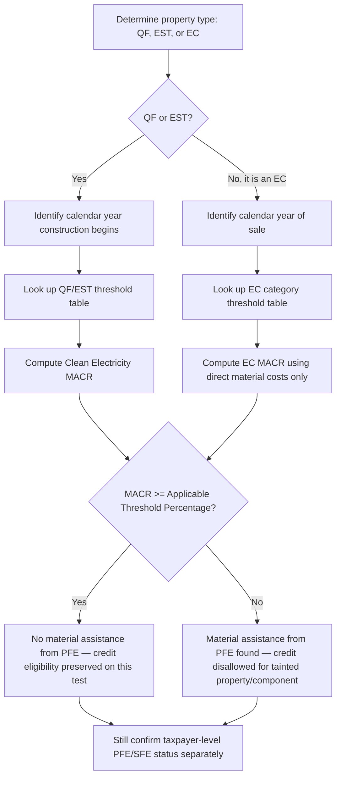

## Applicable Threshold Percentages and Their Escalation Schedule

### Statutory Origin and Purpose

The Applicable Threshold Percentage is the statutory pass/fail benchmark embedded in the "material assistance from a prohibited foreign entity" (PFE) regime enacted by the One Big Beautiful Bill Act (OBBBA), codified principally through Section 7701(a)(52) and cross-referenced into Sections 45Y (Clean Electricity Production Credit), 48E (Clean Electricity Investment Credit), and 45X (Advanced Manufacturing Production Credit). On February 12, 2026, the Treasury Department and the Internal Revenue Service issued Notice 2026-15, which describes rules to be included in forthcoming proposed regulations addressing the PFE material assistance requirements for purposes of Sections 48E, 45Y, and 45X, along with safe harbor tables for determining the applicable material assistance cost ratio (MACR). [Troutman Pepper Locke](https://www.troutman.com/insights/treasury-and-irs-issue-feoc-material-assistance-guidance/)

The threshold percentage functions as a floor. A taxpayer computes a Material Assistance Cost Ratio (MACR) — the proportion of a project's or product's cost that is *not* attributable to a prohibited foreign entity — and compares that ratio against the Applicable Threshold Percentage for the relevant year and technology. If the resulting percentage is less than the applicable threshold percentage, then the qualified facility or energy storage system includes material assistance from a prohibited foreign entity, and the credit is disallowed (in whole, or as to the tainted property, depending on the credit). [BakerHostetler](https://www.bakerlaw.com/insights/material-assistance-newly-issued-irs-guidance/)

### Core Mechanic: MACR vs. Threshold Percentage

$$\text{MACR} = \frac{\text{Total Direct Costs} - \text{PFE-Attributable Direct Costs}}{\text{Total Direct Costs}}$$

The taxpayer passes the material assistance test only if:

$$\text{MACR} \geq \text{Applicable Threshold Percentage}$$

For QFs and ESTs, the Clean Electricity MACR equals total direct costs of manufactured products and components incorporated into the QF or EST at completion, reduced by the direct costs of those items that were mined, produced or manufactured by a PFE, divided by total direct costs. For ECs, the MACR is computed using the direct material costs in a similar way. If the MACR meets or exceeds the statute's threshold for the applicable year, the property is not considered to include material assistance from a PFE. [McGuireWoods](https://www.mcguirewoods.com/client-resources/alerts/2026/3/irs-releases-initial-feoc-guidance-answers-key-questions-leaves-others-unanswered/)

Two parallel threshold tracks exist:

1. **Clean Electricity MACR** — applies to Qualified Facilities (QFs, i.e., Section 45Y/48E generation projects) and Energy Storage Technologies (ESTs), tested at the facility level.
2. **Eligible Component (EC) MACR** — applies to Section 45X advanced manufacturing production credit claims, tested at the component/product level using direct *material* costs only (labor is excluded from this narrower base).

The Clean Electricity MACR test applies to QFs and ESTs that begin construction after Dec. 31, 2025. The EC MACR test applies to ECs sold in taxable years beginning after July 4, 2025. [McGuireWoods](https://www.mcguirewoods.com/client-resources/alerts/2026/3/irs-releases-initial-feoc-guidance-answers-key-questions-leaves-others-unanswered/)

### Escalation Schedule — Qualified Facilities (QF) and Energy Storage Technology (EST)

The threshold percentages rise annually based on the calendar year in which construction begins (not the placed-in-service date), following a defined step-up pattern.

For a qualified facility that begins construction in 2026, the threshold percentage is 40%. For an EST that begins construction in 2026, the threshold is 55%. The threshold percentage increases by 5% each year for both categories through 2029. [Troutman Pepper Locke](https://www.troutman.com/insights/treasury-and-irs-issue-feoc-material-assistance-guidance/)

| Calendar Year Construction Begins | QF Threshold | EST Threshold |
| --- | --- | --- |
| 2026 | 40% | 55% |
| 2027 | 45% | 60% |
| 2028 | 50% | 65% |
| 2029 | 55% | 70% |
| 2030 and later | 60% | 75% |

Notes on this track:

- The QF and EST tracks escalate in parallel, each by a flat 5 percentage points per year, but the EST track sits a consistent 15 points above the QF track at every step.
- The schedule plateaus at 2030 — there is no further statutory escalation baked into the OBBBA text beyond the 2030-and-later tier, though this could be revisited in future legislation or rulemaking.
- Begin-construction date controls, so a project that begins construction in 2026 but is not placed in service until 2029 is still tested against the 2026 threshold (40%/55%), not the year of completion. [Inference: this follows the general "begin construction" locking convention used elsewhere in Sections 45/48/45Y/48E, though Notice 2026-15 itself is the operative authority for this specific rule and taxpayers should confirm against final regulations.]

### Escalation Schedule — Eligible Components (Section 45X)

The Section 45X threshold schedule is materially more granular than the QF/EST schedule: the threshold percentages for ECs vary by category, sale year, and — for wind — a hard termination date. [McGuireWoods](https://www.mcguirewoods.com/client-resources/alerts/2026/3/irs-releases-initial-feoc-guidance-answers-key-questions-leaves-others-unanswered/)

| EC Category | Sold 2026 | Sold 2027 | Sold 2028 | Sold 2029 | Sold 2030 and later |
| --- | --- | --- | --- | --- | --- |
| Solar Energy Components | 50% | 60% | 70% | 80% | 85% |
| Wind Energy Components | 85% | 90% | N/A (terminated) | N/A (terminated) | N/A (terminated) |
| Inverters | 50% | 55% | 60% | 65% | 70% |
| Qualifying Battery Components | 60% | 65% | 70% | 80% | 85% |
| Applicable Critical Minerals | 0% | 0% | 0% | 0% | 25% (2030), 30% (2031), 40% (2032), 50% (2033+) |

Key structural observations:

- **Non-uniform annual step sizes.** Unlike the flat 5-point QF/EST escalation, EC thresholds move in uneven increments — solar jumps 10 points per year for three years then only 5 points in the final step (80% → 85%); inverters move in flat 5-point increments throughout; battery components jump 10 points in the final two years (70% → 80% → 85%).
- **Wind terminates rather than escalates.** Wind energy components carry the steepest near-term threshold (85% in 2026, 90% in 2027) and then the category is terminated entirely for components produced and sold after December 31, 2027, consistent with the broader OBBBA phase-out of wind and solar component eligibility discussed below. After termination, the threshold question becomes moot because the credit itself is unavailable for that category. [McGuireWoods](https://www.mcguirewoods.com/client-resources/alerts/2026/3/irs-releases-initial-feoc-guidance-answers-key-questions-leaves-others-unanswered/)
- **Critical minerals threshold is zero through 2029.** The current threshold percentage for critical minerals in section 7701(a)(52) is zero percent, meaning that even if 100% of the costs of production of an applicable critical mineral are attributable to a prohibited foreign entity, the MACR would not be less than the threshold percentage and would satisfy the Material Assistance Rules. This is a legislative anomaly: it means the material assistance rule has no practical bite for critical minerals until the 2030 tier activates, even though PFE ownership/control rules for the *taxpayer itself* (as opposed to material assistance) can still separately disqualify a critical minerals producer. [Baker Botts](https://www.bakerbotts.com/thought-leadership/publications/2026/february/treasury-and-irs-provide-guidance-regarding-energy-tax-credit-limits)
- **Sale-year, not construction-year, controls for ECs.** The EC schedule keys off the calendar year of *sale*, distinguishing it from the QF/EST schedule's begin-construction trigger — a frequent point of confusion for integrated manufacturer-developers who both produce and self-consume components.
- **Structural steel and iron are excluded from the calculation entirely.** The MACR calculation does not take into account structural steel or iron, meaning these cost categories are excluded from both the numerator and denominator of the MACR fraction, for both QF/EST and EC computations, and do not affect where a project or product sits relative to the threshold. [Baker Botts](https://www.bakerbotts.com/thought-leadership/publications/2026/february/treasury-and-irs-provide-guidance-regarding-energy-tax-credit-limits)

### Worked Example — Qualified Facility

**Example:** A solar generation project begins construction in June 2027 (QF, Section 48E). Total direct costs of manufactured products and components: $100,000,000. PFE-attributable direct costs (i.e., components mined, produced, or manufactured by a prohibited foreign entity): $48,000,000.

$$\text{MACR} = \frac{\$100{,}000{,}000 - \$48{,}000{,}000}{\$100{,}000{,}000} = \frac{\$52{,}000{,}000}{\$100{,}000{,}000} = 52\%$$

Applicable threshold for a QF beginning construction in 2027 is 45%. Since $52\% \geq 45\%$, the facility passes the material assistance test for its construction-begin year. Note that the facility does not need to re-test in later years merely because thresholds continue rising — the applicable threshold percentage is fixed at the begin-construction year, so this project remains locked to the 45% bar even as the schedule climbs to 60% by 2030. [Inference: locking of the threshold at begin-construction, by analogy to the general begin-construction rule structure, though practitioners should confirm this treatment is preserved once final regulations are published, since Notice 2026-15 does not appear to have been comprehensively tested against edge cases like re-powering or major equipment replacement.]

### Worked Example — Eligible Component (Section 45X)

**Example:** A domestic manufacturer sells qualifying battery components in 2028. The Section 45X framework focuses on the costs attributable to the specific eligible component being produced and sold, using the formula: (Total Direct Material Costs − Prohibited Foreign Entity Direct Material Costs) ÷ Total Direct Material Costs. [BakerHostetler](https://www.bakerlaw.com/insights/material-assistance-newly-issued-irs-guidance/)

Assume total direct material costs of $10,000,000 and PFE direct material costs of $3,200,000:

$$\text{EC MACR} = \frac{\$10{,}000{,}000 - \$3{,}200{,}000}{\$10{,}000{,}000} = 68\%$$

The applicable threshold for qualifying battery components sold in 2028 is 70%. Since $68\% < 70\%$, the component fails the material assistance test and the Section 45X credit is disallowed for that component notwithstanding the manufacturer's otherwise-qualifying domestic production activity.

### Calculation Methodologies Available to Meet the Threshold

Treasury and the IRS provided default general rules on how to calculate the MACR, along with three elective safe harbors, because in light of ambiguity in the general rules it is expected that the safe harbors will be used whenever possible. [Morgan Lewis](https://www.morganlewis.com/pubs/2026/02/meeting-the-macr-irss-interim-guidance-addresses-obbbas-material-assistance-feoc-limitation)

- **General/Direct Cost Method** — fact-specific tracing of actual direct costs to PFE and non-PFE sources; most flexible but most administratively burdensome.
- **Identification (ID) Safe Harbor** — anchors the universe of manufactured products (MPs) and manufactured product components (MPCs) counted in the ratio to the existing Notice 2025-08 domestic content safe harbor tables, so unlisted items are simply disregarded.
- **Cost Percentage (Cost %) Safe Harbor** — substitutes pre-assigned "Assigned Cost Percentages" (borrowed from the domestic content tables) for fact-specific cost tracing, letting taxpayers sum percentages for PFE-produced items rather than compute actual dollar costs.
- **Certification (Cert) Safe Harbor** — allows reliance on supplier certifications as to PFE status and/or attributable costs, absent actual knowledge of inaccuracy.

The ID Safe Harbor and the Cost % Safe Harbor are generally available only to technologies addressed in preexisting domestic content guidance for deployment investment tax credits and production tax credits, meaning many Section 45X eligible components — which lack an established domestic content analogue — are effectively limited to the general direct-cost method or the Certification Safe Harbor, a gap several commentators have flagged as a significant compliance burden. [Morgan Lewis](https://www.morganlewis.com/pubs/2026/02/meeting-the-macr-irss-interim-guidance-addresses-obbbas-material-assistance-feoc-limitation)

### Special Rules Affecting the Threshold Test

- **Qualified interconnection property carve-out.** A qualified facility will not lose ITC eligibility simply because its qualified interconnection property fails to meet the applicable MACR threshold; however, any qualified interconnection property that falls below the threshold is excluded from the qualified facility's ITC basis rather than disqualifying the entire facility — an important distinction between component-level exclusion and facility-level disqualification. [Foley Hoag](https://foleyhoag.com/news-and-insights/publications/alerts-and-updates/2026/february/new-irs-guidance-clarifies-material-assistance-feoc-requirements/)
- **1 MW BESS Allocation Method.** For distributed battery energy storage systems under 1 MWAC placed in service in the same taxable year, taxpayers may average direct costs and PFE percentages across a "specified period" rather than testing each unit individually against the threshold, easing compliance for fleet-scale rollouts.
- **10% de minimis allocation (QFs/ESTs).** Manufactured products or components representing less than 10% of a QF's or EST's total direct costs may be assigned across multiple facilities placed in service in the same taxable year without facility-specific tracking, indirectly affecting how close a project sits to the threshold without altering the threshold itself.
- **Contract manufacturing (45X).** Where parties to a contract manufacturing arrangement elect to allow the customer to claim the Section 45X credit, the MACR calculation includes both costs paid or incurred by the party that performs the actual production activities and the costs to the customer in the arrangement. [Baker Botts](https://www.bakerbotts.com/thought-leadership/publications/2026/february/treasury-and-irs-provide-guidance-regarding-energy-tax-credit-limits)

### Interaction with Related Phase-Out and Termination Schedules

The Applicable Threshold Percentage schedule should not be confused with the separate 45X *credit-value phaseout* schedule, which reduces the dollar amount of the credit itself (independent of PFE status) for components sold in later years:

Under the OBBBA, eligible components sold after December 31, 2029, phase out, with the exception of solar and wind components which terminate for any component produced and sold after December 31, 2027. The phaseout for eligible components is determined by multiplying the credit amount by the phaseout percentage: sale during 2030 – 75%; sale during 2031 – 50%; sale during 2032 – 25%; sale after December 31, 2032 – 0%. Critical minerals (other than metallurgical coal) face their own phaseout for production after December 31, 2030: 2031 – 75%; 2032 – 50%; 2033 – 25%; after 2033 – 0%. [eidebailly](https://www.eidebailly.com/insights/articles/2024/2/understanding-section-45x)[eidebailly](https://www.eidebailly.com/insights/articles/2024/2/understanding-section-45x)

A taxpayer must therefore clear **two independent gates** in years where both schedules apply: (1) the MACR must meet or exceed the Applicable Threshold Percentage (material assistance gate), and (2) the credit amount itself may be reduced by the separate phaseout percentage (credit-value gate). Passing the threshold test does not exempt a taxpayer from the value phaseout, and vice versa.

### Diagram — Escalation Logic and Decision Flow

### Threshold Escalation Trend Illustration (SVG)

<svg xmlns="http://www.w3.org/2000/svg" viewBox="0 0 780 460" font-family="Arial, sans-serif">
<text x="390" y="28" text-anchor="middle" font-size="18" font-weight="bold" fill="#1a1a1a">QF and EST Threshold Percentage Escalation, 2026–2030 (svg_diagram)</text>

<line x1="80" y1="400" x2="740" y2="400" stroke="#333" stroke-width="2" />
<line x1="80" y1="400" x2="80" y2="60" stroke="#333" stroke-width="2" />

<text x="70" y="405" text-anchor="end" font-size="12">0%</text>

<text x="70" y="325" text-anchor="end" font-size="12">20%</text>

<text x="70" y="245" text-anchor="end" font-size="12">40%</text>

<text x="70" y="165" text-anchor="end" font-size="12">60%</text>

<text x="70" y="85" text-anchor="end" font-size="12">80%</text>

<line x1="80" y1="325" x2="740" y2="325" stroke="#ddd" stroke-width="1" />
<line x1="80" y1="245" x2="740" y2="245" stroke="#ddd" stroke-width="1" />
<line x1="80" y1="165" x2="740" y2="165" stroke="#ddd" stroke-width="1" />
<line x1="80" y1="85" x2="740" y2="85" stroke="#ddd" stroke-width="1" />

<text x="160" y="420" text-anchor="middle" font-size="12">2026</text>

<text x="290" y="420" text-anchor="middle" font-size="12">2027</text>

<text x="420" y="420" text-anchor="middle" font-size="12">2028</text>

<text x="550" y="420" text-anchor="middle" font-size="12">2029</text>

<text x="680" y="420" text-anchor="middle" font-size="12">2030+</text>

<polyline points="160,240 290,220 420,200 550,180 680,160" fill="none" stroke="#2166ac" stroke-width="3" />
<circle cx="160" cy="240" r="5" fill="#2166ac" />
<circle cx="290" cy="220" r="5" fill="#2166ac" />
<circle cx="420" cy="200" r="5" fill="#2166ac" />
<circle cx="550" cy="180" r="5" fill="#2166ac" />
<circle cx="680" cy="160" r="5" fill="#2166ac" />

<polyline points="160,180 290,160 420,140 550,120 680,100" fill="none" stroke="#b2182b" stroke-width="3" />
<circle cx="160" cy="180" r="5" fill="#b2182b" />
<circle cx="290" cy="160" r="5" fill="#b2182b" />
<circle cx="420" cy="140" r="5" fill="#b2182b" />
<circle cx="550" cy="120" r="5" fill="#b2182b" />
<circle cx="680" cy="100" r="5" fill="#b2182b" />

<text x="160" y="232" text-anchor="middle" font-size="11" fill="`#2166ac`">40%</text>

<text x="290" y="212" text-anchor="middle" font-size="11" fill="`#2166ac`">45%</text>

<text x="420" y="192" text-anchor="middle" font-size="11" fill="`#2166ac`">50%</text>

<text x="550" y="172" text-anchor="middle" font-size="11" fill="`#2166ac`">55%</text>

<text x="680" y="152" text-anchor="middle" font-size="11" fill="`#2166ac`">60%</text>

<text x="160" y="172" text-anchor="middle" font-size="11" fill="`#b2182b`">55%</text>

<text x="290" y="152" text-anchor="middle" font-size="11" fill="`#b2182b`">60%</text>

<text x="420" y="132" text-anchor="middle" font-size="11" fill="`#b2182b`">65%</text>

<text x="550" y="112" text-anchor="middle" font-size="11" fill="`#b2182b`">70%</text>

<text x="680" y="92" text-anchor="middle" font-size="11" fill="`#b2182b`">75%</text>

<rect x="560" y="55" width="14" height="14" fill="#2166ac" />
<text x="580" y="66" font-size="12">QF Threshold</text>
<rect x="560" y="75" width="14" height="14" fill="#b2182b" />
<text x="580" y="86" font-size="12">EST Threshold</text>
</svg>

### Compliance Risk Points

- **Locking mechanics remain incompletely specified.** Notice 2026-15 addresses only the MACR computation itself; it does not resolve when the applicable threshold "locks" relative to subsequent equipment substitutions, repowering, or capacity additions to an existing QF or EST. [Unverified: treatment of mid-life equipment swaps against a previously-locked threshold year has not been confirmed in published guidance as of this writing.]
- **Interim table dependency.** Treasury must publish PFE-specific safe harbor tables by Dec. 31, 2026, and in the interim the Notice ties identification and cost-percentage methods to the existing Notice 2025-08 domestic content tables — taxpayers will need to reassess MACR positions once the new tables are published. Any threshold percentage compliance position taken in 2026 under the interim tables carries re-computation risk once final MACR-specific tables are issued. [McGuireWoods](https://www.mcguirewoods.com/client-resources/alerts/2026/3/irs-releases-initial-feoc-guidance-answers-key-questions-leaves-others-unanswered/)
- **Effective control and PFE-status ambiguity is a separate, unresolved layer.** Future guidance should clarify effective control standards, ownership tracing methodologies, debt threshold application, treatment of public companies, binding contract interpretation, retroactive designation risk, recapture and liability allocation, and whether and how an entity can "de-FEOC" during a taxable year. A project can satisfy the Applicable Threshold Percentage test on the MACR calculation while still facing disqualification risk on the separate question of whether a counterparty is itself a PFE — the threshold percentage schedule only resolves one of two independent compliance layers. [Novogradac](https://www.novoco.com/notes-from-novogradac/managing-the-interim-feoc-guidance-irs-notice-2026-15-addresses-material-assistance-for-sections-45y-48e-and-45x-deferring-on-broader-pfe-status-guidance)
- **Retroactive designation risk.** Because PFE/SFE status determinations for upstream suppliers may not be finalized until after equipment procurement decisions are locked in, developers relying on current supplier certifications face residual risk that a later PFE designation could retroactively undermine a MACR calculation that passed the threshold at the time of construction commencement. [Speculation: the degree of retroactive exposure will depend heavily on forthcoming proposed regulations and is not yet quantifiable.]

**Related Topics:**

- Definition of "Prohibited Foreign Entity," "Specified Foreign Entity," and "Foreign-Influenced Entity"
- Effective Control Standards and Ownership Attribution Rules Under Section 7701(a)(51)
- Identification Safe Harbor, Cost Percentage Safe Harbor, and Certification Safe Harbor Mechanics
- Notice 2025-08 Domestic Content Safe Harbor Tables and Their Reuse for MACR
- 1 MW BESS Allocation Method and EC Allocation Method for Distributed Assets
- Qualified Interconnection Property Treatment Under the MACR Test
- Section 45X Credit-Value Phaseout Schedule vs. Material Assistance Threshold Test
- Supplier Certification Reliance Standards and Knowledge/Reason-to-Know Exceptions
- Forthcoming Proposed Regulations and the December 31, 2026 Safe Harbor Table Deadline
- Recapture Mechanics for Post-Credit-Claim PFE Redesignation