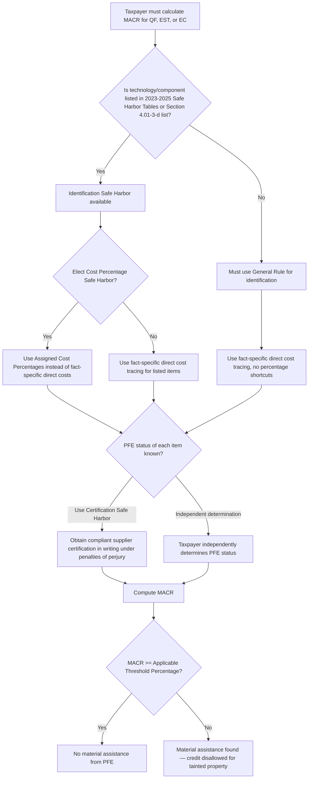

## Safe Harbor Tables and Notice 2026-15

### Overview and Legal Status

On Feb. 12, 2026, the IRS released Notice 2026-15, which provides guidance on how the material assistance rules under Section 7701(a)(52) of the Internal Revenue Code apply to renewable energy developers and manufacturers claiming Section 45Y, 48E, and 45X credits. The Notice is interim sub-regulatory guidance — Treasury and the IRS intend to issue more comprehensive proposed regulations and additional guidance addressing prohibited foreign entity definitions, material assistance rules and related safe harbor tables, and taxpayers can generally rely on the Notice's rules and procedures until that notice of proposed rulemaking is issued.

Notice 2026-15 is substantial in scope and detail: it spans 95 pages, and there are several limitations in the safe harbors — while generally favorable, taxpayers will need to carefully plan how to use the safe harbors to achieve compliance with the material assistance rules. Comments on the Notice were requested with a soft deadline of March 30, 2026.

**Scope limitation.** Notice 2026-15 is limited to the material assistance provisions, which generally became effective on Jan. 1, 2026. Additional guidance relating to the broader prohibited foreign entity (PFE) status rules — including effective control, ownership attribution, and specified/foreign-influenced entity determinations — is forthcoming but was not addressed in this Notice.

### Relationship to the 2023–2025 Domestic Content Safe Harbor Tables

Rather than building an entirely new set of safe harbor tables from scratch, Notice 2026-15 leverages the pre-existing domestic content safe harbor infrastructure already familiar to developers from Notice 2023-38, Notice 2024-41, and Notice 2025-08 (collectively, the "2023-2025 Safe Harbor Tables").

A taxpayer's identification of the manufactured products (MPs) and manufactured product components (MPCs) must be consistent with the meaning of "manufactured products (including components)" identified in Notice 2023-38, and the level of detail needed must be substantially similar to the level of detail provided in the 2023-2025 Safe Harbor Tables. Applicable projects identified in those notices — namely solar, wind, hydropower, and battery storage — can be used by a taxpayer in connection with the Identification Safe Harbor.

This reuse strategy has a direct practical consequence: technologies not listed in the 2023-2025 Safe Harbor Tables (e.g., renewable natural gas, geothermal) will have to interpret the general rules independently to determine what constitutes an MP and MPC, since no safe harbor shortcut exists for them yet.

### The Three Safe Harbors — Structural Summary

Notice 2026-15 establishes three elective, stackable safe harbors, each addressing a different layer of the MACR calculation:

| Safe Harbor | What It Replaces | Primary Limitation |
| --- | --- | --- |
| Identification (ID) Safe Harbor | Ad hoc identification of which MPs/MPCs/constituent materials count | Only available for technologies listed in the 2023-2025 Tables |
| Cost Percentage (Cost %) Safe Harbor | Fact-specific direct cost tracing | Only available where the ID Safe Harbor is also used |
| Certification Safe Harbor | Independent PFE-status investigation | Requires reliable, compliant supplier certifications |

### Identification Safe Harbor — Mechanics

**For Qualified Facilities (QFs) and Energy Storage Technologies (ESTs) — Sections 45Y/48E:**

The Identification Safe Harbor allows taxpayers claiming Section 45Y or 48E credits to use the 2023-2025 Safe Harbor Tables to identify the types of MPs or MPCs used in a qualified facility or energy storage system. If a taxpayer elects this safe harbor, the MPs and MPCs listed in the 2023-2025 Safe Harbor Tables become the exclusive and exhaustive list — any MPs or MPCs not listed are simply disregarded from the MACR calculation entirely.

**For Eligible Components (ECs) — Section 45X:**

The Identification Safe Harbor for eligible components allows taxpayers to use the 2023-2025 Safe Harbor Tables to identify constituent materials in an eligible component, provided the component is "listed" — meaning included in the table found in Section 4.01(3)(d) of Notice 2026-15. This EC-level ID Safe Harbor is materially narrower than its QF/EST counterpart: it is generally limited to inverters, solar modules and battery modules used in distributed battery energy storage systems or grid-scale battery energy storage systems. Manufacturers of other 45X-eligible categories (many critical minerals, non-listed battery components) cannot rely on this shortcut.

### Cost Percentage Safe Harbor — Mechanics

The Cost Percentage Safe Harbor is only available to a taxpayer that has already elected the Identification Safe Harbor; it substitutes pre-assigned percentage weightings from the domestic content tables for fact-specific direct-cost tracing.

**QF/EST calculation steps:**

1. Identify the MPs and MPCs using the Identification Safe Harbor.
2. Track whether each MP or MPC was produced by a prohibited foreign entity.
3. Aggregate the assigned cost percentage for each listed MP and MPC to determine the total percentage for direct costs.
4. Aggregate the assigned cost percentage for each listed MP and MPC produced by a prohibited foreign entity.
5. Calculate the MACR by subtracting the percentage in Step 4 from the percentage in Step 3 and dividing the result by the percentage in Step 3.

**EC calculation steps** (structurally parallel, applied at the component/constituent-material level):

1. Identify the constituent materials using the Identification Safe Harbor.
2. Track whether each constituent material was sourced by a prohibited foreign entity.
3. Aggregate the assigned cost percentage for each listed MPC included in the eligible component.
4. Aggregate the assigned cost percentage for each listed MPC sourced from a prohibited foreign entity and included in the eligible component.
5. Calculate the MACR for eligible components by subtracting the percentage in Step 4 from the percentage in Step 3 and dividing the result by the percentage in Step 3.

The Cost Percentage Safe Harbor for eligible components is limited to the types of eligible components listed in Section 4.01(3)(d) of Notice 2026-15 — the same narrow list (inverters, solar modules, battery modules in distributed or grid-scale BESS) that gates the EC-level Identification Safe Harbor.

**Formula representation:**

$$\text{MACR}_{\text{CostPct}} = \frac{\text{Total Percentage} - \text{Total PFE Percentage}}{\text{Total Percentage}}$$

where Total Percentage is the sum of Assigned Cost Percentages across all listed MPs/MPCs (or constituent materials), and Total PFE Percentage is the subset of that sum attributable to PFE-produced or PFE-sourced items.

**Worked example (Cost Percentage Safe Harbor, QF):** A solar QF elects the ID and Cost % Safe Harbors. Aggregated Assigned Cost Percentages across all listed MPs/MPCs sum to 92% of the facility (the remainder being disregarded non-listed items or, under the Cost Percentage Safe Harbor, excluded steel/iron). Of that 92%, PFE-produced items account for 38 percentage points.

$$\text{MACR} = \frac{92\% - 38\%}{92\%} \approx 58.7\%$$

This result is then tested against the Applicable Threshold Percentage for the facility's begin-construction year (see the escalation schedule topic for those figures).

### Certification Safe Harbor — Mechanics and Requirements

The Certification Safe Harbor described in Section 4.03 of Notice 2026-15 allows taxpayers to rely on certifications from direct suppliers rather than independently determining whether materials and products were produced or sourced from a prohibited foreign entity, shifting part of the verification burden to suppliers. This safe harbor applies to MACR calculations under both the QF/EST track (Sections 45Y/48E) and the EC track (Section 45X).

**Requirements for a valid certification.** A valid certification must:

- Be in writing, including electronic format, and signed under penalties of perjury by an authorized representative of the supplier.
- Specify the direct costs attributable to items that were not produced or sourced from a prohibited foreign entity, or certify that all items are non-PFE produced or sourced.
- Clearly identify the supplier and the specific items covered by the certification.
- State that the supplier exercised reasonable due diligence in determining prohibited foreign entity status.

**Reliance and exposure.** Taxpayers may rely on certifications in good faith when the certification is accurate; however, if a certification is inaccurate due to supplier error or other issues, the taxpayer may face credit disallowance, penalties under Section 6695B of the Code, or accuracy-related penalties under Section 6662 of the Code. Reliance is limited to certifications from *direct* suppliers, meaning tier-two-and-beyond supply chain issues are not covered by a direct supplier's certification alone — taxpayers should address certification requirements in procurement documentation early in the contracting process.

### Definition of "Constituent Materials"

For purposes of applying the Certification Safe Harbor and calculating the MACR, certifications may cover MPs, MPCs, or constituent materials included in the relevant qualified facility, energy storage technology, or eligible component. "Constituent materials" generally refer to materials that are directly incorporated into an MP or eligible component and become part of the finished item during the production process; materials that are not incorporated into the final product, such as tools or production supplies, are not treated as constituent materials for these purposes.

This definitional line matters operationally: consumables, jigs, and process aids used in manufacturing are excluded from the MACR base entirely, regardless of their country of origin or the PFE status of their supplier.

### Full Calculation Walkthrough Without Safe Harbors (General Rule Baseline)

Even though safe harbors are expected to be widely used, understanding the general (non-safe-harbor) methodology clarifies what the safe harbors are substituting for.

**QF/EST general-rule steps:**

1. **Identify MPs and MPCs** incorporated into the qualified facility or energy storage system.
2. **Track direct costs** of each MP/MPC — Notice 2026-15 provides a de minimis assignment-based tracking rule, allowing taxpayers to assign MPs or MPCs of the same type to qualified facilities or energy storage systems placed in service during the same taxable year without individually tracking costs, so long as those items represent less than 10 percent of the total direct costs of each qualified facility or energy storage system.
3. **Determine direct costs attributable to each MP/MPC** — for self-produced items, taxpayers look to Treasury Regulations Sections 1.263A-1(e)(2)(i)(A) and (B) for direct material and direct labor cost definitions, respectively; for purchased MPs/MPCs, the purchase price is treated as the direct cost.
4. **Determine direct costs attributable to PFE-produced MPs/MPCs** — an MP or MPC is treated as PFE-produced if the entity that mined, produced, or manufactured it is a prohibited foreign entity for that entity's taxable year encompassing the date the taxpayer paid or incurred the associated direct costs.
5. **Aggregate and compute:**

$$\text{MACR} = \frac{\text{Total Direct Costs} - \text{Total PFE Direct Costs}}{\text{Total Direct Costs}}$$

**EC general-rule steps (Section 45X):**

1. **Identify constituent materials** directly incorporated into the eligible component, either individually or via the Identification Safe Harbor if listed.
2. **Track each constituent material** — its direct material costs and PFE status — except where averaging is permitted; for averaging, taxpayers may group similar constituent materials incorporated into the same type of eligible component over a specified period (not exceeding the taxable year), using weighted averages based on quantity and cost.
3. **Determine direct material costs** — the costs paid or incurred by the taxpayer for constituent materials, including purchase price, freight-in, and tariffs; costs from resellers are traced back to the original miner, producer, or manufacturer.
4. **Determine PFE status per constituent material** — based on the entity that mined, produced, or manufactured it.
5. **Compute the ratio:**

$$\text{EC MACR} = \frac{\text{Total Direct Material Costs} - \text{PFE Direct Material Costs}}{\text{Total Direct Material Costs}}$$

Both tracks converge on the same threshold test: if the resulting percentage is less than the applicable threshold percentage, then the qualified facility, energy storage system, or eligible component includes material assistance from a prohibited foreign entity.

### Safe Harbor Availability Matrix

| Track | ID Safe Harbor Available? | Cost % Safe Harbor Available? | Certification Safe Harbor Available? |
| --- | --- | --- | --- |
| QF/EST — listed technologies (solar, wind, hydropower, battery storage per 2023-2025 Tables) | Yes | Yes (if ID SH elected) | Yes |
| QF/EST — unlisted technologies (e.g., geothermal, RNG) | No | No | Yes |
| EC — inverters, solar modules, battery modules (distributed/grid-scale BESS) | Yes (Section 4.01(3)(d) list) | Yes (if ID SH elected) | Yes |
| EC — other 45X categories (most critical minerals, non-listed components) | No | No | Yes |

This matrix illustrates why the Certification Safe Harbor functions as the universal fallback: it is the only one of the three safe harbors available across every technology and category, listed or unlisted — the certification safe harbor can be particularly useful when the configuration of a QF, EST or EC does not allow for use of the Cost Percentage Safe Harbor.

### Diagram — Safe Harbor Election Pathway

### Interaction with Special Allocation Methods

Notice 2026-15 pairs the safe harbors with two allocation conveniences aimed at reducing per-unit tracking burden:

- **10% de minimis allocation (QF/EST).** MPs or MPCs of the same type may be assigned across multiple qualified facilities or energy storage systems placed in service in the same taxable year without QF/EST-specific tracking, provided those items represent less than 10% of total direct costs.
- **Averaging over a specified period (EC).** For constituent materials, taxpayers may group similar types incorporated into the same type of eligible component over a specified period not exceeding the taxable year, using quantity- and cost-weighted averages rather than per-unit tracing.

Neither allocation method is itself a "safe harbor" in the sense of the three described above, but each interacts directly with how the ID and Cost % Safe Harbors are operationalized in practice, particularly for high-volume distributed asset deployments (e.g., residential/commercial BESS fleets) and high-throughput component manufacturing lines.

### Open Issues Flagged for Future Guidance

Notice 2026-15 explicitly requests comments on several unresolved implementation questions, signaling where the safe harbor framework may still shift in the forthcoming proposed regulations:

- Whether additional guidance is needed to clarify how taxpayers should determine "total direct costs" attributable to MPs and components incorporated into a qualified facility or energy storage technology.
- What standard should apply for qualified facilities and energy storage technologies under Sections 45Y and 48E, including whether a direct cost framework based on direct materials and direct labor appropriately captures the relevant costs.
- What rules are necessary to prevent circumvention of the prohibited foreign entity and material assistance rules consistent with the purposes of the OBBBA.
- What additional substantiation and documentation requirements, beyond those required under Section 6001 of the Code, should apply to support compliance with anti-circumvention rules, including demonstrating that beginning of construction has occurred for purposes of the prohibited foreign entity and material assistance rules.

[Unverified: the extent to which final regulations will preserve the current safe harbor structure unchanged, versus materially narrowing or expanding safe harbor availability, cannot be determined from the interim Notice alone and depends on comments received and Treasury's subsequent rulemaking.]

### Compliance and Documentation Risk Points

- **Supplier certification reliability is now a first-order compliance dependency.** Because the Certification Safe Harbor is the only universally available safe harbor, developers and manufacturers with complex, multi-tier supply chains face concentrated exposure to upstream certification errors — an inaccurate certification can trigger credit disallowance and penalties under Sections 6695B and 6662 even where the taxpayer acted in good faith.
- **Technology-list dependency creates a two-tier compliance burden.** Developers of solar, wind, hydropower, and battery storage projects can lean on a mature, familiar domestic-content-table infrastructure; developers of geothermal, renewable natural gas, and other unlisted technologies face a materially higher documentation burden with no percentage-based shortcut.
- **95-page guidance document with narrow safe harbor gates.** The scale and specificity of Notice 2026-15 — combined with the narrow eligibility gates for the ID and Cost % Safe Harbors (Section 4.01(3)(d) for ECs) — means taxpayers should not assume broad safe harbor availability by default and should confirm eligibility technology-by-technology and component-by-component.
- **Interim reliance carries reassessment risk.** Taxpayers may rely on Notice 2026-15 now, but positions taken under it will need to be revisited once Treasury issues the mandated MACR-specific safe harbor tables and the subsequent notice of proposed rulemaking, since the current framework borrows tables built for a different purpose (domestic content bonus credits) rather than one purpose-built for the material assistance test.

**Related Topics:**

- Applicable Threshold Percentages and Their Escalation Schedule
- Definition of "Manufactured Product," "Manufactured Product Component," and "Constituent Material"
- Treasury Regulations Section 1.263A-1(e)(2)(i) Direct Cost Definitions in the MACR Context
- Contract Manufacturing Arrangements and 45X Credit Allocation
- Penalty Exposure Under Sections 6695B and 6662 for Inaccurate Certifications
- 1 MW BESS Allocation Method and EC Averaging Methodology
- Comment Process and Anticipated Notice of Proposed Rulemaking Timeline
- Distinguishing Material Assistance Compliance from Taxpayer-Level PFE/SFE Status
- Steel and Iron Exclusion from the MACR Calculation
- Recordkeeping and Substantiation Standards Under Section 6001 for FEOC Compliance