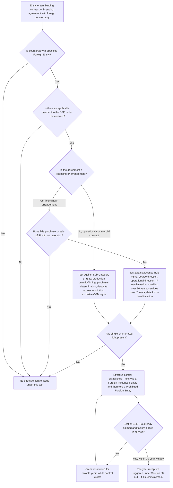

## Effective Control, Licensing, and Financial Arrangement Limits

### Statutory Framework and Placement Within the FEOC Regime

Effective control is one of the five independent tests under Section 7701(a)(51)(D) that can render a taxpayer a "foreign-influenced entity" (FIE) — and therefore a prohibited foreign entity (PFE) — even when that taxpayer would otherwise pass the ownership, appointment, and debt tests. As defined in §7701(a)(51)(D), an FIE is an entity where a specified foreign entity (SFE) has "influence" in at least one of several ways: direct authority to appoint a covered officer; 25% or more ownership by a single SFE; 40% or more aggregate ownership by multiple SFEs; 15% or more debt held by an SFE when issued; or effective control through contractual payments.

Unlike the other four FIE triggers — which are largely mechanical, bright-line ownership and debt calculations — the effective control test is contract-driven and fact-intensive. It asks not "who owns the entity" but "who, through binding contracts or licensing arrangements, functionally directs or restricts the entity's production, operations, or intellectual property."

This places effective control at the intersection of two distinct compliance regimes documented in this chapter:

1. **Taxpayer-level PFE status** (Section 7701(a)(51)) — effective control is one route by which the taxpayer itself becomes disqualified from claiming credits.
2. **Material assistance / MACR compliance** (Section 7701(a)(52)) — a separate, project-level cost-ratio test covered elsewhere in this chapter, which effective control does *not* directly compute but which interacts with it operationally (a supplier that holds effective control over a project is highly likely to also be a source of PFE-tainted material assistance costs).

### The Trigger Mechanism: "Applicable Payments" Under Binding Contract or Licensing Agreement

The OBBBA adds additional restrictions to entities that make "applicable payments" to an SFE during the taxable year through a binding contract or licensing agreement, therefore giving "effective control" (as defined in §7701(a)(51)(D)(ii)) over either the project, manufactured products, or eligible components as it relates to the claimed tax credits of Sections 45Y, 48E, or 45X.

Effective control analysis therefore proceeds in two stages:

1. **Is there an "applicable payment"** flowing to an SFE under a binding contract or licensing agreement?
2. **Does that contract or agreement grant the SFE one or more of the enumerated forms of control** specified in the statute?

Both conditions must be present. A payment alone, absent qualifying control rights, does not create effective control; conversely, contractual control rights without an applicable payment stream are analyzed differently (though in practice most controlling arrangements involve consideration).

### Two Statutory Sub-Categories of Effective Control

Section 7701(a)(51)(D)(ii) splits effective control into two operative sub-tests, targeting different contract types.

**Sub-Category 1 — Operational/Commercial Contract Control (Non-Licensing).** In the meantime (pending further IRS guidance), entities should avoid giving potential SFEs the unrestricted contractual right to:

- Determine the quantity or timing of production of an eligible component (for Section 45X).
- Determine the amount or timing of activities related to the production or storage of electricity (for Section 45Y or 48E).
- Determine which entity may purchase or use the eligible components or critical minerals.
- Determine which entity may purchase or use the electricity.
- Restrict access to data critical to production or storage of energy, or to the factory, mine, or mineral processing facility, to the personnel or agents of such contractual counterparty.
- On an exclusive basis, maintain, repair, or operate any plant or equipment which is necessary to the production of eligible components or electricity.

**Sub-Category 2 — Licensing/Intellectual Property Control ("The License Rule").** New Tax Code section 7701(b)(51)(D)(ii)(III) provides that, with respect to agreements for licensing intellectual property (and related agreements), "effective control" means the retention of a contractual right to specify or direct the sources of components, subcomponents, or applicable critical minerals; the retention of a contractual right to direct operations; the retention of a contractual right to limit the use of the intellectual property; the retention of a contractual right to receive royalties for more than 10 years; the retention of a contractual right to provide services for more than two years; or a limitation on the provision of data, information, or know-how.

Restated as an avoidance checklist, entities should avoid giving potential SFEs the contractual right to:

- Specify or otherwise direct one or more sources of components, subcomponents, or applicable critical minerals to be used in an electricity or energy storage project, or in the production of an eligible component.
- Direct the operation of an electricity or energy storage project, or a facility that produces eligible components or critical minerals.
- Limit the taxpayer's utilization of intellectual property related to the operation of an electricity or energy storage project, or in the production of an eligible component.
- Receive royalties for more than 10 years.
- Require the taxpayer to enter an agreement for the provision of services for a duration longer than 2 years.

Additionally, manufacturers and mineral producers entering into licensing arrangements should ensure the licensee has the technical data, information, and know-how necessary to enable it to produce the eligible component without needing further involvement from the counterparty or other SFE — a "clean break" requirement designed to prevent SFEs from retaining leverage through withheld know-how.

### Notice 2026-15's Treatment of the License Rule

Although Notice 2026-15 is focused primarily on MACR mechanics, it addresses effective control only briefly, and confirms an important interpretive rule for forthcoming regulations. The Notice indicates that forthcoming regulations are expected to clarify that, for purposes of determining whether a PFE has "effective control" over a project, each enumerated licensing arrangement listed in Section 7701(a)(51)(D)(ii)(III)(aa)(AA)-(GG) must be evaluated separately — meaning a licensing agreement is not assessed holistically for "overall" control, but rather each of the six-plus enumerated rights (source-direction, operational-direction, IP-use limitation, 10-year royalty cap, 2-year service cap, data/know-how limitation) is tested independently, and tripping *any single one* of them is sufficient to establish effective control.

Separately, by way of example, the IRS indicated that licensing agreements entered into (or modified) after the date of enactment of the OBBBA (July 4, 2025) would be considered to convey effective control to an SFE if a payment under the licensing agreement is made to the SFE — signaling an aggressive, payment-triggered reading of the license rule that commentators have characterized as draconian. The Notice introduces a few new concepts and affirms a draconian view of licensing arrangements for purposes of determining "effective control."

Future proposed regulations will also include anti-abuse rules intended to prevent entities from evading, circumventing, or abusing the FEOC restrictions under Section 7701(a)(51).

### The Bona Fide Purchase-and-Sale Exception

A bona fide purchase or sale of intellectual property is not subject to the licensing-based effective control restrictions. However, arrangements where ownership of intellectual property reverts to the contractual counterparty after a period of time shall not be considered a bona fide purchase or sale — meaning a disguised license (structured as a "sale" with a reversion clause) does not escape the effective control analysis merely through sale-like labeling.

Industry commentary submitted to Treasury has urged that the bona fide purchase and sale exception of section 7701(a)(51)(D)(ii)(III)(bb) should be read to cover the permanent transfer of intellectual property to multiple parties — an open interpretive question not yet resolved by guidance. [Unverified: whether Treasury will adopt this broader reading of the exception in forthcoming proposed regulations is not yet known.]

### Financial Arrangement Limits — Debt and Ownership Thresholds (Context for Effective Control)

While effective control is a distinct, contract-based test, it operates alongside two other financial/ownership-based FIE triggers that define the broader "financial arrangement limits" landscape:

| Trigger | Threshold | Statutory Basis |
| --- | --- | --- |
| Officer appointment authority | SFE has direct authority to appoint a "covered officer" (board member, CEO, CFO, COO, general counsel, senior VP) | §7701(a)(51)(D)(i), §7701(a)(51)(F) |
| Single-SFE ownership | 25% or more owned by a single SFE | §7701(a)(51)(D) |
| Aggregate multi-SFE ownership | 40% or more owned collectively by multiple SFEs | §7701(a)(51)(D) |
| Debt attribution | 15% or more of debt held by an SFE, tested when issued | §7701(a)(51)(D) |
| Effective control | Contractual/licensing control as described above | §7701(a)(51)(D)(ii) |

These financial arrangement thresholds are tested as of a specific date rather than continuously: entities are tested to determine if they qualify as SFEs and FIEs on the last day of the tax year for which the applicable credit is claimed, with a special first-year rule — for the first taxable year after July 4, 2025, the test takes place on the first day of the taxable year, meaning calendar-year taxpayers are tested as of January 1, 2026, for the 2026 tax year.

Notice 2026-15 provides meaningful clarity on how to calculate material assistance under Section 7701(a)(52), but it leaves several critical questions on PFE designation under Section 7701(a)(51) unresolved — most notably, the Notice does not fully address how to apply the 25% single-owner and 40% aggregate ownership thresholds, the 15% debt attribution test, governance and veto rights, licensing and intellectual property arrangements (including the 10-year royalty rule), or the broader scope of "effective control" in commercial contracts.

### Recapture Exposure — The Ten-Year §48E Look-Back

Effective control is not a one-time, at-closing determination for ITC claimants — it carries an extended, post-closing recapture tail unique among the FEOC provisions.

In §50(a)(4), the recapture risk for ITCs is extended to ten years if there is any "applicable payment" sent to an SFE that thereby allows that entity to have effective control. If any payment is made to an SFE in the ten years after the qualified facility is placed in service, then the entirety of the credit is clawed back. This provision applies to taxpayers who claim a credit for any taxable year beginning after July 4, 2027 (i.e., 2028 and beyond for calendar-year filers).

**Practical consequence for structuring.** This asymmetric recapture exposure may have the impact of shifting more developers towards claiming a Section 45Y production tax credit over a Section 48E investment tax credit, where the taxpayer has the option to elect either, since a PTC's annual claim structure does not carry the same decade-long clawback trigger tied to a single point-in-time credit event. [Inference: this strategic shift is a reasoned market response described by practitioners, not a guaranteed outcome for every taxpayer, since PTC vs. ITC selection depends on many additional factors — capital structure, financing cost of capital, placed-in-service timing, and technology type — beyond FEOC recapture exposure alone.]

### Public Company Treatment

Public companies are largely exempt from being considered an SFE, except in the instance where the company is traded on a market in a Covered Nation. However, exemption from SFE status does not confer blanket immunity from the broader PFE analysis:

- Public companies are at risk of being considered an FIE if an SFE has the authority to appoint a board member or executive officer.
- Public companies are also at risk of giving "effective control" to an SFE through a contractual payment or licensing agreement.

This means a widely held, exchange-listed U.S. developer can still trip the effective control wire through an ordinary commercial licensing agreement with a foreign counterparty, irrespective of its dispersed ownership structure — public float does not immunize a company from contract-based effective control exposure.

### The Unresolved "No-Look-Through" Question

A significant open structural issue concerns how deeply Treasury will require ownership tracing through complex holding structures. It is also unclear whether the IRS will utilize the authority granted under Section 7701(a)(51)(D)(ii)(II) of the Code to override the current statutory definition of effective control with respect to QFs, ESTs and EC manufacturing processes. Proposed Treasury Regulations issued on Oct. 21, 2025, suggest that the current Treasury may be considering adoption of a "no-look-through" approach similar to the one it applied under the proposed regulations under Section 897 to domestically controlled real estate investment entities, which simplified ownership tracing through the use of domestic blockers.

Unless and until the concepts of ownership and effective control — and other definitional questions relating to PFE and SFE status — are resolved, taxpayers will face significant diligence burdens and continued uncertainty. [Unverified: whether a no-look-through safe harbor will ultimately be adopted, and if so how narrowly or broadly it would apply to effective control (as opposed to ownership percentage tests), remains speculative pending the forthcoming proposed regulations.]

### Worked Example — Licensing Agreement Effective Control Analysis

**Scenario:** A U.S. battery manufacturer licenses cathode-chemistry intellectual property from a foreign technology firm that is a specified foreign entity. The license agreement, executed in September 2025 (after OBBBA enactment), includes:

- An ongoing royalty payment to the SFE licensor of 3% of net sales, uncapped in duration.
- A right for the licensor to approve the manufacturer's choice of precursor material suppliers.
- A 5-year technical services and training arrangement under which licensor personnel provide ongoing production support.

**Analysis under the License Rule:**

| Contractual Term | Enumerated Effective-Control Trigger | Triggered? |
| --- | --- | --- |
| Uncapped royalty (no defined end date, effectively exceeds 10 years) | Retention of a contractual right to receive royalties for more than 10 years | Yes |
| Supplier-approval right over precursor materials | Retention of a contractual right to specify or direct sources of components/subcomponents | Yes |
| 5-year technical services arrangement | Retention of a contractual right to provide services for more than 2 years | Yes |

Because *any one* of the enumerated rights is independently sufficient — per Notice 2026-15's confirmation that each licensing arrangement is evaluated separately — this agreement trips at least three independent effective-control triggers. The manufacturer would be treated as an FIE (and therefore a PFE) for any taxable year in which this agreement remains in effect on these terms, disqualifying it from claiming the Section 45X credit for components produced under this arrangement, regardless of the manufacturer's ownership structure or debt profile.

**Remediation path:** Restructuring the royalty to a fixed term under 10 years, removing the supplier-approval veto (converting it to a non-binding technical consultation right), and shortening the services term to under 2 years (or converting it to a series of independently negotiated short-term engagements) would each independently remove one trigger; all three would need to be cured to eliminate effective control exposure entirely.

### Diagram — Effective Control Determination Logic

### Compliance and Documentation Practices

Reunion's recommended compliance checklist for effective control identifies the categories of agreements requiring ongoing review: maintain evidence to verify that over the previous tax year, an SFE did not hold "effective control" over key aspects of production, generation, or storage which are not already captured through the authority, ownership, or debt tests. Categories flagged for review include:

- Operations, maintenance, or asset management agreements, including long-term service, performance, or dispatch authority terms.
- Supply, procurement, or manufacturing agreements specifying approved vendors or sourcing restrictions.
- Power purchase, offtake, or energy storage agreements governing generation schedules, dispatch, or output allocation.
- Licensing or technology agreements covering intellectual property, software, or SCADA systems.
- Construction or EPC contracts where counterparties retain operational authority or site access control rights.
- Joint venture, development, or shareholder agreements involving shared governance, veto, or consent rights.
- Financing, lease, or royalty agreements imposing operational conditions or extended payment obligations.
- Data access or remote operations agreements granting privileged access to system controls or operational data.
- Consulting, technical service, or training agreements creating long-term dependence or ongoing foreign involvement.

For the ten-year §48E recapture window specifically, the same category list applies on a rolling post-placed-in-service basis, since any qualifying applicable payment made at any point during the ten-year period — not merely at origination — can trigger full clawback.

### Interaction with the Broader FEOC Compliance Stack

Effective control analysis does not operate in isolation. A complete FEOC compliance review layers three distinct questions, each governed by different statutory provisions and different levels of current guidance maturity:

1. **Is the taxpayer itself a PFE?** (Ownership, appointment, debt, and effective control tests under §7701(a)(51) — largely unaddressed by Notice 2026-15.)
2. **Does the project/product receive material assistance from a PFE?** (MACR computation under §7701(a)(52) — the primary subject of Notice 2026-15's safe harbors.)
3. **Does any contract or licensing arrangement confer effective control to an SFE, independent of ownership?** (The subject of this topic — partially addressed by Notice 2026-15's single-sentence guidance and forthcoming proposed regulations.)

Unfortunately, current guidance does not address the first and third of these three questions in comparable depth to the second, leaving taxpayers to apply the bare statutory text and limited interpretive signals (such as the "each right evaluated separately" rule and the payment-triggers-control example) while awaiting comprehensive proposed regulations.

### Practical Risk Points

- **Standard commercial terms can inadvertently trigger effective control.** Royalty structures, supplier-approval rights, and multi-year service agreements are common in ordinary technology licensing and EPC contracting; FEOC counsel should screen these terms specifically against the enumerated list rather than relying on general commercial reasonableness.
- **The "each right evaluated separately" rule raises the compliance bar.** Because Notice 2026-15 signals that any single enumerated right is independently sufficient, a contract cannot be "mostly compliant" — a single non-conforming clause (e.g., an 11-year royalty term) is sufficient to establish effective control even if every other term is properly drafted.
- **Payment-triggered reading of post-enactment licenses is aggressive.** The IRS's stated position that a post-July 4, 2025 licensing agreement conveys effective control if any payment flows to the SFE licensor suggests minimal tolerance for negotiated middle-ground licensing structures with SFE technology providers.
- **Ten-year recapture creates long-tail counterparty risk for ITC claimants.** A Section 48E credit that is properly claimed at placed-in-service can still be fully clawed back years later if a subsequent contractual relationship (e.g., a later service agreement or licensing renewal) with an SFE counterparty is entered into during the ten-year window — favoring PTC election or extremely conservative long-term contracting practices for ITC-claiming projects.
- **Reversion clauses undermine sale characterization.** Structuring what is functionally a license as a "sale" with a future reversion of IP ownership does not escape effective control scrutiny; the bona fide purchase-and-sale exception requires a genuine, non-reverting transfer.

**Related Topics:**

- Specified Foreign Entity (SFE) and Foreign-Influenced Entity (FIE) Definitions Under Section 7701(a)(51)
- Covered Officer Appointment Authority and Governance Rights Diligence
- 25%/40% Ownership Attribution and Look-Through Methodology
- 15% Debt Attribution Test and Debt Instrument Diligence
- Ten-Year Recapture Mechanics Under Section 50(a)(4) for Section 48E ITCs
- PTC vs. ITC Election Strategy Under FEOC Recapture Exposure
- Anti-Abuse and Anti-Circumvention Rules in Forthcoming Proposed Regulations
- Public Company Exemptions and Residual FIE/Effective Control Risk
- Supplier and Counterparty Certification Practices for Effective Control Diligence
- Interaction Between Effective Control Findings and MACR/Material Assistance Compliance