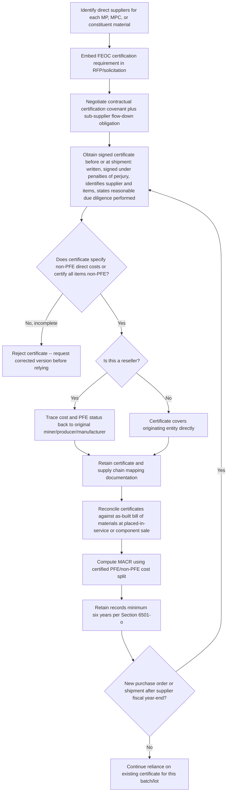

## Supplier Certification and Procurement Diligence

### Purpose and Placement in the Compliance Stack

Supplier certification and procurement diligence is the operational layer that translates the statutory and regulatory FEOC/material assistance framework into a day-to-day contracting and recordkeeping practice. Rather than requiring taxpayers to independently investigate the corporate ownership, debt structure, and manufacturing origin of every component in a supply chain, Congress and Treasury built a certification-based reliance system: developers and manufacturers ask their direct suppliers to certify PFE status and cost attribution, and — provided statutory reliance conditions are met — the taxpayer may rely on that certification rather than conduct independent verification.

This topic sits downstream of both the Applicable Threshold Percentage/MACR mechanics and the Safe Harbor framework covered elsewhere in this chapter: certification is not itself a method of calculating the MACR, but rather the evidentiary mechanism by which the inputs to that calculation (PFE status of each manufactured product, component, or constituent material) are established and substantiated.

### Statutory Basis for Certificates

Project developers and manufacturers will ask equipment suppliers to provide certificates confirming whether products were manufactured by PFEs, and whether there are any PFEs in the supply chain. The certificate should confirm the payment amount charged to the taxpayer for non-PFE goods, per Section 7701(a)(52)(D)(iii) of the Code. Certificates should be retained by both the taxpayer and supplier for six years and include the following:

- EIN number of the supplier.
- Any foreign identification number.
- Signatures from suppliers.
- A statement about the relationship to a PFE, if applicable, for all Manufactured Products Costs or Eligible Components Costs.

### The Certification Safe Harbor (Notice 2026-15, Section 4.03)

Notice 2026-15 elaborates this statutory certificate concept into a formal, elective Certification Safe Harbor. The Certification Safe Harbor described in Section 4.03 of Notice 2026-15 allows taxpayers to rely on certifications from direct suppliers rather than independently determining whether materials and products were produced or sourced from a prohibited foreign entity. The safe harbor is intended to simplify compliance by shifting part of the verification burden to suppliers and reducing the need for taxpayers to separately determine prohibited foreign entity status. This safe harbor applies to MACR calculations under both the QF/EST track (Sections 45Y/48E) and the EC track (Section 45X).

**Elements of a valid certification under Notice 2026-15.** To use the safe harbor, a taxpayer requests certifications from its direct supplier for each MP, MPC, or constituent material. A valid certification must:

- Be in writing, including electronic format, and signed under penalties of perjury by an authorized representative of the supplier.
- Specify the direct costs attributable to items that were not produced or sourced from a prohibited foreign entity, or certify that all items are non-prohibited foreign entity produced or sourced.
- Clearly identify the supplier and the specific items covered by the certification.
- State that the supplier exercised reasonable due diligence in determining prohibited foreign entity status.

**Scope of what a certification may cover.** For purposes of applying the Certification Safe Harbor and calculating the material assistance cost ratio, certifications may cover MPs, MPCs, or constituent materials included in the relevant qualified facility, energy storage technology, or eligible component. "Constituent materials" generally refer to materials that are directly incorporated into an MP or eligible component and become part of the finished item during the production process; materials that are not incorporated into the final product, such as tools or production supplies, are not treated as constituent materials for these purposes.

### Direct-Supplier Limitation — Why Tiering Matters

A critical structural feature of the Certification Safe Harbor is that reliance is limited to certifications from *direct* suppliers — the party the taxpayer contracts with directly, not sub-suppliers further up the chain. Because reliance is limited to certifications from direct suppliers, taxpayers should address certification requirements in procurement documentation early in the contracting process.

This creates a practical pass-through obligation: a direct supplier certifying to a developer that its components are non-PFE-sourced is implicitly relying on *its own* upstream suppliers' representations, cost tracing, or certifications — but the developer's safe-harbor protection runs only to its immediate contractual counterparty's certification, not directly to the tier-2 or tier-3 source. Developers should therefore consider requiring direct suppliers, as a contractual matter, to flow down equivalent certification and due-diligence obligations to their own sub-suppliers, even though the developer's own reliance protection under the safe harbor stops at the direct-supplier level.

### Reliance Standard and Knowledge Qualifier

Taxpayers may rely on certifications in good faith when the certification is accurate. However, if a certification is inaccurate due to supplier error or other issues, the taxpayer may face credit disallowance, penalties under Section 6695B of the Code or accuracy-related penalties under Section 6662 of the Code.

The reliance protection is therefore not absolute — it is conditioned on the taxpayer's good faith and lack of actual or constructive knowledge of inaccuracy. [Inference: the "knowledge or reason to know" qualifier is a standard feature of certification-based safe harbors throughout the tax code (analogous structures appear in domestic content and other supplier-certification regimes), and its application here follows that established pattern, though the precise contours of "reasonable due diligence" for FEOC certifications specifically have not yet been fully elaborated in final regulations.]

### Penalty Structure for Inaccurate Certifications

The certification framework is reinforced by a two-sided penalty regime that places exposure on both the certifying supplier and the relying taxpayer.

**Penalty to taxpayer.** Per §6662(a), the penalty is 20% of the reduction in the tax basis that benefited from the tax credit if the taxpayer's underpayment exceeds 1% of what they should have paid or $5,000, whichever is greater. Per §6662(d)(1)(B), if the taxpayer is a corporation, the penalty applies if the taxpayer's underpayment exceeds 1% of what they should have paid or $10 million, whichever is less.

**Penalty to equipment supplier.** Per §6695B, in the instances where a certificate is inaccurate, the supplier of that certificate is subject to a penalty that is the greater of 10% of the understatement of the taxpayer's tax basis, or $5,000. This penalty is only relevant if the understatement is greater than the lesser of 5% of the tax on the tax return or $100,000. Certificates provided before January 1, 2026, are exempt from this penalty.

**Statute of limitations.** The IRS can challenge the material assistance determination anytime in the six years after the tax return is filed for a qualified facility, energy storage technology, eligible component, or critical mineral, per Section 6501(o) — an extended look-back period compared to the general three-year statute of limitations, reflecting Congress's judgment that supply-chain FEOC issues may take longer to surface than ordinary return errors.

| Party | Penalty Provision | Penalty Amount | Trigger Threshold |
| --- | --- | --- | --- |
| Taxpayer (individual/pass-through) | §6662(a) | 20% of tax basis reduction attributable to the credit | Underpayment exceeds greater of 1% of tax owed or $5,000 |
| Taxpayer (corporation) | §6662(d)(1)(B) | 20% of tax basis reduction attributable to the credit | Underpayment exceeds lesser of 1% of tax owed or $10 million |
| Certifying supplier | §6695B | Greater of 10% of taxpayer's tax basis understatement or $5,000 | Understatement exceeds lesser of 5% of tax on the return or $100,000; exempt for certificates issued before Jan. 1, 2026 |
| IRS examination window | §6501(o) | N/A (procedural) | Six years from date the return is filed |

### Procurement Documentation Timeline — When to Build Certification Into Contracting

Because certification requirements function most effectively when embedded at the outset of a commercial relationship rather than retrofitted after equipment has already been ordered or installed, procurement diligence should be sequenced across the deal lifecycle:

1. **RFP/solicitation stage** — include FEOC certification requirements and PFE representations as a mandatory bid condition, screening out counterparties unwilling to certify before a contract is even negotiated.
2. **Contract negotiation** — embed certification delivery, format, and update obligations as binding contractual covenants (not side letters), including flow-down requirements to sub-suppliers and remedies for inaccurate certifications (indemnification, cost reimbursement, credit-disallowance risk allocation).
3. **Pre-shipment/pre-delivery** — obtain the actual signed certificate, tied to the specific batch, lot, or shipment of MPs, MPCs, or constituent materials being delivered, since PFE status is tested at the level of the specific item and the specific taxable year of the producing entity.
4. **Placed-in-service/credit claim** — reconcile all certificates against the as-built bill of materials before filing, confirming no gaps exist between certified items and items actually incorporated into the facility or component.
5. **Post-claim retention** — retain certificates for at least six years, aligned with the Section 6501(o) examination window, and longer if the asset is subject to the ten-year Section 48E recapture tail for effective control (a related but distinct exposure covered elsewhere in this chapter).

### Supply Chain Mapping — Documentation Categories

Beyond the certificate itself, comprehensive procurement diligence requires maintaining a broader evidentiary record to support the underlying MACR calculation and defend against IRS examination. Recommended supply chain mapping documentation includes:

- Documentation listing all suppliers and sub-suppliers of covered items for each qualified facility, including entity names, addresses, and countries of formation/operation.
- Bills of materials, purchase orders, and invoices identifying all covered items and their source entities.
- Payment records and proof of transaction completion.
- Agreements with contractors, subcontractors, and suppliers.
- Confirmation of physical receipt or completion of services for the covered items.

This documentation serves a dual function: it substantiates the direct-cost inputs to the MACR calculation under the general rule (Section 1.263A-1(e)(2)(i) direct material and labor costs), and it provides an independent audit trail in the event a supplier's certification is later challenged or found inaccurate.

### Special Timing Rule: PFE Status Testing Date

For each constituent material, a taxpayer must determine whether the entity that mined, produced or manufactured the constituent material is a prohibited foreign entity. MPs or MPCs will be considered to be produced by prohibited foreign entities if the entity that mined, produced or manufactured such MPs or MPCs is considered a prohibited foreign entity for such entity's taxable year that encompasses the date the taxpayer paid or incurred the direct costs associated with such MPs or MPCs.

This creates a procurement diligence implication distinct from the taxpayer's own PFE testing date: while the taxpayer itself is tested as an SFE/FIE on the last day of its own tax year (or the first day, for the initial post-enactment year), each *supplier's* PFE status for material assistance purposes is tested based on the *supplier's* taxable year that encompasses the payment date — meaning a supplier's status can change from one purchase order to the next if its own tax year, ownership, or control profile shifts, even mid-project.

**Practical consequence:** Certifications should not be treated as permanently valid documents obtained once at contract signing. A supplier certified as non-PFE at the time of an initial purchase order may need to be re-certified for subsequent shipments or renewal orders if a meaningful time gap exists, particularly across a supplier's fiscal year-end boundary.

### Reseller and Multi-Tier Sourcing Tracing

Costs from resellers are traced back to the original miner, producer or manufacturer. This rule prevents circumvention through interposed distributor or trading-company layers: certifying "the reseller is not a PFE" is insufficient if the underlying manufacturer or miner is itself a PFE. Procurement diligence for reseller-sourced materials must therefore obtain (directly or via the reseller's own certification chain) information tracing back to the originating producer, not merely the immediate contractual seller.

This reinforces why the direct-supplier certification limitation discussed above is operationally significant: a reseller can serve as the "direct supplier" for certification safe-harbor purposes, but the substantive PFE determination underlying that certification must still reach back through the reseller to the true originating entity.

### Averaging and Specified-Period Methods — Documentation Implications

For eligible components under Section 45X, taxpayers may group similar types of constituent materials incorporated into the same type of eligible component over a specified period (not exceeding the taxable year), calculating weighted averages based on quantity and costs rather than tracing each unit individually. Similarly, for distributed battery storage under 1 MWAC, the 1 MW BESS Allocation Method allows averaging across a specified period rather than per-unit tracking.

These averaging conveniences reduce transactional certification burden but do not eliminate documentation obligations — they shift the unit of certification from the individual shipment to the aggregate volume and PFE-production-percentage across the specified period. Procurement diligence for averaging-eligible categories should therefore track:

- Total quantity of each constituent material type received during the specified period.
- The proportion of that quantity that was PFE-produced versus non-PFE-produced.
- Weighted-average direct costs across the period, consistent with the specified-period requirements (contiguous, calendar-day-aligned, collectively covering the full taxable year).

### Diagram — Supplier Certification Workflow

### Practical Procurement Diligence Checklist

- **Front-load certification requirements.** Include FEOC/PFE certification obligations in RFPs and term sheets before contract execution, not as an afterthought during closing diligence.
- **Specify certificate format contractually.** Require the writing, penalties-of-perjury signature, supplier/item identification, and due-diligence attestation elements as binding contractual deliverables, not merely aspirational asks.
- **Build in flow-down obligations.** Require direct suppliers to obtain and pass through equivalent certifications (or underlying support) from their own sub-suppliers, since the taxpayer's safe-harbor reliance runs only to the direct-supplier certification.
- **Track supplier fiscal year-end and re-certify accordingly.** Because PFE status is tested against the *producing entity's* taxable year encompassing the payment date, long-running supply relationships spanning a supplier's fiscal year-end may require refreshed certifications.
- **Maintain parallel supply chain mapping documentation.** Certificates alone may not withstand IRS scrutiny within the six-year examination window without underlying bills of materials, purchase orders, invoices, and payment records corroborating the certified figures.
- **Allocate inaccurate-certification risk contractually.** Given the two-sided penalty exposure (Section 6662 for the taxpayer, Section 6695B for the supplier), procurement agreements should address indemnification, cost-sharing, or credit-disallowance risk allocation if a certification later proves inaccurate.
- **Watch the certificate grandfather date.** Certificates provided before January 1, 2026, are exempt from the Section 6695B supplier penalty — a transition rule relevant to legacy agreements signed before the material assistance rules' effective date but still governing ongoing deliveries.
- **Distinguish reseller certifications from originating-producer certifications.** Confirm that reseller-sourced components' certifications actually trace to the original miner, producer, or manufacturer rather than merely certifying the reseller's own non-PFE status.

### Compliance Risk Points

- **Direct-supplier limitation creates a documentation gap for tiered supply chains.** Multi-tier manufacturing (common in solar module and battery cell supply chains) means the taxpayer's safe-harbor reliance may not reach the entities most likely to carry PFE risk (upstream cell, wafer, or polysilicon producers), requiring contractual flow-down solutions that are not themselves mandated by the safe harbor.
- **Good-faith reliance is not a strict-liability shield.** The "knowledge or reason to know" qualifier means a taxpayer aware of red flags (e.g., public reporting suggesting a supplier's PFE status, inconsistent certifications across shipments) cannot mechanically rely on a facially compliant certificate without risking loss of safe-harbor protection.
- **Certification is a snapshot, not a continuing warranty.** Because PFE status is tested by taxable year and by payment date, a certification obtained at one point in a long-running supply relationship does not automatically remain accurate for later shipments, particularly across ownership changes, corporate reorganizations, or shifts in a supplier's covered-nation exposure.
- **Six-year audit exposure outlasts typical project finance diligence periods.** Procurement teams should plan document retention well beyond typical project closing and construction timelines, since IRS examination risk persists for six years from the return filing date under Section 6501(o).
- **Reunion and other market commentators note the absence of a standardized certification format.** As of current guidance, there are no widely accepted comprehensive formats for demonstrating PFE compliance beyond the statutory and Notice 2026-15 minimum elements, meaning taxpayers and suppliers should expect format variation and potential friction in cross-counterparty certification exchanges until Treasury issues further standardization. [Unverified: whether Treasury will issue a standardized certificate template in the forthcoming proposed regulations, as opposed to continuing to rely on the minimum-elements approach, is not yet confirmed.]

**Related Topics:**

- Applicable Threshold Percentages and Their Escalation Schedule
- Safe Harbor Tables and Notice 2026-15
- Effective Control, Licensing, and Financial Arrangement Limits
- Section 6662 Accuracy-Related Penalties and Section 6695B Supplier Penalties in Detail
- Section 6501(o) Extended Statute of Limitations for Material Assistance Determinations
- Reseller and Multi-Tier Supply Chain Tracing Methodologies
- 1 MW BESS Allocation Method and EC Averaging for High-Volume Procurement
- Binding Contract and Pre-June 16, 2025 Purchase Order Exclusions
- Indemnification and Risk Allocation Provisions in FEOC-Sensitive Procurement Contracts
- Recordkeeping Systems and Supply Chain Mapping Technology for FEOC Compliance