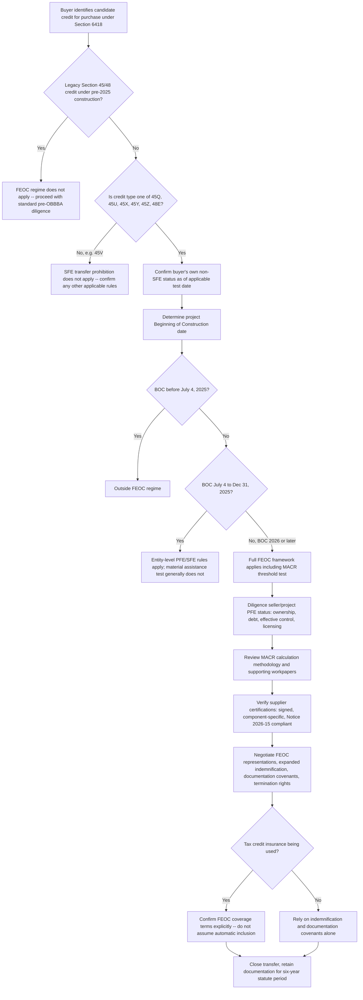

## Effects on Credit Buyers in Transfer Transactions

### Why FEOC Fundamentally Changes Buyer Risk in Section 6418 Transfers

Section 6418, effective for tax years beginning after 2022, provides a mechanism for taxpayers to monetize the benefit of an eligible credit through transfer to an unrelated party for cash, and a robust credit transfer market has developed around it. Under this framework, eligible taxpayers can elect to transfer all or a portion of an eligible credit to unrelated taxpayers for cash, and the tax credit buyer is treated as the taxpayer with respect to such credit.

The critical structural fact that has always defined buyer risk in this market is that credit eligibility largely depends on the activities of the transferor, but the buyer is subject to the excessive credit transfer liability. FEOC/material assistance compliance does not change this basic allocation of legal exposure — the buyer still bears excessive credit transfer risk — but it changes the *character* and *severity* of that risk dramatically compared to pre-OBBBA diligence items.

Two features make FEOC unlike any prior tax credit compliance regime for a buyer:

- **All-or-nothing eligibility.** Missing a domestic content threshold under the prior IRA framework cost a 10% bonus adder. Missing the Material Assistance Cost Ratio (MACR) threshold under the OBBBA disqualifies the entire credit — there is no partial-credit outcome for a failed material assistance test.
- **Six-year statute of limitations.** The IRS has twice the normal window to assess additional tax on material assistance violations, per Section 6501(o), meaning buyers carry exposure long after closing — roughly double the ordinary three-year assessment period buyers are accustomed to for other tax credit risk items.

### Prohibition on Transfers to Specified Foreign Entities

Beyond the seller-side material assistance question, FEOC imposes an entirely new buyer-side eligibility gate that did not exist before OBBBA: the buyer itself must not be a prohibited entity.

The OBBBA amended §6418(g) to prohibit the transfer of any portion of a Section 45Q, 45U, 45X, 45Y, 45Z, or 48E credit to a specified foreign entity. This means credit buyers must now assess their own SFE status in addition to the seller-side project and credit diligence that was already required before the OBBBA. For transactions involving these six restricted credit types, buyers should confirm their organizational structure, ownership, and country of principal operations to verify non-SFE status as of the applicable test date.

**Practical transaction consequence:** transfer agreements for these six credit types must now include obtaining buyer SFE representations — written representations from the buyer regarding non-SFE status as of the applicable test date — a wholly new category of buyer-side representation that did not exist in pre-OBBBA transfer documentation. Note that this prohibition applies specifically to SFE status; the broader FIE definition (with its ownership, debt, and effective control tests) determines whether a taxpayer is a PFE for purposes of *generating* an eligible credit, while the §6418(g) transfer-to-SFE prohibition is narrower and targets only the SFE sub-category on the buyer side.

### Credit-Type Segmentation — Which Transfers Are Affected

Not every transferable credit carries FEOC exposure, and the degree of exposure varies significantly by credit type and vintage. This segmentation is a threshold diligence question buyers must resolve before any FEOC-specific work begins.

| Credit Category | FEOC Exposure | Basis |
| --- | --- | --- |
| Legacy Section 45 / Section 48 credits | Exempt | Legacy tax credits under Sections 45 and 48 are exempt from these rules; projects under construction for tax purposes by the end of 2024 can claim legacy credits without FEOC compliance |
| Section 45Y / 48E — construction began before Jan. 1, 2026 | Entity-level rules apply; material assistance test does not | Section 45Y and 48E projects that start construction for tax purposes before January 1, 2026, are not subject to project-level material assistance requirements, but are subject to entity-level restrictions beginning in the taxpayer's first taxable year after OBBBA enactment |
| Section 45Y / 48E — construction begins Jan. 1, 2026 or later | Full FEOC framework, including MACR | Applicable Threshold Percentage schedule applies in full (see escalation schedule topic) |
| Section 45X — components sold in taxable years beginning after July 4, 2025 | Full FEOC framework, including EC-level MACR | Statutory effective date tied to OBBBA enactment |
| Section 45V (hydrogen) | Not subject to SFE restriction | According to the Tax Law Center's analysis, the law does not apply foreign entity rules to Section 45V, and therefore Section 45V credits remain transferable without the SFE restriction |
| Section 45Q, 45U, 45Z | Entity-level PFE/SFE restrictions apply on staggered timelines | SFE prohibition generally begins the tax year after July 4, 2025; FIE prohibition for 45U/45Z begins the second tax year after enactment (2027) |

Because legacy credits carry no FEOC exposure at all, they have become highly sought-after in the transfer market and are expected to trade at a premium as supply diminishes — a direct pricing consequence of the compliance burden this topic addresses.

### The Buyer's Beginning-of-Construction (BOC) Diligence Gate

Because so much of the FEOC exposure analysis turns on when a project began construction, confirming the BOC date is typically the buyer's first diligence step, functioning as a gate that determines how much subsequent FEOC work is even necessary.

**BOC timeline framework:**

- **Before July 4, 2025:** Generally outside the FEOC regime entirely.
- **July 4 – December 31, 2025:** Entity-level rules apply; material assistance rules generally do not.
- **On or after January 1, 2026:** Full FEOC framework applies, including MACR testing against the Applicable Threshold Percentage.

A significant practical complication for 2026-vintage deals: the 5% cost safe harbor is no longer available for new projects; only the physical work test establishes BOC. This raises the evidentiary bar for BOC substantiation precisely at the moment BOC date determines full FEOC applicability. Buyers should request dated documentation: physical work evidence, engineering contracts, equipment delivery records, and a BOC memorandum from tax counsel.

**Common buyer error:** assuming a pre-2026 BOC exempts a project entirely from FEOC — entity-level ownership and control rules still apply even to a project that begins construction before the material assistance regime's effective date, since the taxpayer-level PFE restrictions activate on a separate, earlier timeline than the project-level material assistance test.

### PFE Status Diligence on the Seller/Project Side

Beyond the buyer's own SFE status, the buyer must diligence whether the seller, the project entity, or the credit-generating taxpayer itself is a PFE — since a credit purportedly generated by a PFE taxpayer would be invalid regardless of the buyer's own status.

Red flags in this diligence layer include direct or indirect equity ownership by a covered-nation entity, effective control through licensing or technology agreements, and certain debt arrangements (the ownership, debt, and effective control tests covered elsewhere in this chapter). Buyers should require a written FEOC representation covering ownership to the ultimate parent, copies of licensing and services agreements, and a sworn statement that transfer proceeds will not flow to a specified foreign entity.

**Common buyer error:** ignoring effective control — licensing and technology agreements can establish PFE status even without any equity ownership stake, meaning an ownership-only diligence review can miss a disqualifying arrangement entirely.

### MACR Verification as a Buyer Diligence Item

For 45Y/48E projects beginning construction in 2026 or later, and for 45X components sold after the statutory effective date, buyers must independently verify that the seller's MACR calculation actually clears the Applicable Threshold Percentage for the relevant year and technology.

The MACR is the percentage of total direct manufacturing costs not attributable to a PFE; the higher the MACR, the cleaner the project, with thresholds rising each year per the escalation schedule. Notice 2026-15 allows taxpayers to calculate the MACR under general rules or to elect one of three interim safe harbors (Identification, Cost Percentage, or Certification), but there is no IRS-issued form for this calculation — meaning buyers cannot rely on a standardized government-verified computation and must instead review the seller's underlying methodology and supporting workpapers directly.

**Buyer verification checklist for MACR:**

- Which calculation methodology did the seller use — general rule, ID Safe Harbor, Cost % Safe Harbor, or Certification Safe Harbor?
- Does the resulting MACR clear the threshold for the project's actual begin-construction year (or, for 45X, the actual sale year) with an adequate margin, or is it borderline?
- Are the underlying supplier certifications (see below) complete, properly executed, and consistent with the MACR calculation presented?
- Has the seller retained the six-year documentation required to defend the calculation if challenged?

### Supplier Certification Review as a Buyer Diligence Item

MACR compliance relies on supplier certifications signed under penalties of perjury. Buyers should verify that certifications come from each tier-one (direct) supplier, name the specific components covered, follow the Notice 2026-15 format requirements, and are backed by audit-ready records.

A market friction point buyers should proactively surface: a meaningful number of deals have stalled when a manufacturer refused to sign a required certification — this counterparty cooperation risk is worth identifying early in a transaction timeline rather than discovering it during final diligence, since it can derail a deal that is otherwise economically agreed.

**Common buyer error:** accepting boilerplate supplier letters — generic language without component-level detail is not defensible in the event of an IRS challenge, and a buyer relying on such a letter inherits weak underlying support for the MACR position.

### Structuring FEOC Protections Into the Transfer Agreement

Pre-OBBBA transfer agreement language is no longer sufficient for FEOC-affected credits. A properly updated transfer agreement should include:

- **Explicit FEOC representations** covering ownership, control, MACR compliance, and supplier certification accuracy — not generic "compliance with applicable law" boilerplate.
- **Expanded indemnification** calibrated to the six-year statute of limitations, reflecting that the buyer's exposure window is roughly double what pre-OBBBA transfer agreements were typically drafted to cover.
- **Documentation covenants** requiring the seller to maintain BOC evidence, MACR calculations, and supplier records for the full statute period — ensuring the seller (who controls the underlying facts) remains obligated to preserve the evidence the buyer would need if challenged years after closing.
- **Termination rights** if post-signing diligence reveals a material FEOC issue, giving the buyer an exit mechanism between signing and closing if new adverse information surfaces.
- **Tax contest and audit-defense language**, addressing how an audit is handled and what consent rights the parties have in the event of a potential IRS settlement, since audit defense is often a collaborative effort and buyers may need project documentation during an audit that is not required under the minimum documentation regulations.

Since the passage of the OBBBA, FEOC concerns are now a central item for every party looking to buy or sell IRA tax credits, and sellers may need to represent to buyers that they have complied with applicable FEOC requirements and provide documentation substantiating that compliance as a standard deal term rather than a negotiated extra.

### Interaction with Recapture Rules

FEOC-related recapture exposure compounds with — rather than replaces — the pre-existing recapture framework buyers already had to diligence.

- **General ITC recapture.** Transferred credits under Sections 48, 48C, and 48E are subject to the investment tax credit basis and recapture rules under Section 50, an exposure that pre-dates and operates independently of FEOC.
- **PTC recapture immunity.** Unlike ITCs, §45 and §45Y PTCs are not subject to general recapture risk, which is a structural reason buyers may prefer PTC-generating credits when FEOC risk tolerance is a concern.
- **FEOC-specific ten-year effective control recapture (§48E only).** As discussed elsewhere in this chapter, any applicable payment made to an SFE within ten years after a Section 48E-credited facility is placed in service triggers full clawback of the credit under Section 50(a)(4) — an FEOC-specific recapture exposure layered on top of ordinary Section 50 recapture, and one that persists long after a buyer might otherwise have considered its diligence period closed.
- **Excessive credit transfer liability generally.** Because the buyer, not the seller, is directly liable for excessive credit transfers, it remains critical for buyers to perform robust due diligence before closing — FEOC issues are simply the newest and highest-stakes category within that pre-existing liability structure. Credits involving prevailing wage and apprenticeship, domestic content, or recapture issues already presented increased risk for a transferee if challenged by the government; FEOC/material assistance issues now sit alongside (and often above) those in severity given the all-or-nothing nature of the MACR threshold test.

### Risk Mitigation Tools Available to Buyers

Buyers can mitigate transaction risks — including credit disallowance, recapture, eligible basis issues, and counterparty credit risk — through careful diligence, seller indemnities, parent guarantees, and tax insurance.

**Tax credit insurance considerations specific to FEOC:** buyers should confirm separately whether tax credit insurance will cover FEOC risk and on what terms, since policy language varies meaningfully on this point — FEOC coverage should not be assumed to be automatically bundled into a standard tax credit insurance policy, and underwriters typically demand the same underlying documentation buyers should independently be collecting rather than serving as a substitute for that diligence. A common buyer error is treating insurance as a substitute for diligence, when in practice underwriters require the same documentation buyers should be collecting themselves.

**Additional recognized mitigation actions** for parties on both sides of a transfer include reviewing ownership, debt, and contractual arrangements to ensure no SFE or FIE taint; auditing supply chains and procurement to ensure compliance with MACR thresholds; obtaining and retaining supplier certifications and documentation; and monitoring Treasury and IRS announcements regarding impending FEOC guidance, since the interim nature of Notice 2026-15 means the compliance landscape buyers are diligencing against continues to evolve.

### Diagram — Buyer Diligence Sequence in a FEOC-Affected Transfer

### Common Buyer Mistakes Summarized

- **Assuming pre-2026 BOC exempts a project entirely** — entity-level ownership and control rules still apply regardless of when material assistance testing begins.
- **Accepting boilerplate supplier letters** — generic language without component-level detail is not defensible in an IRS challenge.
- **Ignoring effective control** — licensing and technology agreements can establish PFE status even without any equity ownership.
- **Treating insurance as a substitute for diligence** — underwriters demand the same documentation buyers should independently collect.
- **Underestimating the six-year exposure window** when calibrating indemnification caps, escrow holdback periods, or survival clauses in the transfer agreement, since a two-year or three-year survival period common in pre-OBBBA deals may leave a substantial gap relative to the actual IRS assessment window.

### Market-Level Effects of Buyer-Side FEOC Diligence

The elevated diligence burden described above has produced observable market effects: MACR compliance has become a standard financing diligence item, with lenders, tax equity investors, and credit buyers all requiring audit-ready MACR documentation files, including supplier certifications, bills of materials, and country-of-origin attestations. Separately, many Section 45X credit sellers have been focused on understanding FEOC compliance and have been less active in the transfer market, creating a temporary supply lag in that segment — a dynamic buyers should factor into sourcing strategy and pricing expectations for 45X-generated credits specifically. [Unverified: the duration and ultimate resolution of this 45X market lag depends on how quickly Treasury issues the mandated safe harbor tables and how sellers adapt, and cannot be predicted with confidence from current guidance alone.]

**Related Topics:**

- Applicable Threshold Percentages and Their Escalation Schedule
- Safe Harbor Tables and Notice 2026-15
- Effective Control, Licensing, and Financial Arrangement Limits
- Supplier Certification and Procurement Diligence
- Section 6418(g) Prohibition on Transfers to Specified Foreign Entities
- Ten-Year Recapture Mechanics Under Section 50(a)(4) for Section 48E ITCs
- Beginning-of-Construction Substantiation Standards Post-Physical-Work-Test-Only Regime
- Tax Credit Insurance Product Design for FEOC-Specific Risk
- Legacy Credit Premium Pricing Dynamics in the Post-OBBBA Transfer Market
- Buyer Indemnification, Escrow, and Survival Period Structuring for Six-Year Exposure Windows