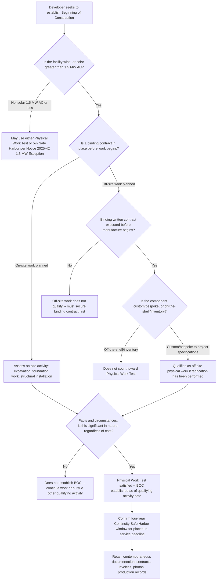

## The Physical Work Test

### Origin and Purpose in the Beginning-of-Construction Framework

Since at least 2013, the IRS has recognized two "beginning of construction" (BOC) methods for clean energy tax credit purposes. Under the Physical Work Test, a taxpayer demonstrates eligibility by performing "physical work of a significant nature" before the applicable deadline. Notice 2013-29 established both the Physical Work Test and the Five Percent Safe Harbor as alternative frameworks for establishing BOC, and subsequent notices — most notably Notice 2018-59, which taxpayers relied on when the Inflation Reduction Act passed, and Notice 2022-61, addressing prevailing wage and apprenticeship interactions — reaffirmed and refined those same principles.

Neither the Inflation Reduction Act nor the OBBBA defined "beginning of construction" with specificity in the statutory text itself; the concept has always been built out through IRS sub-regulatory guidance (Notices) rather than the Code or Treasury Regulations. The Physical Work Test is the more substance-oriented of the two historical BOC pathways — it asks what was actually built or contracted to be built, rather than how much money changed hands.

### Core Legal Standard

Construction is considered to have begun when physical work of a significant nature commences. This includes work performed by the taxpayer or by others under a binding written contract executed prior to the manufacture, construction, or production of the facility. The determination of whether physical work is of a significant nature depends on the relevant facts and circumstances, focusing on the nature of the work performed, not its amount or cost.

This "nature, not amount" standard is the defining conceptual feature of the test: there is no fixed minimum amount, monetary, or percentage threshold. A relatively small but qualifying physical activity can satisfy the test, while a large volume of non-qualifying preliminary work cannot.

### On-Site and Off-Site Work

Physical work of a significant nature includes both on-site and off-site work, and may include work performed by the taxpayer or another party. Both off-site and on-site physical work may be taken into account in the facts-and-circumstances determination.

| Work Category | Examples | Key Condition |
| --- | --- | --- |
| On-site physical work | Excavation for foundations, installation of racking/mounting structures, pouring of concrete pads, installation of transformers or wind turbine foundations | Must be significant in nature; preliminary site activities generally do not qualify |
| Off-site physical work | Manufacture of components specifically for the project (e.g., custom transformers, bespoke turbine blades) | Must generally be performed under a binding written contract entered into prior to the manufacture, and must not be from existing inventory |

**The inventory/off-the-shelf exclusion.** Inventory components and "off-the-shelf" items do not count toward the Physical Work Test, but bespoke manufacturing — such as custom transformers or wind turbine blades built specifically for the project — does count, and such items should be specified as custom/bespoke in the underlying contract to support this treatment. This distinction is central to how off-site manufacturing work qualifies: a manufacturer pulling a standard-catalog component from existing stock to fill an order does not constitute qualifying physical work, because that manufacturing activity was not undertaken *for* the specific project; a manufacturer beginning fabrication of a component built to the project's specifications, under a binding contract, does qualify.

### The Binding Written Contract Requirement for Off-Site Work

Binding, enforceable contracts must precede off-site work for that work to count toward the Physical Work Test. This creates a sequencing requirement: the contract must be executed *before* the manufacture, construction, or production activity begins, not after the fact to paper over work already underway. A contract is generally treated as "binding" for this purpose if it is enforceable under local law against the taxpayer (or a party engaged on the taxpayer's behalf) and does not limit damages to a specified amount that is materially less than the total contract price (a limitation-of-damages threshold long used in prior BOC guidance for the closely related "binding written contract" concept elsewhere in the beginning-of-construction doctrine). [Inference: this specific damages-limitation threshold is drawn from the well-established binding-contract standard used throughout IRS beginning-of-construction guidance for other purposes, such as the Five Percent Safe Harbor's binding contract requirement, and is presented here by analogy since the search results confirm the general "binding written contract executed prior to" requirement without independently restating this precise damages formulation for the current Notice 2025-42 iteration specifically.]

### What Does NOT Qualify as Physical Work of a Significant Nature

The Physical Work Test has always excluded preliminary activities that precede actual construction, regardless of how much time or money is spent on them. This exclusion list has been carried forward consistently across IRS notices since 2013:

- Planning or design work.
- Securing financing.
- Obtaining permits.
- Clearing a site (in the absence of other qualifying work).
- Test drilling for soil composition or resource assessment.
- Removal of existing structures without accompanying qualifying construction activity.

Preliminary activities like planning or permitting are explicitly excluded — the test tightens the "beginning of construction" requirements around demonstrable physical construction progress, not administrative or preparatory milestones, however necessary those milestones are to the eventual project.

### Historical Coexistence with the Five Percent Safe Harbor

For over a decade, the Physical Work Test operated as one of two equally available BOC-establishment methods, with taxpayers free to choose whichever fit their project's development timeline and risk tolerance:

- **Physical Work Test** — fact-intensive, substance-based, no dollar threshold, but requires actual construction or bespoke manufacturing activity.
- **Five Percent Safe Harbor** — a taxpayer establishes BOC by paying or incurring at least 5% of total project costs before the applicable deadline; simpler to document with cost records but requires committing meaningful capital.

Historically, taxpayers could establish beginning of construction by either the Physical Work Test (beginning physical work of a significant nature) or the Five Percent Safe Harbor (paying or incurring at least 5% of total project costs) under earlier guidance such as Notice 2013-29 and its successors. This dual-pathway structure was the status quo the industry relied upon for over a decade.

### The 2025-2026 Disruption: Notice 2025-42 and the OBBBA Termination Deadline

The Physical Work Test's practical significance escalated sharply in 2025-2026 because of two converging developments under the OBBBA.

**The OBBBA termination backdrop.** The OBBBA singled out solar and wind for early tax credit phase-outs: wind and solar projects seeking the Section 48E ITC or Section 45Y PTC must be placed in service by the end of 2027 to claim the credits. However, the OBBBA created an exception for projects that establish beginning of construction before July 4, 2026 — exactly one year after the OBBBA was enacted. Projects meeting that earlier BOC deadline are not subject to the 2027 placed-in-service requirement, making the choice of BOC-establishment method for wind and solar projects an unusually high-stakes decision in this window.

**Notice 2025-42's elimination of the Five Percent Safe Harbor.** On August 15, 2025, in response to Executive Order 14315, Treasury issued Notice 2025-42, which removed the Five Percent Safe Harbor — a longstanding IRS-recognized method used since 2013 (and, before that, in connection with the since-expired Section 1603 grant program) — for all wind projects and for solar projects exceeding 1.5 MW (AC). Under the Notice, only the Physical Work Test (as described in Section 3.02 of the Notice) could be used to determine whether such a solar or wind facility began construction for purposes of the OBBBA phase-out rules. The Notice applied prospectively, generally effective for BOC determinations after September 2, 2025, while Notices 2013-29, 2018-59, and 2022-61 continued to apply in their entirety for projects that started construction before that date.

**The 1.5 MW low-output solar exception.** Notice 2025-42 preserved a limited exception: low-output solar facilities with a maximum net output of no more than 1.5 megawatts (AC) could continue to use either the Physical Work Test or the 5% Safe Harbor as outlined in Notice 2013-29. The 1.5 MW maximum net output threshold is measured on a nameplate generating capacity basis, in alternating current, at the time the facility is placed in service, with integrated operations and related-taxpayer aggregation rules applied to prevent artificial project-splitting to stay under the cap.

**A terminology tightening.** One notable language change in the physical work requirement is that under the previous Notice 2013-29, a taxpayer could establish beginning of construction by "starting" physical work of a significant nature, whereas Notice 2025-42 required that the work be "performed" — a subtle but consequential shift toward requiring demonstrated completion of qualifying activity rather than mere commencement.

**Scope limitation — FEOC excluded.** Notice 2025-42 explicitly stated that its guidance was not intended to address the beginning of construction rules for the FEOC/material assistance restrictions, which the Treasury Department and IRS indicated they were separately drafting; this is why the BOC standards discussed in this topic (Beginning of Construction and Safe Harbor Doctrine chapter) and the FEOC-specific BOC treatment discussed elsewhere in this course are formally distinct, even though they frequently reference the same underlying physical-work concepts.

### June 2026 Litigation Development — Vacatur of Notice 2025-42

A significant post-issuance development substantially altered the practical landscape for the Physical Work Test's exclusivity. On Saturday, June 6, 2026, the U.S. District Court for the District of Columbia vacated IRS Notice 2025-42, which had eliminated the Five Percent Safe Harbor as a BOC-establishment method for wind projects and solar projects greater than 1.5 MW (AC).

The court concluded that the IRS failed to provide a reasoned basis for the policy shift of eliminating the 5% Safe Harbor for only wind and solar facilities, and therefore held the Notice violated the Administrative Procedure Act. Key aspects of the decision:

- **Vacatur of Notice 2025-42**, with the court finding the notice "arbitrary and capricious."
- **Remand to the IRS** for further consideration.
- **Nationwide application** of the vacatur to all taxpayers, not just the plaintiffs in the case.

**Practical guidance despite the ruling.** Given the short timeline before the July 4, 2026 BOC deadline, the remand to the IRS for further review, and the potential for an appeal of the ruling on procedural and substantive grounds on which it may be overruled, practitioners cautioned that it was not advisable to rely on the Five Percent Safe Harbor for wind and large solar projects notwithstanding the vacatur, given the residual legal uncertainty in the narrow window before the statutory deadline.

[Unverified: the status of any appeal of this June 2026 district court ruling, and whether Treasury has issued replacement guidance following the remand, falls after this course's reliable knowledge cutoff and should be independently verified against current IRS and court filings, since this is an active and rapidly evolving legal matter as of this writing.]

### The Continuity Requirement — Physical Work Test's Companion Doctrine

Establishing BOC via the Physical Work Test is necessary but not sufficient on its own; a taxpayer must also maintain a continuous program of construction (or continuous efforts, for the safe-harbor alternative) from the BOC date through the placed-in-service date. This can be satisfied through the Continuity Safe Harbor if the project is placed in service by the end of a calendar year that is no more than four calendar years after the calendar year during which construction began.

This four-year Continuity Safe Harbor period begins in the year construction begins and ends in the calendar year four years later; if the facility is placed in service within that window, the taxpayer is deemed to satisfy the continuity requirement without needing to separately document continuous construction activity year by year.

### Worked Example — Applying the Physical Work Test

**Scenario:** A developer is constructing a 150 MW wind facility and wants to establish BOC via the Physical Work Test before the July 4, 2026 OBBBA deadline (rather than relying on the now-uncertain Five Percent Safe Harbor).

**Step 1 — Identify candidate on-site activities.** The developer begins excavation work for turbine foundation pads in May 2026. Foundation excavation is a well-established example of qualifying on-site physical work of a significant nature.

**Step 2 — Identify candidate off-site activities.** In parallel, the developer has a binding written contract, executed in March 2026, with a turbine manufacturer for custom-specified turbine blades built to the project's technical specifications (not drawn from manufacturer inventory). The manufacturer begins fabrication of the first blade set in April 2026.

**Step 3 — Assess sufficiency.** Under the facts-and-circumstances standard, both the foundation excavation (on-site) and the custom blade fabrication under a pre-existing binding contract (off-site) independently support a finding of physical work of a significant nature. There is no dollar threshold to clear — the qualifying nature of the activities themselves, not their cost, establishes BOC.

**Step 4 — Documentation.** The developer retains dated site photographs and excavation logs (on-site work), the executed turbine supply contract with custom-specification language and a delivery schedule, and the manufacturer's production records showing fabrication commenced before the deadline (off-site work) — creating the evidentiary record needed to substantiate the BOC date if challenged.

**Outcome:** BOC is established as of the earlier of the two qualifying activity start dates (subject to relevant-facts-and-circumstances aggregation principles across the whole project), positioning the project outside the OBBBA's 2027 placed-in-service deadline for wind and solar.

### Diagram — Physical Work Test Decision Logic

### Documentation Best Practices

Because the Physical Work Test is inherently fact-intensive rather than a bright-line percentage test, contemporaneous documentation is the primary defense against a later IRS challenge to the claimed BOC date:

- **Dated photographic and video evidence** of on-site excavation, foundation work, or structural installation activity.
- **Executed binding contracts** for off-site fabrication, clearly specifying custom/bespoke component specifications (not generic catalog part numbers) and dated prior to the commencement of manufacturing.
- **Manufacturer production records** substantiating that fabrication of contracted components actually began before the relevant deadline, distinct from mere order placement or deposit payment.
- **A BOC memorandum from tax counsel**, synthesizing the facts-and-circumstances analysis and the applicable legal standard as of the date the memorandum is prepared — particularly important given the volatility of the surrounding guidance (Notice 2025-42's issuance, subsequent vacatur, and any further Treasury response) in the 2025–2026 period.
- **A record of any relevant safe-harbor election** (e.g., reliance on the 1.5 MW low-output solar exception, or a considered decision to proceed under the Physical Work Test rather than the now-litigation-affected Five Percent Safe Harbor) memorializing the reasoning at the time, given how quickly the governing guidance shifted.

### Compliance Risk Points

- **Volatility of the governing guidance itself.** The Physical Work Test's exclusivity for wind and larger solar projects was imposed by Notice 2025-42 in August 2025 and then vacated by a federal court in June 2026, with the vacatur applied nationwide but subject to potential appeal — taxpayers making BOC decisions in this period faced (and future analogous situations may face) a moving legal target, and any BOC position taken should be documented with a clear as-of-date reference to the guidance relied upon.
- **"Nature, not amount" cuts both ways.** The absence of a dollar threshold means a taxpayer cannot simply point to substantial spending as proof of qualifying work; conversely, a small but genuinely qualifying physical activity can be sufficient — misunderstanding this distinction is a common source of BOC disputes.
- **Off-the-shelf risk in off-site manufacturing.** Developers relying on off-site fabrication should confirm with suppliers, in the contract itself, that components are being custom-manufactured for the specific project rather than drawn from general inventory, since inventory-sourced components do not count regardless of contract value.
- **Sequencing errors in binding contracts.** A contract executed after fabrication has already begun does not retroactively qualify that work; the binding written contract must precede the manufacture, construction, or production activity.
- **FEOC BOC rules remain separately governed.** Notice 2025-42 and its underlying Physical Work Test standards do not address the beginning-of-construction determination for FEOC/material assistance purposes — a taxpayer establishing BOC under this doctrine for OBBBA phase-out purposes must separately confirm the BOC treatment applicable under the FEOC-specific guidance covered in the Foreign Entity of Concern chapter, since the two BOC concepts, while related, are not guaranteed to be interpreted identically pending further Treasury guidance.

**Related Topics:**

- The Five Percent Safe Harbor and Its 2026 Litigation History
- The Continuity Requirement and Four-Year Continuity Safe Harbor
- Binding Written Contract Standards Across BOC Guidance
- The 1.5 MW Low-Output Solar Exception Under Notice 2025-42
- OBBBA Placed-in-Service Deadlines for Wind and Solar (Section 45Y/48E)
- Beginning-of-Construction Standards for FEOC/Material Assistance Purposes
- Notice 2013-29, Notice 2018-59, and Notice 2022-61 Historical Framework
- Documentation and Substantiation Practices for BOC Determinations
- Executive Order 14315 and Its Effect on Treasury Sub-Regulatory Guidance
- Administrative Procedure Act Challenges to IRS Notices