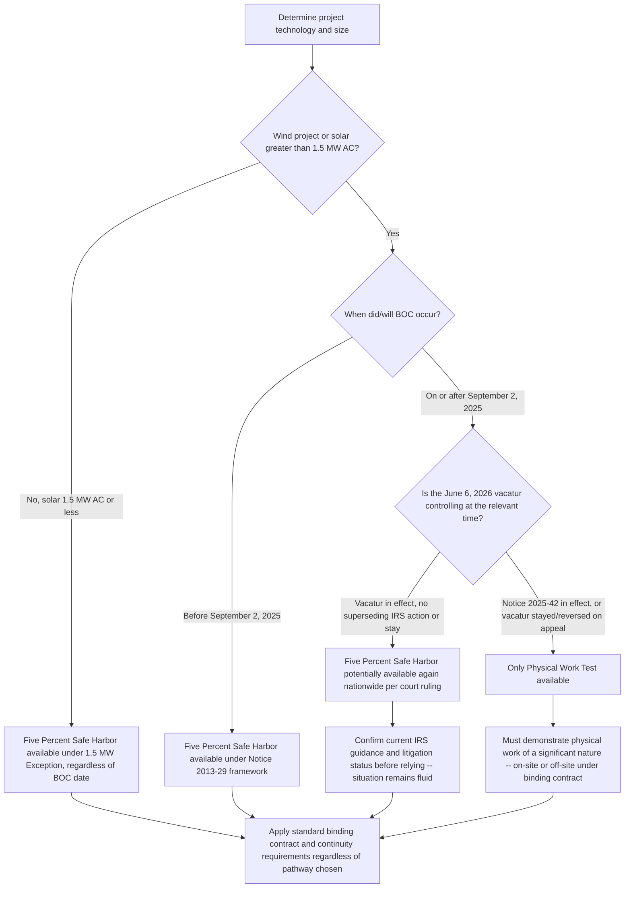

## The Five Percent Safe Harbor and Its Elimination for New Projects

### Origin and Statutory Purpose

The Five Percent Safe Harbor is the second of the two historical "beginning of construction" (BOC) methods that the IRS has recognized since at least 2013, alongside the Physical Work Test. Under the Notice, during the relevant year there must be either physical work of a significant nature, or the incurrence of at least 5 percent of the costs of the project (the Safe Harbor), and, in either case, satisfaction of certain continuity requirements.

The Safe Harbor's original purpose was practical and administrable: rather than forcing every developer into a fact-intensive "was this construction activity significant" inquiry, Treasury and the IRS offered a bright-line, cost-based alternative. A taxpayer establishes BOC by paying or incurring at least 5% of total project costs before the applicable deadline. This mirrored the framework Treasury had earlier used in the Section 1603 cash grant program, giving the renewable energy industry a familiar, well-tested standard to rely on across multiple credit regimes and roughly a decade of subsequent guidance.

### Core Mechanics of the Test

$$\text{Safe Harbor Satisfied if: } \frac{\text{Costs Paid or Incurred}}{\text{Total Project Cost}} \geq 5\%$$

Both the Physical Work Test and the Safe Harbor standards can be satisfied by work done by or payments made to a contractor pursuant to a binding contract — meaning a developer does not need to have performed the work itself; payments to third-party contractors under qualifying binding contracts count toward the 5% threshold.

**Key structural features distinguishing the Safe Harbor from the Physical Work Test:**

| Feature | Five Percent Safe Harbor | Physical Work Test |
| --- | --- | --- |
| Threshold basis | Fixed percentage of total project cost | No fixed dollar/percentage threshold |
| Primary evidence | Cost records, invoices, payment documentation | Facts-and-circumstances physical activity |
| Documentation burden | Comparatively simpler — an accounting exercise | Comparatively more subjective — requires substantiating "significance" |
| Cost overrun risk | Introduces a distinct compliance risk (see below) | Not directly implicated by later cost overruns |

### The Binding Written Contract Standard

Both BOC methods rely on the same underlying definition of a "binding written contract" for purposes of counting third-party payments toward the applicable threshold. Under both the Section 1603 grant guidance and Notice 2013-29, a contract is considered binding only if it is enforceable under local law against the taxpayer (or a predecessor) and does not limit damages to a specified amount, such as through a liquidated damages provision.

**The 5% liquidated damages de minimis exception.** As originally issued, Notice 2013-29 did not include a de minimis rule for liquidated damages provisions — a departure from the earlier Section 1603 grant guidance, which had permitted damages limitations of at least 5% of the contract price without disqualifying the contract as "binding." This was considered a potentially onerous requirement, since EPC contracts, turbine supply contracts and similar agreements commonly contain liquidated damages provisions. The IRS subsequently revised Notice 2013-29 to align it with the grant program standard: a contractual provision that limits damages to an amount equal to at least 5 percent of the total contract price will not be treated as limiting damages to a specified amount, and this revision aligned Notice 2013-29 with guidance issued under the Section 1603 cash grant program as well as Treasury Regulations on bonus depreciation and other tax credits (referencing the definition of a binding contract under §1.168(k)-1(b)(4)(ii)(A)-(D)).

This means a standard EPC or turbine supply contract containing a customary liquidated damages clause capped at 5% or more of the contract price is still treated as "binding" for BOC purposes — an important practical relief, since a stricter reading would have disqualified the great majority of real-world construction and supply contracts from counting toward either BOC method.

### Continuity Requirement Distinctions Between the Two Methods

An important historical asymmetry existed between the two BOC methods regarding how continuity was enforced. The Section 1603 grant guidance contained a continuous construction requirement for purposes of the Physical Work Test, but did not include a similar requirement for the Five Percent Safe Harbor. By contrast, the Five Percent Safe Harbor in Notice 2013-29 required that, after incurring 5 percent or more of the total cost of a facility, the taxpayer maintain a continuous program of construction (or, more precisely, "continuous efforts" toward completion) — a requirement not identically structured for the Physical Work Test's "continuous construction" standard.

In practice, both methods have since been paired with the four-year Continuity Safe Harbor: if a facility is placed in service by the end of the calendar year that is no more than four calendar years after the year construction began, the taxpayer is deemed to satisfy the applicable continuity requirement automatically, without needing to build a fact-specific record of continuous effort or construction activity year by year.

### The Cost Overrun Risk Unique to the Percentage-Based Test

A structural vulnerability specific to the Five Percent Safe Harbor — and largely absent from the Physical Work Test — is that the 5% threshold is measured against *total* project cost, which is often not finally known at the time BOC is being established. If actual total project costs later increase materially beyond original estimates (due to equipment price changes, tariffs, scope changes, or financing delays), the amount originally paid or incurred may retroactively fall below 5% of the *revised* total cost, jeopardizing the BOC determination that was made in reliance on the original cost estimate.

[Inference: this cost-overrun exposure is a widely recognized structural risk of percentage-based safe harbors described consistently across BOC practitioner guidance over the life of the doctrine, though the precise tolerance the IRS would apply to a given cost escalation in litigation or examination is inherently fact-specific and not reducible to a fixed numerical cushion.] Developers historically managed this risk by incurring costs meaningfully above the bare 5% minimum (a "cushion") specifically to absorb reasonably foreseeable cost escalation without falling below the threshold.

### Historical Coexistence and Long-Standing Reliance

For over a decade, the Five Percent Safe Harbor operated as a co-equal alternative to the Physical Work Test, and the renewable energy industry built substantial financing, procurement, and tax equity practice around it. This decade-plus of consistent agency guidance — dating to 2013 and, before that, to the since-expired Section 1603 grant program — became deeply embedded in project finance documentation, lender underwriting standards, and tax equity investment committee practices, which is precisely why its later elimination for wind and solar (discussed below) was characterized by courts and commentators as a significant and disruptive policy reversal.

### Elimination for Wind and Large Solar Projects — Notice 2025-42

**Trigger.** Issued in response to Executive Order 14315, Notice 2025-42 (August 15, 2025) eliminated the Five Percent Safe Harbor as an available BOC-establishment method for all wind projects and for solar projects exceeding 1.5 MW (AC), leaving the Physical Work Test as the sole method available to those categories of projects.

**Effective scope and timing.** The elimination applied prospectively: Notices 2013-29, 2018-59, and 2022-61 continued to apply in their entirety — meaning the Five Percent Safe Harbor remained available — for projects that started construction before September 2, 2025. Only wind and larger solar projects establishing BOC on or after that date were confined to the Physical Work Test.

**The 1.5 MW low-output solar carve-out.** Notice 2025-42 preserved a narrow exception: low-output solar facilities with a maximum net output not exceeding 1.5 MW (AC) could continue to use either the Physical Work Test or the Five Percent Safe Harbor as outlined in Notice 2013-29. This exception was accompanied by integrated-operations and related-taxpayer aggregation rules to prevent artificial project-splitting designed to keep facilities under the 1.5 MW cap merely to preserve safe harbor access.

**Rationale offered and criticized.** The Notice was framed as tightening the "beginning of construction" requirements to focus on demonstrable construction progress rather than cost-incurrence alone — an emphasis on substance over form. Critically, cost-incurring strategies alone, such as non-bespoke turbine or panel orders, would no longer preserve credit eligibility for most wind and large solar projects, pushing developers toward accelerated on-site or contractually bound off-site physical work of a significant nature instead.

### The June 2026 Vacatur — Restoration of the Safe Harbor

The elimination of the Five Percent Safe Harbor for wind and large solar projects was subsequently challenged and overturned in federal court, materially changing the landscape this topic describes.

**The challenge.** Various industry groups challenged Notice 2025-42 under the Administrative Procedure Act (APA), arguing that the IRS acted arbitrarily and capriciously when it eliminated the Five Percent Safe Harbor for certain technologies without adequately explaining its reasoning, singled out wind and solar projects without justification, and failed to address the significant reliance interests the renewable energy industry had built around the prior decade-plus of consistent guidance.

**The ruling.** On Saturday, June 6, 2026, the U.S. District Court for the District of Columbia vacated Notice 2025-42 in full. The court concluded that the IRS failed to provide a reasoned basis for the policy shift of eliminating the 5% Safe Harbor for only wind and solar facilities, and therefore violated the APA. The decision:

- **Vacated Notice 2025-42**, with the court finding the notice "arbitrary and capricious."
- **Remanded the matter to the IRS** for further consideration.
- **Applied the vacatur nationwide**, to all taxpayers, not just the plaintiffs in the case.

**Practical effect and residual uncertainty.** The ruling potentially restores the Five Percent Safe Harbor as a valid BOC-establishment method for wind and large-scale solar projects seeking to meet the July 4, 2026 OBBBA deadline. However, given the short timeline before that deadline, the remand to the IRS for further review, and the potential for an appeal of the ruling on procedural or substantive grounds on which it may be overruled, practitioners cautioned that it was not advisable to rely on the Five Percent Safe Harbor for such projects notwithstanding the favorable ruling — the legal landscape remained unsettled in the narrow window before the statutory deadline. The decision arrives just weeks before the July 4, 2026 statutory beginning-of-construction deadline and may provide a renewed pathway specifically for projects that have incurred significant development costs but may not satisfy the Physical Work Test.

[Unverified: whether the IRS has appealed the June 6, 2026 vacatur, issued replacement guidance following the remand, or otherwise clarified its position falls after this course's reliable knowledge cutoff. Given the active and fast-moving nature of this litigation, current IRS guidance and court dockets should be checked directly before relying on any BOC position keyed to the Five Percent Safe Harbor for wind or large solar projects.]

### Timeline Summary

| Date | Event |
| --- | --- |
| 2013 (Notice 2013-29) | Five Percent Safe Harbor and Physical Work Test both established as co-equal BOC methods |
| 2013 (revised) | 5% liquidated damages de minimis rule added to align with Section 1603 grant guidance |
| 2018 (Notice 2018-59) | Framework reaffirmed and extended for IRA-era credits |
| 2022 (Notice 2022-61) | Principles reaffirmed for prevailing wage/apprenticeship interaction purposes |
| July 4, 2025 | OBBBA enacted; wind/solar termination and July 4, 2026 BOC exception established |
| August 15, 2025 | Notice 2025-42 issued; Five Percent Safe Harbor eliminated for wind and solar over 1.5 MW, effective for BOC on/after Sept. 2, 2025 |
| September 2, 2025 | Effective date of elimination; prior notices continue to apply for projects with earlier BOC |
| June 6, 2026 | U.S. District Court for D.C. vacates Notice 2025-42 nationwide; remands to IRS |
| July 4, 2026 | OBBBA's statutory BOC deadline for wind/solar projects to avoid the Dec. 31, 2027 placed-in-service requirement |

### Diagram — Availability of the Five Percent Safe Harbor by Project Type and Timing

### Worked Example — Safe Harbor Cost Calculation and Overrun Risk

**Scenario:** A developer estimates total project cost for a 100 MW solar-plus-storage facility (exceeding the 1.5 MW low-output exception, so this example assumes a period/circumstance in which the Five Percent Safe Harbor is available to the project) at $120,000,000 as of the BOC-establishment date. To satisfy the safe harbor, the developer would need to pay or incur at least:

$$\$120{,}000{,}000 \times 5\% = \$6{,}000{,}000$$

The developer enters into a binding equipment supply contract (with a liquidated damages clause capped at 6% of the contract price, satisfying the de minimis exception and thus not disqualifying the contract as "binding") and makes a $7,200,000 payment before the applicable deadline — a 6% ratio, providing a modest cushion above the bare minimum.

**Cost overrun scenario:** If subsequent tariff increases, equipment cost inflation, or scope additions raise the *actual* total project cost to $155,000,000, the required 5% threshold recalculates to:

$$\$155{,}000{,}000 \times 5\% = \$7{,}750{,}000$$

Because the developer's actual $7,200,000 payment now falls *below* the recalculated $7,750,000 threshold, the originally established BOC date is placed at risk — illustrating precisely why practitioners recommend a meaningful cushion above the bare 5% minimum rather than targeting the threshold exactly, and why the percentage-based test carries cost-overrun exposure that the Physical Work Test does not share in the same way.

### Compliance and Planning Risk Points

- **Litigation-driven uncertainty is the dominant current risk factor.** Unlike most historical BOC guidance, which developed relatively predictably through successive IRS notices, the Five Percent Safe Harbor's availability for wind and large solar projects as of mid-2026 depends on an active, unresolved APA challenge — any BOC strategy built on the restored safe harbor should be paired with a contingency plan (e.g., parallel pursuit of qualifying Physical Work Test activity) in case the vacatur is stayed or reversed on appeal.
- **Cost-overrun exposure requires a deliberate cushion.** Developers relying on the percentage-based test should build in a margin above the bare 5% threshold, informed by a realistic assessment of potential cost escalation, rather than targeting the minimum precisely.
- **Binding contract drafting must track the 5% liquidated damages de minimis rule.** Standard EPC and supply contracts with liquidated damages clauses remain usable, but only if the damages limitation is set at or above 5% of the total contract price; a lower cap risks disqualifying the contract as "binding" and thus disqualifying the associated payments from counting toward the threshold.
- **The 1.5 MW exception requires careful aggregation analysis.** Developers should confirm integrated-operations and related-taxpayer rules are properly applied when relying on the low-output solar carve-out, since improper project-splitting to stay under the cap can be challenged and unwound.
- **Documentation obligations do not relax merely because the percentage test is simpler to compute.** Payment records, invoices, binding contracts, and total-project-cost support should be retained with the same rigor as Physical Work Test documentation, particularly given the six-year-plus examination windows common across adjacent FEOC and general tax credit compliance regimes covered elsewhere in this course.
- **FEOC BOC treatment is separately governed.** As with the Physical Work Test, Notice 2025-42 (and its vacatur) address BOC solely for purposes of the OBBBA's wind/solar phase-out deadlines; the beginning-of-construction rules for FEOC/material assistance purposes are governed by separate guidance discussed in the Foreign Entity of Concern chapter, and a BOC date established for one purpose does not automatically control for the other.

**Related Topics:**

- The Physical Work Test
- Binding Written Contract Standards and the Liquidated Damages De Minimis Rule
- The Continuity Requirement and Four-Year Continuity Safe Harbor
- The 1.5 MW Low-Output Solar Exception and Aggregation Rules
- OBBBA Placed-in-Service Deadlines for Wind and Solar (Section 45Y/48E)
- Administrative Procedure Act Challenges to IRS Sub-Regulatory Guidance
- Notice 2013-29, Notice 2018-59, and Notice 2022-61 Historical Framework
- Section 1603 Cash Grant Program Legacy Standards
- Beginning-of-Construction Standards for FEOC/Material Assistance Purposes
- Cost Overrun Risk Management and Contingency Planning in Project Finance Documentation