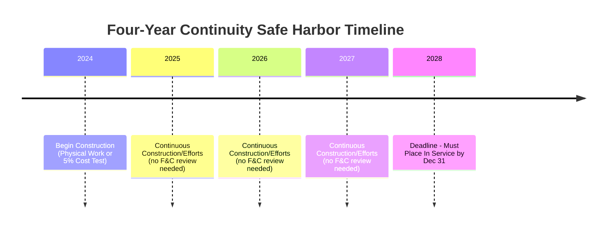

## The Four-Year Continuity Safe Harbor

### Overview

The Four-Year Continuity Safe Harbor is an administrative rule developed by the IRS to give taxpayers certainty regarding the "Continuity Requirement" embedded in the Beginning of Construction (BOC) doctrine for federal energy tax credits, including the Investment Tax Credit (ITC) under IRC §48 (and successor technology-neutral credit §48E) and the Production Tax Credit (PTC) under IRC §45 (and successor §45Y). Establishing that construction "began" on a project via either the Physical Work Test or the 5% Safe Harbor (cost-based test) is only half of the BOC analysis. Taxpayers must also demonstrate "Continuous Construction" (if using the Physical Work Test) or "Continuous Efforts" (if using the 5% Safe Harbor) from the beginning-of-construction date through the placed-in-service date. The Four-Year Continuity Safe Harbor eliminates the need for a facts-and-circumstances continuity analysis by deeming the continuity requirement automatically satisfied if the project is placed in service by the end of the calendar year that is four years after the year in which construction began.

### Statutory and Administrative Basis

- The underlying continuity requirement is not explicit in the Internal Revenue Code text for §45/§48 but was developed by the IRS through a series of Notices interpreting the "begun construction" language added by legislative extensions of the PTC/ITC (originally tied to the American Recovery and Reinvestment Act cash grant program under §1603).
- Governing guidance history includes:
  - **Notice 2013-29**: First articulated the Physical Work Test and the 5% Safe Harbor, and introduced the continuity concept.
  - **Notice 2013-60**: Clarified continuity and introduced the original safe harbor placed-in-service deadline.
  - **Notice 2016-31**: Extended and refined rules for continuity, introducing a rolling continuity safe harbor tied to a specific number of years.
  - **Notice 2018-59**: Applied similar BOC rules to solar and other ITC-eligible property under §48.
  - **Notice 2021-41**: Extended the Continuity Safe Harbor period to **four years** (from the prior mix of 4-year and shorter windows) for projects that began construction in 2016 through 2021, in response to COVID-19-related and supply chain delays.
  - **Notice 2022-61**: Addressed prevailing wage and apprenticeship (PWA) requirements introduced by the Inflation Reduction Act (IRA) but preserved existing BOC continuity guidance for pre-IRA-vintage rules; subsequent guidance (Notice 2013-29 framework) continues to apply to §45, §48, §45Y, and §48E for post-IRA projects, with the four-year continuity safe harbor generally carried forward as the operative standard for most technologies.
- [Inference] Because guidance has evolved incrementally, taxpayers must confirm which Notice governs the specific credit, technology, and vintage year of their project, since the exact continuity safe harbor period has not been uniformly four years across all guidance iterations (some earlier projects used a shorter window before the 2021 extension).

### The Continuity Requirement It Replaces

Absent the safe harbor, taxpayers must prove "continuous construction" (Physical Work Test) or "continuous efforts" (5% Safe Harbor) using a facts-and-circumstances test. Relevant factors the IRS has identified include:

- Paying or incurring additional costs includible in the depreciable basis of the property
- Entering into binding written contracts for future work or components
- Obtaining necessary permits
- Performing physical work of a significant nature (continuously, not just at the outset)

Excusable disruptions that do **not** break continuity under the facts-and-circumstances test include:

- Severe weather
- Labor stoppages
- Supply chain and equipment delays
- Financing delays
- Interconnection and permitting delays caused by utilities or governmental entities
- Litigation

The facts-and-circumstances approach is inherently uncertain and audit-risk-heavy, which is precisely why the Four-Year Continuity Safe Harbor is the preferred compliance path whenever feasible.

### Mechanics of the Four-Year Safe Harbor

**Key Points**

- **Trigger event**: The date construction begins, established via the Physical Work Test or the 5% Safe Harbor (cost-based) method.
- **Deadline**: The project must be placed in service by December 31 of the calendar year that is four years after the calendar year in which construction began.
- **Formula**: If BOC year = $Y$, the safe harbor placed-in-service deadline is:

$$\text{PIS Deadline} = \text{December 31 of year } (Y + 4)$$

- **Example**: If a taxpayer begins construction in 2024 (either by starting physical work of a significant nature or by incurring 5% of total project costs), the project is deemed to satisfy continuity if it is placed in service on or before **December 31, 2028**.
- **No facts-and-circumstances review required**: If the four-year deadline is met, the IRS will not inquire into whether construction was "continuous" in the interim — the safe harbor is a bright-line, mechanical test.
- **Failure to meet the deadline does not automatically disqualify the project**: Missing the four-year window simply means the taxpayer reverts to the facts-and-circumstances continuity test; it is not a per se failure of BOC, but it does reintroduce audit risk and evidentiary burden.

### Interaction with the Two Beginning-of-Construction Tests

| Test | How BOC Is Established | Continuity Standard Without Safe Harbor | Four-Year Safe Harbor Applicability |
| --- | --- | --- | --- |
| Physical Work Test | Physical work of a significant nature (on-site or off-site, per Notice 2013-29 §4) | "Continuous construction" | Applies equally |
| 5% Safe Harbor | Incurring/paying ≥5% of total project cost (accrual-basis binding contract rules apply for accrual taxpayers) | "Continuous efforts" | Applies equally |

**Example**

A wind developer incurs 6% of total anticipated project costs in November 2023 under a binding turbine supply agreement, satisfying the 5% Safe Harbor for BOC in 2023. Under the Four-Year Continuity Safe Harbor, the project must be placed in service by **December 31, 2027** to avoid a facts-and-circumstances continuity review.

### Interplay with Prevailing Wage & Apprenticeship (PWA) Requirements

- Under the IRA, projects that began construction **before January 29, 2023** are exempt from PWA requirements for the full bonus credit rate; BOC date is therefore doubly significant — it establishes both the continuity clock and PWA applicability.
- [Inference] Because the BOC date interacts with both continuity safe harbor timing and PWA exemption eligibility, developers frequently structure procurement (e.g., minimum-required equipment purchases or physical work packages) specifically to lock in an early BOC date, which secures PWA exemption while simultaneously starting the four-year continuity clock — a deliberate dual-purpose tax planning strategy common in post-2022 project development.

### Practical Application and Documentation

**Example (Physical Work Test Timeline)**

Documentation practitioners should maintain to substantiate both BOC and the safe harbor deadline includes:

- Signed, binding written contracts (with no unenforceable liquidated-damages caps under 5% of contract value, per the binding contract rules)
- Invoices and proof of payment demonstrating cost incurrence for the 5% test
- Engineering, procurement, and construction (EPC) contract execution dates
- Physical work logs, site photographs, and equipment delivery records
- Interconnection agreements and permits, to corroborate the development timeline

**Output**

A well-documented BOC file should allow a taxpayer to answer, with contemporaneous evidence: (1) the exact date and method used to establish BOC, (2) the calculated four-year deadline, and (3) proof of actual placed-in-service date, ideally with margin before the deadline to absorb any commissioning delays.

### Risk Areas and Common Pitfalls

- **Ownership transfers**: A transfer of a project after BOC but before placed-in-service generally does not reset the BOC date, provided the transfer meets IRS "hot property" and continuity-of-business-enterprise-type standards under relevant guidance, but structuring should be reviewed carefully. [Inference] This is a frequently litigated and negotiated area in M&A tax due diligence for renewable projects, since buyers want assurance the BOC date (and therefore the safe harbor clock and PWA exemption) transfers cleanly.
- **Single project vs. multiple project treatment**: For projects comprised of multiple facilities (e.g., a wind farm with many turbines, or a solar portfolio), the IRS aggregation/disaggregation rules (Notice 2013-29 §6.02, as clarified in subsequent Notices) determine whether the four-year deadline is tested on a single-facility or aggregated-project basis; taxpayers can sometimes elect disaggregation to preserve safe harbor eligibility for phases still under construction.
- **Retrofitted or repowered projects**: The "80/20 Rule" for repowered facilities (where at least 80% of the fair market value of the facility must be new property) interacts with BOC dating for repowering projects; a new BOC date is generally established for the repowered facility, restarting the four-year clock.
- **COVID-era and supply-chain relief was project-vintage specific**: The extended four-year window (versus a prior shorter continuity period in some earlier guidance) applied to projects beginning construction in specific years (2016–2021 per Notice 2021-41); [Unverified] whether any additional retroactive extensions apply to later vintages depends on subsequent IRS guidance that should be checked against current Treasury/IRS releases, since guidance in this area has continued to evolve after the IRA.

### Conclusion

The Four-Year Continuity Safe Harbor functions as a compliance safety valve within the Beginning of Construction doctrine, converting an inherently subjective continuity inquiry into an objective, calendar-based deadline. Taxpayers who begin construction properly (via Physical Work or the 5% cost test) and place their project in service within four calendar years of the BOC year avoid a facts-and-circumstances audit of construction continuity entirely. Missing the deadline does not forfeit the credit outright but shifts the taxpayer back into a more burdensome and less certain continuity analysis, making the four-year deadline a central planning benchmark in structuring project finance timelines, EPC contracts, and PWA compliance strategy.

**Related Topics**

- The Physical Work Test (on-site and off-site physical work standards)
- The 5% Safe Harbor / Cost-Based Test and binding contract requirements
- Single Project vs. Multiple Facility Aggregation Rules (Notice 2013-29 §6.02)
- Prevailing Wage and Apprenticeship (PWA) Requirements under the IRA
- The 80/20 Rule for Repowered Facilities
- Continuity of Business Enterprise in Renewable Project M&A / Transfer Restrictions
- Notice 2013-29, Notice 2013-60, Notice 2016-31, Notice 2018-59, and Notice 2021-41 comparative analysis
- Technology-Neutral Credits under §45Y (PTC) and §48E (ITC) Post-2024 Transition Rules