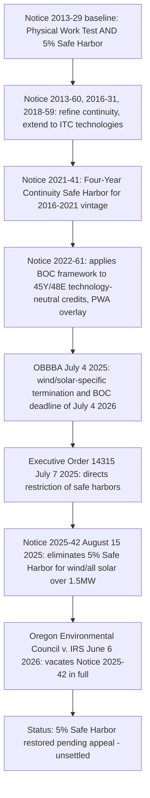

## Notice 2025-42 and Its Interaction with Prior Guidance

### Overview

IRS Notice 2025-42, released August 15, 2025, was the Treasury Department's response to the One Big Beautiful Bill Act ("OBBBA") and Executive Order 14315, providing critical guidance on the beginning of construction requirements for wind and solar facilities. Its central and most consequential feature was the near-total elimination of the long-standing 5% cost-based Safe Harbor as a method for establishing beginning of construction ("BOC") for wind and utility-scale solar facilities, leaving the Physical Work Test as effectively the sole available pathway for most projects. This represented the most significant disruption to the two-test BOC framework since it was first articulated in Notice 2013-29 over a decade earlier. As of the current date, Notice 2025-42 has been vacated by a federal district court, though the litigation remains unresolved on appeal — making the Notice's interaction with prior guidance a live, unsettled area of tax law practice.

### Legislative and Executive Trigger

- **OBBBA enactment (July 4, 2025)**: The OBBBA introduced a firm termination date for wind and solar facilities under Sections 45Y and 48E: qualified facilities placed in service after December 31, 2027, are ineligible for such credits if construction begins after July 4, 2026.
- **Executive Order 14315 ("Ending Market Distorting Subsidies for Unreliable, Foreign Controlled Energy Sources")**: Issued July 7, 2025, this order imposed a 45-day deadline on the Secretary of the Treasury to take all action necessary and appropriate to strictly enforce the termination of the clean energy production and investment tax credits for wind and solar facilities, including by issuing new and revised guidance and restricting the use of broad safe harbors "unless a substantial portion of a subject facility has been built."
- **Dual mandate**: The Executive Order also directed Treasury to issue guidance implementing the OBBBA's enhanced foreign-entity-of-concern restrictions, which Notice 2025-42 explicitly stated would be issued separately (this separate FEOC guidance later emerged as Notice 2026-15).

### What Notice 2025-42 Changed

**Key Points**

- **5% Safe Harbor eliminated for most wind and solar**: Notice 2025-42 eliminates the 5% cost safe harbor for solar and wind facilities, except for "low output solar facilities," defined as a solar facility that has a maximum net output of not greater than 1.5 MW. The Notice largely adopted the existing beginning-of-construction guidance from the pre-IRA Notices (Notice 2013-29 and 2018-59), except for this critical carve-out limiting the 5% safe harbor to solar projects with a nameplate capacity of 1.5 MW (AC) or less, generally measured on an interconnection point basis.
- **Effective date**: The Notice was effective for projects that do not begin construction under the Pre-IRA Notices prior to September 2, 2025 — meaning large wind and solar projects seeking to lock in BOC using the 5% safe harbor needed to do so before that date.
- **Physical Work Test remains, largely unchanged**: The sole manner (except for low-output solar facilities) by which developers could demonstrate that construction of a wind or solar project had begun by the BOC deadline was by satisfying the facts-and-circumstances Physical Work Test, requiring the taxpayer to commence physical work of a significant nature on the project.
- **Offshore wind continuity safe harbor effectively eliminated**: Because Notice 2025-42 does not distinguish between onshore and offshore wind, the 10-year continuity safe harbor previously provided in Notice 2021-05 for offshore wind is effectively eliminated under the new guidance.
- **National security tolling eliminated**: The new guidance also eliminates, for wind and solar, the tolling and extension of the continuity safe harbor previously provided in Notice 2019-43 for circumstances involving significant national security concerns.
- **Single project rules preserved**: The new guidance leaves in place the longstanding single-project aggregation rules, and clarifies that for the 1.5 MW low-output solar exception, facilities with "integrated operations" will be aggregated for purposes of the 1.5 MW determination.

### Scope Limitations — What Notice 2025-42 Did NOT Change

**Key Points**

- **Technology scope**: Clean energy properties using technologies other than wind and solar (e.g., battery storage, geothermal, hydropower, nuclear) under IRC Sections 45Y and 48E are not affected by the guidance.
- **FEOC/MACR purposes excluded**: The Notice does not modify the beginning of construction rules for purposes of the OBBBA's foreign entity of concern (FEOC) restrictions. Footnote 3 of Notice 2025-42 states explicitly that the guidance in the notice is not intended to address the beginning of construction rules for purposes of the foreign entity restrictions, and that Treasury and the IRS were separately drafting additional guidance to implement those restrictions. Accordingly, other technologies' beginning-of-construction status — and wind/solar BOC status specifically for FEOC purposes — continue to be governed under the Pre-IRA Notices, including for FEOC purposes, although there is some risk, generally viewed as low, that FEOC beginning-of-construction guidance could have retroactive effect to some prior date.
- **Other deadlines unaffected**: The Notice applied only to solar and wind projects and only for purposes of the July 4, 2026 BOC deadline; it did not apply to other "beginning of construction" deadlines, such as the end-of-2025 deadline relevant to the OBBBA's Material Assistance Cost Ratio requirements under the FEOC rules.

### Relationship to the Traditional Two-Test BOC Framework

For more than a decade, the IRS recognized two methods by which a taxpayer can establish the beginning of construction for purposes of clean energy tax credits: the qualitative Physical Work Test, requiring physical work of a significant nature to commence before the applicable statutory deadline, and the quantitative 5% Safe Harbor, requiring a taxpayer to pay or incur 5% or more of the total cost of a facility before the deadline. Both methods were reaffirmed by the IRS repeatedly through Notice 2022-61 and applied across successive rounds of legislation creating and extending clean energy tax credits. Notice 2025-42 represented the first time in the doctrine's history that one of the two co-equal tests was substantively withdrawn for a subset of technologies (wind and large solar), rather than merely clarified or extended.

### Litigation: Oregon Environmental Council v. IRS

**Example**

On June 6, 2026, the U.S. District Court for the District of Columbia issued a memorandum opinion in *Oregon Environmental Council v. Internal Revenue Service*, Case No. 25-4400 (CKK), vacating IRS Notice 2025-42 in full and remanding the matter to the IRS for further administrative proceedings. A coalition of environmental, consumer, tribal, and public-sector plaintiffs had challenged the Notice, arguing that it would raise power prices, disrupt clean energy development, and increase pollution.

- **Holding**: The court held that the IRS acted arbitrarily and capriciously under the Administrative Procedure Act (APA) by significantly changing established guidance that taxpayers had previously relied upon, and by treating wind and solar projects differently from other project types without sufficient justification. The court found the IRS had failed to adequately justify its departure from established guidance and neglected to consider long-standing industry reliance on the 5% safe harbor.
- **Remedy**: The court vacated the Notice nationwide and remanded it to Treasury and the IRS, effectively restoring the prior Physical Work Test / 5% Safe Harbor dual-test framework while leaving the door open to further rulemaking or appeals. The ruling applies not only to the named plaintiffs but to all taxpayers.
- **Practical uncertainty**: The government is expected to appeal, and may seek a stay pending appeal, on jurisdictional and merits grounds. The court itself acknowledged that the appellate timeline almost certainly extends past the July 4, 2026 beginning-of-construction deadline. As a reversal of the court's holding could have retroactive effect, market participants should not treat the decision as final; the vacatur might not have practical use to developers looking to safe-harbor projects prior to July 4, 2026, given the uncertainty of what might occur on appeal.
- **FEOC purposes unaffected by the litigation**: For purposes of the OBBBA's foreign-entity-of-concern restrictions, Congress expressly adopted the IRS's existing beginning-of-construction framework independent of Notice 2025-42's fate, consistent with the Notice's own footnote 3 disclaiming FEOC applicability.

[Unverified] The current appellate posture (whether the government has filed a notice of appeal, sought a stay, or whether the IRS has issued superseding guidance) should be confirmed against the most recent Treasury/IRS releases and appellate docket, since this is an active and rapidly evolving litigation as of this writing.

### Practical Compliance Guidance Under the Current Unsettled Posture

**Output**

Given the vacatur and pending appellate uncertainty, developers of wind and solar projects face a genuinely bifurcated risk landscape:

1. **Physical Work Test remains the safest path**: For any project targeting the July 4, 2026 BOC deadline, the Physical Work Test remains the primary and most defensible method regardless of how the appeal resolves, since it was never eliminated by Notice 2025-42 and is unaffected by the vacatur dispute.
2. **5% Safe Harbor reliance carries appellate risk**: Although the ruling currently reopens use of the 5% Safe Harbor Test for solar and wind projects, taxpayers relying on it should consider the possibility of the IRS revising its guidance, issuing new guidance, or succeeding on appeal — any of which could retroactively undermine BOC positions established solely through 5% cost-incurrence during the vacatur window.
3. **Documentation remains paramount**: Regardless of which test is used, taxpayers should maintain robust contemporaneous documentation (binding contracts, invoices, physical work logs) sufficient to support BOC under either test, given the fluid legal landscape.
4. **FEOC BOC tracking is separate**: Developers must continue to track a distinct BOC date and methodology for FEOC/MACR purposes under the pre-IRA Notices framework, independent of whatever BOC date and method is used for the general 45Y/48E termination deadline — these are not necessarily the same date or established via the same test.

### Comparative Summary Table

| Guidance Layer | Scope | Status as of Current Posture |
| --- | --- | --- |
| Notices 2013-29, 2013-60, 2016-31, 2018-59 (Pre-IRA Notices) | All technologies; dual-test BOC framework | Baseline framework; governs FEOC BOC and all non-wind/solar technologies |
| Notice 2021-41 | Four-Year Continuity Safe Harbor extension | Continues to apply generally |
| Notice 2022-61 | Extends BOC framework to §45Y/48E; PWA overlay | Continues to apply generally |
| Notice 2025-42 | Wind/solar-specific; eliminates 5% Safe Harbor (except ≤1.5MW solar) | **Vacated nationwide** by D.D.C., June 6, 2026; restored 5% Safe Harbor pending appeal |
| Notice 2026-15 | FEOC/MACR-specific BOC and cost-ratio rules | Separate track; explicitly not addressed by, and not affected by, Notice 2025-42's vacatur |

### Conclusion

Notice 2025-42 illustrates how legislative acceleration (the OBBBA's abrupt termination timeline) and executive direction (Executive Order 14315) can disrupt decade-old, heavily relied-upon administrative safe harbors — and how quickly such disruption can itself be challenged and unwound through APA litigation. Its interaction with prior guidance is best understood as a narrow, technology-specific carve-out layered on top of the pre-existing Physical Work Test / 5% Safe Harbor framework, rather than a wholesale replacement of BOC doctrine: other technologies, other credit provisions (like FEOC/MACR), and the underlying continuity concepts from Notices 2013-29 through 2022-61 remained largely undisturbed even before the vacatur. The June 2026 vacatur in *Oregon Environmental Council v. IRS* has, for now, restored the traditional dual-test framework for wind and solar, but the unresolved appeal means taxpayers must weigh the near-term flexibility of a reinstated 5% Safe Harbor against the real possibility of reversal, making conservative, well-documented Physical Work Test compliance the more durable strategy for projects racing the July 4, 2026 deadline.

**Related Topics**

- The Physical Work Test: On-Site and Off-Site Standards
- The Four-Year Continuity Safe Harbor (Notice 2021-41)
- The 1.5 MW Low-Output Solar Exception and Integrated Operations Aggregation
- Administrative Procedure Act Challenges to IRS Sub-Regulatory Guidance
- The OBBBA's Wind and Solar Credit Termination Timeline (§45Y/§48E)
- The Material Assistance Cost Ratio Calculation and Its Independent BOC Standard
- Offshore Wind Continuity Safe Harbor Under Notice 2021-05 (Pre-2025-42)
- Executive Order 14315 and Its Directives to Treasury