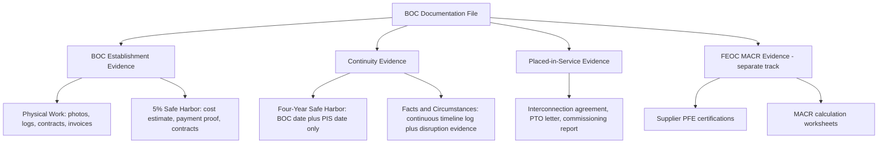

## Documentation Standards for Establishing Construction Start

### Overview

Establishing a Beginning of Construction ("BOC") date under either the Physical Work Test or the 5% Cost Safe Harbor is only as strong as the contemporaneous documentation that supports it. Because BOC determinations are frequently tested years after the fact — in tax equity due diligence, credit transfer diligence under §6418, IRS examination, or M&A transactions — the evidentiary record assembled at the time of construction start (and maintained continuously thereafter) is often the single most important risk-mitigation factor in the entire tax equity structuring process. Documentation standards are not separately codified in a single regulation; rather, they are derived from the substantive requirements of the underlying tests articulated across Notice 2013-29, Notice 2013-60, Notice 2018-59, Notice 2021-41, and Notice 2022-61, combined with general federal tax recordkeeping principles under IRC §6001 and Treas. Reg. §1.6001-1.

### Foundational Principle: Contemporaneous Evidence Governs

**Key Points**

- The IRS evaluates BOC claims based on facts and circumstances existing **at the time** construction was claimed to have begun, not on retrospective reconstruction.
- Documentation created substantially after the fact, or that cannot be independently corroborated (e.g., internally generated memos with no supporting third-party evidence), carries materially less evidentiary weight.
- [Inference] Because tax equity investors and credit transfer buyers conduct diligence on a compressed timeline relative to when BOC actually occurred (often years later), the taxpayer's documentation file is frequently the *only* practical evidence available; oral testimony or reconstructed timelines are rarely sufficient to satisfy investor diligence standards or withstand IRS scrutiny.
- Every item of documentation should be dated, retained in its original form (not summarized or recreated), and cross-referenced to the specific BOC test and specific facility/project it supports.

### Documentation for the Physical Work Test

**Key Points**

The Physical Work Test requires physical work of a significant nature, either on-site or off-site, performed by the taxpayer or under a binding written contract with another party. Both the nature of the work and its physical performance must be substantiated.

**On-Site Physical Work Documentation**

- Dated site photographs and, where available, geotagged or timestamped imagery showing excavation, foundation work, road construction, or racking/mounting installation
- Site logs and daily construction reports identifying the scope of work performed, dates, and personnel/equipment on site
- Grading permits, building permits, and other governmental authorizations correlated to the work performed
- Signed inspection reports from engineers, code inspectors, or independent third parties confirming physical progress
- Survey markers, geotechnical reports, and soil testing records tied to specific dates

**Off-Site Physical Work Documentation**

- Manufacturing work orders and production schedules from equipment suppliers (e.g., custom transformers, turbine components) showing manufacture began for a specific, identifiable project rather than generic inventory production
- Invoices and proof of payment tied to specific manufactured components, cross-referenced to serial numbers or lot numbers where possible
- Correspondence with manufacturers confirming the work performed is not of a type normally held in inventory (a threshold requirement under Notice 2013-29 for off-site work to qualify)
- Bills of lading, shipping manifests, and delivery confirmations

**Binding Written Contract Documentation (when work is performed by a third party)**

- The fully executed contract itself, with execution date clearly visible
- Confirmation the contract is binding under local law and does not contain a liquidated damages cap limiting damages to less than 5% of the contract price (a threshold used to distinguish binding contracts from mere options)
- Any amendments, with amendment dates separately tracked, since amendments can affect the binding-contract analysis
- Proof of contractor's actual performance under the contract (invoices, progress billing, lien waivers)

### Documentation for the 5% Cost Safe Harbor

**Key Points**

The 5% Safe Harbor requires the taxpayer to pay or incur (for accrual-method taxpayers) at least 5% of the total cost of the facility before the applicable deadline.

- **Total project cost basis calculation**: A detailed, contemporaneous cost estimate or budget (e.g., an EPC contract price, an engineering cost estimate, or a signed term sheet) establishing the total anticipated cost basis against which the 5% threshold is measured. This estimate should be dated and should reflect the taxpayer's genuine, good-faith projection at the time — not a number reverse-engineered later to justify a 5% threshold already crossed.
- **Proof of cost incurrence**:
  - For cash-method taxpayers: proof of actual payment (wire transfers, cancelled checks, bank statements)
  - For accrual-method taxpargets: proof the cost was incurred under the "all events test" and economic performance rules of Treas. Reg. §1.461-1, meaning a binding obligation existed and the liability was fixed and determinable, even if not yet paid
- **Binding written contract for accrual-basis incurrence**: When relying on incurred (not yet paid) costs, the underlying purchase order or supply agreement must itself be a binding written contract as of the relevant date — the same binding-contract standard applicable to the Physical Work Test applies here.
- **Invoices, purchase orders, and payment ledgers**: A complete chain from purchase order → invoice → payment record → general ledger entry, allowing an examiner or diligence reviewer to trace the 5% calculation from source documents to the taxpayer's claimed percentage.
- **Cost allocation methodology memo**: Particularly for multi-facility or portfolio safe harbors (see Aggregation below), a memo explaining how safe-harbored costs (e.g., a bulk equipment purchase) were allocated across individual facilities within a single project or portfolio.

### The Master Supply Agreement / Aggregation Documentation Problem

**Example**

A developer enters into a master supply agreement for 200 wind turbines intended for allocation across ten separate wind farm projects still in early development. To safe harbor multiple projects using a single bulk purchase:

- The taxpayer must maintain a written, contemporaneous unit allocation schedule identifying which specific turbines (by unit or serial number, once assigned) are allocated to which specific project
- The allocation must be fixed with reasonable specificity at, or shortly after, the time of the safe harbor is claimed — not adjusted retroactively based on which projects ultimately proceed
- Supporting documentation should show the cost per unit, the number of units allocated per project, and the resulting percentage of that project's total cost represented by the allocated units
- [Inference] Because master agreements covering many prospective projects are a common and IRS-scrutinized structuring technique, maintaining rigorous, contemporaneous allocation records is one of the highest-risk documentation areas in practice; failure to fix allocations early is a frequently cited weakness in IRS challenges to safe harbor positions.

### Continuity Documentation (Physical Work Test and 5% Safe Harbor)

If a project does not qualify for the Four-Year Continuity Safe Harbor (i.e., it is not placed in service within four years of the BOC year), the taxpayer must affirmatively document continuous construction or continuous efforts under the facts-and-circumstances standard. Recommended documentation includes:

- A running project timeline log documenting all material construction activities, permitting milestones, financing closings, and procurement events across the entire construction period, not just at the BOC date
- Correspondence and documentation substantiating any claimed excusable disruption (severe weather records, documented labor stoppages, supply chain delay notices from suppliers, utility-caused interconnection delays, permitting agency correspondence, or litigation filings)
- Evidence of continued cost incurrence or additional binding contracts entered into throughout the construction period, showing the project was not abandoned or indefinitely paused
- Annual (or more frequent) internal status memos prepared contemporaneously, summarizing progress and any delays, ideally reviewed by tax counsel or accounting advisors as part of ongoing compliance monitoring

### Documentation for the Four-Year Continuity Safe Harbor (When Applicable)

When relying on the Four-Year Continuity Safe Harbor instead of the facts-and-circumstances continuity test, documentation is comparatively lighter but still essential:

- Clear, unambiguous evidence of the exact BOC date and method (Physical Work Test or 5% Safe Harbor), since the four-year deadline is calculated directly from this date
- Placed-in-service documentation: interconnection agreements, utility permission-to-operate letters, commissioning reports, and the date the facility was capable of generating electricity in a commercially viable manner
- A calculated deadline memo, prepared at or near the BOC date, stating the exact four-year deadline and cross-referencing it against the project's anticipated construction schedule — creating a contemporaneous record that the deadline was understood and planned for

### FEOC/Material Assistance Cost Ratio-Specific Documentation

Given the introduction of the FEOC/PFE material assistance regime (Notice 2026-15) and its distinct BOC standard, taxpayers must now maintain a **parallel** documentation file for FEOC purposes, separate from the general 45Y/48E BOC file:

- Documentation establishing the BOC date used specifically for FEOC/MACR threshold-year determination purposes (which, per Notice 2025-42's footnote 3 and its subsequent vacatur, may be established under a different standard than the general BOC test for the same facility)
- Supplier certifications regarding PFE production status of manufactured products and components
- Cost percentage calculations and worksheets supporting the Material Assistance Cost Ratio, cross-referenced to the Identification Safe Harbor and Cost Percentage Safe Harbor tables where used
- Records supporting reliance on the pre-June 16, 2025 binding written contract exclusion, if claimed

### Documentation Retention and Organization Framework

### Documentation in the Tax Equity and Credit Transfer Context

**Output**

Beyond IRS examination risk, documentation standards are heavily shaped by the practical due diligence requirements of tax equity investors, credit transfer buyers under §6418, and lenders:

- Tax equity investors typically require a formal **BOC memorandum** prepared by tax counsel, summarizing the legal basis for the BOC claim, the specific test relied upon, the supporting documentation reviewed, and counsel's conclusion (often rendered as a "should" or "more likely than not" level opinion)
- Credit transfer buyers commonly require representations and warranties regarding BOC status backed by an indemnification structure, and will conduct their own document review of the underlying evidentiary file
- Lenders financing construction may require BOC documentation as a condition to construction loan draws, particularly where loan sizing depends on anticipated credit value
- [Inference] Because multiple counterparties (investors, buyers, lenders, and potentially the IRS) may independently review the same documentation file at different points in a project's life, maintaining a single, well-organized, chronologically indexed BOC file — rather than scattered records across multiple systems or personnel — is a practical best practice that substantially reduces transaction friction and diligence costs.

### Common Documentation Deficiencies Observed in Practice

- Site photographs without reliable date/location metadata, making it difficult to corroborate the claimed work date
- Cost estimates for the 5% Safe Harbor that appear to have been prepared or revised after the fact to justify a threshold already believed to be met
- Master supply agreements lacking contemporaneous, unit-level allocation schedules across multiple projects
- Absent or informal excusable-disruption documentation for continuity purposes (e.g., relying on general industry knowledge of supply chain disruptions rather than project-specific correspondence)
- Missing or unexecuted contract signature pages, or contracts containing liquidated damages caps that undermine the "binding contract" characterization
- Inconsistent BOC dates used across different purposes (general 45Y/48E, FEOC/MACR, and financing documents) without a clear reconciliation memo explaining any differences

### Conclusion

Documentation standards for establishing construction start function as the evidentiary backbone of the entire Beginning of Construction doctrine: the substantive legal tests (Physical Work, 5% Safe Harbor, continuity, and now FEOC/MACR) only provide value to the extent the taxpayer can prove, with contemporaneous and independently corroborated records, that the relevant facts existed on the dates claimed. Because BOC positions are frequently reviewed years after the fact by tax equity investors, credit transfer counterparties, and potentially the IRS, taxpayers should treat documentation not as an afterthought but as a parallel, ongoing compliance workstream that begins on day one of project development and continues through placed-in-service — with particular attention to the emerging complexity of maintaining separate, potentially divergent BOC documentation tracks for general credit-eligibility purposes versus FEOC/Material Assistance Cost Ratio purposes.

**Related Topics**

- The Physical Work Test: On-Site and Off-Site Standards
- The 5% Cost Safe Harbor and Binding Contract Requirements
- The Four-Year Continuity Safe Harbor
- Single Project vs. Multiple Facility Aggregation Rules
- The Material Assistance Cost Ratio Calculation
- Tax Equity Due Diligence and BOC Opinion Letters
- Credit Transfer Representations and Warranties Under §6418
- Notice 2025-42 and Its Interaction with Prior Guidance