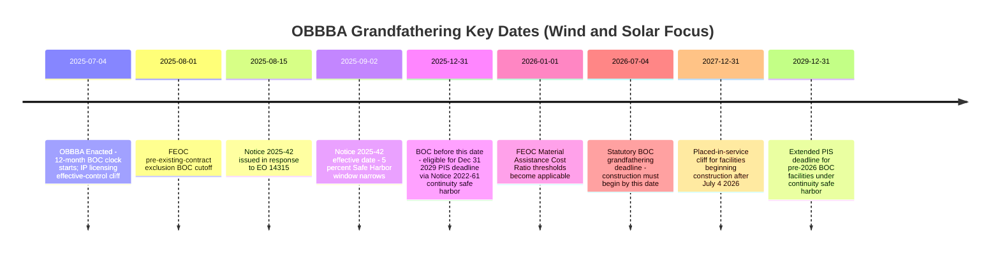

## Grandfathering Rules by Construction-Start Date

### Overview

Grandfathering rules by construction-start date are the mechanism by which the One Big Beautiful Bill Act ("OBBBA") preserves eligibility for clean energy tax credits under the prior, more favorable statutory framework, contingent entirely on when a project establishes its Beginning of Construction ("BOC") date. Because the OBBBA imposed sweeping — and in the case of wind and solar, dramatically accelerated — termination provisions on the Clean Electricity Investment Credit (§48E) and Clean Electricity Production Credit (§45Y), the specific calendar date on which a project's construction is deemed to begin has become the single most consequential variable in determining whether a project retains full credit eligibility, faces a compressed placed-in-service deadline, or loses eligibility entirely. Grandfathering thresholds differ materially by technology, by credit provision (general 45Y/48E eligibility versus FEOC/material assistance restrictions versus domestic content requirements), and by whether continuity safe harbors are properly invoked.

### The Core Statutory Grandfathering Mechanism (Wind and Solar)

**Key Points**

- **Enactment date**: OBBBA was signed into law July 4, 2025.
- **Termination rule**: Qualified solar and wind facilities must now be in service no later than December 31, 2027, unless such facilities "begin construction" within 12 months after the date of enactment of the bill (July 4, 2026).
- **Grandfathering effect**: §48E(e)(4), added by the OBBBA, accelerates the termination of the credit for wind and solar facilities whose construction begins after July 4, 2026. If construction begins after July 4, 2026, the qualified property must be placed in service by December 31, 2027, to qualify for the credit.
- **Extended timeline for early starters**: Facilities that successfully begin construction prior to July 4, 2026, will have four years to be placed into service — meaning a project that establishes BOC on, say, June 2026 is not bound by the December 31, 2027 placed-in-service cliff, but instead receives the benefit of the general Four-Year Continuity Safe Harbor framework.
- **Scope limitation**: The OBBBA's amendment accelerating termination does not affect related energy storage technology — battery storage remains on a separate, more favorable timeline (see below).

### The Critical BOC-Date Threshold Table (Wind and Solar)

| Construction-Start Date | Governing Placed-in-Service Deadline | Notes |
| --- | --- | --- |
| Before December 31, 2025 | December 31, 2029 (via Four-Year Continuity Safe Harbor under Notice 2022-61) | If the start of construction occurred prior to Dec. 31, 2025, and the continuity safe-harbor provision of Notice 2022-61 is relied upon, the wind and solar facilities receive an extended placed-in-service date of Dec. 31, 2029 |
| December 31, 2025 – July 4, 2026 | Four years from BOC year (general Four-Year Continuity Safe Harbor) | Facilities that begin construction on or before July 4, 2026 avoid the accelerated December 31, 2027 deadline entirely |
| After July 4, 2026 | December 31, 2027 (fixed, compressed deadline) | To avoid the accelerated placed-in-service date of Dec. 31, 2027, taxpayers must demonstrate they started construction on or before July 4, 2026 |

[Inference] The distinction between the "before December 31, 2025" and "December 31, 2025 to July 4, 2026" bands reflects the interaction between the general Notice 2022-61 continuity framework and the OBBBA's new statutory cutoff; practitioners should confirm the precise mechanics of how these two timeline regimes interact for projects beginning construction in the narrow window between these dates, as this is an area of guidance still subject to refinement.

### The September 2, 2025 Effective-Date Cliff (Notice 2025-42 Interaction)

**Key Points**

Notice 2025-42, discussed in the BOC chapter's guidance-interaction topic, added a second, independent grandfathering layer specifically affecting the 5% Safe Harbor method:

- The August 2025 Notice is effective for facilities for which construction did not begin prior to September 2, 2025. This means that developers had a short window to grandfather projects based on the Five Percent Safe Harbor before that date.
- **3.5-month delivery expectation requirement**: As a general matter, amounts paid for goods or services are not treated as incurred for purposes of the Five Percent Safe Harbor unless the taxpayer has a reasonable expectation at the time of payment that such goods or services will be delivered or performed within 3.5 months of the payment date. Developers intending to grandfather projects prior to September 2, 2025 using the Five Percent Safe Harbor needed to carefully consider the feasibility of satisfying this delivery requirement.
- **Current litigation overlay**: As covered in the companion topic on Notice 2025-42, this Notice was vacated by a federal district court on June 6, 2026, which — pending appeal — restores general availability of the 5% Safe Harbor beyond the September 2, 2025 cliff. [Unverified] The interaction between the vacated Notice's effective-date restriction and the underlying OBBBA statutory grandfathering deadline of July 4, 2026 should be independently confirmed against the most current guidance, since the vacatur specifically affects the *method* of establishing BOC, not the underlying statutory grandfathering date itself.

### Technology-Specific Grandfathering Divergence

**Key Points**

A central feature of OBBBA grandfathering is that it applies unevenly across technologies — wind and solar bear the accelerated timeline, while other technologies retain the original, more gradual phase-out structure.

- **Wind and solar**: Subject to the accelerated July 4, 2026 BOC deadline / December 31, 2027 placed-in-service cliff described above. This accelerated timeline only affects solar and wind technologies.
- **Nuclear, geothermal, hydropower, and battery storage**: These technologies generally maintain eligibility on a separate, longer timeline. Other eligible technologies — such as battery storage, nuclear, and geothermal — retain full credit value through 2033, stepping down gradually to phase out in 2036. Fuel cells, cogeneration, geothermal, and nuclear energy are also left intact under the updated 45Y and 48E frameworks, and continue to qualify for clean electricity tax credits assuming they meet emissions and labor-related eligibility criteria. Other clean electricity technologies retain the original IRA phaseout structure (beginning in 2032).
- **Clean hydrogen PTC**: Prior to the enactment of the OBBBA, the beginning-of-construction deadline for the clean hydrogen production tax credit was January 1, 2033; [Unverified] whether and how this deadline was modified by the OBBBA should be separately confirmed, as hydrogen-specific grandfathering provisions are addressed in a distinct statutory section from the wind/solar rules.
- **Geothermal heat pump property (§48 ITC)**: The OBBBA's omission of the FEOC rules from Section 48 means that geothermal heat pump property that begins construction before January 1, 2035, will not be subject to the FEOC rules if the Section 48 ITC is claimed with respect to such property — an example of a technology-specific FEOC grandfathering carve-out distinct from the general BOC timeline.

### Grandfathering for FEOC / Material Assistance Purposes (Separate Track)

**Key Points**

Grandfathering under the general 45Y/48E termination timeline is entirely independent from grandfathering under the FEOC/Material Assistance Cost Ratio regime, and taxpayers must track both separately:

- Starting January 1, 2026, projects with material assistance from Prohibited Foreign Entities are ineligible for tax credits unless they satisfy the applicable MACR threshold (40% for qualified facilities, 55% for storage in 2026, phasing up in subsequent years, as detailed in the Material Assistance Cost Ratio Calculation topic).
- **Pre-June 16, 2025 binding contract exclusion**: A taxpayer may elect to exclude from the MACR the cost of certain manufactured products, eligible components, or materials incorporated therein that were acquired pursuant to a binding written contract entered into prior to June 16, 2025, provided these items are placed in service before January 1, 2030 (or January 1, 2028 for certain applicable wind and solar facilities) in a facility for which construction began prior to August 1, 2025 — a distinct, narrower grandfathering window specifically for FEOC purposes.
- **IP licensing "effective control" cliff**: If read literally, the practical effect of the "entered into after the date of enactment" standard under forthcoming proposed regulations is that any licensing agreements executed after July 4, 2025 are deemed to provide the licensee with effective control, triggering foreign-influenced-entity status — meaning July 4, 2025 functions as a hard grandfathering cliff for IP licensing arrangements independent of any BOC date.

### Domestic Content Bonus Credit Grandfathering (Related but Distinct Track)

The OBBBA modified the domestic content manufactured-products percentage requirement on its own construction-start-date schedule, separate from both the general termination timeline and the FEOC timeline:

- Facilities that begin construction after June 16, 2025, but before 2026: manufactured products threshold increases to 45% (or 27.5% for offshore wind facilities)
- Facilities beginning construction after 2026: threshold continues to increase, up to 55%
- [Inference] This creates a third, independently-calculated BOC-date-driven threshold schedule that developers must track alongside the general termination timeline and the FEOC/MACR timeline — meaning a single project's BOC date can simultaneously trigger three separate, technology- and provision-specific grandfathering analyses.

### Consolidated Grandfathering Timeline Visualization

### Practical Structuring Implications

**Output**

- Developers should identify, for each project, the **earliest** relevant grandfathering deadline across all applicable regimes (general termination, FEOC/MACR, domestic content, IP licensing) rather than assuming a single BOC date satisfies all thresholds simultaneously.
- Because BOC dating strategies (e.g., early physical work packages, master equipment purchase agreements) can be optimized to capture more favorable grandfathering treatment across multiple regimes at once, tax counsel commonly structure a single, well-documented BOC event to simultaneously lock in: (1) the pre-July 4, 2026 statutory deadline exemption, (2) more favorable domestic content percentage thresholds, and (3) FEOC/MACR grandfathering where the pre-June 16, 2025 contract exclusion is unavailable.
- For wind and solar projects specifically, the interplay between the vacated-but-potentially-reinstated Notice 2025-42 and the underlying statutory July 4, 2026 deadline means that developers should document BOC under **both** the Physical Work Test and, where feasible, the 5% Safe Harbor, to preserve optionality regardless of how the pending appellate litigation resolves.
- Buyers should focus on advancing solar projects ahead of the July 4, 2026 deadline to retain full credit value, since projects started after the deadline will likely struggle to hit the compressed development timeline to the December 31, 2027 placed-in-service cliff.

### Conclusion

Grandfathering rules by construction-start date transform the Beginning of Construction doctrine from a technical eligibility threshold into the central strategic variable of post-OBBBA renewable energy tax planning. Because the statute layers multiple, technology- and provision-specific BOC deadlines on top of one another — the general wind/solar termination cliff (July 4, 2026), the FEOC material assistance threshold effective date (January 1, 2026), the domestic content percentage schedule (June 16, 2025 and 2026 breakpoints), and the IP licensing effective-control cliff (July 4, 2025) — practitioners must approach grandfathering analysis as a multi-dimensional exercise rather than a single date lookup. The ongoing litigation over Notice 2025-42 further complicates this picture by injecting uncertainty into which BOC *methods* remain available for wind and solar projects racing the July 4, 2026 deadline, making conservative documentation and early, well-substantiated BOC positioning the most durable risk-management strategy available to developers.

**Related Topics**

- Notice 2025-42 and Its Interaction with Prior Guidance
- The Four-Year Continuity Safe Harbor
- The Material Assistance Cost Ratio Calculation
- Documentation Standards for Establishing Construction Start
- Domestic Content Bonus Credit Percentage Thresholds and Safe Harbor Tables
- The 80/20 Rule for Repowered Facilities
- IP Licensing and the "Effective Control" Foreign-Influenced-Entity Trap
- Technology-Specific Phase-Out Schedules Under the OBBBA (Nuclear, Geothermal, Hydropower, Storage)