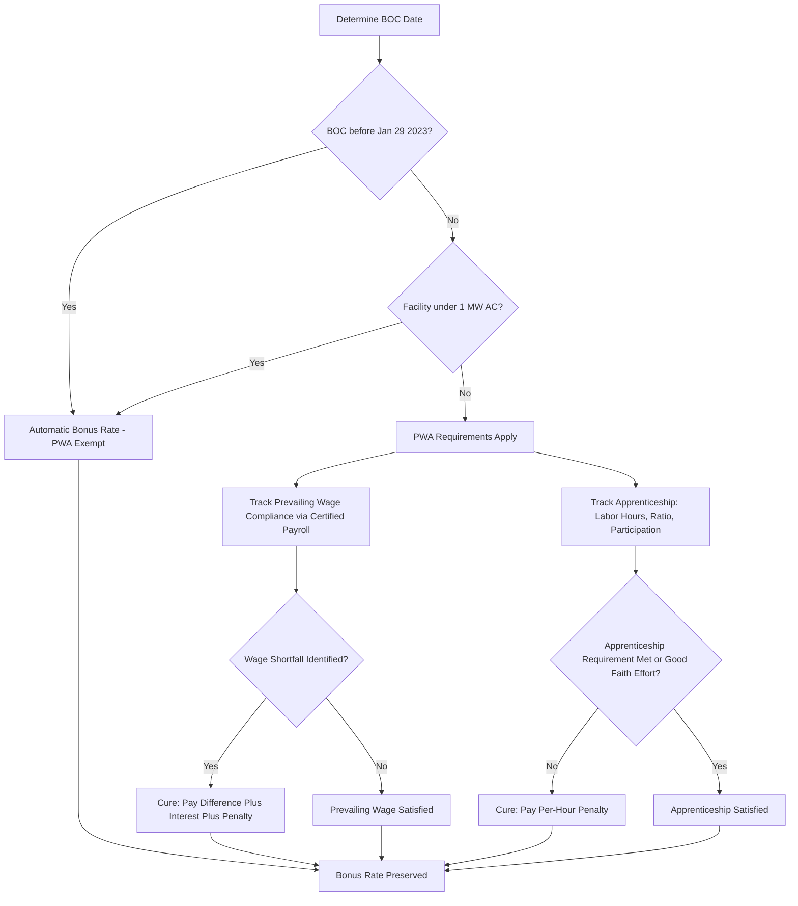

## Prevailing Wage and Apprenticeship Requirements

### Overview

The Prevailing Wage and Apprenticeship ("PWA") requirements are a labor-standards condition attached to numerous federal clean energy tax credits by the Inflation Reduction Act ("IRA") of 2022, functioning as a "bonus rate" mechanism: facilities and projects that satisfy PWA requirements are eligible for a credit rate five times greater than facilities that do not. Rather than a single flat credit amount, IRA-era energy credits generally establish a low "base rate" and a substantially higher "bonus rate," with PWA compliance serving as the primary gateway between the two. PWA requirements apply across most major clean energy credits, including the Investment Tax Credit (§48), Production Tax Credit (§45), the technology-neutral Clean Electricity Investment Credit (§48E) and Clean Electricity Production Credit (§45Y), the Advanced Manufacturing Production Credit (§45X, in modified form), the Clean Fuel Production Credit (§45Z), and others.

### Statutory and Regulatory Basis

- **Core statutory sections**: IRC §45(b)(6)-(8), §48(a)(9)-(11), and their technology-neutral successors §45Y(g) and §48E(d) establish the PWA framework and the five-times multiplier mechanism.
- **Primary administrative guidance**: Notice 2022-61 (published November 30, 2022) provided the initial comprehensive guidance on PWA requirements, including definitions, recordkeeping standards, and the mechanics of the cure provisions.
- **Final Treasury Regulations**: Treasury and the IRS issued final regulations (T.D. 9998, effective 2023) providing detailed rules on prevailing wage determinations, apprenticeship ratios, recordkeeping, and penalty/cure mechanics.
- **Beginning-of-construction linkage**: Notice 2022-61 applies principles from historic beginning of construction guidance (Notices 2013-29, 2013-60, 2018-59, and related notices) to determine PWA applicability, since the single most important date in the PWA analysis is the project's BOC date.

### The Core Exemption: Pre-January 29, 2023 Beginning of Construction

**Key Points**

- Facilities that began construction **before January 29, 2023** are entirely exempt from PWA requirements and automatically qualify for the full bonus credit rate, regardless of actual wage or apprenticeship practices on the project.
- This exemption date is fixed by statute (60 days after Notice 2022-61's publication) and does not move with subsequent guidance changes.
- [Inference] Because this exemption is binary and BOC-date-dependent, it creates strong structuring incentives for developers of projects under early development in late 2022 to establish BOC before the January 29, 2023 cutoff wherever factually supportable — mirroring the incentive structure seen in other BOC-driven grandfathering contexts (e.g., the OBBBA wind/solar deadline).
- **Small facility exception**: Separately, certain facilities with a maximum net output of less than 1 megawatt (as measured in alternating current) are generally exempt from PWA requirements regardless of BOC date, reflecting Congress's intent to reduce compliance burden for small-scale distributed generation.

### The Five-Times Multiplier Mechanic

For projects that began construction on or after January 29, 2023, and do not qualify for the small-facility exception, the credit rate depends entirely on PWA compliance:

$$\text{Bonus Rate Credit} = 5 \times \text{Base Rate Credit}$$

**Example**

For the §48E Investment Tax Credit, the base rate is generally 6% of qualified investment; the bonus rate, achieved through PWA compliance, is 30%. For the §45Y Production Tax Credit, the base rate is generally 0.3 cents per kWh (adjusted for inflation); the bonus rate is 1.5 cents per kWh. In each case, the bonus-to-base ratio is exactly 5:1, though the underlying cents/percentage figures are indexed for inflation and should be confirmed against the current-year published rates.

### Prevailing Wage Requirement

**Key Points**

- **Applicable workers**: All laborers and mechanics employed by the taxpayer, contractors, and subcontractors in the construction, alteration, or repair of the facility must be paid wages at rates not less than the prevailing rates for the type of work performed, in the geographic locality, as most recently published by the Department of Labor ("DOL").
- **Ongoing obligation for PTC-type credits**: For production-based credits (§45Y), the prevailing wage requirement applies not only during construction but also during the alteration or repair of the facility throughout the entire credit period (generally 10 years for PTC-eligible facilities) — meaning PWA compliance is not a one-time construction-phase obligation for these credits but a recurring operational compliance requirement.
- **Wage determination sourcing**: Applicable prevailing wage rates are determined under the Davis-Bacon Act framework administered by the DOL, published through wage determinations specific to geographic locality, labor classification, and type of construction (e.g., building, heavy, highway, residential).
- **General wage determination vs. project-specific wage determination**: Taxpayers generally rely on published general wage determinations for the relevant locality and classification; if no applicable general wage determination exists for a needed classification, the taxpayer must request a project-specific wage determination or supplemental rate from the DOL.

### Apprenticeship Requirement

**Key Points**

The apprenticeship requirement has three independent components, all of which must be satisfied:

1. **Labor Hours Requirement**: A specified percentage of total labor hours for construction, alteration, or repair work must be performed by qualified apprentices enrolled in registered apprenticeship programs. This percentage phases up over time:

| Construction Start Year | Required Apprentice Labor Hour Percentage |
| --- | --- |
| Before 2023 | Not applicable (exempt) |
| 2023 | 12.5% |
| 2024 and thereafter | 15% |

2. **Ratio Requirement**: Any apprentice-to-journeyworker ratio applicable under the registered apprenticeship program's standards (as approved by the Department of Labor or a State Apprenticeship Agency) must be satisfied on each day work is performed.
3. **Participation Requirement**: Any taxpayer, contractor, or subcontractor employing four or more individuals to perform construction, alteration, or repair work must employ one or more qualified apprentices to perform such work.

### The Good Faith Effort Exception

**Key Points**

- If a taxpayer fails to satisfy the Labor Hours, Ratio, or Participation requirements, the taxpayer may still be treated as satisfying the apprenticeship requirement if it demonstrates a "Good Faith Effort" to comply.
- A Good Faith Effort generally requires the taxpayer to have requested qualified apprentices from a registered apprenticeship program and either (a) the request was denied (other than for reasons related to the taxpayer's non-compliance with program requirements), or (b) the program failed to respond to the request within five business days.
- Documentation of the request and any response (or non-response) is essential to substantiate reliance on this exception.

### Cure Provisions and Penalty Mechanics

**Key Points**

Congress recognized that strict, non-curable PWA compliance would impose disproportionate risk on developers, and built in statutory cure mechanisms distinguishing between prevailing wage failures and apprenticeship failures.

**Prevailing Wage Cure**

- If a taxpayer fails to pay a worker the required prevailing wage, the taxpayer may cure the failure by paying the worker the difference between wages paid and the required prevailing wage, plus interest, and by paying a penalty to the IRS of $5,000 per affected worker (indexed for inflation), per year the failure occurred.
- **Enhanced penalty for intentional disregard**: If the failure to pay prevailing wages is due to intentional disregard of the requirements, the correction payment penalty increases to $10,000 per worker (indexed for inflation) and the wage make-up payment is tripled (rather than paid at the standard rate plus interest).

**Apprenticeship Cure**

- If a taxpayer fails to satisfy the apprenticeship Labor Hours, Ratio, or Participation requirements (and does not qualify for the Good Faith Effort exception), the taxpayer may cure the failure by paying a penalty to the IRS of $50 per labor hour for which the requirement was not satisfied (indexed for inflation).
- **Enhanced penalty for intentional disregard**: If the failure is due to intentional disregard, the penalty increases to $500 per labor hour (indexed for inflation).

### Recordkeeping Requirements

**Output**

To substantiate PWA compliance (or to support a cure calculation if a failure occurs), taxpayers should maintain:

- Certified payroll records identifying each worker, classification, hours worked, and wages paid, cross-referenced to the applicable DOL wage determination
- Copies of the applicable wage determinations relied upon, dated and tied to the specific geographic locality and classification
- Apprenticeship program enrollment verification for workers counted toward the Labor Hours Requirement
- Correspondence with registered apprenticeship programs documenting any requests made in support of a Good Faith Effort claim
- Contractor and subcontractor flow-down provisions in construction contracts requiring PWA compliance and cooperation with recordkeeping and audit requests
- Annual compliance certifications from contractors/subcontractors, particularly important for PTC-type credits requiring PWA compliance throughout the multi-year credit period

### PWA Compliance Workflow

### Interaction with Beginning of Construction Doctrine

[Inference] PWA compliance analysis is inseparable from the broader BOC doctrine discussed elsewhere in this chapter, since the same BOC date that establishes the Four-Year Continuity Safe Harbor deadline and OBBBA grandfathering treatment also determines whether PWA applies at all. This creates a scenario where a single, well-documented BOC date serves triple duty: (1) establishing the continuity safe harbor clock, (2) determining OBBBA-driven grandfathering treatment for wind and solar, and (3) determining PWA exemption or applicability — reinforcing why rigorous, contemporaneous BOC documentation (as discussed in the Documentation Standards topic) is foundational to nearly every aspect of clean energy tax credit planning.

### Interaction with Domestic Content and Energy Community Bonus Adders

- PWA compliance is independent of, but frequently stacked with, other bonus credit adders such as the Domestic Content Bonus and the Energy Community Bonus.
- [Inference] Because PWA, domestic content, and energy community adders can be layered on top of the base PWA-qualified bonus rate, developers commonly pursue all applicable adders simultaneously, requiring coordinated compliance tracking across distinct documentation regimes (labor records for PWA, sourcing/cost records for domestic content, and geographic/economic data for energy community status).

### Common Compliance Pitfalls

- Failing to identify the correct DOL wage determination classification for specialized renewable energy construction work (e.g., misclassifying solar installation labor under a lower-paying classification)
- Inadequate contractor/subcontractor flow-down provisions, leaving the taxpayer without contractual recourse or visibility into subcontractor-level compliance
- Treating the apprenticeship Labor Hours percentage as satisfied in the aggregate across a multi-year project without tracking day-by-day Ratio Requirement compliance
- For PTC-eligible facilities, failing to maintain PWA compliance systems throughout the full multi-year credit period, mistakenly treating PWA as a construction-only obligation
- Relying on the Good Faith Effort exception without adequate documentation of the actual request made to a registered apprenticeship program and its outcome

### Conclusion

Prevailing Wage and Apprenticeship requirements represent one of the most consequential and operationally demanding conditions attached to modern clean energy tax credits, converting labor practices into a direct, five-times multiplier on credit value. The framework's binary "cliff" nature — full bonus rate compliance or reliance on the cure provisions — combined with its close linkage to the Beginning of Construction doctrine, makes early and rigorous BOC documentation, careful DOL wage determination sourcing, and disciplined contractor flow-down provisions essential elements of any well-structured tax equity transaction. Because PWA compliance for production-based credits extends throughout the entire multi-year credit period rather than terminating at placed-in-service, ongoing compliance monitoring — not merely construction-phase diligence — is required to preserve bonus-rate treatment for the life of the credit.

**Related Topics**

- Beginning of Construction and the January 29, 2023 PWA Exemption Date
- Documentation Standards for Establishing Construction Start
- Domestic Content Bonus Credit Percentage Thresholds and Safe Harbor Tables
- Energy Community Bonus Credit Adder
- The Good Faith Effort Exception and Registered Apprenticeship Program Coordination
- Cure Provisions and Penalty Calculation Mechanics
- Notice 2022-61: Foundational PWA Guidance
- Contractor and Subcontractor Flow-Down Provisions in EPC Contracts