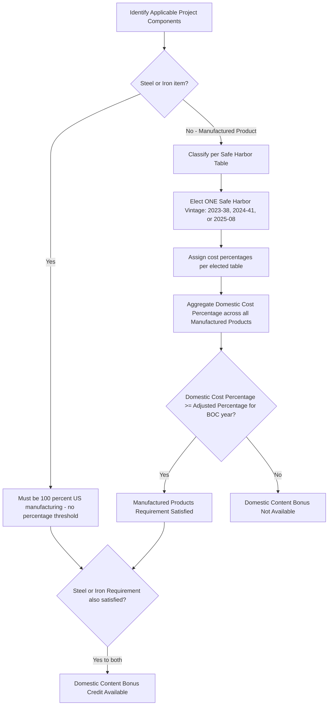

## Domestic Content Bonus and the Adjusted Percentage Rule

### Overview

The Domestic Content Bonus Credit is a bonus adder available under IRC §§45, 45Y, 48, and 48E that increases the credit amount for qualified facilities, energy projects, and energy storage technologies that satisfy specified U.S.-sourcing requirements for their steel, iron, and manufactured product components. The Adjusted Percentage Rule is the specific statutory mechanism (found at, e.g., §45(b)(9)(C)) that establishes the minimum domestic cost percentage threshold a project must meet to qualify, and that threshold percentage itself adjusts (increases) over time based on the calendar year in which construction of the project begins. Understanding the Adjusted Percentage Rule requires understanding both the underlying domestic content compliance framework and the escalating percentage schedule tied to BOC year.

### Statutory and Regulatory Basis

- **Enacting statute**: The Inflation Reduction Act of 2022 amended §§45 and 48 to provide a domestic content bonus credit amount for certain qualified facilities or energy projects placed in service after December 31, 2022, and added new §§45Y and 48E, which include a domestic content bonus credit amount for certain investments in qualified facilities or energy storage technologies placed in service after December 31, 2024.
- **Guidance history**:
  - **Notice 2023-38** (May 12, 2023): Foundational guidance establishing the Steel or Iron Requirement, the Manufactured Products Requirement, and the original safe harbor classification table (Table 2).
  - **Notice 2024-41** (May 2024): Created the "New Elective Safe Harbor" for solar, wind, and battery energy storage system (BESS) projects, providing a table ("Table 1") with assigned cost percentages to determine the domestic cost percentage for these project types, reducing the burden of determining actual costs from individual suppliers.
  - **Notice 2024-9**: Addressed statutory exceptions to phaseout reducing elective payment amounts for applicable entities if domestic content requirements are not satisfied.
  - **Notice 2025-08** (published February 18, 2025): The "First Updated Elective Safe Harbor," modifying Notice 2024-41's Table 1 and refining certain domestic content rules.

### Bifurcated Domestic Content Requirement

**Key Points**

To qualify for the Domestic Content Bonus, a project must satisfy two separate requirements simultaneously:

**1. Steel or Iron Requirement**

All manufacturing processes with respect to steel or iron items in an Applicable Project (except metallurgical processes involving refinement of steel additives) must take place in the United States. This is a strict, 100%-domestic requirement with no percentage threshold — steel/iron components must be entirely domestically manufactured, not merely majority-domestic.

**2. Manufactured Products Requirement**

For manufactured products, a minimum percentage of the total cost must be mined, produced, or manufactured in the United States. Unlike the Steel or Iron Requirement, this is a percentage-based test — this percentage threshold is precisely what the Adjusted Percentage Rule governs.

### Key Defined Terms

- **Applicable Project Component**: Any article, material, or supply (which may be iron, steel, or a manufactured product) that is directly incorporated into an applicable project.
- **Manufactured Product**: A component classified as a manufactured product (rather than steel/iron) subject to the percentage-based Manufactured Products Requirement.
- **Manufactured Product Component (MPC)**: An article, material, or supply that is directly incorporated into a manufactured product. Consistent with Notice 2023-38, the direct cost of producing a Manufactured Product counts toward the Domestic Cost Percentage only if all of its Manufactured Product Components are domestically produced.
- **Domestic Cost Percentage**: The ratio calculated by comparing domestic costs to total costs of the manufactured products incorporated into the project; this is the figure tested against the Adjusted Percentage Rule threshold.

### The Adjusted Percentage Rule: Threshold Schedule

**Key Points**

The Adjusted Percentage Rule establishes the minimum Domestic Cost Percentage a project's Manufactured Products must collectively achieve to satisfy the Manufactured Products Requirement, and this minimum threshold escalates based on the calendar year construction begins.

| Facility Type | BOC Before 2025 | BOC in 2025 | BOC in 2026 | BOC After 2027 |
| --- | --- | --- | --- | --- |
| General applicable projects (§45/§48) | 40% | 45% | 45%+ (per year-by-year schedule) | 55% |
| Offshore wind facilities (§45Y) | 20% | Increases annually | Increases annually | 55% |

For Section 45Y, the adjusted percentage for offshore wind facilities is 20% if construction of a project begins before 2025 and increases annually up to 55% for projects beginning construction after 2027, and ranges from 40% to 55% for other applicable projects. [Unverified] The precise year-by-year intermediate percentages between the 2025 and post-2027 endpoints (for both offshore wind and general applicable projects) should be confirmed against the specific statutory text of §45(b)(9)(C)/§48(a)(12) and the corresponding §45Y/§48E provisions, since the schedule involves multiple stepped increases across intervening years that are not fully captured in a simplified endpoints table.

### Calculation Formula

$$\text{Domestic Cost Percentage} = \frac{\text{Total Domestic Cost of Manufactured Products}}{\text{Total Cost of All Manufactured Products}}$$

A project satisfies the Manufactured Products Requirement (and thus the Adjusted Percentage Rule) if:

$$\text{Domestic Cost Percentage} \geq \text{Applicable Adjusted Percentage (based on BOC year)}$$

**Example**

A solar facility begins construction in 2025. Under the Adjusted Percentage Rule, its applicable threshold is 45%. If the facility's total manufactured product costs are $10,000,000, and $4,600,000 of that cost is attributable to domestically produced manufactured products and components, the Domestic Cost Percentage is:

$$\frac{\$4{,}600{,}000}{\$10{,}000{,}000} = 46\%$$

Since $46\% \geq 45\%$, the facility satisfies the Manufactured Products Requirement for the Domestic Content Bonus (assuming the Steel or Iron Requirement is also independently satisfied).

### The Elective Safe Harbor Framework (Simplified Compliance Path)

**Key Points**

Given the complexity of tracing actual manufactured-product costs through multi-tier supply chains, the IRS has developed a series of elective safe harbors that allow taxpayers to use standardized, pre-assigned cost percentages rather than tracing actual costs:

- **Original Safe Harbor (Notice 2023-38, Table 2)**: Provided a safe harbor table classifying certain Applicable Project Components as either Manufactured Products or Manufactured Product Components, and Steel/Iron items, for representative types of qualified facilities.
- **New Elective Safe Harbor (Notice 2024-41, Table 1)**: Created for solar, wind, and BESS projects, this table classifies applicable project components and assigns associated cost percentages for identified manufactured products and manufactured product components, substantially reducing the burden of determining actual costs from individual suppliers.
- **First Updated Elective Safe Harbor (Notice 2025-08)**: Updates and modifies the safe harbor in Notice 2024-41 for calculating a project's domestic cost percentage, and may impact the Notice 2023-38 safe harbor for classifying applicable projects as steel/iron or manufactured products.

**Reliance and transition rules**: Taxpayers may continue to rely on Notice 2024-41 for any projects the construction of which begins before April 16, 2025. Taxpayers can also rely on Notice 2023-38 regardless of the beginning of construction date. Effective January 16, 2025, taxpayers may rely on the First Updated Elective Safe Harbor for any Applicable Project the construction of which begins before the date that is 90 days after any future modification, update, or withdrawal of the First Updated Elective Safe Harbor.

**Mutual exclusivity of safe harbor election**: Where taxpayers may rely on either the New Elective Safe Harbor of Notice 2024-41 or the First Updated Elective Safe Harbor in Notice 2025-08, a taxpayer may apply only one of the referenced safe harbors, and its associated cost percentages, and must use it exclusively — a taxpayer cannot mix and match cost percentages between competing safe harbor vintages for the same project.

### Safe Harbor Compliance Workflow

### Bonus Rate Structure and PWA Interaction

**Key Points**

The Domestic Content Bonus, like other IRA bonus adders, has its own PWA-style bonus/base rate structure that interacts with, but is independent of, the general PWA requirement discussed elsewhere in this chapter:

- For projects that satisfy PWA requirements (or qualify for the PWA exemption, such as construction beginning before January 29, 2023, or the project satisfies the prevailing wage and apprenticeship requirements), the Domestic Content Bonus adds a larger increment to the base credit rate (e.g., an additional 10 percentage points to the ITC rate, or a 10% increase to the PTC rate).
- Projects failing PWA compliance receive a smaller domestic content bonus increment.
- [Inference] This layering means a project's total effective credit rate is the product of two independently-tracked compliance regimes — PWA compliance and Domestic Content Bonus compliance — each with its own documentation and safe harbor election requirements, requiring coordinated compliance tracking rather than a single unified test.

### Special Rule: Retrofitted Projects Under the 80/20 Rule

Notice 2025-08 clarifies that projects seeking the Domestic Content Bonus for retrofitted projects under the 80/20 Rule can rely on the classifications and cost percentages in Table 1 (Notice 2024-41) or the First Updated Elective Safe Harbor for new property added, subject to other requirements. When assessing compliance with the Steel or Iron Requirement, only the new property is considered to determine if the retrofitted project meets the criteria. For purposes of the Manufactured Products Requirement, all used property is assigned a domestic cost percentage of zero — meaning retrofitted/repowered projects can only count their newly added components toward satisfying the Adjusted Percentage Rule, with legacy/used equipment contributing nothing to the numerator (though it may still count in the denominator depending on total cost calculation methodology).

### Certification and Recordkeeping

**Output**

To substantiate a Domestic Content Bonus claim, taxpayers should maintain:

- Supplier certifications identifying the country of manufacture/production for each Manufactured Product and Manufactured Product Component
- Cost documentation (invoices, purchase orders) sufficient to calculate actual domestic cost percentages if not relying on an elective safe harbor
- A clear election record identifying which single safe harbor vintage (2023-38, 2024-41, or 2025-08) was elected for the project, since elections are exclusive and cannot be mixed
- BOC date documentation, since the Adjusted Percentage Rule threshold is keyed to the year construction begins — the same rigorous BOC documentation discussed in the Documentation Standards topic serves this purpose as well
- An IRS domestic content certification statement, required to be attached to the return claiming the credit, attesting to compliance with both the Steel or Iron Requirement and the Manufactured Products Requirement

### Common Compliance Pitfalls

- Attempting to blend cost percentages from multiple safe harbor notice vintages for the same project, which is impermissible under the exclusivity rule
- Miscounting a structural steel/iron component as a Manufactured Product (or vice versa), which affects whether the 100%-domestic Steel or Iron standard or the percentage-based Adjusted Percentage Rule applies
- Failing to recognize that a Manufactured Product's cost only counts toward the Domestic Cost Percentage numerator if *all* of its Manufactured Product Components are domestically produced — a single foreign sub-component can zero out an otherwise domestically-assembled product's contribution
- For retrofitted/repowered facilities, incorrectly including used property's cost in the domestic cost percentage numerator, when it must be assigned a zero domestic cost percentage
- Using an outdated BOC year to apply an incorrect (too low) Adjusted Percentage Rule threshold, particularly for projects that experience BOC redetermination due to ownership changes or repowering

### Conclusion

The Adjusted Percentage Rule operationalizes the Domestic Content Bonus Credit's Manufactured Products Requirement into a precise, BOC-year-dependent percentage threshold that projects must clear to access the bonus adder. Its interaction with an evolving, multi-vintage safe harbor framework (Notices 2023-38, 2024-41, and 2025-08) means compliance is as much an exercise in careful election-making and documentation discipline as it is in actual domestic sourcing — a project's ultimate bonus eligibility depends on correctly classifying components as steel/iron versus manufactured products, consistently applying a single elected safe harbor's cost percentages, and accurately establishing the BOC year that determines which percentage threshold in the escalating schedule applies. As the required percentage continues to climb toward 55% for most technologies, and as safe harbor tables continue to be refreshed by Treasury, developers should expect the domestic content compliance burden to intensify over the life of the tax credit programs.

**Related Topics**

- Prevailing Wage and Apprenticeship Requirements
- The 80/20 Rule for Repowered Facilities
- Documentation Standards for Establishing Construction Start
- The Material Assistance Cost Ratio Calculation (Comparative Cost-Ratio Framework)
- Elective Safe Harbor Table Selection and Exclusivity Elections
- Energy Community Bonus Credit Adder
- IRS Domestic Content Certification Statement Requirements