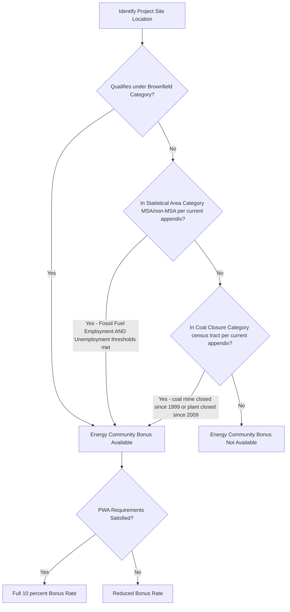

## Energy Community Bonus Criteria

### Overview

The Energy Community Bonus Credit is a location-based bonus adder available under IRC §§45, 45Y, 48, and 48E that increases the value of clean energy tax credits for qualified facilities and energy projects sited within a statutorily defined "energy community." The bonus reflects a Congressional policy objective embedded in the Inflation Reduction Act ("IRA"): directing continued investment toward communities historically dependent on fossil fuel extraction, processing, and power generation employment, as those regions transition toward newer energy sources. The bonus generally increases the value of credits found in Sections 45, 48, 45Y, and 48E by 10 percent — though this bonus amount is reduced if the prevailing wage and apprenticeship requirements are not satisfied, mirroring the PWA-linked bonus/base rate structure found in other adders discussed in this chapter.

### Statutory Basis

- **Enacting statute**: Public Law 117-169 (August 16, 2022), the Inflation Reduction Act of 2022, amended §§45 and 48 to provide the increased credit rate for facilities in energy communities, with the technology-neutral successor credits §45Y and §48E incorporating parallel provisions.
- **Statutory definitional provision**: Section 45(b)(11)(B) identifies three location-based categories of energy communities for purposes of §§45, 45Y, 48, and 48E.

### The Three Statutory Categories

**Key Points**

An energy community is defined under three independent, mutually exclusive-in-application categories — a project need only satisfy **one** of the three to qualify:

**1. Brownfield Category**

A site that qualifies as a "brownfield site" under applicable federal environmental law definitions (generally tied to the definition used in the Comprehensive Environmental Response, Compensation, and Liability Act, as referenced in Notice 2023-29). Three safe harbors exist for establishing Brownfield Category status, and an opinion from an environmental attorney may be warranted, with the scope of the opinion varying based on which of the three brownfields safe harbors a project is claiming.

**2. Statistical Area Category**

A metropolitan statistical area (MSA) or non-metropolitan statistical area (non-MSA) that satisfies a two-part test:

- **Fossil Fuel Employment threshold**: The area has (or, at any time during the period beginning after December 31, 2009, had) 0.17 percent or greater direct employment (Fossil Fuel Employment), or 25 percent or greater local tax revenues, related to the extraction, processing, transport, or storage of coal, oil, or natural gas; **and**
- **Unemployment rate threshold**: The area had an unemployment rate at or above the national average unemployment rate for the previous year.

**3. Coal Closure Category**

A census tract (or directly adjoining census tract) in which:

- A coal mine has closed since 1999, or a coal-fired power plant has shut down since 2009, within that census tract or an adjacent tract.

### Category Comparison Table

| Category | Basis | Key Data Source | Annual Update? |
| --- | --- | --- | --- |
| Brownfield | Environmental site status (CERCLA-linked) | Environmental attorney opinion / safe harbor | No — status-based, not annually redetermined |
| Statistical Area | Fossil Fuel Employment % + local unemployment rate | MSA/non-MSA level government data | Yes — annually |
| Coal Closure | Coal mine/plant closure history | Census tract-level historical closure records | Periodically updated as new tracts qualify |

### Guidance Evolution and Annual Update Mechanism

**Key Points**

Because Statistical Area Category and Coal Closure Category eligibility depend on data that changes over time (annual unemployment rates, newly closed coal facilities), the IRS issues periodic updated guidance:

- **Notice 2023-29** (July 17, 2023, clarified by Notice 2023-45, modified by Notice 2024-30): The foundational guidance establishing the three categories and containing the original Appendices A, B, and C setting forth qualifying MSAs/non-MSAs and census tracts.
- **Notice 2023-47**: First annual update, containing Appendices 1, 2, and 3 updating the information in the original Notice 2023-29 appendices.
- **Notice 2024-30** (April 15, 2024): Broadened eligibility through two key changes: expansion of the "nameplate capacity attribution rule" and inclusion of two additional NAICS codes for determining the fossil fuel employment rate for the Statistical Area Category. The nameplate capacity attribution rule pertains to projects with offshore generation — namely, offshore wind — that have a nameplate capacity but are not located within a census tract, an MSA, or a non-MSA; the rule allows developers to allocate their offshore nameplate capacity onshore for purposes of qualifying for the energy community bonus.
- **Notice 2024-48** (June 24, 2024): Provided updated lists for both the Statistical Area Category and Coal Closure Category based on calendar year 2023 information, with Appendix 1 (Statistical Area) and Appendix 2 (Coal Closure).
- **Notice 2025-31** (June 23, 2025): The most recent comprehensive update, providing five new appendices addressing the Statistical Area Category (Appendices 1, 2, and 3) and Coal Closure Category (Appendices 4 and 5), based on 2020 decennial census data groupings and updated unemployment figures; this Notice does **not** address the Brownfield Category.

[Inference] The recurring annual-update pattern (Notice 2023-29 → 2023-47 → 2024-30 → 2024-48 → 2025-31) indicates the IRS intends to continue issuing yearly refreshes of the Statistical Area and Coal Closure appendices; practitioners should check for the most current successor notice beyond 2025-31 when performing a present-day energy community determination, since a location's status can change annually based on updated unemployment data.

### Statistical Area Category — Detailed Mechanics

**Example**

To qualify as a county or county equivalent for the energy community bonus under the Statistical Area Category as of the most recent guidance, the location must be listed in the current appendix as being in either a "Vintage 1" or "Vintage 2" MSA, or a non-MSA that meets both the fossil fuel employment and unemployment rate thresholds — specifically, being in an MSA with an unemployment rate at or above the national average for the previous year.

- **Vintage 1 MSAs/non-MSAs**: Groupings of county and county-equivalents into MSAs and non-MSAs generally based on the 2010 Decennial Census.
- **Vintage 2 MSAs/non-MSAs**: A newer grouping based on 2020 decennial census data, introduced in later guidance (e.g., Notice 2025-31) to reflect updated census geography.
- **Year-to-year volatility**: Because an MSA's or non-MSA's status as an energy community depends on its unemployment rate for the previous year, an MSA or non-MSA that qualifies as an energy community in one period might not qualify as an energy community in a later period if its unemployment rate for the previous year falls below the national average — meaning Statistical Area Category status is not a permanent designation and must be re-verified for each relevant determination date (generally, the BOC date or placed-in-service date, depending on the applicable credit mechanics).

### Coal Closure Category — Detailed Mechanics

An updated list of qualifying census tracts is periodically released (most recently reflected in Appendix 4 of Notice 2025-31), listing newly eligible census tracts that should be used together with the prior appendices from Notice 2023-29 (Appendix C), Notice 2023-47 (Appendix 3), and Notice 2024-48 (Appendix 2) to provide a complete cumulative list of census tracts qualified for the energy community bonus credit under this category.

### Determination Timing

**Key Points**

- **PTC-type credits (§45, §45Y)**: Energy community status is generally tested for each year of the 10-year credit period, meaning a project's location must be re-evaluated annually against the then-current Statistical Area Category and Coal Closure Category lists to determine bonus eligibility for that specific credit year — reflecting the year-to-year volatility discussed above.
- **ITC-type credits (§48, §48E)**: Energy community status is generally determined as of the placed-in-service date (or, under certain guidance, the beginning-of-construction date), producing a single, fixed determination rather than an annual re-test.
- [Inference] This timing distinction between production-based and investment-based credits mirrors a broader pattern seen elsewhere in this chapter (e.g., the PWA requirement's ongoing multi-year compliance obligation for PTC-eligible facilities versus the largely construction-phase-focused compliance for ITC-eligible facilities), reflecting Congress's general design choice to tie PTC bonus eligibility to the ongoing production period rather than a single point-in-time determination.

### Energy Community Determination Workflow

### Offshore Wind — Nameplate Capacity Attribution Rule

**Example**

An offshore wind facility located outside the boundaries of any census tract, MSA, or non-MSA would ordinarily be unable to satisfy the Statistical Area Category, since that category is defined by onshore geographic units. Under the nameplate capacity attribution rule introduced in Notice 2024-30, the developer may allocate the facility's offshore nameplate capacity to an onshore point of interconnection or another specified onshore location for purposes of the Statistical Area Category determination — effectively allowing offshore generation assets to "borrow" the energy community status of a connected onshore location.

### Documentation and Diligence Considerations

**Output**

- **Statistical Area and Coal Closure Categories**: Relatively straightforward from a due diligence standpoint, since the IRS publishes definitive, government-maintained lists of qualifying MSAs, non-MSAs, and census tracts in each annual notice — taxpayers can generally confirm eligibility by cross-referencing the project address against the current and all historically cumulative appendices.
- **Brownfield Category**: Requires more substantive diligence, typically including an environmental attorney's opinion addressing which of the three brownfield safe harbors applies and the evidentiary basis supporting that conclusion.
- **Cumulative appendix tracking**: Because Coal Closure Category appendices accumulate across multiple notices rather than being replaced by each new notice, taxpayers must check a census tract against the full historical set of appendices (2023-29's Appendix C, 2023-47's Appendix 3, 2024-48's Appendix 2, and 2025-31's Appendices 4-5, plus any subsequent updates) rather than relying on only the most recent notice in isolation.
- **BOC/PIS date correlation**: Energy community determinations should be documented alongside the BOC and placed-in-service documentation discussed in the Documentation Standards topic, since the applicable determination date (and therefore the applicable version of the qualifying-area appendices) depends on the specific credit and timing rules in effect.

### Common Compliance Pitfalls

- Relying on a single notice's appendix rather than checking the complete cumulative list of appendices across all successive Coal Closure Category updates
- Failing to re-test Statistical Area Category status annually for PTC-type credits, incorrectly assuming a one-time qualification determination carries through the entire 10-year credit period
- Overlooking the nameplate capacity attribution rule for offshore wind projects, potentially forgoing an available bonus for facilities located outside traditional onshore statistical boundaries
- Assuming Brownfield Category qualification without obtaining appropriate environmental counsel opinion, given the fact-intensive, safe-harbor-dependent nature of that category
- Failing to stack the Energy Community Bonus correctly with the PWA-linked bonus/reduced-bonus rate structure, resulting in an incorrect total credit calculation

### Conclusion

The Energy Community Bonus Criteria establish a three-pronged, location-based eligibility framework — Brownfield, Statistical Area, and Coal Closure categories — designed to channel clean energy investment toward historically fossil-fuel-dependent regions. Its administration through a continuously updated series of IRS notices (from the foundational Notice 2023-29 through the most recent Notice 2025-31) reflects the dynamic, data-dependent nature of two of the three categories, particularly the Statistical Area Category's dependence on annually shifting unemployment data. Successful compliance requires not only confirming a project's physical location against the correct, cumulative set of qualifying-area appendices, but also correctly timing that determination relative to the applicable credit's PTC-versus-ITC structure and properly layering the resulting bonus rate against PWA compliance status.

**Related Topics**

- Prevailing Wage and Apprenticeship Requirements
- Domestic Content Bonus and the Adjusted Percentage Rule
- Documentation Standards for Establishing Construction Start
- The Nameplate Capacity Attribution Rule for Offshore Generation
- Brownfield Site Safe Harbors and Environmental Attorney Opinions
- Annual Redetermination Requirements for Production Tax Credit Bonus Adders
- Stacking Multiple Bonus Credit Adders: Interaction Effects