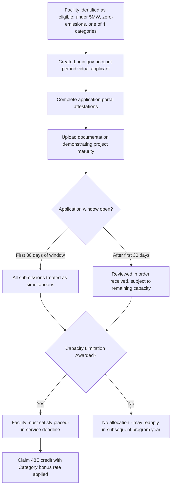

## Low-Income Communities Bonus Under Section 48E

### Overview

The Section 48E(h) Clean Electricity Low-Income Communities Bonus Credit Amount Program (the "Program") is a competitively allocated bonus adder that increases the Section 48E Clean Electricity Investment Tax Credit for small-scale applicable energy facilities sited in, or benefiting, low-income communities. Section 13702 of the Inflation Reduction Act ("IRA") added new section 48E(h) to the Code to authorize the Secretary of the Treasury to establish a program for calendar years 2025 and succeeding years to award allocations of capacity limitation that increase the amount of the Section 48E credit with respect to eligible property that is part of an applicable facility. Unlike the Domestic Content and Energy Community bonuses discussed elsewhere in this chapter — which are self-executing, non-competitive adders available to any qualifying project — the Low-Income Communities Bonus operates as a **capacity-limited, competitively allocated program**, meaning eligibility alone does not guarantee receipt of the bonus; a taxpayer must also secure a successful allocation award within an annually capped capacity pool.

### Statutory and Regulatory Basis

- **Enacting statute**: Section 13702 of Public Law 117-169 (the IRA), adding §48E(h) to the Internal Revenue Code.
- **Predecessor program**: 48E(h) is the technology-neutral successor program to the §48(e) Low-Income Communities Bonus Credit program, which applied for calendar years 2023 and 2024 only under the prior technology-specific ITC framework (§48). The Program expands the §48(e) bonus credit and promotes cost-saving clean energy investments in low-income communities, on Indian land, or as part of affordable housing developments, and aims to benefit low-income households.
- **Technology expansion**: The Program builds on the §48(e) predecessor by supporting additional clean energy technologies beyond solar and wind, such as hydropower and geothermal, consistent with §48E's broader technology-neutral design.
- **Proposed regulations**: Issued August 30, 2024 (REG-108920-24), providing initial rules regarding facility categories, nameplate capacity requirements, geographic location eligibility, placed-in-service requirements, and capacity limitation reservations.
- **Final regulations**: Published January 8, 2025 (effective January 13, 2025), largely adopting the proposed regulations with additional clarifications, including rules on disregarded entities, and establishing the definitive Program framework, effective January 1, 2025.

### Eligibility Threshold: Facility Size and Emissions

**Key Points**

- **Nameplate capacity limit**: The 48E(h) bonus credit increases the 48E Clean Electricity Investment Tax Credit for applicable energy facilities with maximum net output of less than 5 megawatts (MW).
- **Zero-emissions requirement**: Eligible facilities under 48E(h) must categorically be non-combustion or non-gasification with a greenhouse gas emissions rate not greater than zero, as defined in the 48E Clean Electricity Investment Tax Credit — consistent with §48E's general technology-neutral zero-emissions eligibility standard.

### The Four Facility Categories

**Key Points**

The Program's annual capacity limitation is distributed across four distinct categories, based on where the facility is located or whether it benefits a housing program or low-income economic benefit project:

| Category | Description | Bonus Rate |
| --- | --- | --- |
| Category 1 | Located in a Low-Income Community | 10% |
| Category 2 | Located on Indian Land | 10% |
| Category 3 | Qualified Low-Income Residential Building Project | 20% |
| Category 4 | Qualified Low-Income Economic Benefit Project | 20% |

A 10% increase is available to applicable facilities that are located in low-income communities or on Indian land. A 20% increase is available to applicable facilities that are part of a qualified low-income residential building project or a qualified low-income economic benefit project.

**Practical maximum credit rate**: The IRS has confirmed that eligible projects can increase the Clean Electricity ITC to up to 50% under Section 48E — reflecting the base 30% bonus rate (assuming PWA compliance) plus a maximum 20% Category 3/4 Low-Income Communities Bonus stacked on top.

### Annual Capacity Limitation and Allocation Mechanics

**Key Points**

- **Total annual capacity**: Per §48E(h)(4)(C), the total annual capacity limitation to be allocated is 1.8 gigawatts of direct current capacity per calendar year beginning on January 1, 2025.
- **Category sub-allocation (2025 program year initial distribution)**: Under Category 1, a capacity limitation of 200 MW is sub-reserved for Eligible Front-of-the-Meter Facilities and Non-Residential Behind-the-Meter (BTM) Facilities, and 400 MW is sub-reserved for Eligible Residential BTM Facilities, as part of the four-category division of the 1.8 GW total.
- **2026 program year distribution**: For the 2026 Program year, the capacity limitation is distributed across the four categories, plus any carried-over unallocated capacity limitation from the 2025 program year; for example, 600,000.00 kW (600 MW) are available to facilities located in low-income communities under Category 1 for the 2026 program year.
- **Carryover mechanism**: Unallocated capacity limitation from a prior program year carries over and is added to the subsequent year's base 1.8 GW allocation, meaning actual available capacity in any given year can exceed the nominal 1.8 GW figure.
- **High demand relative to capacity**: A Treasury analysis of the first year of the predecessor §48(e) program showed that the program received more than 54,000 applications from 48 states, the District of Columbia, and four territories — for the 2025 §48E(h) program year, approximately 174,243 [applications/kW — figure incomplete in available source data] were reportedly involved, reflecting the program's status as substantially oversubscribed relative to available capacity. [Unverified] The precise 2025 application volume and the resulting allocation/denial rates should be confirmed against the IRS's published program statistics dashboard, since demand levels and allocation outcomes are reported figures subject to updates as each program year's application cycle closes.

### Application Process and Timeline

- **Application window (2026 and beyond)**: For the 2026 calendar year and beyond, the application period opens the first Monday of February at 9:00 a.m. EST/ET and closes the first Friday of August at 11:59 p.m. EST/ET. Applications for the 2026 program year specifically opened at 9 a.m. ET on February 2, 2026, and closed at 11:59 p.m. ET on August 7, 2026.
- **Simultaneous-submission window**: During the first 30 days of each application period, all applications submitted will be treated as if they were submitted simultaneously — meaning early submission within this window confers no priority advantage over other applications filed within the same 30-day period. Applications submitted after this initial 30-day period are reviewed in the order received, provided there is sufficient capacity limitation remaining.
- **2025 program year exception**: For the 2025 calendar year specifically, the application period was announced separately in the Internal Revenue Bulletin rather than following the standard February–August window later established for 2026 and beyond.
- **Required credentials**: Each individual completing an application on behalf of their organization needs a Login.gov account to complete an application.

### Application Documentation Requirements

**Output**

Applicants must complete a series of attestations provided in the application portal and upload certain documentation to demonstrate project maturity. Category-specific documentation resources published by the IRS include:

- **Category 1 (Low-Income Community)**: Maps for Category 1 and Geographic Selection Criteria, used to confirm the facility's physical location falls within a qualifying low-income community census tract.
- **Category 3 (Qualified Low-Income Residential Building Project)**: Publication 6067 (48E(h) Eligible Federal Housing Programs — Category 3) and a Category 3 Benefits Sharing Statement Template, used to demonstrate the required financial benefit-sharing arrangement with residential building occupants.
- **Category 4 (Qualified Low-Income Economic Benefit Project)**: Household Income Limits for Category 4 and a Category 4 Demonstration of Financial Benefits Statement Template, used to substantiate that the required percentage of financial benefits flow to qualifying low-income households.
- **General program guides**: Publication 6065 (48E(h) Applicant User Guide) and Publication 6068 (48E(h) Applicant Checklist) provide comprehensive procedural guidance for the application process.
- **Ownership transfer documentation**: Publication 6066 (48E(h) Successor-in-Interest Transfer Request User Guide) governs the process for transferring an awarded allocation when project ownership changes after allocation but before placed-in-service.

### Placed-in-Service Deadline

Facilities receiving a capacity limitation allocation must satisfy the applicable placed-in-service deadline tied to the program year of the award (published program-year-specific deadlines, e.g., a stated deadline of Friday, December 31, 2032 has appeared in program materials for certain award years). [Unverified] The exact placed-in-service deadline applicable to any specific program year's allocation should be confirmed against the specific award documentation and current IRS program guidance, since deadlines are structured relative to the award year and have been subject to periodic clarification.

### Interaction with Other Bonus Adders and Base Credit Structure

**Key Points**

- The Low-Income Communities Bonus stacks on top of the base §48E credit rate (6% base / 30% PWA-compliant bonus rate), operating as an additional percentage-point increase rather than a multiplier.
- [Inference] Because the Low-Income Communities Bonus, PWA compliance, Domestic Content Bonus, and Energy Community Bonus are all independently determined adders that can in principle stack on the same project (subject to each adder's own eligibility criteria), a fully optimized small-scale facility located in a qualifying low-income community, satisfying PWA, achieving Energy Community status, and meeting Domestic Content thresholds could theoretically achieve a substantially higher effective credit rate than any single adder alone — though the competitive, capacity-limited nature of the Low-Income Communities Bonus means this particular adder cannot be assumed available and must be affirmatively won through the application process, unlike the self-executing Domestic Content and Energy Community adders.
- **Disregarded entities**: The final regulations include specific clarifications regarding the treatment of disregarded entities for purposes of Program eligibility and allocation, relevant to common project finance and tax equity ownership structures.

### Regulatory Stability Caveat

Although effective as of January 13, 2025, these final regulations may be subject to review and overturn through the Congressional Review Act — a general procedural caveat applicable to recently finalized federal regulations that practitioners should monitor for any subsequent Congressional action affecting the Program's regulatory framework.

### Common Compliance Pitfalls

- Assuming eligibility under one of the four categories guarantees receipt of the bonus, when in fact the Program is competitively allocated and capacity-limited — a facility can be fully eligible yet receive no allocation if capacity is exhausted
- Submitting applications with the expectation that earlier submission within the initial 30-day window confers priority, when in fact all submissions within that window are treated as simultaneous
- Failing to prepare Category-specific documentation (e.g., the Benefits Sharing Statement for Category 3, or Demonstration of Financial Benefits Statement for Category 4) in advance of the application window opening, given the compressed and competitive nature of the process
- Overlooking the successor-in-interest transfer process (Publication 6066) when a project changes ownership after receiving an allocation but before being placed in service, potentially jeopardizing the awarded bonus
- Failing to distinguish the sunset predecessor program under §48(e) (2023–2024 only) from the current §48E(h) program (2025 and succeeding years), particularly when reviewing older guidance or diligence materials that reference the prior program's rules

### Conclusion

The Low-Income Communities Bonus under Section 48E represents a structurally distinct category of bonus credit adder within this chapter: rather than a self-executing percentage threshold like the Domestic Content or Energy Community bonuses, it operates as a competitive, capacity-limited allocation program requiring an affirmative application, government review, and successful award before the bonus rate can be claimed. Its four-category structure — Low-Income Community, Indian Land, Qualified Low-Income Residential Building Project, and Qualified Low-Income Economic Benefit Project — reflects a deliberate targeting of both geographic and beneficiary-based equity objectives, with the higher 20% bonus rate reserved for categories requiring direct, demonstrable financial benefit flow to low-income households or residents. Given the Program's substantial oversubscription in its early years, developers pursuing this bonus should treat the application process itself — documentation preparation, category selection, and timely submission within the competitive window — as a critical path item independent from, and in addition to, the underlying technical and financial development of the facility.

**Related Topics**

- Domestic Content Bonus and the Adjusted Percentage Rule
- Energy Community Bonus Criteria
- Prevailing Wage and Apprenticeship Requirements
- The Predecessor Section 48(e) Environmental Justice Solar and Wind Capacity Program
- Bonus Credit Adder Stacking and Maximum Effective Credit Rate Calculation
- Successor-in-Interest Transfers of Capacity Limitation Allocations
- Disregarded Entity Treatment in Tax Equity Ownership Structures