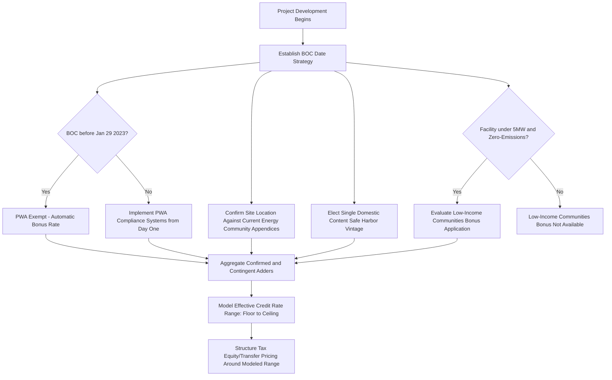

## Stacking Multiple Adders in Practice

### Overview

Stacking Multiple Adders in Practice addresses the practical mechanics, sequencing, and structuring considerations that arise when a single clean energy project pursues more than one bonus credit adder simultaneously. As detailed elsewhere in this chapter, the four principal bonus categories — Prevailing Wage and Apprenticeship (PWA), Domestic Content, Energy Community, and the Low-Income Communities Bonus (§48E(h)) — are each independently defined, independently documented, and (with the exception of the Low-Income Communities Bonus) independently self-executing. In practice, however, sophisticated developers rarely pursue a single adder in isolation; the economics of tax equity transactions frequently depend on maximizing the aggregate effective credit rate by satisfying as many applicable adders as the project's technology, location, labor practices, and supply chain will support. This topic synthesizes the interaction effects, compounding mechanics, sequencing dependencies, and documentation-management challenges that arise when adders are layered together.

### The Compounding Mechanic: Additive, Not Multiplicative

**Key Points**

A common structuring error is assuming bonus adders multiply against one another. In fact, for the §48E Investment Tax Credit, the adders generally compound as an additive percentage-point stack layered on top of the base credit rate, subject to the PWA base/bonus-rate gateway multiplier discussed separately.

$$\text{Effective Credit Rate} = \text{Base Rate} \times \text{PWA Multiplier} + \text{Domestic Content Adder} + \text{Energy Community Adder} + \text{Low-Income Communities Adder}$$

**Example**

Consider a small-scale (under 5 MW) solar facility that:

- Satisfies PWA requirements, qualifying for the 5x bonus rate (base 6% → 30%)
- Achieves Energy Community status (Statistical Area Category), adding 10 percentage points
- Successfully wins a Category 1 Low-Income Communities Bonus allocation, adding 10 percentage points

$$\text{Effective Credit Rate} = 30\% + 10\% + 10\% = 50\%$$

This produces a 50% effective ITC rate — the maximum commonly cited combined rate for small-scale §48E-eligible facilities, consistent with the IRS's own confirmation that eligible projects can increase the Clean Electricity ITC to up to 50% under Section 48E when combining the base PWA-compliant rate with the maximum 20-percentage-point Low-Income Communities Bonus (Category 3 or 4) — or, as in this example, the 10-point Category 1/2 bonus plus a separately available Energy Community bonus.

[Inference] Because Domestic Content compliance functions as a threshold percentage test rather than a flat adder in the same units as the other bonuses, its specific point-value contribution to the stack (rather than the base credit rate multiplier it affects) should be confirmed against the specific statutory provision and current-year percentages applicable to the credit and technology at issue, since domestic content's numeric contribution to the stack can vary by technology and PWA status in ways the other, flatter adders do not.

### Adder Compatibility Matrix

| Adder | Self-Executing or Competitive? | Depends on BOC Date? | Depends on Location? | Depends on Labor Practices? | Depends on Supply Chain? |
| --- | --- | --- | --- | --- | --- |
| PWA (base/bonus gateway) | Self-executing | Yes (Jan 29, 2023 exemption) | No | Yes | No |
| Domestic Content | Self-executing | Yes (Adjusted Percentage Rule threshold) | No | No (but PWA affects bonus magnitude) | Yes |
| Energy Community | Self-executing | Yes (determination timing varies by credit type) | Yes | No (but PWA affects bonus magnitude) | No |
| Low-Income Communities (§48E(h)) | **Competitive/Capacity-Limited** | Yes (placed-in-service deadlines tied to award year) | Yes (Category 1/2) or Beneficiary-based (Category 3/4) | No | No |

[Inference] This matrix illustrates that three of the four adders are purely a function of project characteristics the developer controls or can document (labor practices, sourcing, siting), while the fourth — Low-Income Communities — additionally requires winning a competitive allocation process independent of the project's underlying qualification, meaning it should be modeled as a contingent, not guaranteed, addition to the stack.

### Sequencing and Structuring Considerations

- **BOC date as the master planning variable**: Because BOC date determines PWA applicability, Domestic Content Adjusted Percentage Rule thresholds, and (for ITC-type credits) Energy Community determination timing, a single, well-documented BOC event — as discussed in the Documentation Standards topic — should be planned with all four adders in mind simultaneously, not sequentially addressed after the fact.
- **Site selection as an early-stage lever**: Since Energy Community status and Low-Income Communities Bonus Category 1/2 eligibility are both purely location-driven, developers with siting flexibility should cross-reference candidate sites against both the current Energy Community appendices and the Low-Income Communities Bonus geographic selection maps during the earliest site-selection phase, since a site qualifying for both adders meaningfully changes project economics before capital is committed.
- **Labor and procurement systems stood up early**: PWA compliance (certified payroll, apprenticeship tracking) and Domestic Content compliance (supplier certifications, safe harbor election) both require systems and contractual flow-down provisions established before or at construction start — retrofitting compliance systems after construction has begun risks gaps in the record that cannot be cured retroactively for periods already elapsed.
- **Competitive adder application as a parallel workstream**: Because the Low-Income Communities Bonus requires a separate, time-boxed application process (discussed in the preceding topic) with its own documentation, attestations, and Login.gov credentialing, this workstream should run in parallel with — not sequentially after — the general BOC and construction planning process, given the fixed annual application windows.

### Documentation Consolidation Challenge

**Output**

Each adder carries its own independent documentation regime, discussed in detail in its respective topic:

- PWA: certified payroll, DOL wage determinations, apprenticeship program correspondence
- Domestic Content: supplier certifications, single-vintage safe harbor election records, BOC date for threshold determination
- Energy Community: site address cross-referenced against cumulative appendices, determination-date documentation
- Low-Income Communities: application portal attestations, category-specific templates (Benefits Sharing Statement, Demonstration of Financial Benefits Statement), successor-in-interest records if ownership changes

[Inference] Given that all four documentation regimes ultimately support a single return position (or a single §6418 credit transfer representation package), practitioners commonly consolidate these into a unified "credit substantiation file" organized by adder, cross-referenced to a master BOC and placed-in-service timeline — reducing the risk that inconsistent dates or figures are used across the different adder-specific analyses (e.g., using a different BOC date for the Domestic Content Adjusted Percentage Rule than the date used for PWA exemption analysis).

### Interaction with Tax Equity and Credit Transfer Structuring

**Key Points**

- **Diligence complexity multiplies with adder count**: Each additional adder a project claims introduces a corresponding diligence workstream for tax equity investors or §6418 credit transfer buyers, since each adder has its own risk profile, recapture exposure, and evidentiary standard.
- **Risk allocation across adders**: Representations, warranties, and indemnification provisions in tax equity and transfer agreements are commonly structured on an adder-by-adder basis, since the likelihood and consequence of an adder being disallowed on audit (e.g., a Domestic Content miscalculation versus a PWA cure-eligible wage shortfall) differ substantially in both probability and remediability.
- **Modeling a credit rate range, not a single figure**: Because the Low-Income Communities Bonus is competitive and uncertain until awarded, and because certain adders (like Energy Community status for PTC-type credits) can fluctuate year to year based on updated government data, sophisticated financial models typically present a floor (guaranteed, self-executing adders only) and a ceiling (all adders including contingent/competitive ones) effective credit rate, rather than a single point estimate, to appropriately price risk into the transaction.

### Recapture Risk Aggregation

**Key Points**

[Inference] Because a failure in any single adder's compliance (e.g., a later-discovered PWA violation, an incorrect Domestic Content safe harbor election, or a successor-in-interest transfer defect for the Low-Income Communities Bonus) can independently trigger recapture or credit reduction for that specific adder's contribution — without necessarily affecting the other stacked adders — practitioners should model recapture exposure adder-by-adder rather than treating the combined effective rate as a single, monolithic risk. This means a project's overall credit position is more accurately understood as a portfolio of independently defensible (or independently vulnerable) adder claims layered on a base credit, rather than a single unified number with unified risk characteristics.

### Common Structuring Pitfalls When Stacking

- Assuming all four adders are equally certain at financial close, when the Low-Income Communities Bonus remains contingent on a competitive award that may not be known until well after other project milestones
- Using inconsistent BOC dates across different adder analyses due to siloed workstreams (e.g., tax counsel using one date for PWA analysis while a separate consultant uses a different date for Domestic Content analysis)
- Failing to re-verify Energy Community status annually for PTC-type credits after initially confirming eligibility at project inception, given the year-to-year volatility discussed in the Energy Community topic
- Underestimating the parallel administrative burden of the Low-Income Communities Bonus application process, treating it as a minor addition rather than a distinct, deadline-driven workstream requiring dedicated resources
- Structuring tax equity or transfer pricing around a single "best case" combined rate without appropriately discounting for the probability-weighted likelihood of securing contingent/competitive adders

### Conclusion

Stacking multiple bonus credit adders in practice is less a matter of legal eligibility — which is often achievable for a well-sited, well-structured project — and more a matter of disciplined, coordinated project management across labor compliance, supply chain documentation, site selection, and competitive application processes, all anchored to a single, carefully established and consistently applied Beginning of Construction date. The additive (rather than multiplicative) nature of the adder stack means the theoretical ceiling — commonly cited as up to a 50% effective §48E credit rate — is achievable only when every applicable adder's independent documentation and compliance regime is simultaneously satisfied, while the presence of one genuinely competitive, capacity-limited adder (Low-Income Communities) means sophisticated financial modeling should always distinguish between guaranteed and contingent components of the stack. As bonus adder frameworks continue to evolve through successive IRS guidance, maintaining a consolidated, cross-referenced documentation file spanning all claimed adders remains the single most effective risk-mitigation practice available to developers and their tax equity counterparties.

**Related Topics**

- Prevailing Wage and Apprenticeship Requirements
- Domestic Content Bonus and the Adjusted Percentage Rule
- Energy Community Bonus Criteria
- Low-Income Communities Bonus Under Section 48E
- Documentation Standards for Establishing Construction Start
- Tax Equity Due Diligence and Representations Across Multiple Bonus Adders
- Credit Transfer Risk Allocation Under Section 6418
- Recapture Risk Modeling for Stacked Bonus Credits