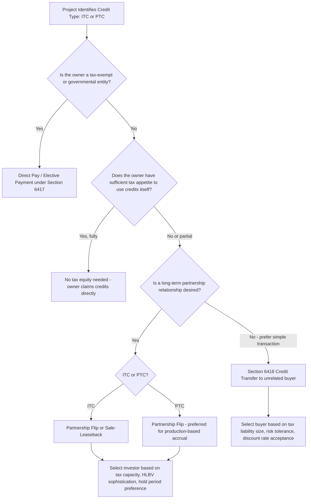

## How Structure Choice Depends on Credit Type and Investor Profile

### Overview

Tax equity structuring is not a one-size-fits-all exercise: the choice among the principal deal structures — the Partnership Flip, the Sale-Leaseback, the Inverted Lease (Pass-Through Lease), and, following the Inflation Reduction Act ("IRA"), Direct Pay (Elective Payment) and Transferability (§6418 Credit Transfer) — depends heavily on which credit is being monetized (ITC versus PTC), the technology involved, and the specific characteristics, risk appetite, and tax capacity of the prospective investor. Understanding how structure choice depends on credit type and investor profile is foundational to the remainder of this chapter's deal-structure-specific topics, since it explains *why* a given structure is selected before examining *how* that structure is mechanically implemented.

### The Credit-Type Axis: ITC vs. PTC Structural Implications

**Key Points**

- **ITC (Investment Tax Credit, §48/§48E)**: A one-time credit, generally claimed in the year the property is placed in service, calculated as a percentage of qualified investment (basis). Because the credit crystallizes at a single point in time, ITC-based structures place enormous importance on the placed-in-service date and on establishing eligible basis correctly at that moment.
- **PTC (Production Tax Credit, §45/§45Y)**: A credit earned over time based on actual electricity production (cents per kWh), generally over a 10-year credit period. Because the credit accrues gradually and depends on ongoing operational performance, PTC-based structures place greater importance on long-term operating relationships, production risk allocation, and sustained compliance (e.g., the multi-year PWA compliance obligation discussed in the Bonus Credit Adders chapter).
- **Structural consequence**: ITC's one-time nature makes it more naturally compatible with structures that can crystallize and monetize a credit quickly and exit the investor relationship earlier (e.g., certain Sale-Leaseback structures or straight credit transfers), whereas PTC's decade-long accrual naturally favors structures maintaining a long-term ownership or allocation relationship with the tax equity investor throughout the production period, since production-based credits cannot be transferred or crystallized until production actually occurs.

### The Investor Profile Axis

**Key Points**

Not all tax equity investors have the same objectives, tax capacity, accounting treatment preferences, or risk tolerance, and structure choice must accommodate these differences:

- **Large money-center banks and insurance companies**: Typically possess substantial, stable tax liability and sophisticated internal tax and accounting functions capable of handling complex partnership structures; historically the dominant investor class in Partnership Flip structures for both ITC and PTC deals.
- **Corporates seeking both tax and ESG/sustainability benefits**: May prioritize structures that also support renewable energy attribute claims (e.g., Renewable Energy Certificates) alongside tax benefits, sometimes favoring structures with clearer environmental attribute allocation.
- **New entrants post-IRA (via Transferability)**: The introduction of §6418 credit transferability dramatically expanded the pool of potential "tax equity-like" capital providers, since a straightforward credit purchase requires none of the partnership tax expertise, HLBV accounting capability, or long-term relationship management that traditional partnership flip or lease structures demand — opening credit monetization to smaller banks, family offices, and corporates without dedicated tax equity teams.
- **Tax-exempt and governmental entities**: The IRA's introduction of Direct Pay (Elective Payment) under §6417 specifically addresses investor profiles that were previously excluded from tax credit monetization altogether — entities with no tax liability against which to claim a credit, such as municipalities, tribal governments, rural electric cooperatives, and tax-exempt organizations, for whom Direct Pay functions as a cash refund mechanism rather than a credit requiring a tax equity partner at all.

### Structure Selection Framework

### Partnership Flip Structures

**Key Points**

- **Best fit for**: Both ITC and PTC deals, particularly where the developer wants to retain a long-term ownership and operational relationship with the project while monetizing credits through a sophisticated institutional investor.
- **Investor profile fit**: Well-suited to large banks and insurers with substantial, recurring tax liability and internal capability to handle Hypothetical Liquidation at Book Value ("HLBV") accounting, capital account maintenance, and the multi-year monitoring inherent in a partnership relationship — particularly important for PTC deals where the investor's allocation of production-based credits continues for up to a decade.
- **Why PTC gravitates here**: Because PTC credits accrue over the production period and cannot be transferred as a single lump-sum event in the same way an ITC crystallizes, the Partnership Flip's ongoing allocation mechanism (where the tax equity investor receives a specified percentage of income, loss, and tax credits until reaching a target after-tax yield, at which point allocations "flip" to the developer) is a natural fit for the credit's temporal profile.

### Sale-Leaseback Structures

**Key Points**

- **Best fit for**: Primarily ITC-eligible projects, since the structure relies on the lessor (tax equity investor) claiming the ITC based on its purchase of the property, followed by a lease back to the developer/operator.
- **Investor profile fit**: Attractive to investors seeking a more straightforward, real-estate-like ownership and depreciation position without the ongoing complexity of a partnership relationship, though generally still requiring sophisticated tax capacity to absorb the ITC and associated depreciation.
- **Limited PTC compatibility**: [Inference] Because PTC is tied to actual production by the credit claimant, and a sale-leaseback separates ownership (lessor, credit claimant) from operation (lessee, developer), PTC-based sale-leasebacks present more complex qualification questions than ITC-based ones, making this structure comparatively less common for PTC-eligible technologies relative to the Partnership Flip.

### Inverted Lease (Pass-Through Lease) Structures

**Key Points**

- **Best fit for**: ITC-eligible projects, frequently used in the solar sector, where the structure allows a lessee (rather than the property owner) to be treated as the tax owner for ITC purposes via a "pass-through lease" election, while the lessor retains legal title and claims depreciation.
- **Investor profile fit**: Historically popular where investor and developer objectives are best served by bifurcating the ITC claim from the depreciation claim between two different parties, allowing each to be allocated to whichever party can use it most efficiently.

### Direct Pay (Elective Payment) Under Section 6417

**Key Points**

- **Best fit for**: Tax-exempt entities, governmental bodies, tribal governments, and other "applicable entities" as defined under §6417 that have no tax liability against which to use a credit in the traditional sense.
- **Investor profile fit**: This is not a tax equity structure in the traditional sense at all — there is no third-party investor — but rather a direct cash-refund mechanism from the IRS to the eligible entity itself, eliminating the need for tax equity partnership entirely for this investor class.
- **Structural implication**: [Inference] The availability of Direct Pay for applicable entities has meaningfully reduced tax-exempt developers' historical reliance on complex partnership flip structures with a tax-paying "blocker" or partner entity, since such entities can now access credit value directly rather than needing a tax-paying counterparty solely to monetize credits it could not use itself.

### Section 6418 Credit Transferability

**Key Points**

- **Best fit for**: Taxpayers of any size seeking a simpler, one-time monetization transaction without entering into an ongoing partnership relationship, applicable to both ITC and PTC (with PTC transfers occurring on a year-by-year basis as production-based credits accrue).
- **Investor profile fit**: Dramatically broadens the addressable buyer pool beyond traditional tax equity investors, since a credit transfer buyer need only have sufficient tax liability to absorb the purchased credit — it requires none of the partnership tax expertise, HLBV accounting, or long-term operational relationship that Partnership Flip or lease structures demand.
- **Pricing and risk allocation differences**: [Inference] Because transfer buyers take on less structural complexity but also receive fewer economic benefits (no depreciation, no residual equity upside) than a traditional tax equity investor, credit transfers are generally priced at a discount to face value reflecting risk allocation (primarily recapture risk) rather than reflecting a full tax equity yield calculation — a fundamentally different pricing dynamic than the after-tax yield targeting used in Partnership Flip structures.

### Comparative Structure Selection Table

| Structure | Primary Credit Fit | Typical Investor Profile | Relationship Duration |
| --- | --- | --- | --- |
| Partnership Flip | ITC and PTC | Large banks, insurers with sustained tax appetite and HLBV capability | Long-term (through flip date and often beyond) |
| Sale-Leaseback | Primarily ITC | Investors seeking real-estate-like ownership without partnership complexity | Medium to long-term (lease term) |
| Inverted Lease | Primarily ITC | Investors/developers seeking to bifurcate ITC and depreciation claims | Medium-term (lease term) |
| Direct Pay (§6417) | ITC and PTC | Tax-exempt/governmental "applicable entities" with no tax liability | N/A — no investor relationship |
| Credit Transfer (§6418) | ITC and PTC | Broad range of taxpayers with sufficient tax liability, seeking simple one-time transactions | Short-term (single transaction, or annual for PTC) |

### Factors Practitioners Weigh When Selecting a Structure

**Output**

- **Developer's own tax capacity**: A developer with substantial tax liability of its own may not need any structure at all, or may prefer Direct Pay/transfer over a full partnership flip to avoid diluting long-term project economics with an equity partner.
- **Desired complexity and cost**: Partnership Flip and lease structures carry substantially higher transaction costs (legal, accounting, HLBV modeling) than a straightforward §6418 transfer, making the latter attractive for smaller projects where those fixed costs would consume a disproportionate share of credit value.
- **Bonus adder stacking considerations**: [Inference] Given the bonus adder stacking dynamics discussed in the prior chapter, projects claiming multiple adders (PWA, Domestic Content, Energy Community, Low-Income Communities) may find that the additional diligence and representation complexity associated with each adder is more efficiently absorbed within a single sophisticated tax equity partnership relationship than spread across a transfer buyer relationship, since a partnership investor's ongoing involvement may better support the multi-year compliance monitoring some adders require (e.g., ongoing PWA compliance for PTC-eligible facilities).
- **Desired residual ownership outcome**: Partnership Flip structures are specifically designed to return full ownership to the developer after the flip date, whereas Sale-Leaseback structures may involve more complex end-of-term purchase option mechanics — a consideration for developers with strong views on long-term asset ownership.
- **Investor's accounting and reporting preferences**: Some investors prefer the equity-method HLBV accounting treatment associated with partnership structures for financial reporting purposes, while others prefer the simplicity of a straightforward credit purchase with more conventional tax-basis accounting treatment.

### Conclusion

The choice among tax equity structures is fundamentally a matching exercise between the temporal and technical characteristics of the credit being monetized (one-time ITC crystallization versus decade-long PTC accrual) and the tax capacity, risk tolerance, accounting preferences, and desired relationship duration of the available investor pool. The IRA's introduction of Direct Pay and Transferability has meaningfully expanded this matching exercise beyond the traditional Partnership Flip, Sale-Leaseback, and Inverted Lease structures by creating entirely new pathways for tax-exempt entities and non-traditional buyers to participate in credit monetization — but has not eliminated the traditional structures, which remain preferred where long-term partnership relationships, bonus adder compliance complexity, or specific ownership/depreciation allocation objectives make a deeper structural relationship more valuable than a simple transfer. The remaining topics in this chapter examine each of these structures' specific mechanics in detail.

**Related Topics**

- Partnership Flip Structure Mechanics and the Flip Point
- Sale-Leaseback Structure Mechanics
- Inverted Lease (Pass-Through Lease) Mechanics
- Direct Pay (Elective Payment) Under Section 6417
- Section 6418 Credit Transferability Mechanics and Pricing
- HLBV Accounting in Partnership Flip Structures
- Bonus Credit Adder Stacking and Its Effect on Structure Choice
- Recapture Risk Allocation Across Deal Structures