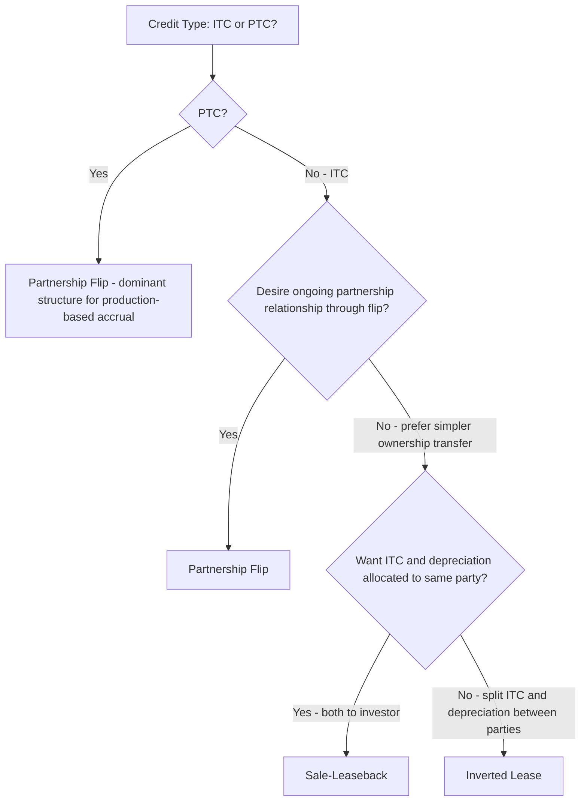

## Comparing Partnership Flip, Sale-Leaseback, and Inverted Lease

### Overview

The Partnership Flip, Sale-Leaseback, and Inverted Lease (Pass-Through Lease) are the three principal traditional tax equity structures used to monetize the Investment Tax Credit ("ITC") and Production Tax Credit ("PTC") by allocating tax benefits to an investor with tax appetite in exchange for capital contributed to the project. While the preceding topic addressed *why* a given structure might be selected based on credit type and investor profile, this topic provides a detailed side-by-side technical comparison of the three structures' mechanics, tax ownership rules, economic allocation approaches, and typical use cases.

### Fundamental Structural Distinction

**Key Points**

The three structures differ primarily in **who holds tax ownership of the underlying property** (and therefore who claims the credit and depreciation) and **how economic returns are allocated between developer and investor over time**:

- **Partnership Flip**: The developer and tax equity investor form a partnership that owns the project; both the ITC/PTC and depreciation are allocated to partners according to the partnership agreement, with allocations "flipping" from an investor-favorable split to a developer-favorable split once the investor reaches a target after-tax yield.
- **Sale-Leaseback**: The developer sells the completed, placed-in-service project to a tax equity investor (the lessor), who claims the ITC and depreciation as legal and tax owner, then leases the project back to the developer (the lessee) to operate.
- **Inverted Lease (Pass-Through Lease)**: The tax equity investor (lessor) retains legal title and claims depreciation, but makes a "pass-through lease" election under Treas. Reg. §1.48-4 allowing the lessee (developer/operator) to be treated as the tax owner for ITC purposes only — bifurcating the ITC claim from the depreciation claim between two different parties.

### Comparative Structure Table

| Feature | Partnership Flip | Sale-Leaseback | Inverted Lease |
| --- | --- | --- | --- |
| Tax ownership of ITC | Partnership (allocated per partnership agreement) | Lessor (investor) | Lessee (developer), via pass-through election |
| Tax ownership of depreciation | Partnership (allocated per partnership agreement) | Lessor (investor) | Lessor (investor) |
| PTC compatibility | Strong — natural fit for production-based accrual | Limited — complex given ownership/operation separation | Not typically used for PTC |
| Legal/formal ownership of project | Joint (partnership entity) | Investor (lessor) | Investor (lessor) |
| Operational control | Typically managing member/developer | Lessee (developer) | Lessee (developer) |
| Economic return mechanism | Allocations flip at target yield ("the flip") | Rent payments; often includes purchase option | Rent payments; ITC passed through to lessee |
| Typical technology fit | Both ITC and PTC (solar, wind) | Primarily ITC (solar) | Primarily ITC (solar) |
| Relationship duration | Long-term (through and often beyond flip date) | Medium to long-term (lease term) | Medium-term (lease term) |
| Relative structural complexity | High | Moderate | Moderate to High |

### Partnership Flip: Detailed Mechanics

**Key Points**

- **Formation**: Developer and investor form a partnership (typically an LLC taxed as a partnership) that holds direct or indirect ownership of the project.
- **Allocation structure**: Prior to the "flip," the tax equity investor typically receives the substantial majority (often 99%) of tax attributes (depreciation and credits) and a specified share of cash distributions, in exchange for its capital contribution.
- **The flip point**: Allocations shift ("flip") from the investor-favorable split to a developer-favorable split (often 5% investor / 95% developer, or similar) once the investor achieves its target after-tax internal rate of return ("IRR"), sometimes referred to as the "flip yield."
- **Post-flip dynamics**: After the flip, the developer typically retains an option to buy out the investor's remaining minority interest, often through a fair-market-value purchase option, allowing the developer to reconsolidate full ownership.
- **PTC fit**: Because PTC accrues over a 10-year production period, and partnership allocations of income, loss, and credits continue throughout the partnership's life (both pre- and post-flip), this structure naturally accommodates the temporal profile of PTC in a way that ownership-transfer-based structures (sale-leaseback) cannot as readily replicate.
- **Compliance obligations**: Partnership Flip structures require sophisticated ongoing tax compliance, including partnership tax return preparation, capital account maintenance under Treas. Reg. §1.704-1(b), and — critically — Hypothetical Liquidation at Book Value ("HLBV") accounting for the investor's financial reporting purposes.

### Sale-Leaseback: Detailed Mechanics

**Key Points**

- **Transaction sequence**: The developer constructs and places the facility in service (establishing PIS date and eligible basis), then within a short period (generally required to be within three months of the placed-in-service date under applicable Treasury guidance) sells the facility to the tax equity investor.
- **Timing constraint**: The compressed sale window after placed-in-service is a defining structural feature — if the sale occurs too long after PIS, the transaction risks being recharacterized or otherwise failing to preserve the investor's ability to claim the ITC as if it were the original placed-in-service party.
- **Lease-back terms**: The investor, as new legal owner, leases the facility back to the developer (as lessee/operator) under a long-term lease, typically structured to provide the investor with a target return through a combination of rental payments, tax benefits (ITC and depreciation), and (frequently) a purchase option exercisable by the developer at the end of the lease term.
- **Depreciation and ITC claimed by lessor**: Because the investor holds full legal and tax ownership, it claims both the ITC and MACRS depreciation directly, without the allocation complexity of a partnership structure.
- **Simpler ongoing compliance relative to Partnership Flip**: [Inference] Because the investor is a straightforward owner-lessor rather than a partner in an operating entity, sale-leaseback structures generally avoid the HLBV accounting and partnership capital account complexity of the Partnership Flip, though they introduce their own lease accounting considerations (e.g., operating versus finance lease classification) for both parties.

### Inverted Lease: Detailed Mechanics

**Key Points**

- **Pass-through lease election**: Under Treas. Reg. §1.48-4, a lessor may elect to treat the lessee as having acquired the property for ITC purposes, allowing the lessee to claim the ITC directly even though the lessor retains legal title.
- **Bifurcation rationale**: This structure allows the ITC to be allocated to the party best positioned to use it (often the developer/lessee, particularly where the developer itself has sufficient tax capacity to use the ITC but prefers to monetize depreciation separately through an investor), while depreciation remains with the lessor/investor.
- **"Inverted" terminology**: The structure is termed "inverted" because it reverses the typical sale-leaseback allocation, where the investor (as owner) would normally claim both the ITC and depreciation; here, the ITC flows to the lessee while depreciation stays with the lessor.
- **Typical use case**: [Inference] Historically popular in the solar sector for structures involving a master tenant/sub-tenant arrangement, where a "pass-through lessee" entity (sometimes itself jointly owned by developer and investor interests) receives the ITC allocation while a separate investor entity retains the depreciation benefit as legal owner — allowing for more granular tailoring of which economic participant receives which specific tax attribute.
- **PTC incompatibility**: Because the pass-through lease election under Treas. Reg. §1.48-4 is specific to the ITC (Section 48/48E) and has no direct PTC analog, this structure is not generally used for PTC-eligible technologies or projects electing PTC treatment.

### Selection Logic Visualization

### Economic and Risk Allocation Differences

**Example**

Consider a $100 million solar project generating $30 million in ITC value (at a 30% PWA-compliant rate):

- **Partnership Flip**: The investor might contribute approximately $25-30 million in exchange for a 99% pre-flip allocation of the credit and depreciation, targeting an after-tax IRR in a range the parties negotiate (commonly cited historically in the high single digits to low double digits, though this varies by market conditions and risk profile); the developer retains a small pre-flip allocation and an ownership pathway back to majority control post-flip.
- **Sale-Leaseback**: The investor purchases the facility outright near its fair market value (which may exceed or differ from construction cost, subject to valuation scrutiny), claims the full $30 million ITC and depreciation as owner, and receives its return primarily through structured lease payments from the developer/lessee over the lease term, potentially supplemented by a purchase option payment at lease end.
- **Inverted Lease**: The lessee (potentially the developer or a related entity) claims the $30 million ITC directly, while the lessor/investor claims depreciation and receives lease payments reflecting a return calibrated to the depreciation benefit and lease economics rather than the ITC itself.

[Inference] These are illustrative structural mechanics rather than universal figures; actual investor return targets, contribution amounts, and lease terms are heavily negotiated and vary by project risk profile, market conditions, and prevailing tax equity market pricing at the time of the transaction.

### Regulatory and Documentation Touchpoints Common to All Three

- **Beginning of Construction and bonus adder documentation**: As discussed in prior chapters, BOC date documentation, PWA compliance records, Domestic Content safe harbor elections, and Energy Community/Low-Income Communities Bonus substantiation must be assembled and made available to the tax equity investor regardless of which of the three structures is used, since the investor's tax position depends on the accuracy of these underlying determinations.
- **Fair market value substantiation**: All three structures require appraisal or valuation support for the property's fair market value at the relevant testing date (placed-in-service for ITC purposes), since the credit is calculated as a percentage of eligible basis, and inflated basis claims are a frequent focus of IRS scrutiny across all three structure types.
- **Recapture risk allocation**: Each structure must contractually allocate responsibility for the 5-year ITC recapture period (during which a disposition of the property, or a reduction in the investor's interest below certain thresholds, can trigger recapture) — though the specific mechanics of how recapture risk is allocated differ by structure (e.g., partnership interest transfer restrictions in a Flip versus lease assignment restrictions in a Sale-Leaseback or Inverted Lease).

### Trends and Relative Prevalence

[Inference] Since the introduction of §6418 Transferability and §6417 Direct Pay under the IRA, market commentary has generally suggested that simpler credit transfer transactions have captured a growing share of ITC-only, straightforward projects that previously might have used a Sale-Leaseback or Inverted Lease structure primarily to monetize the ITC without partnership complexity — while the Partnership Flip has remained comparatively more resilient for PTC-eligible projects and for transactions where developers specifically value the long-term partnership relationship, residual equity structure, or bonus-adder compliance coordination benefits discussed in the preceding topic. [Unverified] Precise market share data comparing the current relative prevalence of these three structures against transferability should be confirmed against current tax equity market surveys or industry reports, since these proportions shift with market conditions, interest rates, and evolving investor risk appetite.

### Conclusion

Partnership Flip, Sale-Leaseback, and Inverted Lease structures each solve the tax equity monetization problem through a different allocation of legal ownership, tax attribute claims, and economic return timing. The Partnership Flip's ongoing allocation mechanism makes it the most versatile structure across both ITC and PTC credit types and the structure of choice for long-term partnership relationships, while the Sale-Leaseback's clean ownership transfer and the Inverted Lease's attribute-bifurcation capability offer more specialized solutions primarily suited to ITC-eligible projects with particular allocation preferences between the credit and depreciation benefits. Selecting among them requires weighing the credit type involved, the desired duration and complexity of the investor relationship, and the specific tax attribute allocation objectives of the developer and investor — informed by the broader credit-type-and-investor-profile framework discussed in the preceding topic.

**Related Topics**

- How Structure Choice Depends on Credit Type and Investor Profile
- HLBV Accounting in Partnership Flip Structures
- The Flip Point and Target Yield Calculation Mechanics
- Fair Market Value Substantiation and Appraisal Standards in Sale-Leaseback Transactions
- Pass-Through Lease Elections Under Treas. Reg. Section 1.48-4
- Five-Year ITC Recapture Period and Structure-Specific Risk Allocation
- Section 6418 Credit Transferability as a Structural Alternative
- Partnership Capital Account Maintenance Under Treas. Reg. Section 1.704-1(b)