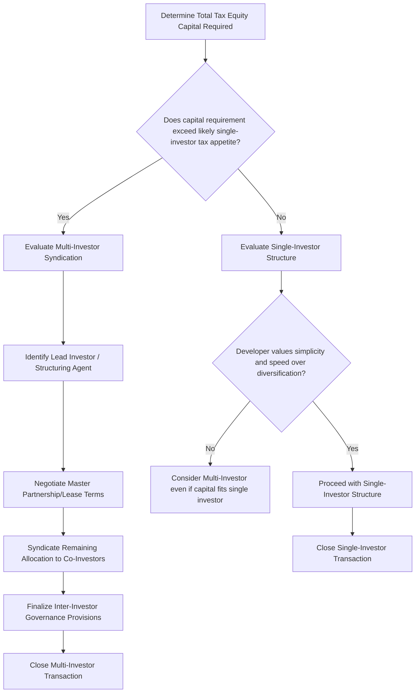

## Single-Investor Versus Multi-Investor Structures

### Overview

Single-Investor Versus Multi-Investor Structures addresses a distinct structuring axis that cuts across the Partnership Flip, Sale-Leaseback, and Inverted Lease frameworks discussed in the preceding topic: how many tax equity investors participate in a single transaction, and how that number affects deal complexity, negotiating leverage, risk diversification, and capital access. As tax equity capital requirements for utility-scale renewable projects have grown, and as the pool of investors with sufficient tax appetite has periodically tightened relative to market demand for tax equity capital, multi-investor ("club" or "syndicated") structures have become an increasingly important tool alongside the traditional single-investor model.

### The Single-Investor Model

**Key Points**

- **Structure**: A single tax equity investor (bank, insurer, or corporate) provides the entire tax equity capital contribution for a project or portfolio, taking on the full allocation of tax benefits (and corresponding economic return rights) that would otherwise be split among multiple parties.
- **Advantages**:
  - Simpler governance: a single investor means a single set of consent rights, approval thresholds, and decision-making processes in the partnership or lease agreement, reducing negotiation complexity and ongoing administrative burden.
  - Faster execution: fewer parties generally means faster negotiation, documentation, and closing timelines.
  - Clearer accountability: a single investor relationship simplifies communication, reporting, and dispute resolution compared to coordinating among multiple co-investors.
- **Disadvantages**:
  - **Capital capacity constraints**: A single investor may lack sufficient tax appetite or risk appetite to absorb the full tax equity requirement of a large utility-scale project or multi-project portfolio, limiting the maximum deal size achievable.
  - **Concentration risk for the developer**: Reliance on a single investor relationship creates counterparty concentration risk — if that investor's tax capacity changes (e.g., due to the investor's own financial performance affecting its tax liability) or its risk appetite shifts, the developer has no alternative capital source within that specific transaction.
  - **Reduced negotiating leverage for the developer in tight markets**: In periods where tax equity demand exceeds available supply, a developer seeking a single investor for a large deal may face less competitive pricing than if it could aggregate demand from multiple investors bidding for portions of the same deal.

### The Multi-Investor (Syndicated/Club) Model

**Key Points**

- **Structure**: Two or more tax equity investors jointly participate in funding a single project or portfolio, each typically taking a proportional share of the capital contribution and corresponding tax benefit allocation, often through a single partnership vehicle in which multiple investor-members hold interests alongside the developer.
- **Advantages**:
  - **Larger aggregate capital capacity**: Enables financing of larger projects or portfolios than any single investor's tax appetite could support alone, particularly important for utility-scale wind, solar, and storage projects with tax equity requirements reaching into the hundreds of millions of dollars.
  - **Risk diversification for investors**: Individual investors can participate in a larger project while limiting their exposure to a size consistent with their own risk management parameters, potentially enabling participation from investors who would not undertake the full deal alone.
  - **Diversification for developers**: Reduces developer dependence on any single investor relationship, providing some insulation against a single investor's changed circumstances.
  - **Competitive tension**: [Inference] Structuring a syndicated process can create competitive dynamics among prospective co-investors bidding for allocation within the syndicate, potentially improving pricing terms for the developer relative to a bilateral single-investor negotiation.
- **Disadvantages**:
  - **Increased governance complexity**: Multiple investor-members typically require more complex consent rights, voting thresholds, and approval mechanisms within the partnership or lease agreement, since each investor-member's interests must be separately protected.
  - **Longer negotiation and closing timelines**: Coordinating due diligence, term negotiation, and closing conditions across multiple investors generally extends transaction timelines compared to a bilateral single-investor deal.
  - **Inter-investor coordination**: Provisions must address how investor-members interact with one another (e.g., tag-along/drag-along rights, rights of first refusal on transfers of an investor's interest, and mechanisms for resolving disagreements among investor-members) in addition to the developer-investor relationship.
  - **HLBV and capital account complexity**: [Inference] Multi-investor partnership flip structures require capital account maintenance and HLBV accounting to be performed and allocated across multiple investor-members rather than a single party, compounding the accounting complexity already inherent in the Partnership Flip structure.

### Structural Comparison Table

| Feature | Single-Investor | Multi-Investor (Syndicated) |
| --- | --- | --- |
| Maximum practical deal size | Limited by single investor's tax appetite | Larger, aggregated across investors |
| Governance complexity | Lower | Higher — multiple consent rights, voting thresholds |
| Negotiation/closing timeline | Generally faster | Generally longer |
| Developer counterparty risk | Concentrated in one relationship | Diversified across multiple relationships |
| Pricing dynamics | Bilateral negotiation | Potential competitive tension among co-investors |
| Accounting complexity (Partnership Flip) | Single-party capital accounts/HLBV | Multi-party capital accounts/HLBV allocation |
| Typical use case | Smaller to mid-size projects; simpler portfolios | Utility-scale projects; large multi-project portfolios |

### Structuring Decision Framework

### Common Multi-Investor Structuring Approaches

**Example**

Several practical approaches exist for assembling a multi-investor transaction:

1. **Lead investor with syndication**: A single "lead" investor negotiates the core partnership or lease terms with the developer, then syndicates (sells down) a portion of its intended commitment to one or more co-investors on substantially similar terms, reducing the developer's direct negotiation burden to a single primary counterparty while still achieving multi-investor capital diversification.
2. **Simultaneous multi-party negotiation**: The developer negotiates directly and simultaneously with multiple prospective investors from the outset, each taking a proportional share of a single partnership vehicle — offering potentially more balanced terms across investors but requiring more complex, parallel negotiation management by the developer.
3. **Portfolio-level syndication across multiple projects**: Rather than syndicating a single project among multiple investors, a developer with a multi-project portfolio might allocate different individual projects to different single investors, achieving diversification at the portfolio level while preserving single-investor simplicity at the individual project level.

[Inference] The choice among these approaches often depends on the developer's relative sophistication and existing investor relationships, the urgency of the financing timeline, and whether the developer prioritizes minimizing its own negotiation burden (favoring the lead-investor-with-syndication approach) or maximizing direct control over terms with each participating investor (favoring simultaneous multi-party negotiation).

### Interaction with Structure Type (Partnership Flip, Sale-Leaseback, Inverted Lease)

**Key Points**

- **Partnership Flip**: Most naturally accommodates multiple investors, since a partnership agreement can readily define multiple investor-member classes or simply multiple investor-members within the same class, each with proportional capital accounts and tax attribute allocations, all flipping simultaneously (or on individually negotiated flip terms) as their respective target yields are achieved.
- **Sale-Leaseback**: Can accommodate multiple investors through a jointly-owned special purpose lessor entity (itself potentially structured as a partnership among the investor-members) that then engages in a single sale-leaseback transaction with the developer, adding a layer of structural complexity beyond a single-investor sale-leaseback.
- **Inverted Lease**: [Inference] Multi-investor inverted lease structures are comparatively less common in practice, likely reflecting the already-specialized, bifurcated attribute allocation this structure requires between lessor and lessee — adding multiple investors within the lessor position introduces an additional layer of allocation complexity on top of an already bespoke structure, making this combination less frequently pursued than multi-investor Partnership Flip or Sale-Leaseback arrangements.

### Interaction with Section 6418 Transferability

**Key Points**

- [Inference] The availability of §6418 credit transferability has introduced an alternative to multi-investor syndication for developers seeking to diversify their capital sources: rather than syndicating a single partnership or lease among multiple tax equity investors, a developer might instead sell portions of its credits to multiple, unrelated transfer buyers, each purchasing a separate tranche of the credit without any of the partnership governance or inter-investor coordination complexity that multi-investor partnership syndication requires.
- This has arguably reduced, for some ITC-only and simpler PTC transactions, the need for traditional multi-investor syndication as a diversification tool, since multiple independent transfer sales can achieve a similar capital-source diversification objective with substantially less governance complexity — though transfer sales sacrifice the depreciation and residual equity benefits available through a true multi-investor partnership structure.

### Due Diligence Implications

**Output**

- **Single-investor deals**: Diligence is bilateral and can proceed on a single negotiated timeline, with the investor's counsel and the developer's counsel as the primary parties driving the process.
- **Multi-investor deals**: Diligence must be coordinated across multiple investor counsel teams, potentially with differing risk tolerances, differing internal approval processes, and differing preferred representation and warranty language — requiring the developer (and often a lead investor or structuring agent) to manage a more complex, multi-threaded diligence process, particularly around the bonus adder documentation (PWA, Domestic Content, Energy Community, Low-Income Communities) discussed in the prior chapter, since each investor-member's counsel may independently scrutinize this documentation.

### Common Structuring Pitfalls

- Underestimating the additional time required to close a multi-investor transaction relative to a single-investor deal, leading to construction or placed-in-service timeline pressure
- Failing to establish clear inter-investor governance provisions (voting thresholds, transfer restrictions, dispute resolution) at the outset, leading to later friction among investor-members
- Assuming syndication will proceed smoothly without a clearly designated lead investor or structuring agent to coordinate the process
- Overlooking the compounding HLBV and capital account complexity that multiple investor-members introduce into Partnership Flip accounting, potentially underestimating ongoing compliance costs
- Failing to consider whether §6418 credit transfer to multiple buyers might achieve similar capital diversification objectives with less structural complexity than a full multi-investor partnership syndication

### Conclusion

The choice between single-investor and multi-investor tax equity structures represents a trade-off between simplicity and speed on one hand, and capital capacity and diversification on the other. Single-investor structures remain well-suited to smaller and mid-size projects where a single investor's tax appetite is sufficient and where the developer values negotiation speed and governance simplicity, while multi-investor syndication becomes increasingly necessary as project and portfolio sizes grow beyond what any single investor can reasonably absorb, or where developers specifically value diversified counterparty relationships. The Partnership Flip structure most naturally accommodates multi-investor participation, while Sale-Leaseback and particularly Inverted Lease structures require additional structural layering to support multiple investors — and the emergence of Section 6418 transferability has introduced a lower-complexity alternative pathway for developers seeking capital source diversification without the full governance overhead of traditional multi-investor partnership syndication.

**Related Topics**

- Comparing Partnership Flip, Sale-Leaseback, and Inverted Lease
- How Structure Choice Depends on Credit Type and Investor Profile
- HLBV Accounting in Partnership Flip Structures
- Section 6418 Credit Transferability Mechanics and Pricing
- Inter-Investor Governance: Voting Thresholds, Transfer Restrictions, and Dispute Resolution
- Lead Investor and Structuring Agent Roles in Syndicated Tax Equity Transactions
- Portfolio-Level Financing Strategies Across Multiple Projects