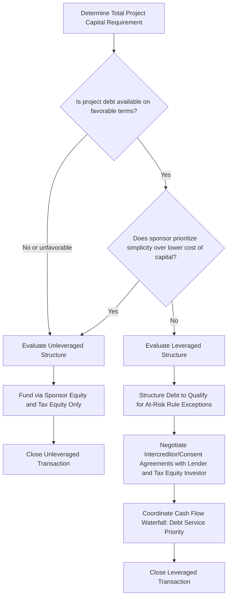

## Leveraged Versus Unleveraged Structures

### Overview

Leveraged Versus Unleveraged Structures addresses a further structuring dimension applicable across the Partnership Flip, Sale-Leaseback, and Inverted Lease frameworks: whether the project's capital stack includes third-party construction or term debt alongside tax equity, or whether the project is financed entirely with tax equity and sponsor equity without debt. This distinction — sometimes described using the historical terminology "leveraged lease" versus "unleveraged lease" (drawn from the equipment leasing context that predates modern renewable energy tax equity practice) but equally applicable to Partnership Flip structures — materially affects credit basis calculations, at-risk rules, investor return profiles, and the interaction between debt covenants and tax equity documentation.

### Core Distinction

**Key Points**

- **Unleveraged structure**: The project is financed solely through a combination of sponsor/developer equity and tax equity investor capital, with no third-party debt encumbering the project entity.
- **Leveraged structure**: The project's capital stack includes third-party debt (construction loan, term loan, or both) in addition to sponsor equity and tax equity, with the debt typically secured by the project's assets and cash flows.
- **Terminology origin**: [Inference] The "leveraged lease" and "unleveraged lease" terminology originates from traditional equipment leasing tax structures that predate the modern renewable energy tax equity market, but the underlying leverage/no-leverage distinction has carried over conceptually into how practitioners describe the presence or absence of third-party debt in both lease-based and partnership-based renewable energy structures.

### Why Leverage Matters for Tax Credit Calculations

**Key Points**

- **ITC basis and debt-financed property**: The presence of debt does not, by itself, reduce ITC-eligible basis — the ITC is generally calculated on the full eligible cost basis of the property regardless of how that cost was financed (debt or equity), which differs from certain other tax provisions where debt-financed property receives different treatment.
- **At-risk rules (IRC §49)**: However, IRC §49 imposes at-risk limitations that can reduce the amount of ITC-eligible basis for a partner (including a tax equity investor) to the extent the partner's investment is financed with certain nonqualified nonrecourse financing — meaning the specific character and terms of the project-level debt matter significantly to how much ITC-eligible basis a leveraged structure's tax equity investor can actually use.
- **Qualified nonrecourse financing exception**: Debt that satisfies the requirements for "qualified commercial financing" (or other exceptions under §49) generally does not reduce at-risk basis in the same manner as nonqualified nonrecourse debt, making the specific structuring of project debt — recourse features, guarantor arrangements, and lender identity — directly relevant to preserving full ITC benefit for the tax equity investor.
- [Inference] Because of this interaction, leveraged structures require careful coordination between the debt financing documents and the tax equity documentation to ensure the debt is structured in a manner that does not inadvertently trigger at-risk limitations that would reduce the investor's usable tax benefits — making this one of the most technically sensitive areas of leveraged tax equity structuring.

### Comparative Structure Table

| Feature | Unleveraged | Leveraged |
| --- | --- | --- |
| Third-party debt present | No | Yes (construction and/or term debt) |
| Capital stack complexity | Lower — sponsor equity + tax equity only | Higher — sponsor equity + tax equity + debt |
| At-risk rule (§49) sensitivity | Minimal — no debt to trigger nonqualified nonrecourse concerns | Significant — debt terms must be structured to avoid at-risk basis reduction |
| Tax equity investor's effective leverage/return profile | Return driven purely by tax benefits and project cash flow | Return can be enhanced by debt leverage on sponsor's contributed capital, but investor tax benefit calculation more complex |
| Lender-tax equity intercreditor complexity | None | Requires intercreditor/consent agreements between lender and tax equity investor |
| Typical use case | Smaller projects; simpler capital structures; situations where sponsor prefers to avoid debt covenant complexity | Larger utility-scale projects where sponsor capital is more efficiently deployed alongside debt leverage |

### Leveraged Structure Mechanics

**Key Points**

- **Debt layering**: In a leveraged Partnership Flip, for example, the developer's sponsor equity contribution to the partnership may itself be leveraged at the sponsor level (i.e., the sponsor borrows to fund its own equity contribution) or the partnership entity itself may hold project-level debt senior to both sponsor and tax equity capital.
- **Intercreditor and consent arrangements**: Because both a third-party lender and a tax equity investor have interests in the same project, leveraged structures require carefully negotiated intercreditor agreements or consent rights addressing scenarios such as: lender's rights upon a tax equity-triggering event (e.g., recapture), tax equity investor's consent rights over refinancing, and cure rights and notice provisions ensuring each party is aware of the other's default or distress scenarios.
- **Debt service coverage and cash flow waterfall**: The presence of debt introduces a cash flow waterfall (debt service payments senior to equity distributions) that must be coordinated with the partnership flip or lease payment mechanics, since the tax equity investor's economic return depends on residual cash flow after debt service in many structures.
- **Construction-to-term conversion**: Many leveraged structures involve construction-period debt that converts to (or is refinanced by) term debt upon achieving commercial operation, with the tax equity investor's capital contribution often being funded partially at construction milestones and partially at or after conversion to term financing, creating a more complex, multi-stage funding sequence than an unleveraged structure's typically simpler funding schedule.

### Unleveraged Structure Mechanics

**Key Points**

- **Simplified funding sequence**: Sponsor equity and tax equity capital are typically the only two sources of project capital, funded according to a schedule tied to construction milestones and/or the placed-in-service date, without the additional complexity of debt draw schedules, debt service reserve requirements, or lender consent processes.
- **No at-risk basis complications from debt**: Since there is no project-level nonrecourse debt to evaluate against the §49 at-risk rules, tax equity investors in unleveraged structures generally have more straightforward basis calculations, without needing to analyze whether specific debt terms qualify for exceptions to at-risk limitations.
- **Potentially higher blended cost of capital**: [Inference] Because unleveraged structures forgo the potentially lower cost of debt capital relative to equity capital, they may result in a higher overall blended cost of capital for the project relative to an equivalent leveraged structure — a trade-off sponsors weigh against the reduced structuring complexity and at-risk rule simplicity that unleveraged structures offer.

### Structuring Decision Framework

### Interaction with Structure Type

**Key Points**

- **Partnership Flip**: Both leveraged and unleveraged Partnership Flips are common in practice; the choice depends primarily on the sponsor's access to debt capital, the sponsor's desired capital efficiency, and the specific at-risk rule structuring the parties are willing to undertake.
- **Sale-Leaseback**: Leveraged sale-leasebacks (sometimes historically termed "leveraged leases" in the equipment leasing context) involve the lessor-investor financing a portion of its purchase price with debt, while unleveraged sale-leasebacks involve the investor funding the full purchase price from its own equity capital.
- **Inverted Lease**: [Inference] Given the Inverted Lease's already bifurcated attribute allocation between lessor and lessee, adding leverage introduces a further layer of complexity in determining how debt affects the lessor's depreciation basis and the lessee's ITC basis respectively — making leveraged Inverted Lease structures comparatively less common than leveraged Partnership Flip or Sale-Leaseback structures.

### Investor Return Considerations

**Output**

- **Leveraged structures**: Can enhance sponsor-level returns by allowing the sponsor to fund a smaller equity contribution relative to total project cost, with debt covering a portion of the capital stack — but this benefit to the sponsor does not necessarily translate into a different return profile for the tax equity investor, whose return remains primarily driven by allocated tax benefits and cash distributions under the partnership or lease agreement, subject to the at-risk basis considerations discussed above.
- **Unleveraged structures**: Provide the tax equity investor with a cleaner, more easily modeled return profile, since there is no debt service priority ahead of equity distributions and no at-risk basis complexity to layer into the return calculation — a simplicity that some tax equity investors may value enough to accept a marginally different pricing outcome relative to an equivalent leveraged deal.

### Common Structuring Pitfalls

- Failing to structure project debt to qualify for at-risk rule exceptions under §49, inadvertently reducing the tax equity investor's usable ITC basis
- Inadequate intercreditor or consent agreement provisions between the lender and tax equity investor, leading to conflicts during a default, recapture event, or refinancing scenario
- Underestimating the additional negotiation and closing timeline required to coordinate lender due diligence and consent processes alongside tax equity investor due diligence in a leveraged structure
- Failing to properly sequence and document the cash flow waterfall between debt service and equity distributions, leading to disputes over the tax equity investor's actual received cash flow
- Overlooking construction-to-term debt conversion mechanics when structuring the tax equity investor's capital contribution funding schedule, potentially creating funding gaps or timing mismatches

### Conclusion

The choice between leveraged and unleveraged structures represents a further layer of structural decision-making that applies across the Partnership Flip, Sale-Leaseback, and Inverted Lease frameworks discussed elsewhere in this chapter, driven primarily by the sponsor's access to and cost of debt capital, its tolerance for the additional intercreditor and at-risk rule complexity that leverage introduces, and the specific tax equity investor's comfort with the more intricate basis calculations that project-level debt can create under IRC §49. While leveraged structures can improve sponsor-level capital efficiency by reducing the equity contribution required relative to total project cost, they demand careful coordination between debt financing documents and tax equity documentation to avoid inadvertently triggering at-risk limitations that would reduce the investor's usable tax benefits — a technical risk that unleveraged structures avoid entirely at the cost of forgoing the potential capital efficiency benefits of debt.

**Related Topics**

- Comparing Partnership Flip, Sale-Leaseback, and Inverted Lease
- Single-Investor Versus Multi-Investor Structures
- The At-Risk Rules Under IRC Section 49 and Qualified Nonrecourse Financing
- Intercreditor Agreements Between Lenders and Tax Equity Investors
- Construction-to-Term Debt Conversion and Tax Equity Funding Schedules
- Cash Flow Waterfalls in Leveraged Project Finance Structures
- HLBV Accounting in Partnership Flip Structures